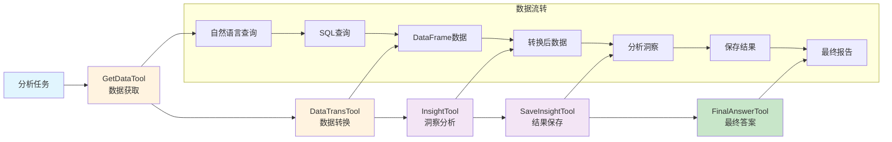
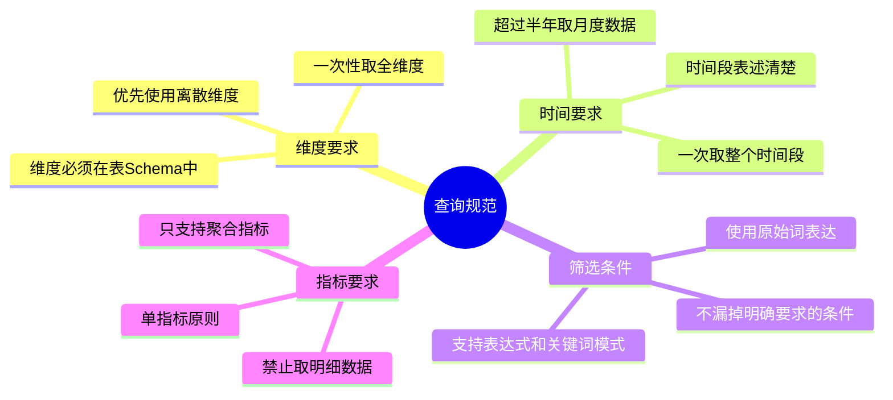
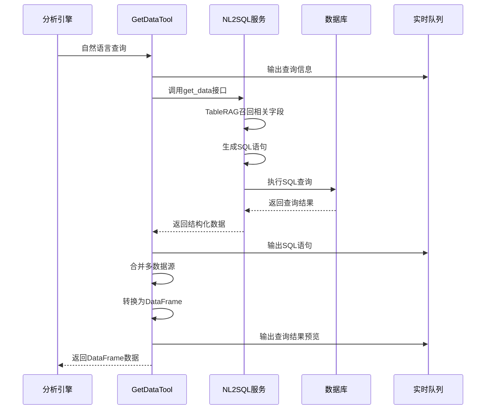
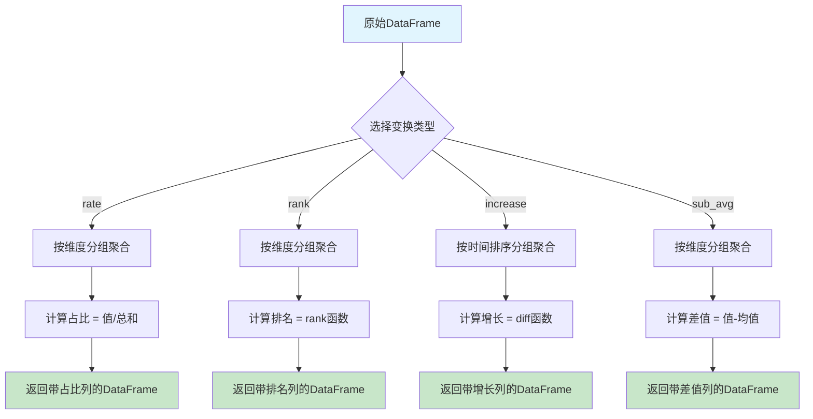
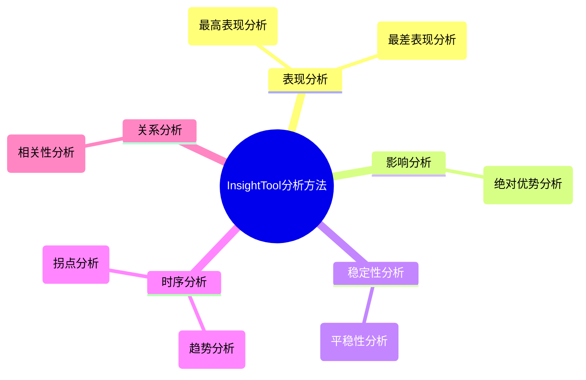
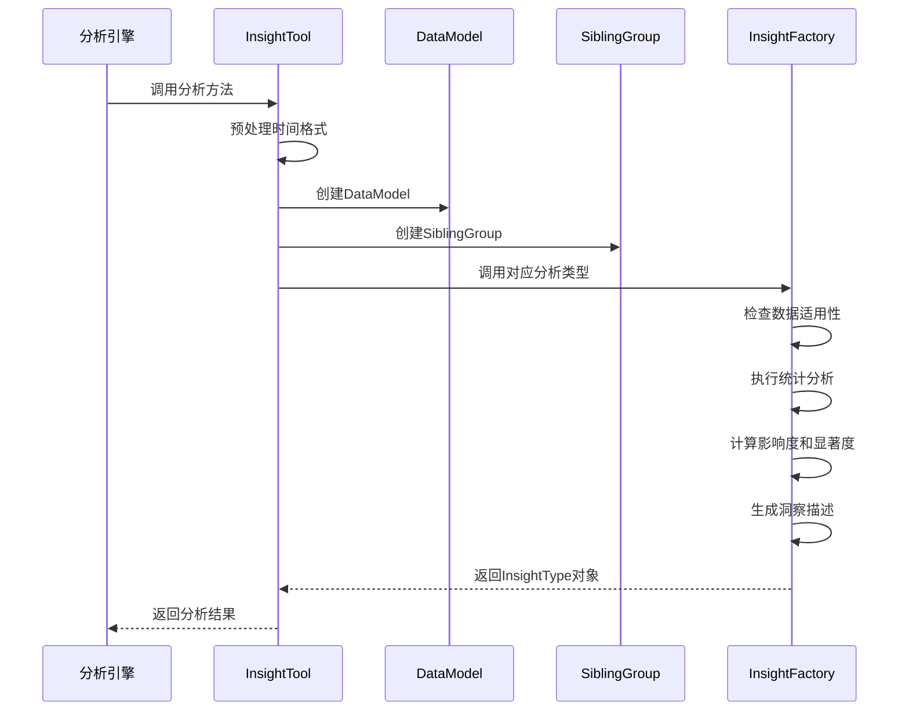
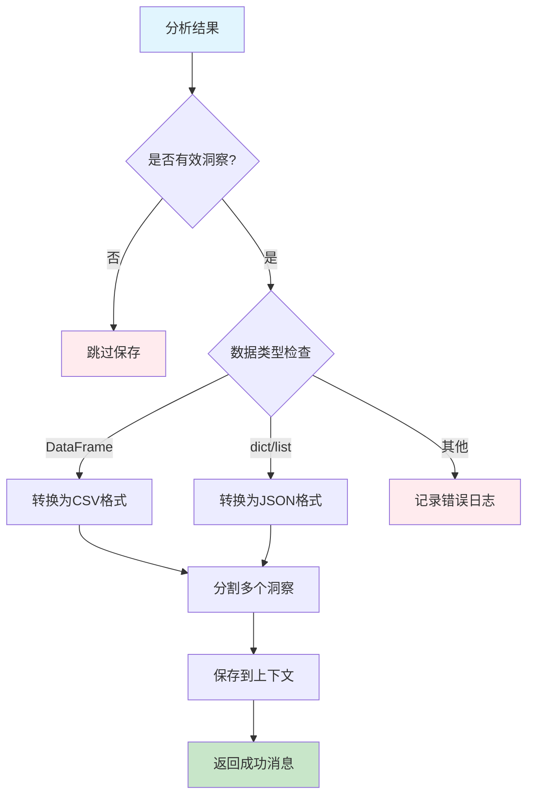
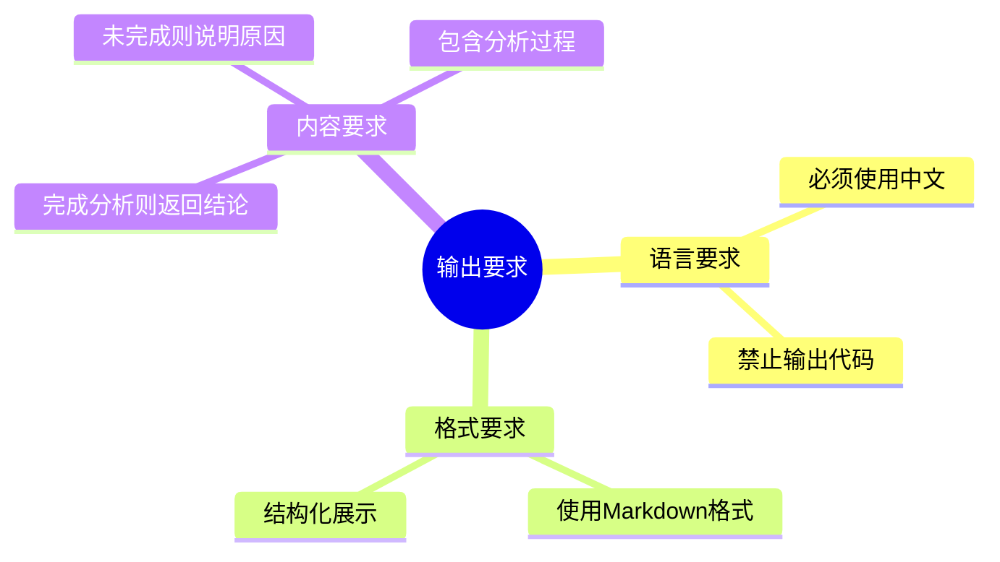
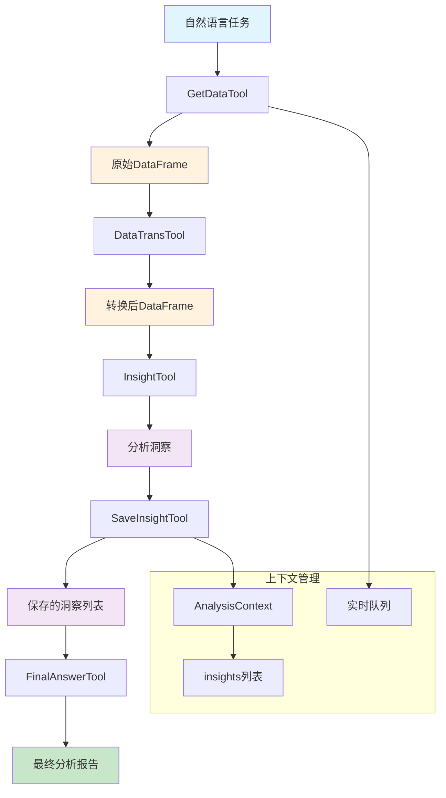

# DataAgent分析工具链深度解析

## 概述

基于对JoyAgent-JDGenie项目源码的深入分析，本文档详细解析DataAgent中的五个核心分析工具：`GetDataTool`、`DataTransTool`、`InsightTool`、`SaveInsightTool`和`FinalAnswerTool`。这些工具构成了一个完整的数据分析工具链，实现了从数据获取到洞察输出的全流程自动化分析。

## 1. 工具链架构概览

### 1.1 工具协作关系



### 1.2 技术栈
- **基础框架**：基于smolagents的Tool基类
- **数据处理**：pandas DataFrame作为数据载体
- **分析引擎**：scipy统计分析库
- **洞察模型**：基于微软研究院的Insight Types规范
- **流式输出**：asyncio Queue实现实时反馈

## 2. GetDataTool - 数据获取工具

### 2.1 工具概述

`GetDataTool`是分析工具链的起点，负责将自然语言查询转换为SQL并获取数据。

```python
class GetDataTool(Tool):
    name = "get_data"
    description = "这是一个取数智能体。可以使用此工具获取需要的数据，非常聪明，能够准确理解你的取数需求，返回 pd.DataFrame 格式的数据"
```

### 2.2 核心功能

#### 2.2.1 自然语言理解
工具接收自然语言描述，支持复杂的查询需求：

```python
def forward(self, query: str) -> pd.DataFrame:
    # 添加数据量限制
    query = f"{query}。取 {self.context.max_data_size} 条"
    
    # 调用后端NL2SQL服务
    base_datas = get_data(query=query, modelCodeList=self.context.modelCodeList, request_id=self.context.request_id)
```

#### 2.2.2 查询规范要求

工具对输入查询有严格的格式要求：



**标准查询格式：**
```
筛选[条件1]、[条件2]，根据[维度1]、[维度2] 进行分组，统计[时间段]的[聚合指标]
```

**示例：**
- 无筛选条件：`根据商品类目、店铺进行分组，统计销售额`
- 有筛选条件：`筛选在线支付、未退货，根据商品类目、省份进行分组，统计2023年Q4的订单总额`

#### 2.2.3 数据合并机制

```python
@classmethod
def merge_df(cls, datas: List[Dict]) -> pd.DataFrame:
    joined_df = cls.to_df(datas[0])
    
    # 处理多数据源合并
    if len(datas) > 1:
        # 生成前缀标识不同数据源
        prefix = "_".join([f"{f['name']}为{f['val']}" for f in datas[0]["filters"] 
                          if f["opt"] in ["EQUALS"] and f["dataType"] in ["VARCHAR"]])
        
        # 重命名度量列避免冲突
        joined_df = joined_df.rename({c["name"]: f"{prefix}_{c['name']}" 
                                     for c in datas[0]["columnList"] 
                                     if c["guid"] in datas[0]["measureCols"]}, axis=1)
    
    # 基于维度列进行外连接
    on_cols = [c["name"] for c in datas[0]["columnList"] if c["col"] in datas[0]["dimCols"]]
    for data in datas[1:]:
        if set(datas[0]["dimCols"]) == set(data["dimCols"]):
            df = cls.to_df(data)
            joined_df = pd.merge(joined_df, df, on=on_cols, how="outer")
    
    return joined_df
```

#### 2.2.4 实时反馈机制

```python
def forward(self, query: str) -> pd.DataFrame:
    # 1. 输出查询信息
    self.context.queue.put_nowait({
        "requestId": self.context.request_id, 
        "data": f"\n### 1. 取数 Query\n{query}  \n", 
        "isFinal": False
    })
    
    # 2. 输出生成的SQL
    if base_datas:
        pretty_sql = sqlparse.format(base_datas[0]["nl2sqlResult"], 
                                   reindent=True, keyword_case="upper", strip_comments=True)
        self.context.queue.put_nowait({
            "requestId": self.context.request_id, 
            "data": f"\n### 2. 取数 SQL\n```sql\n{pretty_sql.strip()}\n```\n", 
            "isFinal": False
        })
    
    # 3. 输出查询结果
    if len(df) > 0:
        top_k = min(5, len(df))
        top_k_data = f"### 3. 取数结果\n共获取到 {len(df)} 条数据，前 {top_k} 条数据如下：\n\n{df[:top_k].to_markdown()}"
        self.context.queue.put_nowait({
            "requestId": self.context.request_id, 
            "data": f"\n{top_k_data}\n", 
            "isFinal": False
        })
```

### 2.3 数据获取流程



## 3. DataTransTool - 数据转换工具

### 3.1 工具概述

`DataTransTool`负责对原始数据进行各种数学变换，为后续分析做准备。

```python
class DataTransTool(Tool):
    name = "data_trans"
    description = "这是一个数据变换工具。可以使用此工具对数据的某一列计算占比、计算排名、计算和整体均值差以及计算增长，返回 pd.DataFrame 格式的数据"
```

### 3.2 支持的变换类型

#### 3.2.1 占比计算 (rate)
计算某个维度在总体中的占比：

```python
if trans_type == "rate":
    df = df.groupby(column).agg({measure: agg}).reset_index()
    df[f"Rate({measure})"] = df[measure] / df[measure].sum()
```

**应用场景：**
- 各地区销售额占比
- 各产品类别订单量占比
- 各部门员工数占比

#### 3.2.2 排名计算 (rank)
按指标值计算排名：

```python
if trans_type == "rank":
    df = df.groupby(column).agg({measure: agg}).reset_index()
    df[f"Rank({measure})"] = df[measure].rank(ascending=False, method="dense").astype(int)
```

**应用场景：**
- 销售额排名
- 用户活跃度排名
- 产品评分排名

#### 3.2.3 增长计算 (increase)
计算时间序列的增长量：

```python
if trans_type == "increase":
    df = df.groupby(column).agg({measure: agg})\
        .sort_values(by=column, ascending=True).reset_index()
    df[f"Increase({measure})"] = df[measure].diff(1)
    df = df.dropna()
```

**应用场景：**
- 月度销售额增长
- 用户数增长趋势
- 成本变化分析

#### 3.2.4 均值差计算 (sub_avg)
计算与整体均值的差值：

```python
if trans_type == "sub_avg":
    df = df.groupby(column).agg({measure: agg}).reset_index()
    avg = df[measure].sum() / df[measure].size
    df[f"{measure}-avg"] = df[measure] - avg
```

**应用场景：**
- 各地区销售额与平均值的差异
- 员工绩效与平均水平的对比
- 产品价格与市场均价的差异

### 3.3 变换流程示例



## 4. InsightTool - 洞察分析工具

### 4.1 工具概述

`InsightTool`是分析工具链的核心，基于微软研究院的Insight Types规范实现多种统计分析方法。

```python
class InsightTool(Tool):
    name = "insight_analysis"
    description = "这是一个传统数据分析工具。可以使用此工具做一些常见数据分析"
```

### 4.2 支持的分析类型

#### 4.2.1 分析方法概览



#### 4.2.2 OutstandingFirst - 最高表现分析

识别在某个维度上表现最突出的值：

```python
class OutstandingFirstInsightType(InsightType):
    """在某个维度上，某个值的指标值是最高的"""
    
    @classmethod
    def _check(cls, data: SiblingGroup, **kwargs) -> bool:
        df = data.get_data()
        df = df.sort_values(by=data.measure.column, ascending=False)
        y = df[data.measure.column].values
        # 检查是否满足突出条件：最高值 > 第二高值 + 第三高值
        return y.size > 3 and y[-1] >= 0 and y[0] > y[1] + y[2] and (0.0 < y[0] / y.sum() < 0.5)
```

**分析逻辑：**
1. 使用幂律分布拟合数据
2. 计算残差的正态分布参数
3. 计算p值评估显著性
4. 生成洞察描述

#### 4.2.3 Trend - 趋势分析

分析时间序列数据的趋势模式：

```python
class TrendInsightType(InsightType):
    """时间序列趋势分析"""
    
    @classmethod
    def _from_data(cls, data: SiblingGroup, **kwargs) -> "InsightType":
        df = data.get_data()
        df = df.sort_values(by=data.breakdown.name)
        
        # 线性回归分析趋势
        x = np.arange(len(df))
        y = df[data.measure.column].values
        slope, intercept, r_value, p_value, std_err = linregress(x, y)
        
        # 判断趋势方向
        if slope > 0:
            trend_direction = "上升"
        elif slope < 0:
            trend_direction = "下降"
        else:
            trend_direction = "平稳"
```

#### 4.2.4 ChangePoint - 拐点分析

识别数据中的转折点：

```python
class ChangePointInsightType(InsightType):
    """变化点检测"""
    
    @classmethod
    def _from_data(cls, data: SiblingGroup, **kwargs) -> "InsightType":
        df = data.get_data()
        y = df[data.measure.column].values
        
        # 使用峰值检测算法找拐点
        peaks, _ = find_peaks(np.abs(np.diff(y)), height=np.std(y))
        
        if len(peaks) > 0:
            change_point_idx = peaks[0] + 1  # diff后索引需要+1
            change_point_value = df.iloc[change_point_idx][data.breakdown.name]
```

### 4.3 洞察评分机制

每个洞察都有影响度和显著度两个评分维度：

```python
@computed_field
def score(self) -> float:
    return self.impact * self.significance

@classmethod
def from_data(cls, data: SiblingGroup, threshold: float = 0.01, **kwargs) -> "InsightType":
    insight = cls._from_data(data, **kwargs)
    
    # 检查评分阈值
    if insight and insight.score < threshold:
        logger.warning(f"{insight.type} insight.score < {threshold}")
        insight = None
    
    # 检查显著性阈值
    if insight and (insight.significance is None or insight.significance < threshold):
        logger.warning(f"{insight.type} significance < {threshold}")
        insight = None
    
    return insight
```

### 4.4 分析执行流程



## 5. SaveInsightTool - 结果保存工具

### 5.1 工具概述

`SaveInsightTool`负责将分析得出的洞察保存到上下文中，为最终报告生成做准备。

```python
class SaveInsightTool(Tool):
    name = "save_insight"
    description = "这是一个分析结论保存工具。请你将你每一步分析得出的**有用的结论或信息**调用此工具保存到数据库中"
```

### 5.2 保存机制

#### 5.2.1 数据格式转换

```python
def forward(self, df: pd.DataFrame, insight: str, analysis_process: str) -> str:
    insights = [i.strip() for i in insight.split("<sep>")]
    
    if isinstance(df, pd.DataFrame):
        data = InsightType.df_to_csv(df)
    elif isinstance(df, (dict, list)):
        try:
            data = json.dumps(df, ensure_ascii=False)
        except Exception as e:
            logger.error(f"数据序列化失败: {e}")
            data = ""
    else:
        logger.error(f"不支持的数据类型: {type(df)}")
        data = ""
    
    return self.context.save_insight(df=data, insight=insights, analysis_process=analysis_process)
```

#### 5.2.2 CSV格式转换

```python
@staticmethod
def df_to_csv(df: pd.DataFrame) -> str:
    df = df.reset_index()
    if "index" in df.columns:
        df = df.drop("index", axis=1)
    
    work_dir = tempfile.mkdtemp()
    try:
        df.to_csv(os.path.join(work_dir, "data.csv"), index=False)
        with open(os.path.join(work_dir, "data.csv"), "r") as rf:
            return "".join(rf.readlines())
    finally:
        shutil.rmtree(work_dir)
```

### 5.3 上下文保存

```python
class AnalysisContext(object):
    def __init__(self, ...):
        self.insights = []  # 保存所有洞察
    
    def save_insight(self, df: str, insight: List[str], analysis_process: str):
        self.insights.append({
            "data": df, 
            "insight": insight, 
            "analysis_process": analysis_process
        })
        return f"保存洞察（{insight}）成功"
```

### 5.4 保存规则



## 6. FinalAnswerTool - 最终答案工具

### 6.1 工具概述

`FinalAnswerTool`是分析工具链的终点，负责整合所有分析结果并生成最终报告。

```python
class FinalAnswerTool(Tool):
    name = "final_answer"
    description = "为用户的任务提供最终答案"
```

### 6.2 答案生成

```python
def forward(self, answer: str) -> Dict:
    return {
        "insights": self.context.insights or [],
        "summary": answer,
    }
```

### 6.3 报告模板

系统使用Jinja2模板生成最终报告：

```python
_RESULT_TEMPLATE = """# {{ task }}  

## 分析过程  

### {{ insight.get("analysis_process") }}  

#### 数据  

{{ insight.get("data") }}

#### 分析结果  


- {{ i }}




## 总结  
{{ summary }}
"""
```

### 6.4 输出格式要求



## 7. 工具链协作机制

### 7.1 数据流转



### 7.2 错误处理机制

每个工具都有完善的错误处理：

```python
# GetDataTool错误处理
if isinstance(base_datas, list):
    # 正常数据处理
    df = self.merge_df(base_datas)
else:
    # 异常情况处理（如权限问题）
    self.context.queue.put_nowait({
        "requestId": self.context.request_id, 
        "data": f"### 3. 取数结果\n{base_datas}\n", 
        "isFinal": False
    })
    return base_datas

# InsightTool错误处理
insight: InsightType = InsightFactoryDict[analysis_method].from_data(sibling_group)
return insight.model_dump(exclude={"data",}) if insight else {"description": "无分析结论"}

# SaveInsightTool错误处理
try:
    data = json.dumps(df, ensure_ascii=False)
except Exception as e:
    logger.error(f"{RequestIdCtx.request_id} {self.name} error: {e}")
    data = ""
```

### 7.3 性能优化

#### 7.3.1 数据量控制
```python
# GetDataTool中限制数据量
query = f"{query}。取 {self.context.max_data_size} 条"
```

#### 7.3.2 计算优化
```python
# InsightTool中使用装饰器进行性能监控
@timer(key="OutstandingFirst")
def _from_data(cls, data: SiblingGroup, **kwargs) -> "InsightType":
    # 分析逻辑
```

#### 7.3.3 内存管理
```python
# SaveInsightTool中使用临时目录
work_dir = tempfile.mkdtemp()
try:
    # 处理逻辑
finally:
    shutil.rmtree(work_dir)
```

## 8. 实际应用示例

### 8.1 完整分析流程

假设分析任务："分析各地区销售额表现，找出表现突出的地区"

#### 步骤1：数据获取
```python
# GetDataTool调用
query = "根据地区进行分组，统计最近一年的销售额"
df = get_data_tool.forward(query)
# 返回：地区、销售额的DataFrame
```

#### 步骤2：数据转换
```python
# DataTransTool调用 - 计算占比
df_rate = data_trans_tool.forward(
    df=df, 
    column="地区", 
    measure="销售额", 
    measure_type="quantity", 
    trans_type="rate"
)
# 新增：Rate(销售额)列
```

#### 步骤3：洞察分析
```python
# InsightTool调用 - 最高表现分析
insight = insight_tool.forward(
    df=df,
    breakdown="地区",
    measure="销售额",
    measure_type="quantity",
    analysis_method="OutstandingFirst"
)
# 返回：{"type": "OutstandingFirst", "insight": {...}, "impact": 0.8, "significance": 0.95}
```

#### 步骤4：结果保存
```python
# SaveInsightTool调用
save_result = save_insight_tool.forward(
    df=df_rate,
    insight="华东地区销售额最高，达到1000万元，占总销售额的35%",
    analysis_process="使用OutstandingFirst方法分析各地区销售额表现"
)
```

#### 步骤5：生成最终答案
```python
# FinalAnswerTool调用
final_result = final_answer_tool.forward(
    answer="通过分析发现，华东地区在销售额方面表现最为突出，建议加大在该地区的投入"
)
```

### 8.2 输出示例

```markdown
# 分析各地区销售额表现，找出表现突出的地区

## 分析过程

### 使用OutstandingFirst方法分析各地区销售额表现

#### 数据
地区,销售额,Rate(销售额)
华东,10000000,0.35
华南,6000000,0.21
华北,5000000,0.175
西南,4000000,0.14
...

#### 分析结果
- 华东地区销售额最高，达到1000万元，占总销售额的35%
- 华东地区的销售额显著高于其他地区，具有绝对优势

## 总结
通过分析发现，华东地区在销售额方面表现最为突出，建议加大在该地区的投入
```

## 9. 技术特点与优势

### 9.1 设计优势

1. **模块化设计**：每个工具职责单一，易于维护和扩展
2. **标准化接口**：基于smolagents框架，接口统一
3. **流式反馈**：实时输出分析过程，提升用户体验
4. **错误容错**：完善的异常处理机制
5. **性能监控**：内置性能计时器，便于优化

### 9.2 技术创新

1. **智能数据合并**：自动处理多数据源合并问题
2. **统计学基础**：基于严格的统计学方法进行分析
3. **洞察评分**：量化洞察的重要性和可信度
4. **上下文管理**：完整的分析上下文保持
5. **模板化输出**：结构化的报告生成

### 9.3 扩展性

工具链支持灵活扩展：

```python
# 新增分析类型
class CustomInsightType(InsightType):
    @classmethod
    def _from_data(cls, data: SiblingGroup, **kwargs) -> "InsightType":
        # 自定义分析逻辑
        pass

# 注册到工厂
InsightFactoryDict["Custom"] = CustomInsightType
```

## 10. 总结

DataAgent的分析工具链通过五个核心工具的协作，实现了从自然语言查询到深度分析洞察的全流程自动化。每个工具都有明确的职责分工和标准化的接口，形成了一个完整、高效、可扩展的数据分析生态系统。

### 核心价值

1. **自动化程度高**：从数据获取到报告生成全程自动化
2. **分析方法丰富**：支持多种统计分析方法
3. **结果可解释**：提供详细的分析过程和依据
4. **用户体验好**：实时反馈和结构化输出
5. **技术先进性**：基于微软研究院的理论基础

这套工具链为DataAgent提供了强大的数据分析能力，使其能够处理复杂的业务分析需求，为用户提供有价值的数据洞察。
