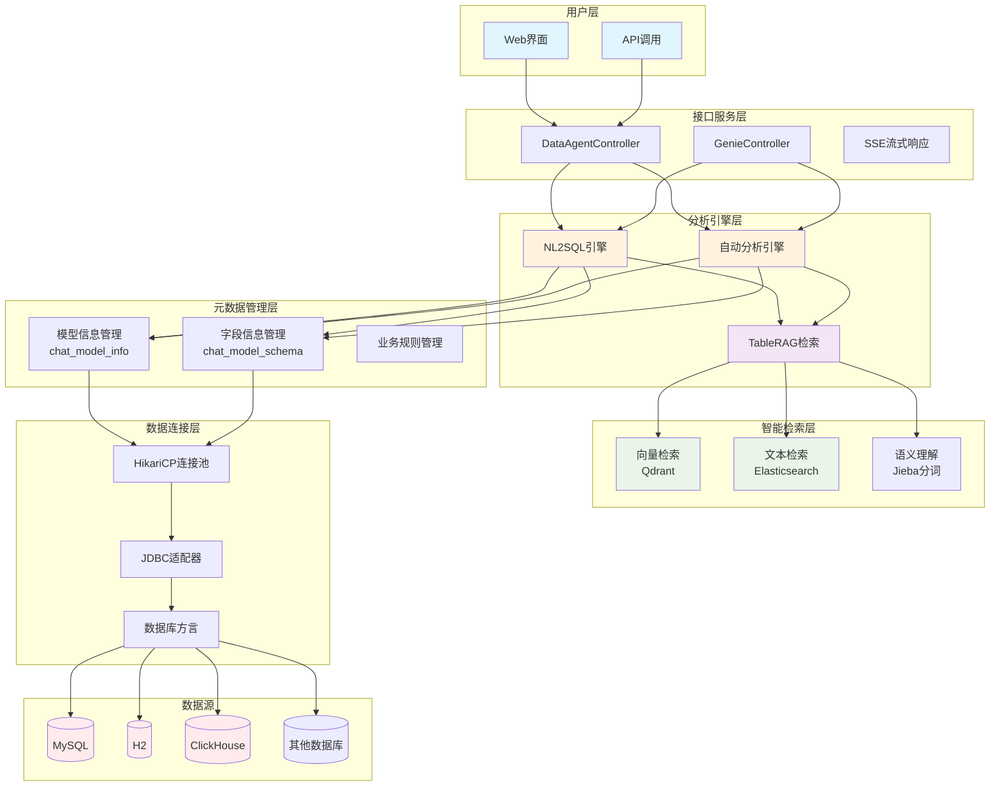
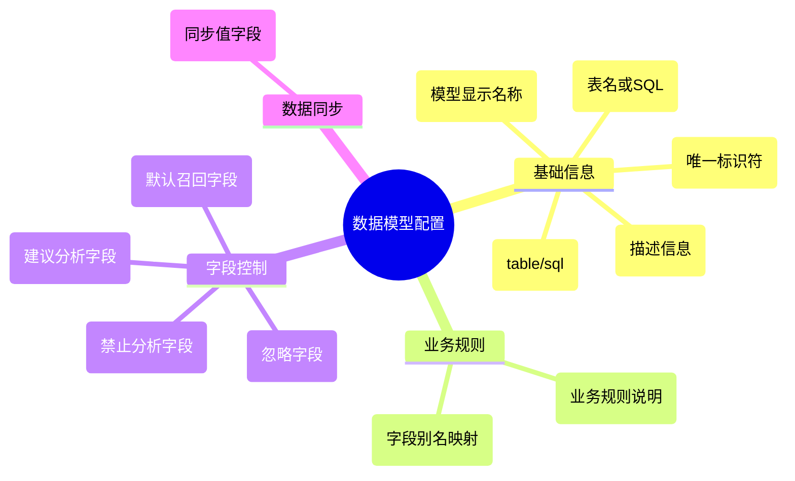
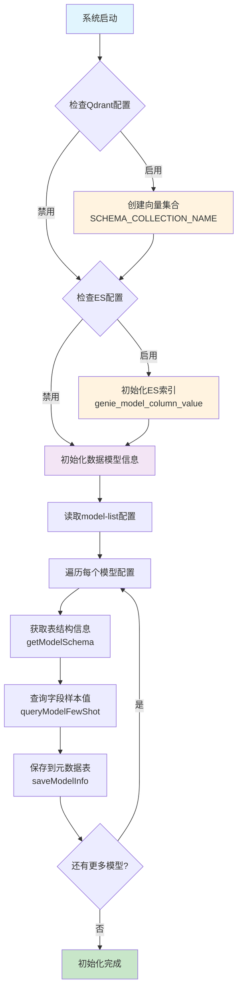
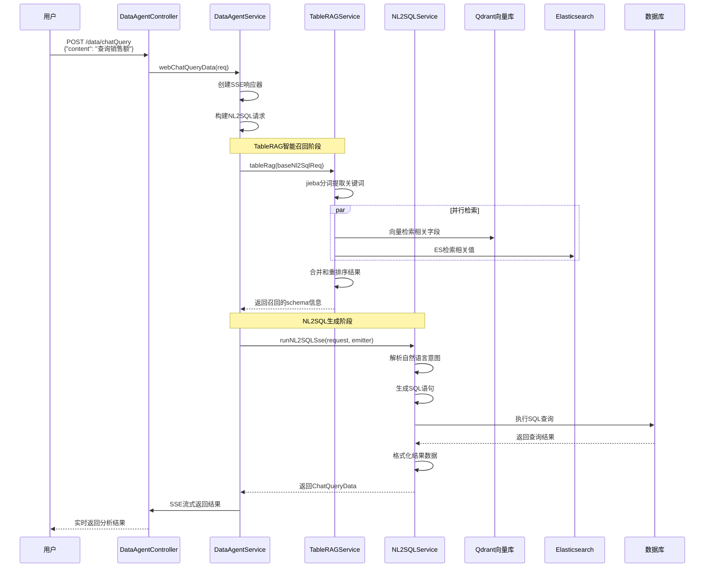
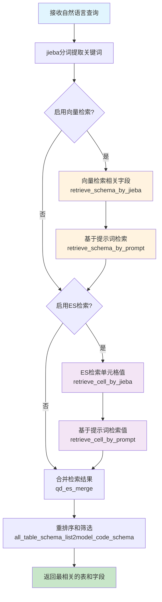
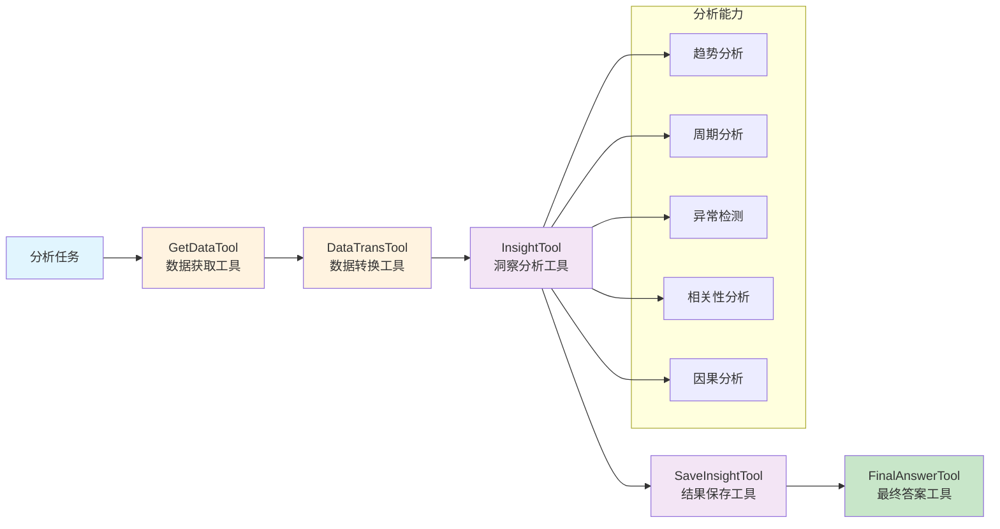
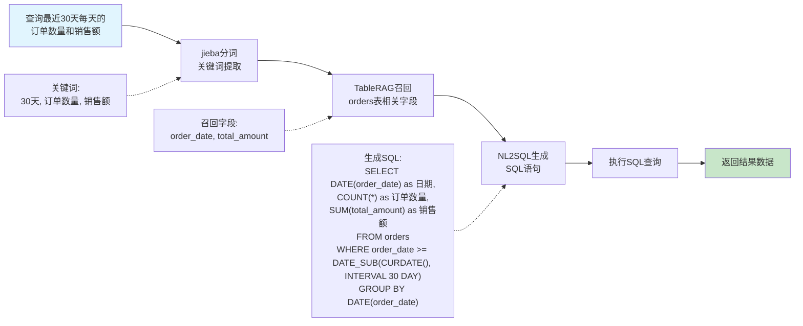
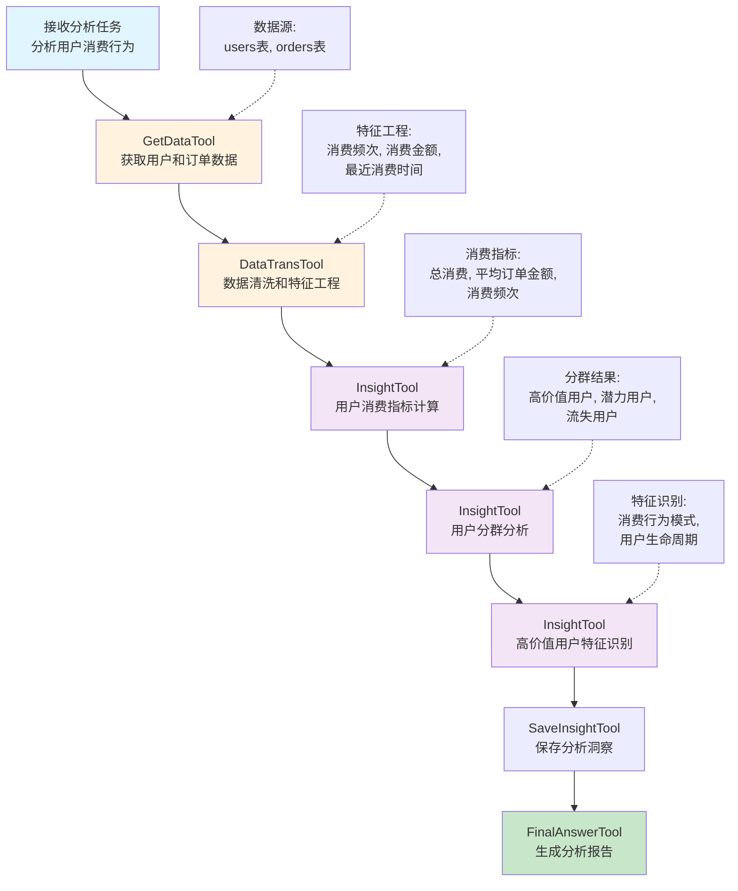
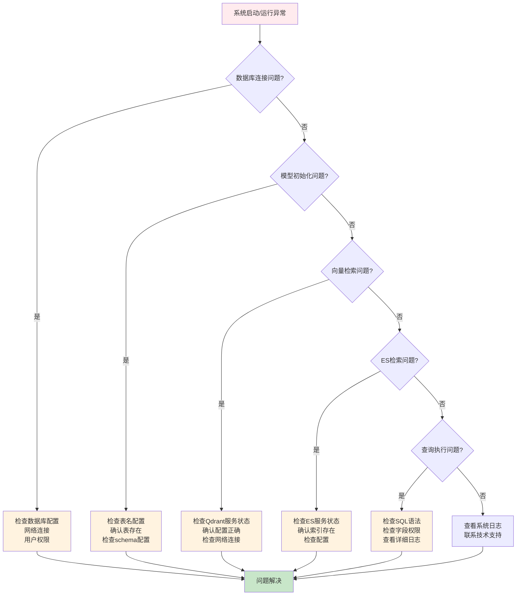
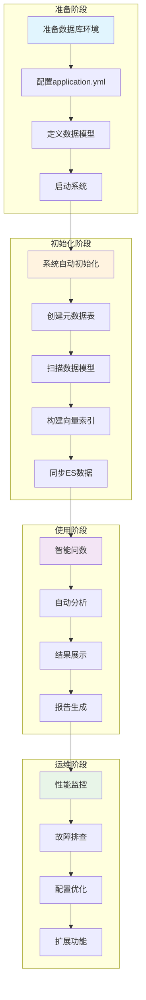

# DataAgent数据库分析使用指南

## 概述

基于对JoyAgent-JDGenie项目源码的深入分析，本指南将详细说明如何使用DataAgent分析您的数据库。DataAgent基于DGP协议，提供了完整的数据治理、智能问数和诊断分析能力。

## 1. 系统架构概览

### 1.1 核心组件
- **数据连接层**：支持MySQL、H2、ClickHouse等数据库
- **元数据管理层**：管理表结构和字段信息
- **智能检索层**：基于向量检索和ES的TableRAG
- **分析引擎层**：NL2SQL和自动分析引擎
- **接口服务层**：RESTful API和流式响应



### 1.2 技术栈
- **后端**：Spring Boot + MyBatis Plus + HikariCP
- **数据库**：支持MySQL、H2、ClickHouse
- **检索**：Qdrant向量数据库 + Elasticsearch
- **AI引擎**：基于大模型的NL2SQL和分析引擎

## 2. 数据库接入配置

### 2.1 配置文件设置

在`application.yml`中配置您的数据库连接：

```yaml
autobots:
  data-agent:
    # DataAgent服务地址
    agent-url: http://127.0.0.1:1601
    
    # 数据库配置
    db-config:
      type: mysql          # 数据库类型：mysql/h2/clickhouse
      host: localhost      # 数据库主机
      port: 3306          # 数据库端口
      schema: your_db     # 数据库名称
      username: root      # 用户名
      password: password  # 密码
      key: your-datasource # 数据源标识
    
    # Qdrant向量数据库配置（可选）
    qdrantConfig:
      enable: true
      host: 127.0.0.1
      port: 6333
      apiKey: your-api-key
      embeddingUrl: http://your-embedding-service
    
    # Elasticsearch配置（可选）
    es-config:
      enable: true
      host: 127.0.0.1:9200
      user: elastic
      password: your-password
```

### 2.2 支持的数据库类型

根据源码分析，系统支持以下数据库：

```java
// 支持的数据库方言
public enum DialectEnum {
    MYSQL("mysql", "com.mysql.cj.jdbc.Driver", "jdbc:mysql://", "/", "?useSSL=false&serverTimezone=UTC"),
    H2("h2", "org.h2.Driver", "jdbc:h2:mem:", "/", ";DB_CLOSE_DELAY=-1"),
    CLICKHOUSE("clickhouse", "com.clickhouse.jdbc.ClickHouseDriver", "jdbc:clickhouse://", "/", "")
}
```

### 2.3 连接池配置

系统使用HikariCP作为连接池，支持以下配置：

```java
// 连接池参数
private Long connectionTimeout = 10000L;    // 连接超时时间
private Long validationTimeout = 3000L;     // 验证超时时间
private Long idleTimeout = 600000L;         // 空闲超时时间
private Long maxLifetime = 1800000L;        // 最大生命周期
private Integer maxPoolSize = 50;           // 最大连接数
private Integer minIdle = 3;                // 最小空闲连接数
```

## 3. 数据模型配置

### 3.1 模型配置结构

在`application.yml`中配置您的数据模型：

```yaml
autobots:
  data-agent:
    model-list:
      # 表类型模型
      - name: 用户信息表                    # 模型名称
        id: t_user_info_001               # 唯一标识
        type: table                       # 类型：table/sql
        content: user_info                # 表名或SQL
        remark: 用户基础信息表             # 描述
        business-prompt: |                # 业务规则
          user_status字段：1-正常，0-禁用
          create_time为创建时间，统计时使用DATE(create_time)
        ignore-fields: id,created_by      # 忽略字段
        default-recall-fields: user_name,user_status  # 默认召回字段
        analyze-suggest-fields: user_type,region      # 建议分析字段
        analyze-forbid-fields: password,phone         # 禁止分析字段
        sync-value-fields: user_name,department       # 同步值字段
        column-alias-map: '{"user_name":"用户名,姓名","user_status":"用户状态,状态"}'
      
      # SQL类型模型
      - name: 用户统计视图
        id: t_user_stat_001
        type: sql
        content: |
          SELECT 
            user_id,
            user_name as 用户名,
            department as 部门,
            DATE(create_time) as 注册日期,
            user_status as 状态
          FROM user_info 
          WHERE user_status = 1
        remark: 活跃用户统计视图
        business-prompt: 只包含正常状态的用户数据
```

### 3.2 模型配置参数说明



| 参数 | 类型 | 说明 |
|------|------|------|
| `name` | String | 模型显示名称 |
| `id` | String | 模型唯一标识符 |
| `type` | String | 模型类型：`table`（表）或`sql`（SQL视图） |
| `content` | String | 表名（table类型）或SQL语句（sql类型） |
| `remark` | String | 模型描述信息 |
| `business-prompt` | String | 业务规则和使用说明 |
| `ignore-fields` | String | 忽略的字段列表（逗号分隔） |
| `default-recall-fields` | String | 默认召回的字段列表 |
| `analyze-suggest-fields` | String | 建议用于分析的字段 |
| `analyze-forbid-fields` | String | 禁止用于分析的字段 |
| `sync-value-fields` | String | 需要同步值到ES的字段 |
| `column-alias-map` | String | 字段别名映射（JSON格式） |

## 4. 系统初始化流程

### 4.1 自动初始化

系统启动时会自动执行以下初始化步骤：



```java
@Component
public class DataAgentInitRunner implements CommandLineRunner {
    @Override
    public void run(String... args) throws Exception {
        // 1. 初始化Qdrant向量集合
        if (qdrantConfig.getEnable()) {
            qdrantService.createCosineCollection(SCHEMA_COLLECTION_NAME, 1024);
        }
        
        // 2. 初始化ES索引
        if (esConfig.getEnable()) {
            columnValueSyncService.initColumnValueIndex();
        }
        
        // 3. 初始化数据模型信息
        chatModelInfoService.initModelInfo(dataAgentConfig);
    }
}
```

### 4.2 模型信息初始化过程

```java
public void initModelInfo(DataAgentConfig dataAgentConfig) throws Exception {
    List<DataAgentModelConfig> tableList = dataAgentConfig.getModelList();
    for (DataAgentModelConfig modelConfig : tableList) {
        // 1. 获取表结构信息
        List<TableColumn> tableSchema = getModelSchema(modelConfig);
        
        // 2. 查询字段样本值
        Map<String, Set<String>> fewShotMap = queryModelFewShot(modelConfig, tableSchema);
        
        // 3. 保存模型信息到数据库
        saveModelInfo(modelConfig, tableSchema, fewShotMap);
    }
}
```

### 4.3 元数据表结构

系统会自动创建以下元数据表：

```sql
-- 数据模型信息表
CREATE TABLE `chat_model_info` (
  `id` bigint(20) NOT NULL AUTO_INCREMENT,
  `code` varchar(50) NOT NULL COMMENT '模型编码',
  `type` varchar(10) NOT NULL COMMENT '模型类型TABLE,SQL',
  `name` varchar(100) DEFAULT NULL COMMENT '模型名称',
  `content` text NOT NULL COMMENT '模型内容，表或者sql',
  `use_prompt` text COMMENT '模型使用说明',
  `business_prompt` text COMMENT '模型业务限定提示词',
  `yn` tinyint(2) NOT NULL DEFAULT '1' COMMENT '是否有效',
  PRIMARY KEY (`id`)
);

-- 数据模型字段信息表
CREATE TABLE `chat_model_schema` (
  `id` bigint(20) NOT NULL AUTO_INCREMENT,
  `model_code` varchar(200) NOT NULL COMMENT '模型编码',
  `column_id` varchar(1000) NOT NULL COMMENT '字段唯一ID',
  `column_name` varchar(200) NOT NULL COMMENT '字段中文名',
  `column_comment` varchar(1000) NOT NULL COMMENT '字段描述',
  `few_shot` text COMMENT '值枚举逗号分隔',
  `data_type` varchar(20) DEFAULT NULL COMMENT '字段值类型',
  `synonyms` varchar(300) DEFAULT NULL COMMENT '同义词',
  `vector_uuid` varchar(400) DEFAULT NULL COMMENT '向量库数据id',
  `default_recall` tinyint(2) NOT NULL DEFAULT '0' COMMENT '默认召回',
  `analyze_suggest` tinyint(2) NOT NULL DEFAULT '0' COMMENT '分析建议',
  `yn` tinyint(2) NOT NULL DEFAULT '1' COMMENT '是否有效',
  PRIMARY KEY (`id`)
);
```

## 5. 智能问数使用

### 5.1 API接口

#### 5.1.1 流式查询接口

```http
POST /data/chatQuery
Content-Type: application/json

{
  "content": "查询最近一个月的销售额",
  "traceId": "optional-trace-id"
}
```

#### 5.1.2 同步查询接口

```http
POST /data/apiChatQuery
Content-Type: application/json

{
  "content": "统计各部门的员工数量",
  "traceId": "optional-trace-id"
}
```

### 5.2 查询处理流程



```java
public SseEmitter webChatQueryData(DataAgentChatReq req) throws Exception {
    // 1. 创建SSE响应器
    SseEmitter emitter = new SseEmitter(AUTO_AGENT_SSE_TIMEOUT);
    
    // 2. 构建NL2SQL请求
    NL2SQLReq baseNl2SqlReq = getBaseNl2SqlReq(req.getContent());
    baseNl2SqlReq.setRequestId(UUID.randomUUID().toString());
    
    // 3. 丰富查询上下文（TableRAG召回）
    enrichNl2Sql(baseNl2SqlReq);
    
    // 4. 异步执行查询
    ThreadUtil.execute(() -> {
        try {
            List<ChatQueryData> result = nl2SqlService.runNL2SQLSse(baseNl2SqlReq, emitter);
            emitter.send(ChatDataMessage.ofData(result));
        } catch (Exception e) {
            emitter.send(ChatDataMessage.ofError(e.getMessage()));
        } finally {
            emitter.complete();
        }
    });
    
    return emitter;
}
```

### 5.3 TableRAG智能召回

系统使用TableRAG技术进行智能字段召回：



```java
private List<ChatSchemaDto> recallModelSchema(NL2SQLReq baseNl2SqlReq) throws IOException {
    List<ChatSchemaDto> recallSchema = null;
    try {
        // 使用TableRAG进行智能召回
        recallSchema = tableRagService.tableRag(baseNl2SqlReq);
    } catch (Exception e) {
        log.warn("tableRag异常，使用数据库兜底", e);
        // 兜底策略：从数据库读取所有字段
        List<ChatModelSchema> list = chatModelSchemaService.list();
        // 转换为DTO
        recallSchema = convertToDto(list);
    }
    return recallSchema;
}
```

## 6. 自动分析功能

### 6.1 分析请求

```http
POST /genie/autoAnalysis
Content-Type: application/json

{
  "task": "分析用户增长趋势和用户行为特征",
  "modelCodeList": ["t_user_info_001", "t_user_behavior_001"],
  "businessKnowledge": "用户状态1表示正常，0表示禁用",
  "maxSteps": 10,
  "stream": true
}
```

### 6.2 分析工具链

系统提供以下分析工具：



```python
# 数据获取工具
class GetDataTool(Tool):
    def execute(self, query: str, model_codes: List[str]) -> pd.DataFrame:
        # 执行SQL查询获取数据
        pass

# 数据转换工具
class DataTransTool(Tool):
    def execute(self, data: pd.DataFrame, operations: List[str]) -> pd.DataFrame:
        # 数据清洗和转换
        pass

# 洞察分析工具
class InsightTool(Tool):
    def execute(self, data: pd.DataFrame, analysis_type: str) -> Dict:
        # 执行统计分析和洞察发现
        pass

# 结果保存工具
class SaveInsightTool(Tool):
    def execute(self, insights: List[Dict]) -> str:
        # 保存分析结果
        pass
```

## 7. 实际使用示例

### 7.1 配置示例数据库

假设您有一个电商数据库，包含以下表：

```sql
-- 用户表
CREATE TABLE users (
    user_id INT PRIMARY KEY,
    username VARCHAR(50),
    email VARCHAR(100),
    register_date DATE,
    user_status INT,
    user_type VARCHAR(20)
);

-- 订单表
CREATE TABLE orders (
    order_id INT PRIMARY KEY,
    user_id INT,
    order_date DATE,
    total_amount DECIMAL(10,2),
    order_status VARCHAR(20)
);

-- 商品表
CREATE TABLE products (
    product_id INT PRIMARY KEY,
    product_name VARCHAR(100),
    category VARCHAR(50),
    price DECIMAL(10,2)
);
```

### 7.2 配置数据模型

```yaml
autobots:
  data-agent:
    db-config:
      type: mysql
      host: localhost
      port: 3306
      schema: ecommerce
      username: root
      password: password
    
    model-list:
      - name: 用户信息表
        id: t_users_001
        type: table
        content: users
        remark: 电商平台用户基础信息
        business-prompt: |
          user_status: 1-正常用户, 0-禁用用户
          user_type: VIP-VIP用户, NORMAL-普通用户
          register_date: 用户注册日期，统计月份时使用DATE_FORMAT(register_date, '%Y-%m')
        analyze-suggest-fields: user_type,register_date,user_status
        analyze-forbid-fields: email
        sync-value-fields: username,user_type
        column-alias-map: '{"username":"用户名","user_status":"用户状态","user_type":"用户类型"}'
      
      - name: 订单信息表
        id: t_orders_001
        type: table
        content: orders
        remark: 电商平台订单信息
        business-prompt: |
          order_status: PAID-已支付, PENDING-待支付, CANCELLED-已取消
          total_amount: 订单总金额，单位为元
          order_date: 订单日期，统计时使用DATE(order_date)
        analyze-suggest-fields: order_date,total_amount,order_status
        sync-value-fields: order_status
        column-alias-map: '{"total_amount":"订单金额","order_status":"订单状态"}'
      
      - name: 用户订单统计
        id: t_user_order_stat_001
        type: sql
        content: |
          SELECT 
            u.user_id,
            u.username as 用户名,
            u.user_type as 用户类型,
            COUNT(o.order_id) as 订单数量,
            SUM(o.total_amount) as 总消费金额,
            AVG(o.total_amount) as 平均订单金额,
            MAX(o.order_date) as 最后下单日期
          FROM users u
          LEFT JOIN orders o ON u.user_id = o.user_id
          WHERE u.user_status = 1
          GROUP BY u.user_id, u.username, u.user_type
        remark: 用户订单消费统计视图
        business-prompt: 统计正常用户的订单和消费情况
```

### 7.3 使用示例

#### 7.3.1 智能问数示例

```bash
# 启动系统
sh start_genie.sh

# 访问前端界面
http://localhost:3000

# 或使用API
curl -X POST http://localhost:8080/data/chatQuery \
  -H "Content-Type: application/json" \
  -d '{
    "content": "查询最近30天每天的订单数量和销售额"
  }'
```

**系统处理流程：**



1. 接收自然语言查询
2. 使用TableRAG召回相关表和字段
3. 生成SQL：`SELECT DATE(order_date) as 日期, COUNT(*) as 订单数量, SUM(total_amount) as 销售额 FROM orders WHERE order_date >= DATE_SUB(CURDATE(), INTERVAL 30 DAY) GROUP BY DATE(order_date)`
4. 执行查询并返回结果

#### 7.3.2 自动分析示例

```bash
curl -X POST http://localhost:1601/auto_analysis \
  -H "Content-Type: application/json" \
  -d '{
    "task": "分析用户消费行为，找出高价值用户特征",
    "modelCodeList": ["t_users_001", "t_orders_001"],
    "businessKnowledge": "VIP用户享受更多优惠，普通用户转化为VIP的条件是月消费超过1000元",
    "maxSteps": 15,
    "stream": true
  }'
```

**系统分析流程：**



1. 获取用户和订单数据
2. 计算用户消费指标
3. 进行用户分群分析
4. 识别高价值用户特征
5. 生成分析报告

## 8. 高级配置

### 8.1 向量检索配置

```yaml
autobots:
  data-agent:
    qdrantConfig:
      enable: true
      host: 127.0.0.1
      port: 6333
      apiKey: your-api-key
      embeddingUrl: http://your-embedding-service
```

### 8.2 Elasticsearch配置

```yaml
autobots:
  data-agent:
    es-config:
      enable: true
      host: 127.0.0.1:9200
      user: elastic
      password: your-password
```

### 8.3 性能优化配置

```yaml
autobots:
  data-agent:
    db-config:
      # 连接池配置
      maxPoolSize: 50
      minIdle: 5
      connectionTimeout: 10000
      idleTimeout: 600000
      maxLifetime: 1800000
```

## 9. 故障排查

### 9.1 常见问题



#### 9.1.1 数据库连接失败
```
错误：Failed to get connection from pool
解决：检查数据库配置、网络连接、用户权限
```

#### 9.1.2 模型初始化失败
```
错误：Table 'xxx' doesn't exist
解决：确认表名正确，检查数据库schema配置
```

#### 9.1.3 向量检索失败
```
错误：Qdrant connection failed
解决：检查Qdrant服务状态，确认配置正确
```

### 9.2 日志分析

系统提供详细的日志信息：

```java
// 查询日志
log.info("{},{} query:{},数据分析取数耗时:{}", traceId, requestId, query, duration);

// SQL执行日志
log.info("jdbc执行sql:{}", sql);

// 召回日志
log.info("{},{} 召回schema数量：{}", traceId, requestId, schemaCount);
```

### 9.3 性能监控

监控关键指标：
- 数据库连接池使用率
- 查询响应时间
- 向量检索耗时
- 内存使用情况

## 10. 最佳实践

### 10.1 数据模型设计
1. **表名和字段名要有意义**：使用清晰的命名规范
2. **合理设置业务规则**：在`business-prompt`中详细说明字段含义
3. **配置字段别名**：提供多种表达方式的映射
4. **设置分析建议**：明确哪些字段适合分析

### 10.2 查询优化
1. **使用索引**：为常用查询字段创建索引
2. **限制数据量**：对大表查询设置合理的时间范围
3. **避免全表扫描**：在业务规则中说明过滤条件

### 10.3 安全考虑
1. **敏感字段保护**：将敏感字段加入`analyze-forbid-fields`
2. **访问权限控制**：配置数据库用户权限
3. **SQL注入防护**：系统已内置SQL解析和验证

### 10.4 扩展性设计
1. **模块化配置**：将不同业务的表分组配置
2. **版本管理**：为模型配置添加版本标识
3. **监控告警**：设置关键指标的监控和告警

## 总结

### 完整使用流程总览



通过以上配置和使用指南，您可以：

1. **快速接入**：将您的数据库接入DataAgent系统
2. **智能问数**：使用自然语言查询数据库
3. **自动分析**：获得AI驱动的数据洞察
4. **灵活配置**：根据业务需求定制分析规则

DataAgent基于DGP协议，提供了完整的数据治理和智能分析解决方案。通过合理的配置和使用，可以大大提升数据分析的效率和质量。

如需更多技术支持，请参考项目文档或联系开发团队。
