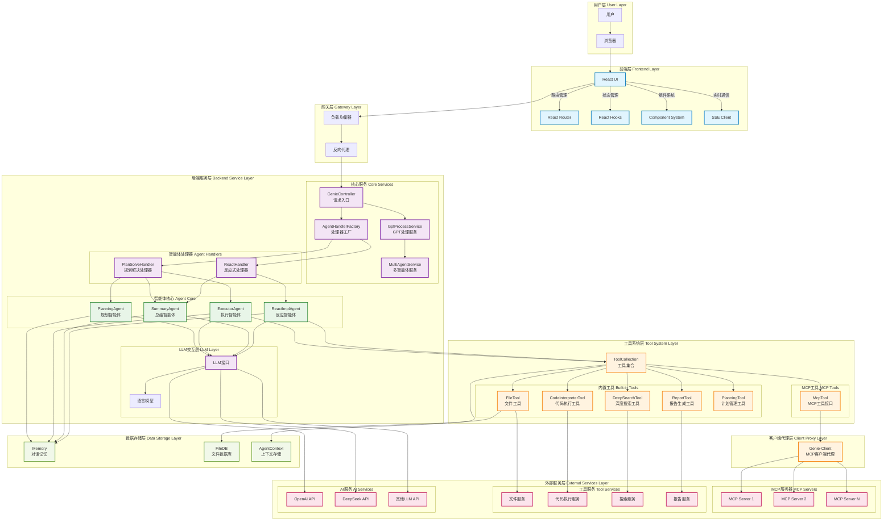
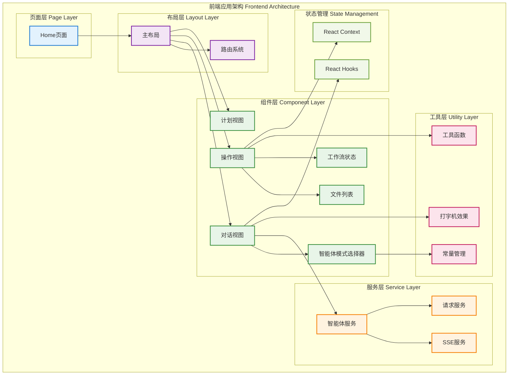
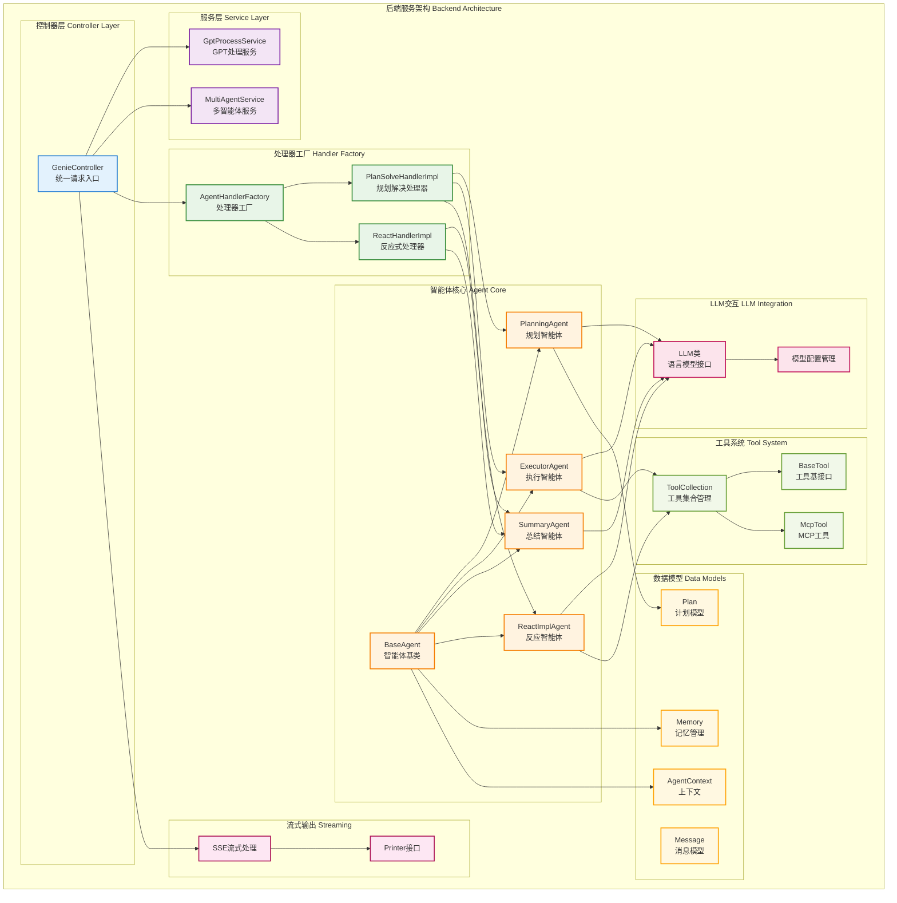
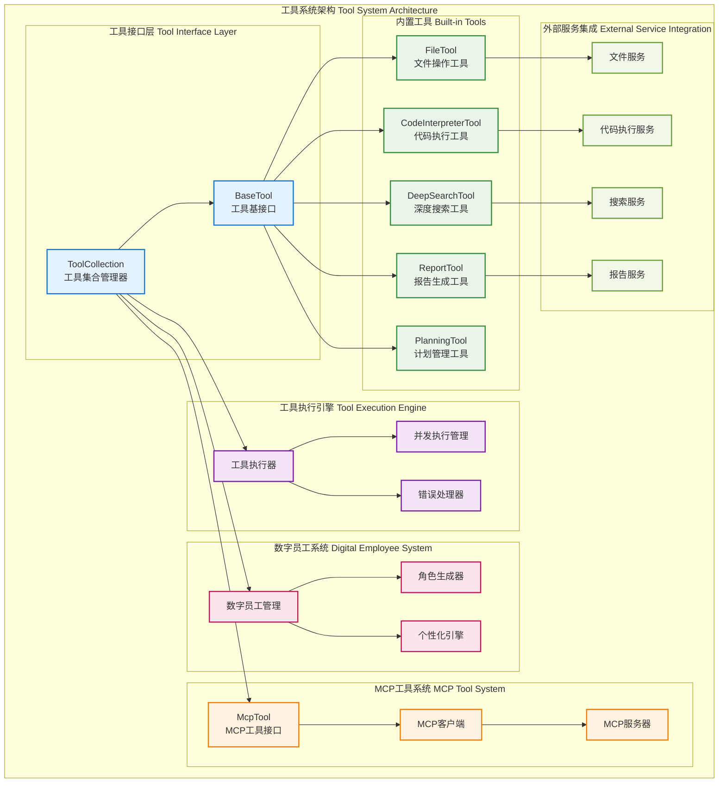
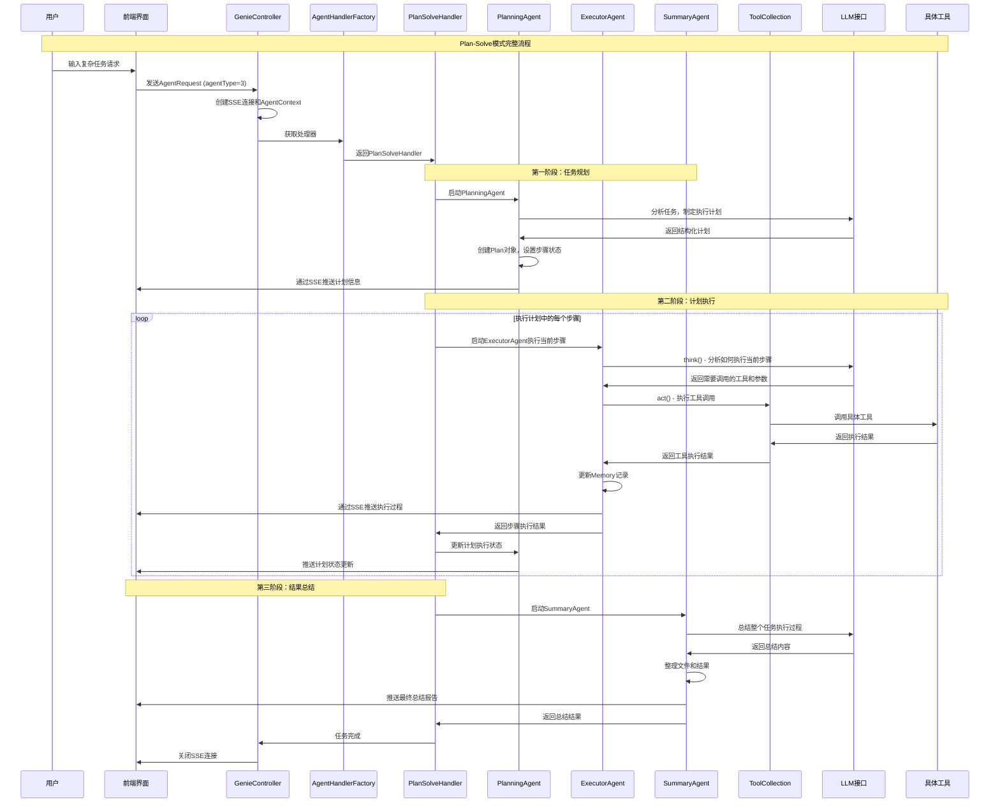

# JoyAgent-JDGenie 系统架构文档

## 概述

JoyAgent-JDGenie 是业界首个开源高完成度轻量化通用多智能体产品，采用端到端的多Agent架构设计，支持开箱即用的智能对话和复杂任务处理。系统基于现代化的微服务架构，集成了前端UI、后端服务、工具系统和客户端代理，提供完整的多智能体协作解决方案。

### 核心特性

- **端到端完整产品**：包含前端、后端、工具系统的完整解决方案
- **多智能体协作**：支持Planning、Executor、Summary等专业化智能体
- **工具生态扩展**：内置工具与MCP协议工具无缝集成
- **实时流式处理**：基于SSE的实时交互体验
- **模式灵活切换**：支持Plan-Solve和ReAct两种处理模式

## 系统整体架构

## 核心组件架构

### 1. 前端架构 (React + TypeScript)

#### 前端核心特性

- **React 18 + TypeScript**：现代化前端技术栈
- **组件化设计**：模块化、可复用的组件架构
- **实时通信**：基于SSE的实时数据流
- **响应式设计**：适配不同屏幕尺寸
- **状态管理**：React Hooks + Context API

#### 关键组件说明

| 组件 | 功能描述 | 关键特性 |
|------|----------|----------|
| **ChatView** | 对话界面主组件 | 消息渲染、输入处理、实时更新 |
| **ActionView** | 操作面板组件 | 文件预览、浏览器列表、工作空间 |
| **PlanView** | 计划展示组件 | 步骤可视化、进度跟踪 |
| **AgentModeSelector** | 智能体模式选择器 | 快速响应、深度研究、工作流模式 |
| **WorkflowStatus** | 工作流状态组件 | 实时状态、进度显示 |

### 2. 后端架构 (Spring Boot + Java)

#### 后端核心特性

- **Spring Boot 框架**：企业级Java应用框架
- **多智能体协作**：专业化智能体分工协作
- **工具扩展性**：统一的工具接口和MCP协议支持
- **流式处理**：SSE实时数据推送
- **状态管理**：完善的Agent状态和执行控制

#### 核心组件说明

| 组件 | 功能描述 | 关键特性 |
|------|----------|----------|
| **GenieController** | 统一请求入口 | SSE连接管理、心跳机制、异步处理 |
| **AgentHandlerFactory** | 处理器工厂 | 基于AgentType的动态路由 |
| **PlanSolveHandler** | 规划解决处理器 | 三阶段处理、并发执行支持 |
| **ExecutorAgent** | 执行智能体 | 工具调用、并发执行、数字员工 |
| **ToolCollection** | 工具集合管理 | 内置工具、MCP工具、动态扩展 |

### 3. 工具系统架构

#### 工具系统特性

- **统一接口设计**：所有工具实现BaseTool接口
- **灵活扩展机制**：内置工具与MCP工具无缝集成
- **并发执行支持**：支持多工具并发调用
- **数字员工体验**：为每个工具分配专业角色
- **错误处理机制**：完善的异常处理和重试机制

## 核心技术栈

### 前端技术栈
- **React 18 + TypeScript**：现代化前端技术栈
- **Vite + Tailwind CSS**：快速构建和样式框架
- **Ant Design**：企业级UI组件库

### 后端技术栈
- **Spring Boot 3.x + Java 17+**：企业级应用框架
- **Maven + Lombok**：构建工具和代码简化
- **OkHttp + Jackson**：HTTP客户端和JSON处理

### 工具系统技术栈
- **Python 3.11+ + FastAPI**：高性能Web框架
- **smolagents + LiteLLM**：智能体框架和多模型支持
- **pandas + matplotlib**：数据处理和可视化

### AI模型支持
- **OpenAI**：GPT-4, GPT-3.5 (通用对话、推理)
- **DeepSeek**：DeepSeek-Chat (代码生成、分析)
- **Anthropic**：Claude (长文本处理)

### 4. 智能体协作流程

## 总结

JoyAgent-JDGenie 系统架构具有以下核心优势：

### 1. 架构优势
- **模块化设计**：清晰的分层架构，组件职责明确
- **多智能体协作**：专业化智能体分工协作
- **工具生态扩展**：内置工具与MCP协议工具无缝集成
- **实时流式处理**：基于SSE的实时交互体验

### 2. 技术优势
- **现代化技术栈**：React + Spring Boot + Python FastAPI
- **AI模型灵活**：支持OpenAI、DeepSeek、Claude等多种模型
- **开箱即用**：端到端完整产品解决方案
- **二次开发友好**：完善的扩展机制和插件化架构

JoyAgent-JDGenie 作为业界首个开源的完整多智能体产品，为企业和开发者提供了一个强大、灵活、易用的AI智能体解决方案。
