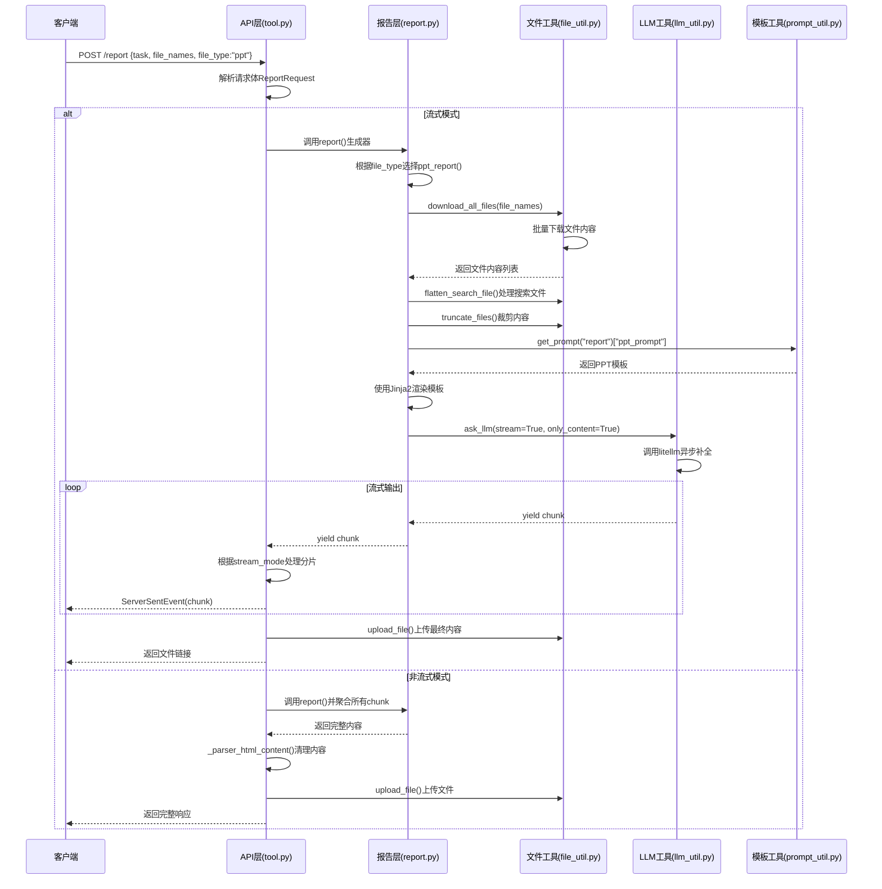

# PPT生成流程源码分析

## 概述

本文档详细分析了 `joyagent-jdgenie` 项目中PPT生成功能的完整源码实现流程。PPT生成是报告生成系统的核心功能之一，通过整合文件处理、模板渲染、LLM调用等多个模块，最终生成高质量的HTML格式PPT报告。

## 整体架构

PPT生成流程涉及以下核心模块：

```
API层 (tool.py)
    ↓
报告生成层 (report.py)
    ↓
工具层 (file_util.py, llm_util.py, prompt_util.py)
    ↓
基础设施层 (log_util.py, context.py)
```

## 详细流程分析

### 1. API入口层 (`genie-tool/genie_tool/api/tool.py`)

#### 1.1 接口定义

```python
@router.post("/report")
async def post_report(body: ReportRequest):
    """报告生成：按类型生成对应格式内容，支持 SSE 流式"""
```

**关键代码分析：**

- **请求体解析**：`ReportRequest` 模型定义在 `model/protocal.py` 中
- **文件类型支持**：`file_type: Literal["html", "markdown", "ppt"]`
- **流式输出控制**：通过 `body.stream` 参数决定是否启用SSE流式响应

#### 1.2 流式处理逻辑

```python
async def _stream():
    """SSE 流式推送报告内容，结束后保存文件并返回链接"""
    content = ""  # 总内容（用于最终存储）
    acc_content = ""  # 分片缓冲（用于节流推送）
    acc_token = 0
    acc_time = time.time()
    
    # 调用报告生成器，按所选类型（markdown/html/ppt）流式生成
    async for chunk in report(
        task=body.task,
        file_names=body.file_names,
        file_type=body.file_type,
    ):
        content += chunk
        acc_content += chunk
        acc_token += 1
        
        # 根据不同流式模式处理输出
        if body.stream_mode.mode == "general":
            # 通用模式：直接透传分片
            yield ServerSentEvent(
                data=json.dumps({
                    "requestId": body.request_id, 
                    "data": chunk, 
                    "isFinal": False
                }, ensure_ascii=False)
            )
        elif body.stream_mode.mode == "token":
            # Token 模式：累计达到阈值时输出
            if acc_token >= body.stream_mode.token:
                yield ServerSentEvent(...)
                acc_token = 0
                acc_content = ""
        # ... 其他模式处理
```

**核心机制：**
1. **累积式内容构建**：每个chunk都会追加到总content中
2. **多种流式模式**：支持general、token、time等不同的流式输出策略
3. **SSE协议**：使用 `ServerSentEvent` 包装数据，支持实时推送

#### 1.3 非流式处理

```python
if body.stream:
    return EventSourceResponse(_stream(), ping_message_factory=lambda: ServerSentEvent(data="heartbeat"), ping=15)
else:
    # 非流式：聚合完整报告并返回
    content = ""
    async for chunk in report(task=body.task, file_names=body.file_names, file_type=body.file_type):
        content += chunk
    
    # HTML/PPT 类型需剥离围栏代码块
    if body.file_type in ["ppt", "html"]:
        content = _parser_html_content(content)
    
    # 上传并返回链接
    file_info = [await upload_file(
        content=content, 
        file_name=body.file_name, 
        request_id=body.request_id,
        file_type="html" if body.file_type == "ppt" else body.file_type
    )]
    return {"code": 200, "data": content, "fileInfo": file_info, "requestId": body.request_id}
```

**关键点：**
- PPT类型最终以HTML格式存储（`file_type="html" if body.file_type == "ppt"`）
- 使用 `_parser_html_content()` 清理LLM生成的markdown代码块包装

### 2. 报告生成核心层 (`genie-tool/genie_tool/tool/report.py`)

#### 2.1 报告类型分发器

```python
@timer(key="enter")  # 记录进入与耗时
async def report(
    task: str,
    file_names: Optional[List[str]] = tuple(),
    model: str = "gpt-4.1",
    file_type: Literal["markdown", "html", "ppt"] = "markdown",
) -> AsyncGenerator:
    # 报告类型到具体处理函数的映射
    report_factory = {
        "ppt": ppt_report,
        "markdown": markdown_report,
        "html": html_report,
    }
    model = os.getenv("REPORT_MODEL", "gpt-4.1")  # 从环境变量覆盖模型名（若存在）
    # 将生成内容以流式片段形式 yield 出去
    async for chunk in report_factory[file_type](task, file_names, model):
        yield chunk
```

**设计模式：**
- 使用**工厂模式**将不同报告类型映射到具体处理函数
- **环境变量覆盖**：支持通过 `REPORT_MODEL` 环境变量动态指定模型
- **异步生成器**：保持流式特性，逐chunk传递给上层

#### 2.2 PPT报告生成器核心实现

```python
@timer(key="enter")  # 记录进入与耗时
async def ppt_report(
    task: str,
    file_names: Optional[List[str]] = tuple(),
    model: str = "gpt-4.1",
    temperature: float = None,
    top_p: float = 0.6,
) -> AsyncGenerator:
    files = await download_all_files(file_names)  # 下载输入文件内容
    flat_files = []  # 汇总用于渲染的文件列表
    
    # 1. 文件过滤和优先级处理
    filtered_files = [f for f in files if f["file_name"].split(".")[-1] in ["md", "html"]
                      and not f["file_name"].endswith("_搜索结果.md")] or files  # 优先使用md/html
    
    for f in filtered_files:
        # 对于搜索文件有结构，需要重新解析
        if f["file_name"].endswith("_search_result.txt"):
            flat_files.extend(flatten_search_file(f))  # 搜索结果拍平
        else:
            flat_files.append(f)  # 直接加入
    
    # 2. 上下文长度控制
    # 按模型上下文长度的80%进行裁剪
    truncate_flat_files = truncate_files(flat_files, max_tokens=int(LLMModelInfoFactory.get_context_length(model) * 0.8))
    
    # 3. Prompt模板渲染
    prompt = Template(get_prompt("report")["ppt_prompt"]) \
        .render(task=task, files=truncate_flat_files, date=datetime.now().strftime("%Y-%m-%d"))  # 渲染PPT任务提示
    
    # 4. LLM流式调用
    async for chunk in ask_llm(messages=prompt, model=model, stream=True,
                                temperature=temperature, top_p=top_p, only_content=True):  # 流式请求LLM
        yield chunk  # 逐片段返回
```

**关键流程：**

1. **文件下载与处理**
   - 调用 `download_all_files()` 批量下载文件内容
   - 优先处理 `.md` 和 `.html` 格式文件
   - 排除搜索结果文件（`_搜索结果.md`）

2. **文件结构化处理**
   - 对搜索结果文件（`_search_result.txt`）调用 `flatten_search_file()` 进行结构化解析
   - 普通文件直接加入处理队列

3. **上下文长度管理**
   - 通过 `LLMModelInfoFactory.get_context_length(model)` 获取模型上下文限制
   - 使用80%作为安全边界，调用 `truncate_files()` 进行内容裁剪

4. **Prompt渲染**
   - 使用Jinja2模板引擎渲染PPT专用prompt
   - 注入任务描述、文件内容、当前日期等变量

5. **LLM调用**
   - 启用流式模式（`stream=True`）
   - 仅返回内容（`only_content=True`），过滤掉元数据
   - 使用较低的 `top_p=0.6` 提高输出一致性

### 3. 文件处理工具层 (`genie-tool/genie_tool/util/file_util.py`)

#### 3.1 文件下载机制

```python
@timer()
async def download_all_files(file_names: list[str]) -> List[Dict[str, Any]]:
    """批量下载文件内容，支持本地文件和远程URL"""
    file_contents = []
    for file_name in file_names:
        try:
            file_contents.append({
                "file_name": file_name,
                "content": await get_file_content(file_name),
            })
        except Exception as e:
            logger.warning(f"Failed to download file {file_name}. Exception: {e}")
            file_contents.append({
                "file_name": file_name,
                "content": "Failed to get content.",
            })
    return file_contents

@timer()
async def get_file_content(file_name: str) -> str:
    """获取文件内容，自动识别本地路径和远程URL"""
    # local file
    if file_name.startswith("/"):
        with open(file_name, "r") as rf:
            return rf.read()
    # file server
    else:
        b_content = b""
        async with aiohttp.ClientSession() as session:
            async with session.get(file_name, timeout=10) as response:
                while True:
                    chunk = await response.content.read(1024)
                    if not chunk:
                        break
                    b_content += chunk
        return b_content.decode("utf-8")
```

**设计特点：**
- **路径识别**：通过判断是否以 `/` 开头来区分本地文件和远程URL
- **异步下载**：使用 `aiohttp` 实现高性能异步HTTP请求
- **分块读取**：以1KB为单位分块读取，避免大文件内存占用
- **容错处理**：下载失败时返回错误提示而非中断整个流程

#### 3.2 内容裁剪机制

```python
@timer()
def truncate_files(
    files: List[Dict[str, Any]] | List[Doc], max_tokens: int
) -> List[Dict[str, Any]] | List[Doc]:
    """按token限制裁剪文件内容"""
    truncated_files = []
    total_tokens = 0
    
    for f in files:
        content = f.get("content", "") if isinstance(f, dict) else f.content
        content_tokens = len(content)  # 简单按字符数估算token
        
        if total_tokens + content_tokens <= max_tokens:
            truncated_files.append(f)
            total_tokens += content_tokens
        else:
            # 部分裁剪：保留能放下的部分
            remaining_tokens = max_tokens - total_tokens
            if remaining_tokens > 0:
                truncated_content = content[:remaining_tokens]
                if isinstance(f, dict):
                    truncated_f = deepcopy(f)
                    truncated_f["content"] = truncated_content
                    truncated_files.append(truncated_f)
                else:
                    truncated_f = deepcopy(f)
                    truncated_f.content = truncated_content
                    truncated_files.append(truncated_f)
            break
    
    return truncated_files
```

**裁剪策略：**
- **贪心算法**：按文件顺序尽可能多地保留完整文件
- **部分保留**：最后一个文件如果超出限制，会保留前半部分
- **深拷贝保护**：避免修改原始数据结构

#### 3.3 搜索文件结构化

```python
@timer()
def flatten_search_file(s_file: Dict[str, Any]) -> List[Dict[str, Any]]:
    """将搜索结果文件解析为结构化文档列表"""
    flat_files = []
    try:
        docs = json.loads(s_file["content"])
        for doc in docs:
            if isinstance(doc, dict) and "content" in doc:
                flat_files.append(doc)
    except Exception as e:
        logger.warning(f"Failed to parse search file. Exception: {e}")
        # 解析失败时返回原文件
        flat_files.append(s_file)
    
    return flat_files
```

### 4. LLM调用层 (`genie-tool/genie_tool/util/llm_util.py`)

#### 4.1 统一LLM接口

```python
@timer(key="enter")
async def ask_llm(
    messages: str | List[Any],
    model: str,
    temperature: float = None,
    top_p: float = None,
    stream: bool = False,
    only_content: bool = False,     # 只返回内容
    extra_headers: Optional[dict] = None,
    **kwargs,
):
    """调用底层 LLM 接口（litellm）"""
    
    # 统一 messages 格式：字符串 -> 单条 user 消息
    if isinstance(messages, str):
        messages = [{"role": "user", "content": messages}]
    
    # 可选的敏感词替换（开关：SENSITIVE_WORD_REPLACE）
    if os.getenv("SENSITIVE_WORD_REPLACE", "false") == "true":
        for message in messages:
            if isinstance(message.get("content"), str):
                message["content"] = SensitiveWordsReplace.replace(message["content"])
            else:
                message["content"] = json.loads(
                    SensitiveWordsReplace.replace(json.dumps(message["content"], ensure_ascii=False)))
    
    # 发起异步补全请求
    response = await acompletion(
        messages=messages,
        model=model,
        temperature=temperature,
        top_p=top_p,
        stream=stream,
        extra_headers=extra_headers,
        **kwargs
    )
    
    # 统一计时：不同返回模式下都统计耗时
    async with AsyncTimer(key=f"exec ask_llm"):
        if stream:
            # 流式：逐增量返回
            async for chunk in response:
                if only_content:
                    if chunk.choices and chunk.choices[0] and chunk.choices[0].delta and chunk.choices[0].delta.content:
                        yield chunk.choices[0].delta.content
                else:
                    yield chunk
        else:
            # 非流式：返回完整对象或仅内容
            yield response.choices[0].message.content if only_content else response
```

**核心特性：**
1. **消息格式统一**：自动将字符串转换为OpenAI格式的messages数组
2. **敏感词过滤**：可选的内容审查机制
3. **流式/非流式兼容**：通过统一接口支持两种调用模式
4. **内容提取**：`only_content=True` 时仅返回文本内容，过滤元数据
5. **性能监控**：使用 `AsyncTimer` 记录调用耗时

### 5. Prompt模板系统 (`genie-tool/genie_tool/prompt/report.yaml`)

#### 5.1 PPT Prompt模板结构

PPT生成的prompt模板包含以下核心部分：

**角色定义：**
```yaml
ppt_prompt: |-
  你是一个资深的前端工程师，同时也是 PPT制作高手，根据用户的【任务】和提供的【文本内容】，生成一份 PPT，使用 HTML 语言。
```

**设计要求：**
- **风格要求**：高级感、科技感、扁平化风格、卡片样式
- **配色方案**：莫兰迪色系、高级灰色系、孟菲斯色系等
- **布局约束**：16:9宽高比、禁止溢出、CSS Grid对齐

**内容要求：**
- **结构化**：首页、目录页、过渡页、内容页、总结页、结束页
- **逻辑性**：按照金字塔原理提炼大纲
- **数据可视化**：使用ECharts生成图表（饼图、折线图、柱状图等）

**技术规范：**
```yaml
### 检查项
请你认真检查下面这些项：
- echarts 使用（https://unpkg.com/echarts@5.6.0/dist/echarts.min.js）资源
- echarts 图表在页面上正确初始化（调用 echarts.init 方法），正常显示
- echarts 能够正确实现自适应窗口（调用 resize 方法）
```

**模板变量注入：**
```yaml
## 文本内容

```
<docs>

  <doc>
    <title>{{ f['title'] }}</title>
    <link>{{ f['link'] }}</link>
    <content>{{ f['content'] }}</content>
  </doc>

</docs>
```


任务：{{ task }}
```

#### 5.2 模板加载机制

```python
from genie_tool.util.prompt_util import get_prompt

def get_prompt(prompt_file):
    """从包资源中加载YAML格式的prompt模板"""
    return yaml.safe_load(importlib.resources.files("genie_tool.prompt").joinpath(f"{prompt_file}.yaml").read_text())
```

### 6. 性能监控与日志系统

#### 6.1 计时装饰器

```python
@timer(key="enter")  # 为每个关键函数添加性能监控
```

系统使用 `@timer()` 装饰器对关键函数进行性能监控：
- `report()` - 总体报告生成耗时
- `ppt_report()` - PPT专用生成耗时
- `download_all_files()` - 文件下载耗时
- `ask_llm()` - LLM调用耗时

#### 6.2 请求链路追踪

通过 `RequestIdCtx` 实现请求级别的链路追踪：
```python
logger.info(f"{RequestIdCtx.request_id} {self.key} cost=[{int((time.time() - self.start_time) * 1000)} ms]")
```

### 7. 上下文管理与模型配置

#### 7.1 模型上下文长度管理

```python
from genie_tool.model.context import LLMModelInfoFactory

# 获取模型的上下文长度限制
max_tokens = int(LLMModelInfoFactory.get_context_length(model) * 0.8)
truncate_flat_files = truncate_files(flat_files, max_tokens=max_tokens)
```

**设计原理：**
- 使用80%的上下文长度作为安全边界
- 为prompt模板、输出内容预留20%空间
- 避免触发模型的token限制导致截断

## 完整流程时序图



## 关键技术特点总结

### 1. 异步流式架构
- **全链路异步**：从API到LLM调用全程使用async/await
- **流式传输**：支持SSE协议实时推送生成内容
- **内存友好**：通过生成器模式避免大内容的内存积累

### 2. 模块化设计
- **职责分离**：API层、业务层、工具层清晰分离
- **工厂模式**：通过report_factory支持多种报告类型
- **依赖注入**：通过环境变量动态配置模型和参数

### 3. 智能内容处理
- **文件类型识别**：自动区分本地文件和远程URL
- **内容优先级**：优先处理md/html格式文件
- **上下文管理**：智能裁剪内容适应模型限制

### 4. 高级Prompt工程
- **模板化系统**：使用Jinja2模板引擎
- **结构化注入**：将文件内容以XML格式注入模板
- **多维度约束**：从设计风格到技术实现的全方位约束

### 5. 企业级特性
- **性能监控**：全链路计时和日志记录
- **链路追踪**：基于RequestId的请求跟踪
- **容错处理**：优雅处理文件下载失败、解析错误等异常
- **敏感词过滤**：可选的内容审查机制

这套PPT生成系统展现了现代AI应用开发的最佳实践，通过精心设计的架构实现了高性能、高可用、高扩展性的智能内容生成能力。
