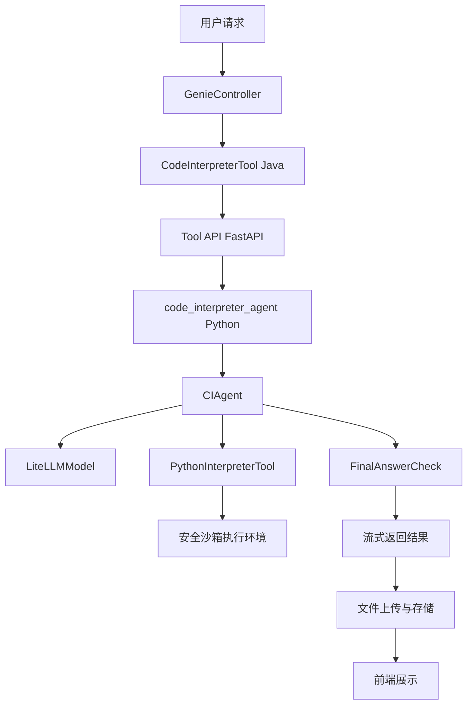
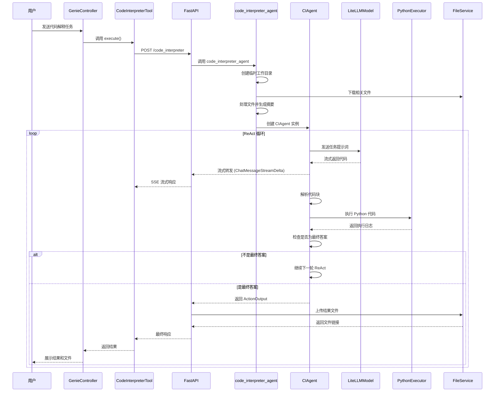
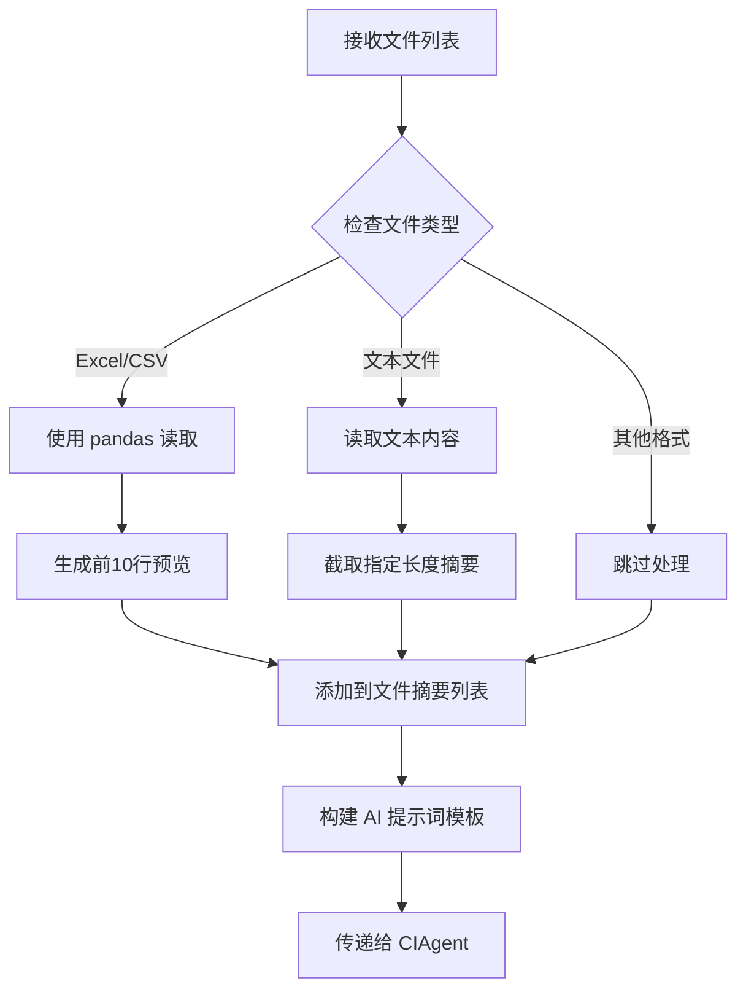
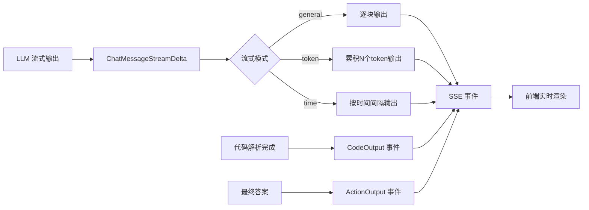

# JoyAgent-JDGenie Code Interpreter Agent 深度分析

## 目录
- [1. 概述](#1-概述)
- [2. 架构设计](#2-架构设计)
- [3. 核心组件分析](#3-核心组件分析)
- [4. 流程图解](#4-流程图解)
- [5. 核心源码分析](#5-核心源码分析)
- [6. 数据流转](#6-数据流转)
- [7. 技术特点](#7-技术特点)
- [8. 使用场景](#8-使用场景)

## 1. 概述

Code Interpreter Agent 是 JoyAgent-JDGenie 系统中的核心组件之一，负责将自然语言任务转换为可执行的 Python 代码，并在安全沙箱环境中执行。该组件基于 ReAct（Reasoning-Acting-Observing）框架设计，支持流式输出和文件处理。

### 1.1 主要功能
- **智能代码生成**：基于用户任务描述生成相应的 Python 代码
- **安全代码执行**：在受限的沙箱环境中执行代码
- **流式输出**：支持实时返回执行过程和结果
- **文件处理**：支持多种文件格式的读取和处理（Excel、CSV、文本文件等）
- **结果导出**：将执行结果保存为文件并提供下载链接

### 1.2 技术栈
- **后端框架**：Java Spring Boot + Python FastAPI
- **AI 框架**：smolagents（轻量级智能体框架）
- **模型接口**：LiteLLM（支持多种 LLM 提供商）
- **数据处理**：pandas, numpy, matplotlib 等
- **流式通信**：SSE (Server-Sent Events)

## 2. 架构设计

### 2.1 整体架构



### 2.2 分层设计

#### 接入层 (Access Layer)
- **GenieController**: 统一的请求入口，负责请求路由和上下文管理
- **CodeInterpreterTool**: Java 工具包装器，实现 BaseTool 接口

#### 服务层 (Service Layer)
- **FastAPI Tool API**: HTTP 接口层，处理跨语言调用
- **code_interpreter_agent**: Python 核心业务逻辑

#### 执行层 (Execution Layer)
- **CIAgent**: 基于 smolagents 的智能体实现
- **PythonInterpreterTool**: 安全的 Python 代码执行器

#### 存储层 (Storage Layer)
- **文件服务**: 负责文件的上传、下载和预览
- **临时工作目录**: 代码执行过程中的临时文件存储

## 3. 核心组件分析

### 3.1 CodeInterpreterTool (Java)

```java
public class CodeInterpreterTool implements BaseTool {
    private AgentContext agentContext;

    @Override
    public String getName() {
        return "code_interpreter";
    }

    @Override
    public Object execute(Object input) {
        // 构建请求参数
        CodeInterpreterRequest request = CodeInterpreterRequest.builder()
            .requestId(agentContext.getSessionId())
            .query(agentContext.getQuery())
            .task(task)
            .fileNames(fileNames)
            .stream(true)
            .build();

        // 调用 Python 服务
        Future future = callCodeAgentStream(request);
        return future.get();
    }
}
```

**核心特性**：
- 实现 BaseTool 接口，集成到智能体工具链
- 支持流式调用 Python 服务
- 自动管理会话上下文和文件列表
- 异步处理和超时控制

### 3.2 code_interpreter_agent (Python)

```python
@timer()
async def code_interpreter_agent(
    task: str,
    file_names: Optional[List[str]] = None,
    max_file_abstract_size: int = 2000,
    max_tokens: int = 32000,
    request_id: str = "",
    stream: bool = True,
):
```

**主要职责**：
1. **环境准备**：创建临时工作目录，下载相关文件
2. **文件处理**：解析不同格式文件并生成摘要
3. **AI 代理创建**：配置 CIAgent 实例
4. **任务执行**：流式执行代码生成和执行任务
5. **结果处理**：上传生成的文件和结果

### 3.3 CIAgent 智能体

基于 smolagents 的 CodeAgent，实现了 ReAct 框架：

```python
class CIAgent(CodeAgent):
    def _step_stream(self, memory_step: ActionStep):
        # 1. 构造模型输入
        memory_messages = self.write_memory_to_messages()

        # 2. 流式调用 LLM
        for event in output_stream:
            yield event  # 实时返回增量

        # 3. 解析代码块
        code_action = fix_final_answer_code(parse_code_blobs(output_text))

        # 4. 执行代码
        _, execution_logs, _ = self.python_executor(code_action)

        # 5. 判断是否为最终答案
        finalFlag, exeLog = finalObj.check_is_final_answer()

        # 6. 返回结果
        yield ActionOutput(output=exeLog, is_final_answer=finalFlag)
```

## 4. 流程图解

### 4.1 完整执行流程



### 4.2 文件处理流程



### 4.3 流式输出处理



## 5. 核心源码分析

### 5.1 流式处理核心逻辑

```python
async def _stream():
    """SSE 流式推送执行过程与最终结果"""
    acc_content = ""
    acc_token = 0
    acc_time = time.time()

    async for chunk in code_interpreter_agent(
        task=body.task,
        file_names=body.file_names,
        request_id=body.request_id,
        stream=True,
    ):
        if isinstance(chunk, CodeOuput):
            # 推送代码块事件
            yield ServerSentEvent(
                data=json.dumps({
                    "requestId": body.request_id,
                    "code": chunk.code,
                    "fileInfo": chunk.file_list,
                    "isFinal": False,
                }, ensure_ascii=False)
            )
        elif isinstance(chunk, ActionOutput):
            # 推送最终答案事件
            yield ServerSentEvent(
                data=json.dumps({
                    "requestId": body.request_id,
                    "codeOutput": chunk.content,
                    "fileInfo": chunk.file_list,
                    "isFinal": True,
                }, ensure_ascii=False)
            )
            yield ServerSentEvent(data="[DONE]")
        else:
            # 处理不同的流式模式
            handle_stream_mode(chunk, body.stream_mode)
```

### 5.2 文件处理核心逻辑

```python
# 处理表格文件
if file_name.split(".")[-1] in ["xlsx", "xls", "csv"]:
    pd.set_option("display.max_columns", None)
    df = (
        pd.read_csv(file_path) if file_name.endswith(".csv")
        else pd.read_excel(file_path)
    )
    files.append({"path": file_path, "abstract": f"{df.head(10)}"})

# 处理文本文件
elif file_name.split(".")[-1] in ["txt", "md", "html"]:
    with open(file_path, "r", encoding="utf-8") as rf:
        files.append({
            "path": file_path,
            "abstract": "".join(rf.readlines())[:max_file_abstract_size],
        })
```

### 5.3 安全执行环境

```python
def create_ci_agent(
    prompt_templates=None,
    max_tokens: int = 16000,
    return_full_result: bool = True,
    output_dir: str = "",
) -> CIAgent:
    model = LiteLLMModel(
        max_tokens=max_tokens,
        model_id=os.getenv("CODE_INTEPRETER_MODEL", "gpt-4.1")
    )

    return CIAgent(
        model=model,
        prompt_templates=prompt_templates,
        tools=[PythonInterpreterTool()],
        return_full_result=return_full_result,
        additional_authorized_imports=[
            "pandas", "openpyxl", "numpy",
            "matplotlib", "seaborn",
        ],
        output_dir=output_dir,
    )
```

## 6. 数据流转

### 6.1 请求数据结构

```python
class CIRequest(BaseModel):
    request_id: str = Field(alias="requestId")
    task: Optional[str] = Field(default=None)
    file_names: Optional[List[str]] = Field(default=[])
    stream: bool = True
    stream_mode: Optional[StreamMode] = Field(default=StreamMode())
```

### 6.2 响应数据结构

```python
@dataclass
class CodeOuput:
    """新生成的代码产出"""
    code: Any
    file_name: str
    file_list: list = None

@dataclass
class ActionOutput:
    """动作执行的输出内容与附件列表"""
    content: str
    file_list: list
```

### 6.3 流式事件类型

1. **ChatMessageStreamDelta**: LLM 的增量输出
2. **CodeOutput**: 解析出的代码片段
3. **ActionOutput**: 最终执行结果
4. **ToolCall/ToolOutput**: 工具调用事件（内部使用）

## 7. 技术特点

### 7.1 安全性
- **沙箱执行环境**：限制文件系统访问和网络请求
- **受限导入**：只允许预定义的 Python 库
- **资源控制**：限制执行时间和内存使用
- **代码解析**：严格解析和验证生成的代码

### 7.2 可扩展性
- **插件化工具系统**：easy to add new tools
- **模型无关**：支持多种 LLM 提供商
- **流式处理**：支持多种流式输出模式
- **文件格式扩展**：容易添加新的文件格式支持

### 7.3 性能优化
- **异步处理**：全链路异步执行
- **流式输出**：减少等待时间，提升用户体验
- **资源清理**：自动清理临时文件和目录
- **连接池**：HTTP 连接复用

### 7.4 错误处理
- **分层异常处理**：每层都有相应的异常处理机制
- **优雅降级**：执行失败时提供有意义的错误信息
- **重试机制**：网络调用失败时自动重试
- **日志追踪**：全链路日志追踪和调试

## 8. 使用场景

### 8.1 数据分析场景
```
用户任务: "分析这个 Excel 文件中的销售数据趋势"
处理流程:
1. 读取 Excel 文件
2. 生成数据预览摘要
3. AI 生成分析代码
4. 执行数据分析
5. 生成可视化图表
6. 返回分析报告和图表文件
```

### 8.2 数据处理场景
```
用户任务: "将 CSV 文件转换为带有统计信息的 Excel 报表"
处理流程:
1. 读取 CSV 文件数据
2. AI 生成数据处理代码
3. 执行数据清洗和统计
4. 生成 Excel 报表
5. 返回处理后的文件
```

### 8.3 图表生成场景
```
用户任务: "根据数据生成销售趋势图"
处理流程:
1. 分析输入数据结构
2. AI 生成 matplotlib 可视化代码
3. 执行绘图代码
4. 保存图表文件
5. 返回图表预览和下载链接
```

### 8.4 代码学习场景
```
用户任务: "帮我写一个计算斐波那契数列的函数"
处理流程:
1. AI 生成示例代码
2. 执行代码验证正确性
3. 提供代码说明和测试结果
4. 保存代码文件供下载
```

---

## 总结

Code Interpreter Agent 是一个功能强大、设计精良的代码生成和执行系统。它通过以下几个关键特性实现了高效的代码解释服务：

1. **智能化**：基于先进的 ReAct 框架和大语言模型
2. **安全性**：沙箱执行环境确保代码安全运行
3. **实时性**：流式输出提供良好的用户体验
4. **灵活性**：支持多种文件格式和输出方式
5. **可扩展**：模块化设计便于功能扩展

该系统在数据分析、代码生成、文件处理等场景下都能提供出色的服务，是 JoyAgent-JDGenie 多智能体系统中的重要组成部分。