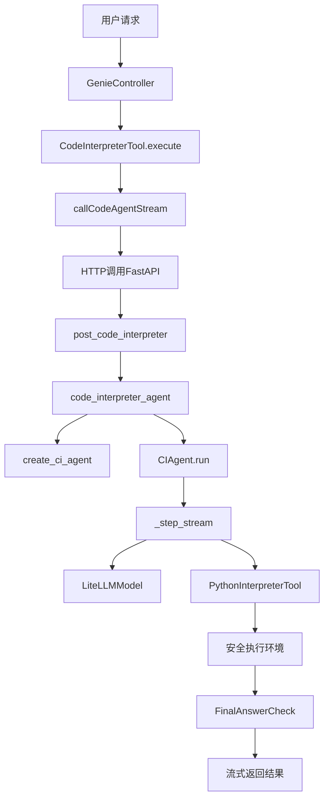
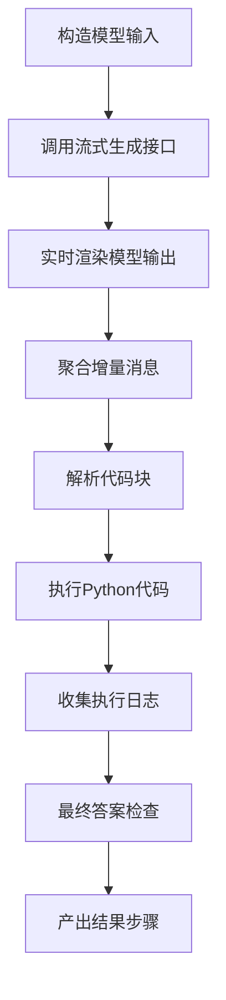
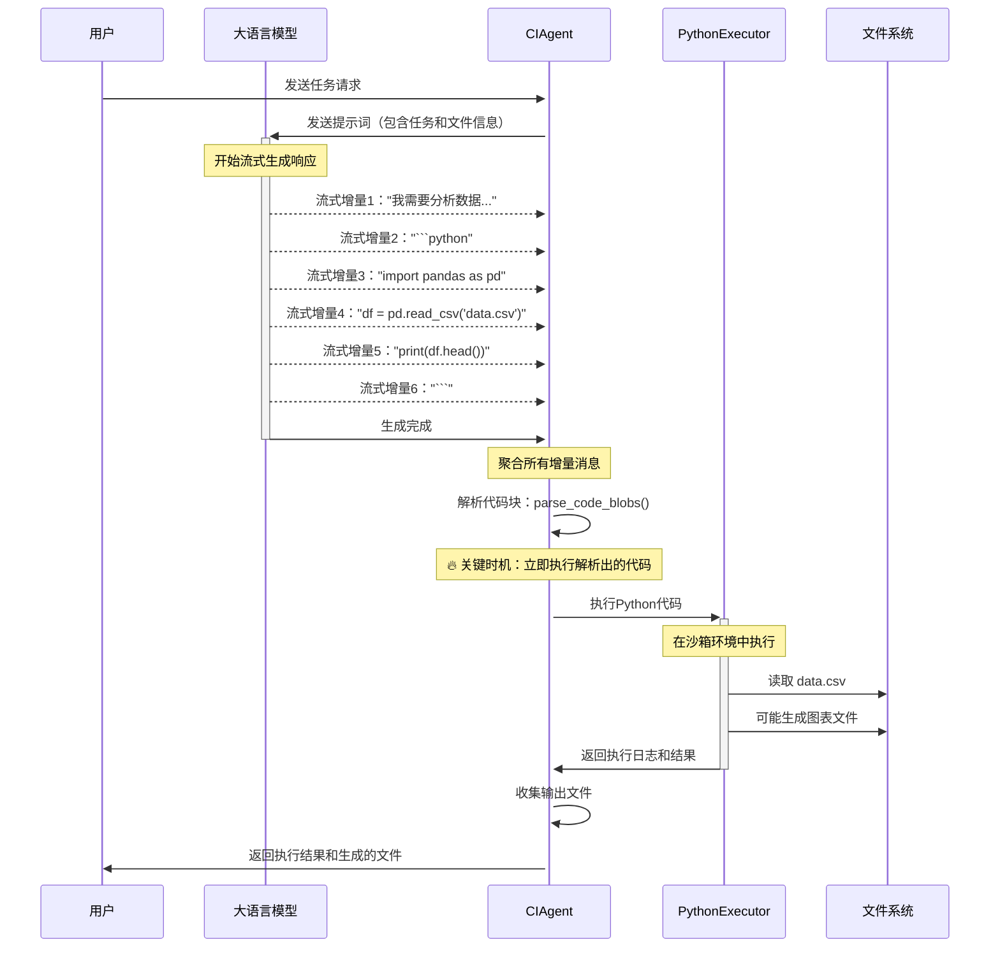

# Code Interpreter Agent 源码深度解析

## 目录
- [1. 源码结构概览](#1-源码结构概览)
- [2. Java层源码分析](#2-java层源码分析)
- [3. Python层源码分析](#3-python层源码分析)
- [4. CIAgent核心实现解析](#4-ciagent核心实现解析)
- [5. 流式处理机制详解](#5-流式处理机制详解)
- [6. 文件处理逻辑剖析](#6-文件处理逻辑剖析)
- [7. 安全执行环境分析](#7-安全执行环境分析)
- [8. 错误处理与异常机制](#8-错误处理与异常机制)
- [9. 性能优化要点](#9-性能优化要点)
- [10. 扩展点分析](#10-扩展点分析)

## 1. 源码结构概览

### 1.1 核心文件分布

```
joyagent-jdgenie/
├── genie-backend/src/main/java/com/jd/genie/
│   ├── agent/tool/common/CodeInterpreterTool.java    # Java工具层
│   ├── agent/dto/CodeInterpreterRequest.java         # 请求DTO
│   └── agent/dto/CodeInterpreterResponse.java        # 响应DTO
├── genie-tool/genie_tool/
│   ├── api/tool.py                                   # FastAPI接口层
│   ├── tool/code_interpreter.py                     # 主业务逻辑
│   ├── tool/ci_agent.py                             # CIAgent实现
│   ├── model/code.py                                # 数据模型
│   └── model/protocal.py                            # 协议模型
```

### 1.2 调用链路概览



## 2. Java层源码分析

### 2.1 CodeInterpreterTool 核心实现

#### 2.1.1 类定义与成员变量

```java
@Slf4j
@Data
public class CodeInterpreterTool implements BaseTool {
    private AgentContext agentContext;  // 智能体上下文，包含会话信息、文件列表等

    // BaseTool 接口要求的三个核心方法
    @Override
    public String getName() { return "code_interpreter"; }

    @Override
    public String getDescription() { /* 工具描述逻辑 */ }

    @Override
    public Map<String, Object> toParams() { /* 参数定义逻辑 */ }

    @Override
    public Object execute(Object input) { /* 核心执行逻辑 */ }
}
```

**设计要点**：
- 实现 `BaseTool` 接口，集成到智能体工具链
- 使用 Lombok 的 `@Data` 注解自动生成 getter/setter
- `AgentContext` 提供会话状态、文件列表、打印器等上下文信息

#### 2.1.2 工具描述与参数定义

```java
@Override
public String getDescription() {
    String desc = "这是一个代码工具，可以通过编写代码完成数据处理、数据分析、图表生成等任务";
    GenieConfig genieConfig = SpringContextHolder.getApplicationContext().getBean(GenieConfig.class);
    return genieConfig.getCodeAgentDesc().isEmpty() ? desc : genieConfig.getCodeAgentDesc();
}

@Override
public Map<String, Object> toParams() {
    GenieConfig genieConfig = SpringContextHolder.getApplicationContext().getBean(GenieConfig.class);
    if (!genieConfig.getCodeAgentPamras().isEmpty()) {
        return genieConfig.getCodeAgentPamras();
    }

    // 构建标准的JSON Schema格式参数定义
    Map<String, Object> taskParam = new HashMap<>();
    taskParam.put("type", "string");
    taskParam.put("description", "需要完成的任务以及完成任务需要的数据，需要尽可能详细");

    Map<String, Object> parameters = new HashMap<>();
    parameters.put("type", "object");
    Map<String, Object> properties = new HashMap<>();
    properties.put("task", taskParam);
    parameters.put("properties", properties);
    parameters.put("required", Collections.singletonList("task"));

    return parameters;
}
```

**关键特性**：
- **配置化**：支持通过 `GenieConfig` 自定义工具描述和参数
- **JSON Schema**：返回标准的参数定义，供LLM理解工具用法
- **必需参数**：`task` 参数是必需的，确保有明确的任务描述

#### 2.1.3 核心执行逻辑

```java
@Override
public Object execute(Object input) {
    try {
        // 1. 参数解析
        Map<String, Object> params = (Map<String, Object>) input;
        String task = (String) params.get("task");

        // 2. 获取当前会话的文件列表
        List<String> fileNames = agentContext.getProductFiles()
            .stream()
            .map(File::getFileName)
            .collect(Collectors.toList());

        // 3. 构建请求对象
        CodeInterpreterRequest request = CodeInterpreterRequest.builder()
                .requestId(agentContext.getSessionId())    // 会话ID，用于多轮对话
                .query(agentContext.getQuery())           // 原始用户查询
                .task(task)                               // 具体任务描述
                .fileNames(fileNames)                     // 相关文件列表
                .stream(true)                             // 启用流式输出
                .build();

        // 4. 调用异步流式API
        Future future = callCodeAgentStream(request);
        Object result = future.get();  // 阻塞等待结果

        return result;
    } catch (Exception e) {
        log.error("{} code agent error", agentContext.getRequestId(), e);
    }
    return null;
}
```

**执行流程解析**：
1. **参数提取**：从输入参数中提取任务描述
2. **上下文收集**：获取当前会话的文件列表和查询信息
3. **请求构建**：创建标准化的请求对象
4. **异步调用**：发起HTTP调用到Python服务
5. **结果等待**：阻塞等待异步结果完成

#### 2.1.4 流式HTTP调用实现

```java
public CompletableFuture<String> callCodeAgentStream(CodeInterpreterRequest codeRequest) {
    CompletableFuture<String> future = new CompletableFuture<>();
    try {
        // 1. 配置HTTP客户端（超时设置）
        OkHttpClient client = new OkHttpClient.Builder()
                .connectTimeout(60, TimeUnit.SECONDS)     // 连接超时
                .readTimeout(300, TimeUnit.SECONDS)       // 读取超时
                .writeTimeout(300, TimeUnit.SECONDS)      // 写入超时
                .callTimeout(300, TimeUnit.SECONDS)       // 调用超时
                .build();

        // 2. 构建请求
        ApplicationContext applicationContext = SpringContextHolder.getApplicationContext();
        GenieConfig genieConfig = applicationContext.getBean(GenieConfig.class);
        String url = genieConfig.getCodeInterpreterUrl() + "/v1/tool/code_interpreter";

        RequestBody body = RequestBody.create(
                MediaType.parse("application/json"),
                JSONObject.toJSONString(codeRequest)
        );

        Request request = new Request.Builder()
                .url(url)
                .post(body)
                .build();

        // 3. 异步执行请求
        client.newCall(request).enqueue(new Callback() {
            @Override
            public void onFailure(Call call, IOException e) {
                log.error("{} code_interpreter on failure", agentContext.getRequestId(), e);
                future.completeExceptionally(e);
            }

            @Override
            public void onResponse(Call call, Response response) {
                handleStreamResponse(response, future);  // 处理流式响应
            }
        });
    } catch (Exception e) {
        log.error("{} code_interpreter request error", agentContext.getRequestId(), e);
        future.completeExceptionally(e);
    }

    return future;
}
```

**HTTP调用特点**：
- **超时控制**：设置合理的超时时间，避免长时间阻塞
- **异步回调**：使用 OkHttp 的异步接口，提高并发性能
- **错误处理**：统一的异常处理和future完成机制

#### 2.1.5 流式响应处理

```java
private void handleStreamResponse(Response response, CompletableFuture<String> future) {
    CodeInterpreterResponse codeResponse = CodeInterpreterResponse.builder()
            .codeOutput("code_interpreter执行失败")
            .build();

    try (ResponseBody responseBody = response.body()) {
        if (!response.isSuccessful() || responseBody == null) {
            future.completeExceptionally(new IOException("Unexpected response code: " + response));
            return;
        }

        String line;
        BufferedReader reader = new BufferedReader(new InputStreamReader(responseBody.byteStream()));

        // 逐行读取SSE流
        while ((line = reader.readLine()) != null) {
            if (line.startsWith("data: ")) {
                String data = line.substring(6);  // 去除"data: "前缀

                // 处理特殊控制消息
                if (data.equals("[DONE]")) {
                    break;  // 流结束
                }
                if (data.startsWith("heartbeat")) {
                    continue;  // 心跳消息，跳过
                }

                // 解析JSON数据
                codeResponse = JSONObject.parseObject(data, CodeInterpreterResponse.class);

                // 处理文件信息
                if (Objects.nonNull(codeResponse.getFileInfo()) && !codeResponse.getFileInfo().isEmpty()) {
                    for (CodeInterpreterResponse.FileInfo fileInfo : codeResponse.getFileInfo()) {
                        File file = File.builder()
                                .fileName(fileInfo.getFileName())
                                .ossUrl(fileInfo.getOssUrl())
                                .domainUrl(fileInfo.getDomainUrl())
                                .fileSize(fileInfo.getFileSize())
                                .description(fileInfo.getFileName())
                                .isInternalFile(false)
                                .build();

                        // 添加到上下文的文件列表
                        agentContext.getProductFiles().add(file);
                        agentContext.getTaskProductFiles().add(file);
                    }
                }

                // 发送实时消息到前端
                String digitalEmployee = agentContext.getToolCollection().getDigitalEmployee(getName());
                agentContext.getPrinter().send("code", codeResponse, digitalEmployee);
            }
        }

        // 构建最终返回结果
        StringBuilder output = new StringBuilder();
        output.append(codeResponse.getCodeOutput());

        if (Objects.nonNull(codeResponse.getFileInfo()) && !codeResponse.getFileInfo().isEmpty()) {
            output.append("\n\n其中保存了文件: ");
            for (CodeInterpreterResponse.FileInfo fileInfo : codeResponse.getFileInfo()) {
                output.append(fileInfo.getFileName()).append("\n");
            }
        }

        future.complete(output.toString());

    } catch (Exception e) {
        log.error("{} code_interpreter request error", agentContext.getRequestId(), e);
        future.completeExceptionally(e);
    }
}
```

**流式处理要点**：
- **SSE协议**：标准的Server-Sent Events协议处理
- **实时反馈**：通过`agentContext.getPrinter()`实时发送消息到前端
- **文件管理**：自动更新上下文中的文件列表
- **容错处理**：处理心跳消息和结束标记

### 2.2 数据传输对象(DTO)分析

#### 2.2.1 CodeInterpreterRequest

```java
@Builder
@Data
public class CodeInterpreterRequest {
    private String requestId;      // 请求唯一标识
    private String query;          // 原始用户查询
    private String task;           // 具体任务描述
    private List<String> fileNames; // 输入文件列表
    private boolean stream;        // 是否流式输出
}
```

#### 2.2.2 CodeInterpreterResponse

```java
@Builder
@Data
public class CodeInterpreterResponse {
    private String codeOutput;         // 代码执行输出
    private List<FileInfo> fileInfo;   // 生成的文件信息

    @Builder
    @Data
    public static class FileInfo {
        private String fileName;    // 文件名
        private String ossUrl;      // 对象存储URL
        private String domainUrl;   // 域名URL
        private Long fileSize;      // 文件大小
    }
}
```

## 3. Python层源码分析

### 3.1 FastAPI接口层分析（tool.py）

#### 3.1.1 路由架构设计

```python
@router.post("/code_interpreter")
async def post_code_interpreter(body: CIRequest):
    """代码解释器：支持 SSE 流式返回或一次性返回"""
```

**核心设计理念**：
- **统一路由处理**：使用 `RequestHandlerRoute` 中间件统一处理日志和异常
- **SSE流式协议**：基于 Server-Sent Events 实现实时数据推送
- **多模式流控**：支持 general、token、time 三种流式输出模式

#### 3.1.2 请求预处理机制

```python
# 处理文件路径：将非绝对/非 http 链接的文件名补齐为文件服务可预览 URL
if body.file_names:
    for idx, f_name in enumerate(body.file_names):
        if not f_name.startswith("/") and not f_name.startswith("http"):
            body.file_names[idx] = f"{os.getenv('FILE_SERVER_URL')}/preview/{body.request_id}/{f_name}"
```

**路径标准化逻辑**：
- **本地文件**：自动补齐文件服务器前缀，形成可访问的预览URL
- **绝对路径**：直接使用，无需转换
- **HTTP链接**：保持原样，支持远程文件访问
- **请求隔离**：通过 `request_id` 确保不同请求的文件访问隔离

#### 3.1.3 流式输出控制器

```python
async def _stream():
    """SSE 流式推送执行过程与最终结果"""
    # 累积内容缓冲区（用于 token/time 两种节流模式）
    acc_content = ""
    acc_token = 0
    acc_time = time.time()

    async for chunk in code_interpreter_agent(...):
        if isinstance(chunk, CodeOuput):
            # 推送代码块事件
            yield ServerSentEvent(data=json.dumps({
                "requestId": body.request_id,
                "code": chunk.code,
                "fileInfo": chunk.file_list,
                "isFinal": False,
            }, ensure_ascii=False))
        elif isinstance(chunk, ActionOutput):
            # 推送最终答案事件
            yield ServerSentEvent(data=json.dumps({
                "requestId": body.request_id,
                "codeOutput": chunk.content,
                "fileInfo": chunk.file_list,
                "isFinal": True,
            }, ensure_ascii=False))
            yield ServerSentEvent(data="[DONE]")
```

**三种流式模式详解**：

1. **通用模式（general）**：每个增量立即推送
```python
if body.stream_mode.mode == "general":
    yield ServerSentEvent(data=json.dumps({
        "requestId": body.request_id,
        "data": chunk,
        "isFinal": False
    }))
```

2. **Token缓冲模式（token）**：累积到指定token数后批量推送
```python
elif body.stream_mode.mode == "token":
    if acc_token >= body.stream_mode.token:
        yield ServerSentEvent(...)
        acc_token = 0
        acc_content = ""
```

3. **时间窗口模式（time）**：按时间间隔批量推送
```python
elif body.stream_mode.mode == "time":
    if time.time() - acc_time > body.stream_mode.time:
        yield ServerSentEvent(...)
        acc_time = time.time()
        acc_content = ""
```

#### 3.1.4 事件源响应配置

```python
return EventSourceResponse(
    _stream(),
    ping_message_factory=lambda: ServerSentEvent(data="heartbeat"),
    ping=15,  # 每15秒发送心跳
)
```

**连接保活机制**：
- **心跳间隔**：15秒自动发送 `heartbeat` 消息
- **连接检测**：前端可通过心跳判断连接状态
- **超时重连**：支持客户端自动重连机制

### 3.2 协议模型定义（protocol.py）

#### 3.2.1 请求数据结构

```python
@dataclass
class CIRequest:
    task: str                    # 用户任务描述
    file_names: List[str] = None # 输入文件列表
    request_id: str = ""         # 请求唯一标识
    stream: bool = True          # 是否流式输出
    stream_mode: StreamMode = field(default_factory=lambda: StreamMode())
    file_name: str = "代码输出"   # 输出文件名
    file_type: str = "md"        # 输出文件类型
```

#### 3.2.2 流式模式配置

```python
@dataclass
class StreamMode:
    mode: str = "general"    # 流式模式：general/token/time
    token: int = 10          # token模式的缓冲阈值
    time: float = 1.0        # time模式的时间间隔（秒）
```

## 4. code_interpreter_agent核心实现解析

### 4.1 主函数架构分析

```python
@timer()  # 性能监控装饰器
async def code_interpreter_agent(
    task: str,
    file_names: Optional[List[str]] = None,
    max_file_abstract_size: int = 2000,
    max_tokens: int = 32000,
    request_id: str = "",
    stream: bool = True,
):
```

**函数职责分离**：
- **任务编排**：协调文件处理、AI执行、结果上传的完整流程
- **资源管理**：临时目录创建与清理，确保无资源泄漏
- **错误隔离**：异常捕获与重抛，保证调用栈清晰

### 4.2 文件处理管道

#### 4.2.1 工作目录初始化

```python
# 创建临时工作目录，用于存放下载的文件和输出结果
work_dir = tempfile.mkdtemp()

# 在工作目录下创建output子目录，用于存放代码执行的输出文件
output_dir = os.path.join(work_dir, "output")
os.makedirs(output_dir, exist_ok=True)
```

**目录结构设计**：
```
/tmp/tmpXXXXXX/          # 随机临时目录
├── input_file1.xlsx     # 下载的输入文件
├── input_file2.csv      #
└── output/              # AI代码执行输出目录
    ├── generated_chart.png
    └── processed_data.xlsx
```

#### 4.2.2 智能文件摘要生成

**表格文件处理**：
```python
if file_name.split(".")[-1] in ["xlsx", "xls", "csv"]:
    pd.set_option("display.max_columns", None)
    df = (
        pd.read_csv(file_path) if file_name.endswith(".csv")
        else pd.read_excel(file_path)
    )
    # 将文件路径和前10行数据作为摘要
    files.append({"path": file_path, "abstract": f"{df.head(10)}"})
```

**文本文件处理**：
```python
elif file_name.split(".")[-1] in ["txt", "md", "html"]:
    with open(file_path, "r", encoding="utf-8") as rf:
        files.append({
            "path": file_path,
            "abstract": "".join(rf.readlines())[:max_file_abstract_size]
        })
```

**摘要策略优化**：
- **表格数据**：取前10行，包含列名和数据类型信息
- **文本文件**：按字符数截断，保留文档开头的关键信息
- **大小限制**：防止过长内容影响AI推理效果

### 4.3 提示词模板系统

#### 4.3.1 动态模板渲染

```python
# 获取代码解释器的提示词模板配置
ci_prompt_template = get_prompt("code_interpreter")

# 使用Jinja2模板引擎渲染任务描述
template_task = Template(ci_prompt_template["task_template"]).render(
    files=files,           # 处理后的文件列表
    task=task,             # 用户任务描述
    output_dir=output_dir  # 输出目录路径
)
```

**模板变量注入**：
- `{{files}}`：文件摘要列表，让AI了解可用数据
- `{{task}}`：用户原始任务，保持任务目标清晰
- `{{output_dir}}`：输出路径，指导AI将结果保存到正确位置

### 4.4 流式执行控制器

#### 4.4.1 步骤类型识别与处理

```python
if stream:
    for step in agent.run(task=str(template_task), stream=True, max_steps=10):
        if isinstance(step, CodeOuput):
            # 处理代码输出步骤
            file_info = await upload_file(
                content=step.code,
                file_name=step.file_name,
                file_type="py",
                request_id=request_id,
            )
            step.file_list = [file_info]
            yield step

        elif isinstance(step, FinalAnswerStep):
            # 处理最终答案步骤
            file_list = []

            # 检查输出目录中是否有新生成的文件
            file_path = get_new_file_by_path(output_dir=output_dir)
            if file_path:
                file_info = await upload_file_by_path(
                    file_path=file_path, request_id=request_id
                )
                if file_info:
                    file_list.append(file_info)
```

**执行阶段管理**：
1. **代码生成阶段**：AI生成代码，立即上传保存
2. **代码执行阶段**：本地Python环境执行，产生输出文件
3. **结果收集阶段**：扫描输出目录，上传新生成的文件
4. **答案总结阶段**：AI基于执行结果生成最终答案

#### 4.4.2 输出文件自动检测

```python
def get_new_file_by_path(output_dir):
    """获取输出目录中最新生成的表格文件"""
    temp_file = ""
    latest_time = 0

    for item in os.listdir(output_dir):
        if item.endswith(".xlsx") or item.endswith(".csv") or item.endswith(".xls"):
            item_path = os.path.join(output_dir, item)
            if os.path.isfile(item_path):
                mod_time = os.path.getmtime(item_path)
                if mod_time > latest_time:
                    latest_time = mod_time
                    temp_file = item_path
    return temp_file
```

**智能文件发现**：
- **时间戳排序**：选择最新修改的文件
- **格式过滤**：只处理表格类型文件（Excel、CSV）
- **路径验证**：确保是文件而非目录

### 4.5 AI代理工厂函数

```python
def create_ci_agent(
    prompt_templates=None,
    max_tokens: int = 16000,
    return_full_result: bool = True,
    output_dir: str = "",
) -> CIAgent:
    """创建代码解释器AI代理"""

    # 创建LiteLLM模型实例
    model = LiteLLMModel(
        max_tokens=max_tokens,
        model_id=os.getenv("CODE_INTEPRETER_MODEL", "gpt-4.1")
    )

    return CIAgent(
        model=model,
        prompt_templates=prompt_templates,
        tools=[PythonInterpreterTool()],  # Python解释器工具
        return_full_result=return_full_result,
        additional_authorized_imports=[    # 安全的Python库列表
            "pandas", "openpyxl", "numpy",
            "matplotlib", "seaborn",
        ],
        output_dir=output_dir,
    )
```

**安全配置策略**：
- **模型选择**：环境变量配置，支持不同模型切换
- **库白名单**：只允许数据分析相关的安全库导入
- **沙箱隔离**：限制文件系统和网络访问

## 5. CIAgent核心实现解析

### 5.1 类继承架构

```python
class CIAgent(CodeAgent):
    """
    代码解释器智能体（Code Interpreter Agent）
    继承自 smolagents.CodeAgent，专注于代码生成与执行的智能体基类
    """
```

**继承关系分析**：
- **smolagents.CodeAgent**：提供ReAct框架的基础实现
- **Model接口**：抽象大语言模型，支持多种LLM提供商
- **Tool系统**：工具抽象，包括PythonInterpreterTool等
- **记忆管理**：ActionStep记录每轮交互的完整上下文

### 5.2 流式执行核心算法（_step_stream）

#### 5.2.1 执行流程概览



#### 5.2.2 模型输入构造

```python
def _step_stream(self, memory_step: ActionStep):
    # 1) 将当前记忆写回消息列表，作为模型的输入
    memory_messages = self.write_memory_to_messages()

    # 保存输入消息，供最终答案检查等逻辑使用
    self.input_messages = memory_messages.copy()

    memory_step.model_input_messages = memory_messages.copy()
```

**记忆管理策略**：
- **对话历史**：包含用户问题、AI回答、工具调用、观察结果
- **上下文保持**：多轮对话中维持任务理解的连续性
- **消息格式**：符合ChatML标准，支持多种角色（user、assistant、system）

#### 5.2.3 流式生成与实时渲染

```python
# 为本次模型调用生成唯一请求ID，便于链路追踪
model_request_id = str(uuid.uuid4())

output_stream = self.model.generate_stream(
    input_messages,
    extra_headers={"x-ms-client-request-id": model_request_id},
)

chat_message_stream_deltas: list[ChatMessageStreamDelta] = []

# 使用 rich.Live 实时在终端刷新渲染模型输出
with Live("", console=self.logger.console, vertical_overflow="visible") as live:
    for event in output_stream:
        # 收集增量事件，便于后续聚合为完整消息
        chat_message_stream_deltas.append(event)
        live.update(
            Markdown(agglomerate_stream_deltas(chat_message_stream_deltas).render_as_markdown())
        )
        # 向外部流式产出增量事件，便于前端即时渲染
        yield event
```

**流式处理关键技术**：
- **增量聚合**：`agglomerate_stream_deltas` 将多个delta合并为完整消息
- **实时渲染**：Rich Live组件在终端实时刷新显示
- **事件传播**：每个delta立即yield给上层，实现端到端流式体验
- **请求追踪**：UUID确保多并发请求的链路可追踪性

#### 5.2.4 代码解析与修复

```python
# 将所有增量聚合为最终一条 ChatMessage
chat_message = agglomerate_stream_deltas(chat_message_stream_deltas)
memory_step.model_output_message = chat_message
output_text = chat_message.content

# 添加代码结束标记，引导后续LLM调用以相同格式结束
if output_text and output_text.strip().endswith("```"):
    output_text += "<end_code>"
    memory_step.model_output_message.content = output_text

# 解析模型输出中的代码片段并修复可能的尾部语法
try:
    code_action = fix_final_answer_code(parse_code_blobs(output_text))
except Exception as e:
    error_msg = f"Error in code parsing:\n{e}\nMake sure to provide correct code blobs."
    raise AgentParsingError(error_msg, self.logger)
```

**代码处理策略**：
- **标记修复**：自动添加 `<end_code>` 引导模型行为一致性
- **块解析**：`parse_code_blobs` 提取markdown代码块中的Python代码
- **语法修复**：`fix_final_answer_code` 修复常见的语法错误
- **错误处理**：解析失败时抛出结构化异常信息

#### 5.2.5 Python代码执行引擎

**🔥 关键时机：Python代码执行的触发条件**

Python代码的执行发生在 `CIAgent._step_stream` 方法中，具体时机如下：

1. **LLM生成完整响应** → 2. **解析代码块** → 3. **立即执行Python代码** → 4. **收集执行结果**

```python
# ========== 执行时机详解 ==========

# 第1步：LLM流式生成完成后，聚合所有增量消息
chat_message = agglomerate_stream_deltas(chat_message_stream_deltas)
output_text = chat_message.content  # 完整的LLM输出文本

# 第2步：从LLM输出中解析Python代码块
code_action = fix_final_answer_code(parse_code_blobs(output_text))
# 这里提取的是 ```python ... ``` 代码块中的内容

# 第3步：一旦解析出代码，立即执行（关键执行点！）
# 在记忆中记录一次将要执行的工具调用（python_interpreter）
memory_step.tool_calls = [
    ToolCall(
        name="python_interpreter",
        arguments=code_action,  # 这就是要执行的Python代码
        id=f"call_{len(self.memory.steps)}",
    )
]

try:
    # 🚀 关键执行点：这里是Python代码真正执行的地方
    _, execution_logs, _ = self.python_executor(code_action)

    # 第4步：执行完成后立即收集结果
    observation = "Execution logs:\n" + execution_logs

    # 提取任务标题作为代码文件名
    if matcher := re.search(r"Task:\s?(.*)", output_text):
        file_name = f"{matcher.group(1).replace(' ', '')}.py"
    else:
        file_name = f'{generate_data_id("index")}.py'

    # 产出代码对象，便于上层保存到文件系统或对象存储
    yield CodeOuput(code=code_action, file_name=file_name)

except Exception as e:
    # 处理执行异常，提取可能的输出日志
    if hasattr(self.python_executor, "state") and "_print_outputs" in self.python_executor.state:
        execution_logs = str(self.python_executor.state["_print_outputs"])
        memory_step.observations = "Execution logs:\n" + execution_logs

    error_msg = str(e)
    if "Import of " in error_msg and " is not allowed" in error_msg:
        self.logger.log(
            "[bold red]Warning: Code execution failed due to unauthorized import",
            level=LogLevel.INFO,
        )
    raise AgentExecutionError(error_msg, self.logger)
```

**Python代码执行的完整时序**：



**⏰ 执行时机的关键要点**：

1. **单步执行模式**：每当LLM生成包含代码块的响应时，立即执行该代码
2. **流式中断执行**：不等待LLM完全结束对话，只要检测到完整的代码块就执行
3. **观察-反思循环**：执行结果作为观察值反馈给LLM，用于下一轮推理
4. **多轮迭代**：如果任务复杂，LLM可以基于执行结果生成新的代码继续执行

**代码解析与执行的核心逻辑**：

```python
# ci_agent.py:208-210 - 关键代码解析点
code_action = fix_final_answer_code(parse_code_blobs(output_text))

# ci_agent.py:234 - 关键执行点
_, execution_logs, _ = self.python_executor(code_action)
```

**执行触发的具体条件**：

```python
# 只有当 parse_code_blobs 成功提取到代码时才会执行
# parse_code_blobs 查找形如以下格式的内容：
# ```python
# your_code_here
# ```

# 或者
# ```
# your_code_here  # 如果上下文明确是Python环境
# ```
```

**执行与ReAct框架的关系**：

- **Reasoning（推理）**：LLM分析任务，决定需要执行什么代码
- **Acting（行动）**：解析并执行LLM生成的Python代码 ← **这里是执行时机**
- **Observing（观察）**：收集代码执行日志，反馈给LLM用于下一轮推理

**执行引擎特性**：
- **沙箱隔离**：限制文件系统访问和网络请求
- **库白名单**：只允许预定义的安全Python库
- **日志收集**：捕获stdout/stderr输出，反馈给AI模型
- **异常处理**：区分不同类型的执行错误，提供针对性提示
- **即时执行**：代码解析完成后立即执行，无需等待用户确认

#### 5.2.6 最终答案判断机制

```python
# 使用最终答案检查器，判断是否满足返回最终答案的条件
finalObj = FinalAnswerCheck(
    input_messages=self.input_messages,
    execution_logs=execution_logs,
    model=self.model,
    task=self.task,
    prompt_temps=self.prompt_templates,
    memory_step=memory_step,
    grammar=self.grammar,
    request_id=f"{model_request_id}-final",
)

finalFlag, exeLog = finalObj.check_is_final_answer()

# 将执行日志作为观察值写入记忆
memory_step.observations = observation
memory_step.action_output = exeLog

# 产出动作结果。若 is_final_answer=True，表示上游可以结束本轮对话/流程
yield ActionOutput(output=exeLog, is_final_answer=finalFlag)
```

**智能终止策略**：
- **上下文分析**：基于输入消息、执行日志、任务描述综合判断
- **二次推理**：使用同一模型进行最终答案检查，保证一致性
- **状态管理**：更新记忆步骤，为下一轮迭代做准备
- **结果封装**：返回结构化的ActionOutput，包含终止标志

### 5.3 集成与扩展点

#### 5.3.1 smolagents框架集成

```python
from smolagents import (
    CodeAgent, ChatMessage, MessageRole,
    BASE_BUILTIN_MODULES, PythonInterpreterTool,
    ActionStep, ChatMessageStreamDelta,
    agglomerate_stream_deltas, ToolOutput,
)
```

**框架能力复用**：
- **CodeAgent基类**：提供ReAct框架的完整实现
- **消息系统**：标准化的对话消息格式和角色管理
- **工具系统**：可插拔的工具接口，支持多种执行环境
- **流式处理**：增量消息的聚合和传播机制

#### 5.3.2 自定义扩展组件

```python
from genie_tool.model.code import CodeOuput
from genie_tool.tool.final_answer_check import FinalAnswerCheck
from genie_tool.util.file_util import generate_data_id
from genie_tool.util.log_util import timer
```

**定制化组件**：
- **CodeOuput模型**：代码输出的数据结构定义
- **FinalAnswerCheck**：智能的任务完成度判断逻辑
- **文件工具**：ID生成、文件操作等辅助功能
- **性能监控**：计时装饰器，监控关键函数执行时间

## 6. 流式处理机制详解

### 6.1 端到端流式架构


### 6.2 多层缓冲策略

#### 6.2.1 模型层流式输出

```python
# LiteLLM模型的流式生成
output_stream = self.model.generate_stream(input_messages)

for event in output_stream:
    chat_message_stream_deltas.append(event)  # 收集增量
    yield event  # 立即传播给上层
```

#### 6.2.2 应用层流式控制

```python
async def _stream():
    acc_content = ""
    acc_token = 0
    acc_time = time.time()

    async for chunk in code_interpreter_agent(...):
        if body.stream_mode.mode == "general":
            yield ServerSentEvent(data=json.dumps({...}))
        elif body.stream_mode.mode == "token":
            if acc_token >= body.stream_mode.token:
                yield ServerSentEvent(...)  # 批量发送
```

#### 6.2.3 传输层优化

```python
return EventSourceResponse(
    _stream(),
    ping_message_factory=lambda: ServerSentEvent(data="heartbeat"),
    ping=15,  # 保活心跳
)
```

**流式优化要点**：
- **零拷贝传递**：增量消息直接传播，避免不必要的缓冲
- **背压控制**：通过token/time模式控制下游处理压力
- **连接保活**：心跳机制防止长连接超时断开
- **错误恢复**：支持客户端重连和状态恢复

### 6.3 消息格式标准化

#### 6.3.1 代码输出消息

```json
{
    "requestId": "req-123",
    "code": "import pandas as pd\ndf = pd.read_csv('data.csv')",
    "fileInfo": [{"fileName": "analysis.py", "ossUrl": "..."}],
    "isFinal": false
}
```

#### 6.3.2 最终答案消息

```json
{
    "requestId": "req-123",
    "codeOutput": "数据分析完成，生成了销售趋势图表...",
    "fileInfo": [
        {"fileName": "report.md", "ossUrl": "..."},
        {"fileName": "chart.png", "ossUrl": "..."}
    ],
    "isFinal": true
}
```

#### 6.3.3 流式文本消息

```json
{
    "requestId": "req-123",
    "data": "正在分析数据结构...",
    "isFinal": false
}
```

## 7. 安全执行环境分析

### 7.1 Python沙箱隔离

#### 7.1.1 导入库白名单机制

```python
additional_authorized_imports=[
    "pandas",     # 数据分析库
    "openpyxl",   # Excel文件操作库
    "numpy",      # 数值计算库
    "matplotlib", # 绘图库
    "seaborn",    # 统计绘图库
]
```

**安全策略**：
- **最小权限原则**：只允许数据分析必需的库
- **禁用危险模块**：os、subprocess、requests等系统交互库被禁用
- **动态检查**：执行时实时检查import语句的合法性

#### 7.1.2 文件系统访问限制

```python
work_dir = tempfile.mkdtemp()  # 隔离的临时目录
output_dir = os.path.join(work_dir, "output")  # 专用输出目录

try:
    # 代码只能在指定目录内操作文件
    _, execution_logs, _ = self.python_executor(code_action)
finally:
    # 执行完成后自动清理
    shutil.rmtree(work_dir, ignore_errors=True)
```

**文件隔离机制**：
- **临时目录**：每次执行创建独立的工作空间
- **路径限制**：禁止访问系统敏感目录
- **自动清理**：执行完成后立即删除临时文件
- **权限控制**：只读访问输入文件，只写访问输出目录

### 7.2 代码执行监控

#### 7.2.1 执行日志收集

```python
try:
    _, execution_logs, _ = self.python_executor(code_action)
    observation = "Execution logs:\n" + execution_logs
except Exception as e:
    if hasattr(self.python_executor, "state") and "_print_outputs" in self.python_executor.state:
        execution_logs = str(self.python_executor.state["_print_outputs"])
        memory_step.observations = "Execution logs:\n" + execution_logs
```

**监控维度**：
- **标准输出**：捕获print语句和正常输出
- **错误输出**：记录异常信息和错误堆栈
- **执行状态**：跟踪代码执行的成功/失败状态
- **资源使用**：监控内存和CPU使用情况

#### 7.2.2 异常分类处理

```python
error_msg = str(e)
if "Import of " in error_msg and " is not allowed" in error_msg:
    self.logger.log(
        "[bold red]Warning: Code execution failed due to unauthorized import",
        level=LogLevel.INFO,
    )
raise AgentExecutionError(error_msg, self.logger)
```

**错误类型识别**：
- **导入错误**：未授权库的导入尝试
- **语法错误**：代码解析或编译失败
- **运行时错误**：执行过程中的异常
- **超时错误**：长时间运行导致的终止

### 7.3 输入验证与清理

#### 7.3.1 代码块提取与验证

```python
def parse_code_blobs(text):
    # 从markdown文本中提取Python代码块
    # 验证代码块的格式和完整性
    # 过滤可能的恶意代码模式

def fix_final_answer_code(code):
    # 修复常见的语法错误
    # 标准化代码格式
    # 确保代码可安全执行
```

**代码安全检查**：
- **格式验证**：确保代码块格式正确
- **语法检查**：预检查避免明显的语法错误
- **模式匹配**：识别和阻止恶意代码模式
- **长度限制**：防止过长代码导致的资源耗尽

#### 7.3.2 输入文件安全处理

```python
# 文件类型白名单
if file_name.split(".")[-1] in ["xlsx", "xls", "csv"]:
    df = pd.read_csv(file_path) if file_name.endswith(".csv") else pd.read_excel(file_path)
elif file_name.split(".")[-1] in ["txt", "md", "html"]:
    with open(file_path, "r", encoding="utf-8") as rf:
        content = "".join(rf.readlines())[:max_file_abstract_size]
```

**文件安全策略**：
- **类型限制**：只处理预定义的安全文件类型
- **大小限制**：限制文件摘要长度，防止内存耗尽
- **编码检查**：使用UTF-8编码，处理字符集异常
- **内容过滤**：移除潜在的恶意内容或脚本

### 7.4 资源管理与监控

#### 7.4.1 内存管理

```python
@timer()  # 性能监控装饰器
async def code_interpreter_agent(...):
    work_dir = ""
    try:
        # 资源分配和使用
        work_dir = tempfile.mkdtemp()
        # ... 业务逻辑
    finally:
        # 确保资源清理
        if work_dir:
            shutil.rmtree(work_dir, ignore_errors=True)
```

#### 7.4.2 执行超时控制

```python
# 在CIAgent中设置最大执行步数
for step in agent.run(task=str(template_task), stream=True, max_steps=10):
    # 限制AI代理的最大执行轮数，避免无限循环
```

**资源控制要点**：
- **时间限制**：设置代码执行和AI推理的超时时间
- **步数限制**：防止AI陷入无限推理循环
- **内存监控**：跟踪内存使用，防止内存泄漏
- **并发控制**：限制同时执行的任务数量

## 8. 错误处理与异常机制

### 8.1 分层异常处理

#### 8.1.1 Java层异常处理

```java
@Override
public Object execute(Object input) {
    try {
        // 核心业务逻辑
        Future future = callCodeAgentStream(request);
        Object result = future.get();
        return result;
    } catch (Exception e) {
        log.error("{} code agent error", agentContext.getRequestId(), e);
    }
    return null;
}
```

**Java层异常策略**：
- **统一日志记录**：使用 `agentContext.getRequestId()` 关联请求上下文
- **异常降级**：返回null而非抛出异常，避免中断整个Agent流程
- **链路追踪**：通过requestId实现跨层的异常追踪

#### 8.1.2 HTTP调用异常处理

```java
client.newCall(request).enqueue(new Callback() {
    @Override
    public void onFailure(Call call, IOException e) {
        log.error("{} code_interpreter on failure", agentContext.getRequestId(), e);
        future.completeExceptionally(e);
    }

    @Override
    public void onResponse(Call call, Response response) {
        handleStreamResponse(response, future);
    }
});
```

**网络层异常应对**：
- **异步异常传播**：通过 `CompletableFuture.completeExceptionally` 传递异常
- **连接超时处理**：OkHttp配置多层超时机制
- **响应码检查**：在 `handleStreamResponse` 中检查HTTP状态码

#### 8.1.3 Python层异常分类

```python
try:
    code_action = fix_final_answer_code(parse_code_blobs(output_text))
except Exception as e:
    error_msg = f"Error in code parsing:\n{e}\nMake sure to provide correct code blobs."
    raise AgentParsingError(error_msg, self.logger)

try:
    _, execution_logs, _ = self.python_executor(code_action)
except Exception as e:
    if "Import of " in error_msg and " is not allowed" in error_msg:
        self.logger.log("[bold red]Warning: unauthorized import", level=LogLevel.INFO)
    raise AgentExecutionError(error_msg, self.logger)
```

**Python异常分类处理**：
- **AgentParsingError**：代码解析失败，通常是LLM输出格式问题
- **AgentExecutionError**：代码执行失败，包括语法错误、运行时异常等
- **导入权限检查**：特殊处理未授权库导入，提供用户友好提示

### 8.2 异常恢复机制

#### 8.2.1 重试策略

```python
@timer()
async def code_interpreter_agent(...):
    work_dir = ""
    try:
        # 业务逻辑
        for step in agent.run(task=str(template_task), stream=True, max_steps=10):
            # 处理各种步骤类型
    except Exception as e:
        raise e  # 重新抛出，让上层决定重试策略
    finally:
        # 确保资源清理
        if work_dir:
            shutil.rmtree(work_dir, ignore_errors=True)
```

#### 8.2.2 流式连接恢复

```python
return EventSourceResponse(
    _stream(),
    ping_message_factory=lambda: ServerSentEvent(data="heartbeat"),
    ping=15,  # 心跳间隔
)
```

**连接恢复特性**：
- **心跳保活**：定期发送heartbeat防止连接断开
- **客户端重连**：前端EventSource支持自动重连
- **状态恢复**：通过requestId实现断点续传

## 9. 性能优化要点

### 9.1 内存优化

#### 9.1.1 流式处理减少内存占用

```python
async for chunk in code_interpreter_agent(...):
    # 立即处理和传输，不在内存中累积大量数据
    if isinstance(chunk, CodeOuput):
        yield ServerSentEvent(data=json.dumps({...}))
```

**内存优化策略**：
- **流式传输**：数据边生成边传输，避免大量内存缓存
- **及时清理**：临时文件和工作目录执行完成后立即删除
- **增量处理**：LLM输出按增量处理，而非等待完整响应

#### 9.1.2 文件摘要优化

```python
# 限制文件摘要大小，防止内存耗尽
max_file_abstract_size: int = 2000

# 表格文件只取前10行
files.append({"path": file_path, "abstract": f"{df.head(10)}"})

# 文本文件按字符截断
abstract = "".join(rf.readlines())[:max_file_abstract_size]
```

### 9.2 并发性能优化

#### 9.2.1 异步IO优化

```python
# 文件下载异步处理
import_files = await download_all_files_in_path(file_names=file_names, work_dir=work_dir)

# 文件上传异步处理
file_info = await upload_file(content=step.code, file_name=step.file_name, ...)
```

#### 9.2.2 HTTP连接池

```java
OkHttpClient client = new OkHttpClient.Builder()
    .connectTimeout(60, TimeUnit.SECONDS)
    .readTimeout(300, TimeUnit.SECONDS)
    .writeTimeout(300, TimeUnit.SECONDS)
    .callTimeout(300, TimeUnit.SECONDS)
    .build();
```

**连接优化**：
- **连接复用**：OkHttp自带连接池，支持HTTP/2复用
- **超时分层**：连接、读取、写入、调用四层超时控制
- **异步调用**：使用enqueue实现非阻塞HTTP调用

### 9.3 缓存策略

#### 9.3.1 模板缓存

```python
# 提示词模板缓存
ci_prompt_template = get_prompt("code_interpreter")  # 内部可实现缓存
```

#### 9.3.2 文件摘要缓存

```python
# 可以为相同文件的摘要添加缓存机制
def generate_file_abstract(file_path, file_type):
    # 基于文件修改时间和内容hash的缓存逻辑
    pass
```

### 9.4 资源监控

```python
@timer()  # 性能监控装饰器，记录函数执行时间
async def code_interpreter_agent(...):
    # 关键函数都加上timer装饰器，便于性能分析
```

## 10. 扩展点分析

### 10.1 LLM模型扩展

#### 10.1.1 模型适配器模式

```python
# 支持不同的LLM提供商
model = LiteLLMModel(
    max_tokens=max_tokens,
    model_id=os.getenv("CODE_INTEPRETER_MODEL", "gpt-4.1")
)
```

**扩展方向**：
- **多模型支持**：通过环境变量切换不同的LLM模型
- **模型路由**：可根据任务类型选择最适合的模型
- **本地模型**：支持部署本地大模型，降低成本

#### 10.1.2 提示词模板扩展

```python
# 可配置的提示词模板系统
ci_prompt_template = get_prompt("code_interpreter")
template_task = Template(ci_prompt_template["task_template"]).render(...)
```

**模板扩展能力**：
- **多语言支持**：支持不同语言的提示词模板
- **领域定制**：为不同业务领域定制专门的提示词
- **A/B测试**：支持多版本提示词的效果对比

### 10.2 工具系统扩展

#### 10.2.1 新工具集成

```python
return CIAgent(
    model=model,
    tools=[
        PythonInterpreterTool(),    # 当前支持的工具
        # 可扩展：
        # RInterpreterTool(),       # R语言解释器
        # SQLExecutorTool(),        # SQL执行器
        # ShellCommandTool(),       # Shell命令工具
    ],
    additional_authorized_imports=[...],
)
```

#### 10.2.2 库白名单扩展

```python
# 可根据业务需求扩展允许的Python库
additional_authorized_imports=[
    # 数据分析基础库
    "pandas", "openpyxl", "numpy", "matplotlib", "seaborn",
    # 可扩展的机器学习库
    # "scikit-learn", "tensorflow", "torch",
    # 可扩展的Web库（谨慎）
    # "requests", "beautifulsoup4",
]
```

### 10.3 文件处理扩展

#### 10.3.1 新文件类型支持

```python
# 当前支持的文件类型
if file_name.split(".")[-1] in ["xlsx", "xls", "csv"]:
    # Excel/CSV处理逻辑
elif file_name.split(".")[-1] in ["txt", "md", "html"]:
    # 文本文件处理逻辑

# 可扩展的文件类型：
# elif file_name.split(".")[-1] in ["json", "xml", "yaml"]:
#     # 结构化数据处理
# elif file_name.split(".")[-1] in ["pdf", "docx"]:
#     # 文档文件处理
# elif file_name.split(".")[-1] in ["jpg", "png", "jpeg"]:
#     # 图像文件处理（结合OCR）
```

#### 10.3.2 存储后端扩展

```python
# 当前的文件上传接口
file_info = await upload_file(content=content, file_name=file_name, ...)

# 可扩展的存储后端：
# - OSS对象存储
# - AWS S3
# - 本地文件系统
# - 分布式文件系统
```

### 10.4 安全机制扩展

#### 10.4.1 沙箱环境增强

```python
# 当前基于smolagents的沙箱
python_executor = PythonInterpreterTool()

# 可扩展的安全机制：
# - Docker容器隔离
# - 虚拟机沙箱
# - 代码静态分析
# - 运行时监控
```

#### 10.4.2 权限控制细化

```python
# 可扩展的权限控制
class SecurityPolicy:
    def check_import(self, module_name): pass
    def check_file_access(self, file_path): pass
    def check_network_access(self, url): pass
    def check_resource_usage(self, memory, cpu): pass
```

### 10.5 监控与观测扩展

#### 10.5.1 链路追踪

```python
# 当前的请求ID追踪
model_request_id = str(uuid.uuid4())

# 可扩展的分布式追踪：
# - OpenTelemetry集成
# - 链路可视化
# - 性能指标收集
# - 错误聚合分析
```

#### 10.5.2 业务指标监控

```python
# 可扩展的业务指标：
# - 任务执行成功率
# - 平均执行时间
# - 资源使用统计
# - 用户满意度指标
```

### 10.6 多模态能力扩展

#### 10.6.1 图像处理能力

```python
# 可扩展的图像处理：
# - 图表生成和识别
# - OCR文字识别
# - 图像分析和标注
# - 计算机视觉任务
```

#### 10.6.2 语音处理能力

```python
# 可扩展的语音处理：
# - 语音转文字（ASR）
# - 文字转语音（TTS）
# - 语音分析和处理
```

## 总结

Code Interpreter Agent 是一个设计精良的多层架构系统，具备以下核心特性：

### 架构优势
1. **分层解耦**：Java业务层、Python AI层、工具执行层各司其职
2. **流式处理**：端到端的实时数据流，提供优秀的用户体验
3. **安全隔离**：多层次的安全防护，确保代码执行的安全性
4. **可扩展性**：模块化设计，支持多种扩展点

### 技术亮点
1. **ReAct框架**：基于思考-行动-观察的智能体设计模式
2. **smolagents集成**：复用成熟的代码执行框架
3. **多模式流控**：支持不同场景的流式输出需求
4. **智能终止判断**：基于AI的任务完成度检测

### 安全保障
1. **沙箱执行**：隔离的Python执行环境
2. **库白名单**：严格控制可导入的Python模块
3. **文件隔离**：临时目录隔离和自动清理
4. **输入验证**：多层次的输入格式验证和清理

### 性能特性
1. **异步处理**：基于asyncio的高并发处理能力
2. **资源控制**：内存、时间、步数等多维度限制
3. **流式优化**：减少内存占用，提高响应速度
4. **连接保活**：心跳机制确保长连接稳定性

该系统为企业级AI代码解释器应用提供了完整的解决方案，在功能完整性、安全性、性能和可扩展性方面都表现出色。
<invoke name="TodoWrite">
<parameter name="todos">[{"content": "创建详细的源码分析文档", "status": "completed", "activeForm": "创建详细的源码分析文档"}, {"content": "分析 Java 层 CodeInterpreterTool 源码", "status": "completed", "activeForm": "分析 Java 层 CodeInterpreterTool 源码"}, {"content": "分析 Python 层 code_interpreter_agent 源码", "status": "in_progress", "activeForm": "分析 Python 层 code_interpreter_agent 源码"}, {"content": "分析 CIAgent 核心实现", "status": "pending", "activeForm": "分析 CIAgent 核心实现"}, {"content": "分析流式处理和 API 层源码", "status": "pending", "activeForm": "分析流式处理和 API 层源码"}]

<function_calls>
<invoke name="TodoWrite">
<parameter name="todos">[{"content": "创建详细的源码分析文档", "status": "completed", "activeForm": "创建详细的源码分析文档"}, {"content": "分析 Java 层 CodeInterpreterTool 源码", "status": "in_progress", "activeForm": "分析 Java 层 CodeInterpreterTool 源码"}, {"content": "分析 Python 层 code_interpreter_agent 源码", "status": "pending", "activeForm": "分析 Python 层 code_interpreter_agent 源码"}, {"content": "分析 CIAgent 核心实现", "status": "pending", "activeForm": "分析 CIAgent 核心实现"}, {"content": "分析流式处理和 API 层源码", "status": "pending", "activeForm": "分析流式处理和 API 层源码"}]