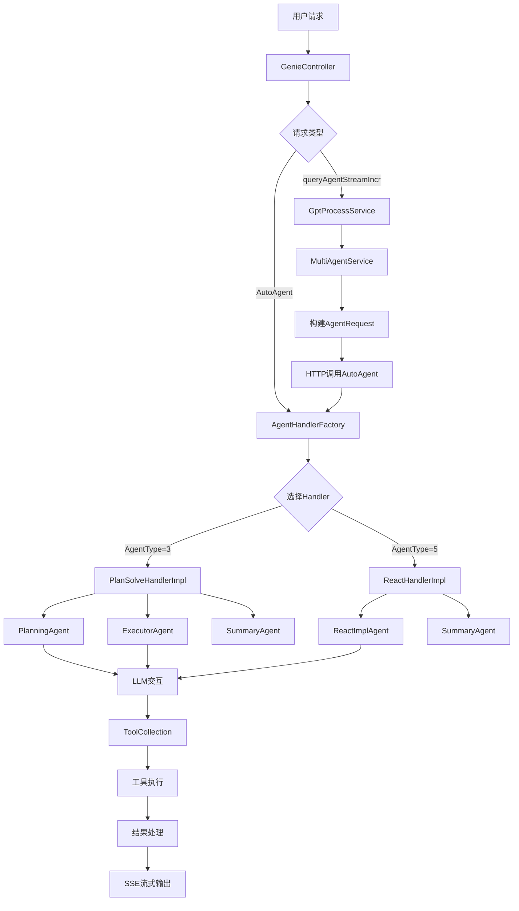
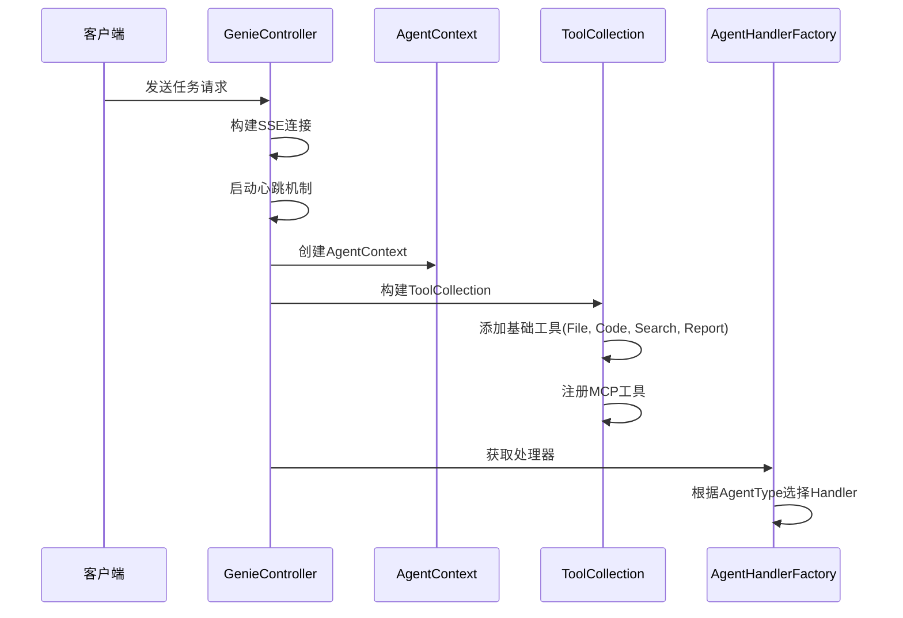
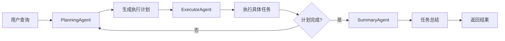
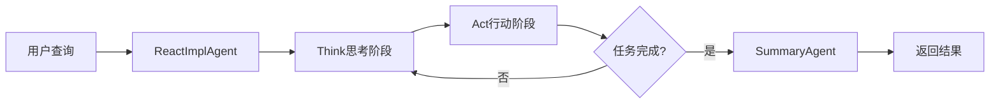
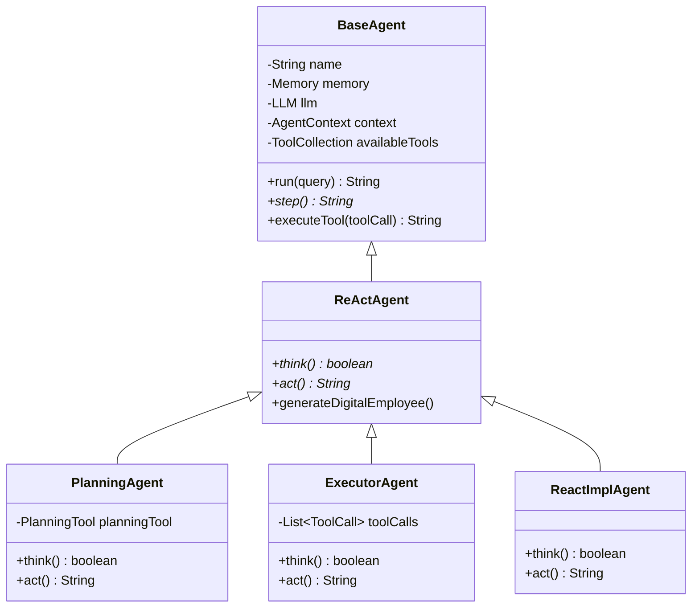
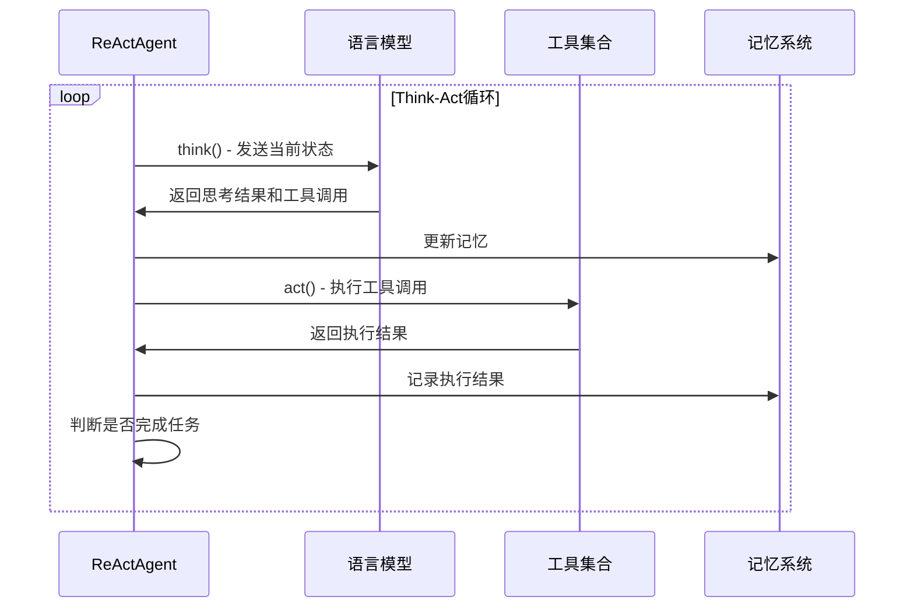
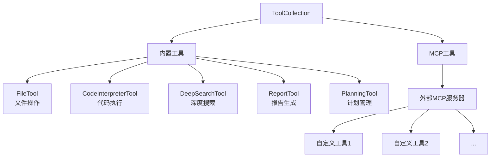
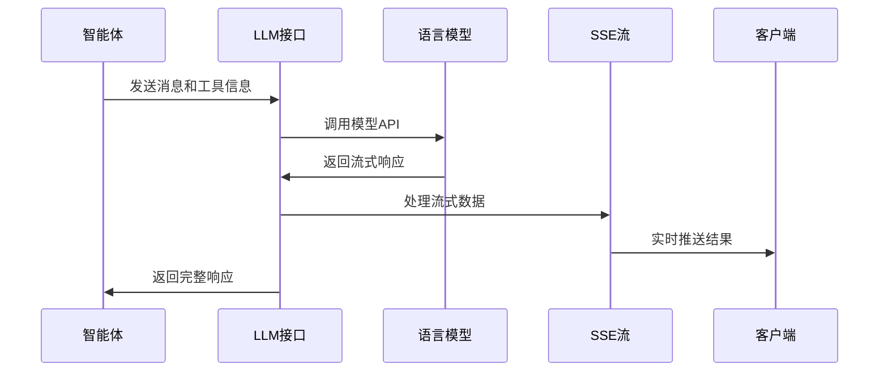
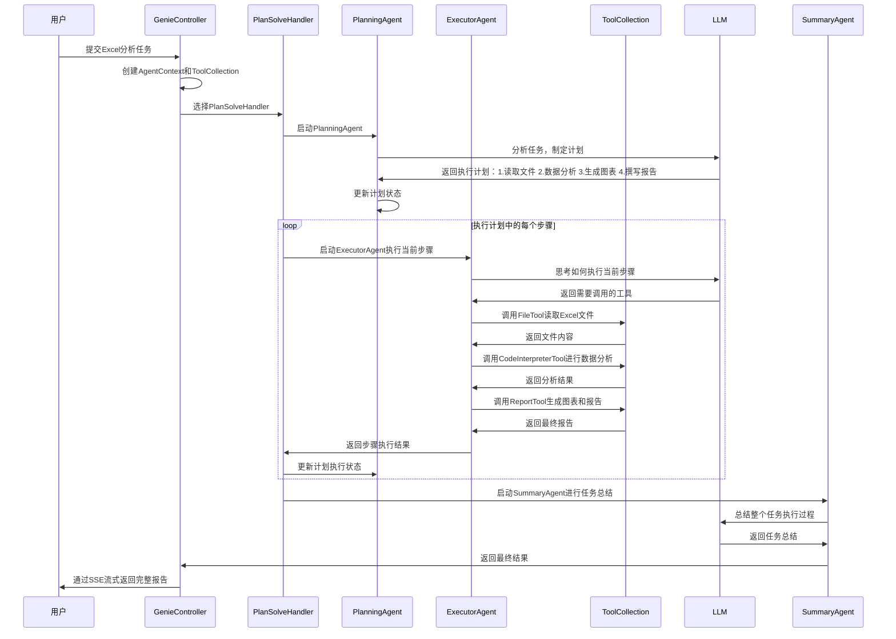

# Genie-Backend 核心调用流程分析

## 项目概述

Genie-Backend 是一个基于多智能体架构的任务处理系统，采用 Spring Boot 框架构建。系统支持两种主要的任务处理模式：**Plan-Solve模式**（规划-执行模式）和 **ReAct模式**（推理-行动模式），能够通过工具调用和LLM交互来完成复杂任务。

## 系统架构概览



## 详细调用流程

### 1. 请求入口层

#### 1.1 主要API接口

**`GenieController`** 是系统的主要入口点，提供两个核心接口：

- **`/AutoAgent`** - 直接的智能体调度接口
- **`/web/api/v1/gpt/queryAgentStreamIncr`** - 通过服务层的间接调用接口

```java
@PostMapping("/AutoAgent")
public SseEmitter AutoAgent(@RequestBody AgentRequest request)

@RequestMapping("/web/api/v1/gpt/queryAgentStreamIncr")
public SseEmitter queryAgentStreamIncr(@RequestBody GptQueryReq params)
```

#### 1.2 请求处理初始化



### 2. 核心处理层

#### 2.1 AgentHandlerFactory - 处理器工厂

**职责**：根据请求类型和Agent类型选择合适的处理器

```java
public AgentHandlerService getHandler(AgentContext context, AgentRequest request) {
    for (AgentHandlerService handler : handlerMap.values()) {
        if (handler.support(context, request)) {
            return handler;
        }
    }
    return null;
}
```

支持的处理器类型：
- **`PlanSolveHandlerImpl`** - 处理AgentType=3的规划解决模式
- **`ReactHandlerImpl`** - 处理AgentType=5的反应模式

#### 2.2 PlanSolveHandlerImpl - 规划解决处理器

**核心特点**：采用规划-执行-总结的三阶段架构



**关键流程**：
1. **规划阶段**：PlanningAgent 分析任务，生成步骤计划
2. **执行阶段**：ExecutorAgent 逐步执行计划中的任务
3. **总结阶段**：SummaryAgent 整理执行结果并生成最终报告

#### 2.3 ReactHandlerImpl - ReAct处理器

**核心特点**：基于推理-行动循环的单一智能体模式



### 3. 智能体执行层

#### 3.1 Agent继承体系



#### 3.2 核心Agent执行流程

**BaseAgent.run() 方法**是所有Agent的核心执行入口：

```java
public String run(String query) {
    setState(AgentState.IDLE);
    updateMemory(RoleType.USER, query, null);
    
    while (currentStep < maxSteps && state != AgentState.FINISHED) {
        currentStep++;
        String stepResult = step(); // 调用具体Agent的step实现
        results.add(stepResult);
    }
    return results.get(results.size() - 1);
}
```

**ReActAgent 的 Think-Act 循环**：



### 4. 工具系统层

#### 4.1 ToolCollection - 工具集合管理

**职责**：统一管理系统中的所有工具，包括内置工具和MCP工具

```java
public class ToolCollection {
    private Map<String, BaseTool> toolMap;      // 内置工具
    private Map<String, McpToolInfo> mcpToolMap; // MCP工具
    
    public Object execute(String name, Object toolInput) {
        if (toolMap.containsKey(name)) {
            return getTool(name).execute(toolInput);
        } else if (mcpToolMap.containsKey(name)) {
            // 执行MCP工具
            return mcpTool.callTool(toolInfo.getMcpServerUrl(), name, toolInput);
        }
    }
}
```

#### 4.2 核心工具类型



### 5. LLM交互层

#### 5.1 LLM类 - 语言模型接口

**核心功能**：
- 支持多种LLM模型配置
- 工具调用能力
- 流式响应处理
- Token计数管理

```java
public CompletableFuture<ToolCallResponse> askTool(
    AgentContext context,
    List<Message> messages,
    Message systemMessage,
    ToolCollection tools,
    ToolChoice toolChoice,
    String streamType,
    boolean isStream,
    int maxTokens
)
```

#### 5.2 消息流处理



### 6. 流式输出层

#### 6.1 SSE流式处理

系统采用 **Server-Sent Events (SSE)** 技术实现实时流式输出：

```java
// 心跳机制
private ScheduledFuture<?> startHeartbeat(SseEmitter emitter, String requestId) {
    return executor.scheduleAtFixedRate(() -> {
        emitter.send("heartbeat");
    }, HEARTBEAT_INTERVAL, HEARTBEAT_INTERVAL, TimeUnit.MILLISECONDS);
}

// 消息发送
public class SSEPrinter implements Printer {
    public void send(String type, Object content) {
        // 构建响应消息
        AgentResponse response = AgentResponse.builder()
            .responseType(type)
            .content(content)
            .build();
        sseEmitter.send(response);
    }
}
```

## 完整任务执行示例

以一个具体的任务为例，展示完整的调用流程：

**任务**：分析某个Excel文件中的销售数据并生成报告



## 核心组件职责总结

| 组件 | 主要职责 | 关键特性 |
|------|----------|----------|
| **GenieController** | 请求入口和流式输出管理 | SSE连接、心跳机制、异步处理 |
| **AgentHandlerFactory** | 处理器选择和分发 | 基于AgentType的动态路由 |
| **PlanSolveHandlerImpl** | 规划解决模式协调 | 三阶段处理、并发执行支持 |
| **ReactHandlerImpl** | ReAct模式处理 | 简化的单Agent处理流程 |
| **PlanningAgent** | 任务规划和计划管理 | 动态计划更新、步骤状态跟踪 |
| **ExecutorAgent** | 具体任务执行 | 工具调用、并发执行、数字员工 |
| **SummaryAgent** | 结果总结和整理 | 智能总结、文件整理 |
| **ToolCollection** | 工具集合管理 | 内置工具、MCP工具、动态扩展 |
| **LLM** | 语言模型交互 | 多模型支持、流式处理、Token管理 |
| **AgentContext** | 上下文信息管理 | 状态保持、信息传递 |

## 系统特性

1. **多智能体协作**：支持Planning、Executor、Summary等多个专业化智能体协同工作
2. **工具扩展性**：通过ToolCollection和MCP协议支持灵活的工具扩展
3. **流式处理**：基于SSE的实时流式输出，提供良好的用户体验
4. **模式灵活性**：支持Plan-Solve和ReAct两种不同的任务处理模式
5. **并发执行**：支持多任务并发执行，提高处理效率
6. **状态管理**：完善的Agent状态管理和执行控制机制

这个架构设计体现了现代AI系统的核心特征：模块化、可扩展、智能化，能够有效处理复杂的多步骤任务。 