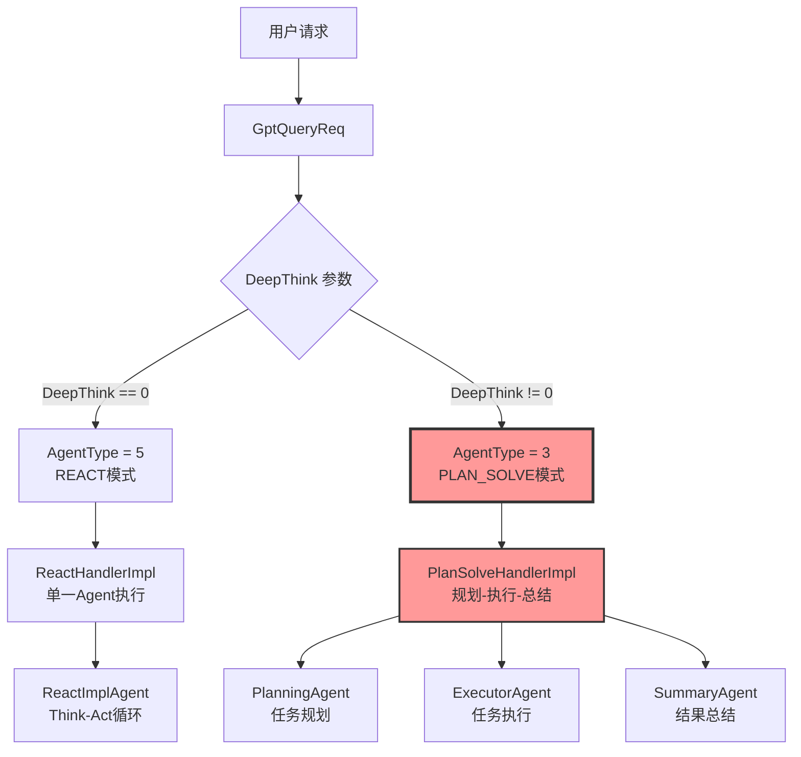
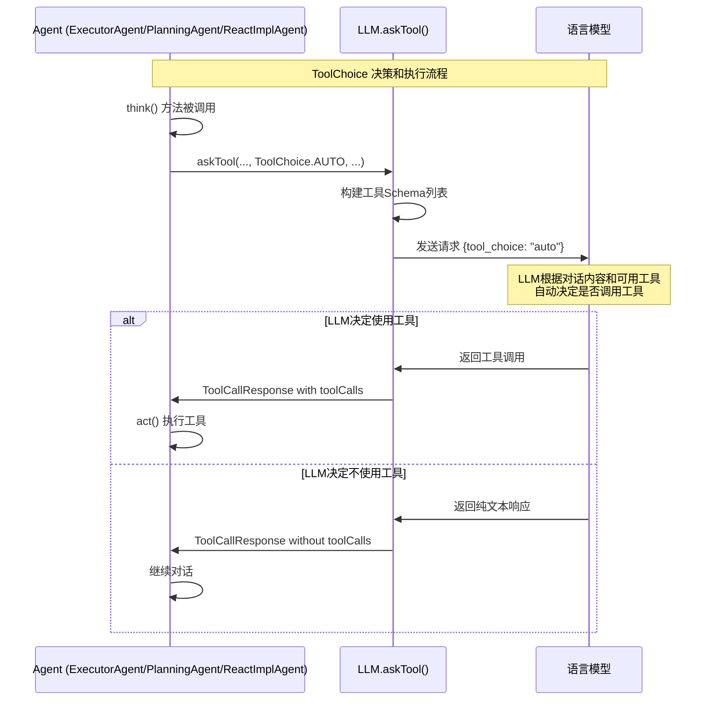
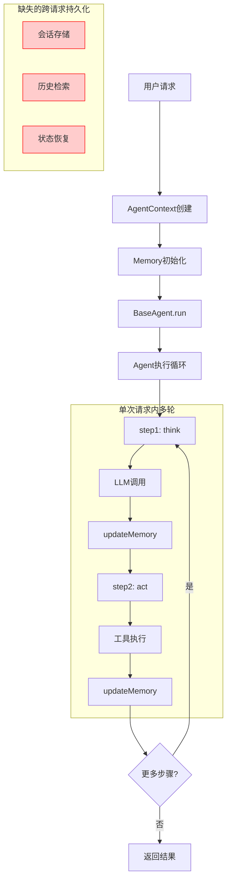
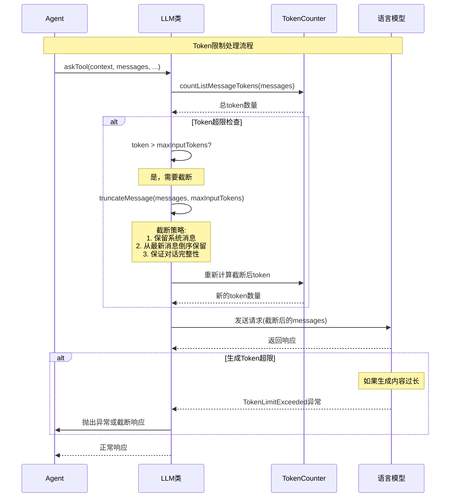
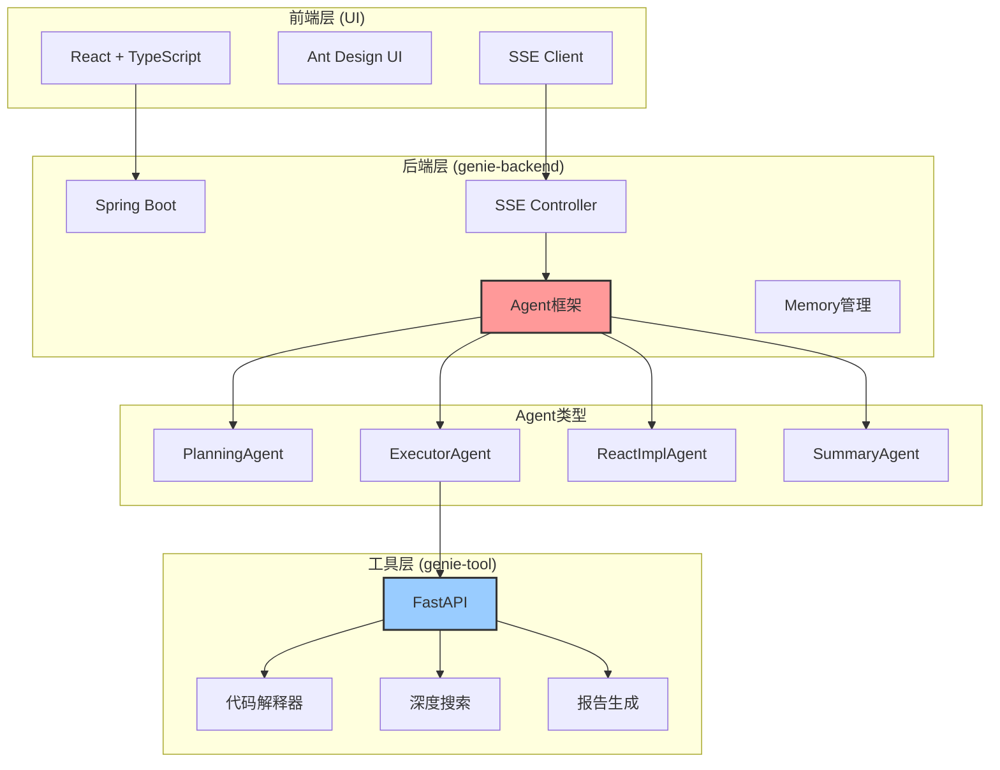
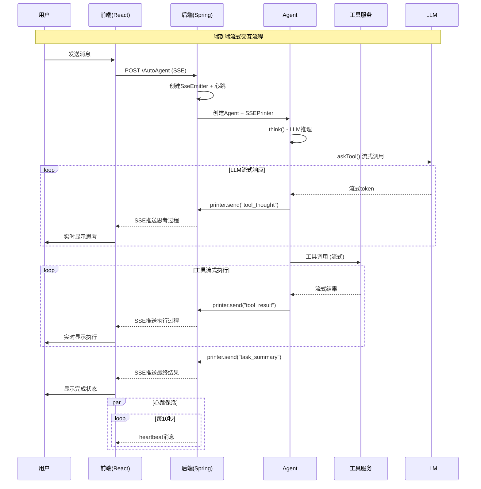
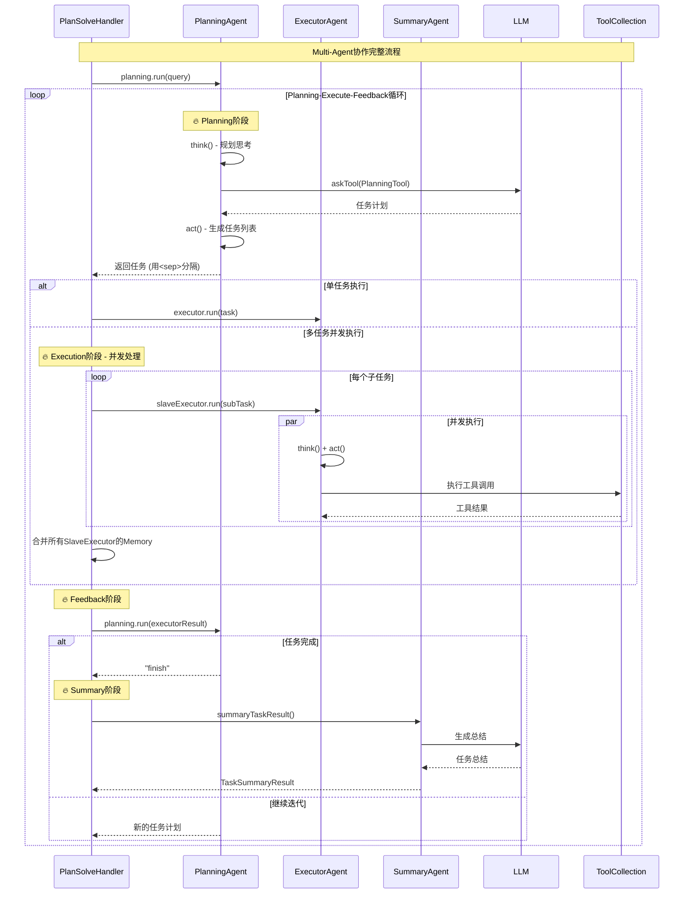
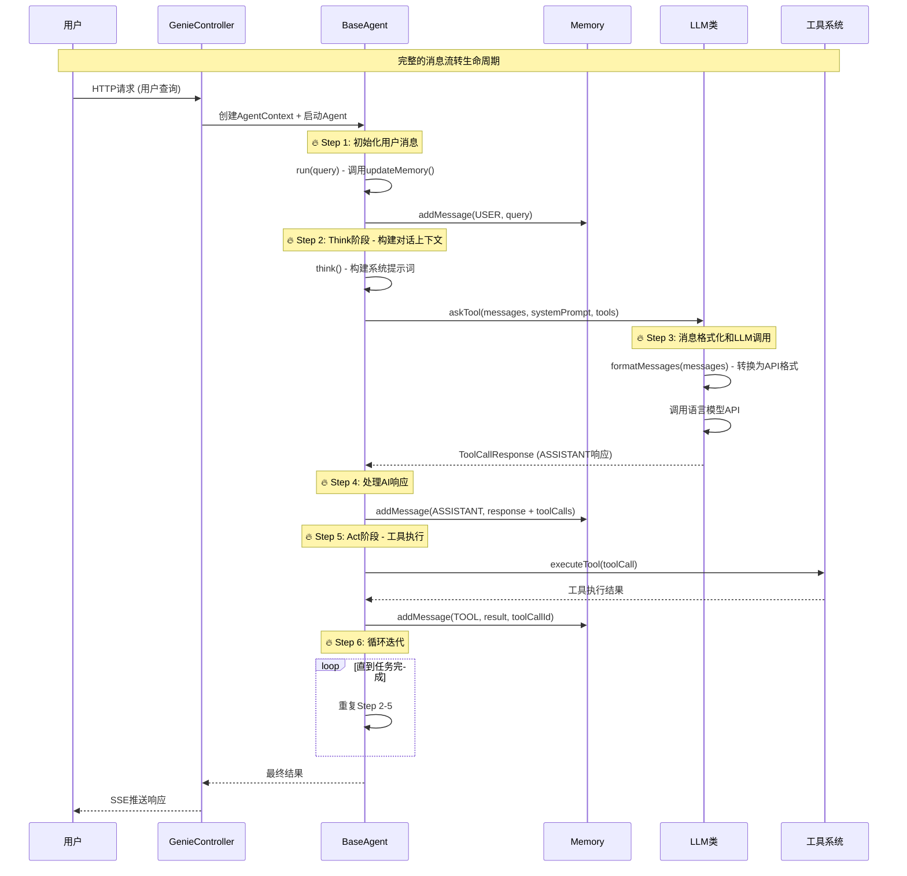

# Genie-Backend 技术FAQ文档

## 常见技术问题解答

### Q1: AgentType=3 是哪里来的，业务逻辑是什么？

#### 答案：

**AgentType=3 对应 PLAN_SOLVE 模式**，是通过 `DeepThink` 参数动态决定的。

#### 详细源码分析：

**1. AgentType 枚举定义**
```java
// 文件位置: com.jd.genie.agent.enums.AgentType
public enum AgentType {
    COMPREHENSIVE(1),  // 综合模式
    WORKFLOW(2),       // 工作流模式  
    PLAN_SOLVE(3),     // 规划解决模式 ⭐
    ROUTER(4),         // 路由模式
    REACT(5);          // 反应模式
}
```

**2. AgentType 设置逻辑**
```java
// 文件位置: com.jd.genie.service.impl.MultiAgentServiceImpl.buildAgentRequest()
private AgentRequest buildAgentRequest(GptQueryReq req) {
    AgentRequest request = new AgentRequest();
    request.setRequestId(req.getTraceId());
    request.setErp(req.getUser());
    request.setQuery(req.getQuery());
    
    // 🔥 核心逻辑：根据 DeepThink 参数决定 AgentType
    request.setAgentType(req.getDeepThink() == 0 ? 5 : 3);
    
    // 根据 AgentType 设置不同的提示词
    request.setSopPrompt(request.getAgentType() == 3 ? genieConfig.getGenieSopPrompt() : "");
    request.setBasePrompt(request.getAgentType() == 5 ? genieConfig.getGenieBasePrompt() : "");
    
    return request;
}
```

**3. 业务逻辑流程**


**4. Handler 选择逻辑**
```java
// 文件位置: com.jd.genie.service.impl.PlanSolveHandlerImpl.support()
@Override
public Boolean support(AgentContext agentContext, AgentRequest request) {
    return AgentType.PLAN_SOLVE.getValue().equals(request.getAgentType());
}

// 文件位置: com.jd.genie.service.impl.ReactHandlerImpl.support()  
@Override
public Boolean support(AgentContext agentContext, AgentRequest request) {
    return AgentType.REACT.getValue().equals(request.getAgentType());
}
```

#### 业务含义总结：

| DeepThink 值 | AgentType | 模式名称 | Handler | 执行特点 |
|-------------|-----------|----------|---------|----------|
| **0** | **5** | REACT | ReactHandlerImpl | 单Agent，简单任务，快速响应 |
| **非0** | **3** | PLAN_SOLVE | PlanSolveHandlerImpl | 多Agent协作，复杂任务，深度思考 |

---

### Q2: ToolChoice 是在哪里决定的，具体代码在哪里？

#### 答案：

**ToolChoice 在各个 Agent 的 `think()` 方法中硬编码为 `AUTO` 模式**，让 LLM 自动决定是否使用工具。

#### 详细源码分析：

**1. ToolChoice 枚举定义**
```java
// 文件位置: com.jd.genie.agent.dto.tool.ToolChoice
public enum ToolChoice {
    NONE("none"),         // 禁止使用工具
    AUTO("auto"),         // 自动决定是否使用工具 ⭐
    REQUIRED("required"); // 强制使用工具
    
    private final String value;
    
    public static ToolChoice fromString(String toolChoice) {
        for (ToolChoice choice : ToolChoice.values()) {
            if (choice.getValue().equals(toolChoice)) {
                return choice;
            }
        }
        throw new IllegalArgumentException("Invalid tool choice: " + toolChoice);
    }
}
```

**2. ExecutorAgent 中的使用**
```java
// 文件位置: com.jd.genie.agent.agent.ExecutorAgent.think()
@Override
public boolean think() {
    try {
        CompletableFuture<LLM.ToolCallResponse> future = getLlm().askTool(
            context,
            getMemory().getMessages(),
            Message.systemMessage(getSystemPrompt(), null),
            availableTools,
            ToolChoice.AUTO,  // 🔥 硬编码为 AUTO
            null, 
            false, 
            300
        );
        
        LLM.ToolCallResponse response = future.get();
        setToolCalls(response.getToolCalls());
        // ...
    } catch (Exception e) {
        log.error("{} think error ", context.getRequestId(), e);
    }
    return true;
}
```

**3. PlanningAgent 中的使用**
```java
// 文件位置: com.jd.genie.agent.agent.PlanningAgent.think()
@Override
public boolean think() {
    try {
        CompletableFuture<LLM.ToolCallResponse> future = getLlm().askTool(
            context,
            getMemory().getMessages(),
            Message.systemMessage(getSystemPrompt(), null),
            availableTools,
            ToolChoice.AUTO,  // 🔥 硬编码为 AUTO
            null, 
            context.getIsStream(), 
            300
        );
        // ...
    } catch (Exception e) {
        log.error("{} think error ", context.getRequestId(), e);
    }
    return true;
}
```

**4. ReactImplAgent 中的使用**
```java
// 文件位置: com.jd.genie.agent.agent.ReactImplAgent.think()
@Override
public boolean think() {
    try {
        CompletableFuture<LLM.ToolCallResponse> future = getLlm().askTool(
            context,
            getMemory().getMessages(),
            Message.systemMessage(getSystemPrompt(), null),
            availableTools,
            ToolChoice.AUTO,  // 🔥 硬编码为 AUTO
            null, 
            context.getIsStream(), 
            300
        );
        // ...
    } catch (Exception e) {
        log.error("{} think error ", context.getRequestId(), e);
    }
    return true;
}
```

**5. LLM.askTool() 方法处理**
```java
// 文件位置: com.jd.genie.agent.llm.LLM.askTool()
public CompletableFuture<ToolCallResponse> askTool(
    AgentContext context,
    List<Message> messages,
    Message systemMessage,
    ToolCollection tools,
    ToolChoice toolChoice,  // 🔥 接收 ToolChoice 参数
    String streamType,
    boolean isStream,
    int maxTokens
) {
    try {
        // 构建工具Schema
        List<Map<String, Object>> toolSchemas = buildToolSchemas(tools);
        
        // 根据 toolChoice 构建请求参数
        Map<String, Object> params = new HashMap<>();
        params.put("model", model);
        params.put("messages", formatMessages(allMessages, model.contains("claude")));
        params.put("tools", toolSchemas);
        params.put("tool_choice", toolChoice.getValue()); // "auto"
        
        // 调用 LLM API
        // ...
    } catch (Exception e) {
        log.error("{} Unexpected error in askTool: {}", context.getRequestId(), e.getMessage(), e);
    }
}
```

#### ToolChoice 决策流程：



#### 代码位置总结：

| 组件 | 文件路径 | 方法 | ToolChoice设置 |
|------|----------|------|----------------|
| **ExecutorAgent** | `com.jd.genie.agent.agent.ExecutorAgent` | `think()` | `ToolChoice.AUTO` |
| **PlanningAgent** | `com.jd.genie.agent.agent.PlanningAgent` | `think()` | `ToolChoice.AUTO` |
| **ReactImplAgent** | `com.jd.genie.agent.agent.ReactImplAgent` | `think()` | `ToolChoice.AUTO` |
| **LLM处理** | `com.jd.genie.agent.llm.LLM` | `askTool()` | 接收并传递给模型 |

#### 设计理念：

1. **智能化决策**: 使用 `AUTO` 模式让 LLM 根据对话上下文智能决定是否需要工具
2. **简化逻辑**: 避免复杂的工具选择逻辑，依赖 LLM 的推理能力
3. **灵活适应**: LLM 可以根据任务复杂度自动选择合适的工具组合

---

### Q3: 如何扩展新的 AgentType 或 ToolChoice？

#### 扩展 AgentType：

**1. 添加枚举值**
```java
// 修改 AgentType.java
public enum AgentType {
    COMPREHENSIVE(1),
    WORKFLOW(2),
    PLAN_SOLVE(3),
    ROUTER(4),
    REACT(5),
    CUSTOM_AGENT(6); // 新增自定义Agent类型
}
```

**2. 创建对应的Handler**
```java
@Component
public class CustomAgentHandlerImpl implements AgentHandlerService {
    @Override
    public String handle(AgentContext agentContext, AgentRequest request) {
        // 自定义处理逻辑
        return "";
    }
    
    @Override
    public Boolean support(AgentContext agentContext, AgentRequest request) {
        return AgentType.CUSTOM_AGENT.getValue().equals(request.getAgentType());
    }
}
```

#### 扩展 ToolChoice：

**1. 添加新的选择策略**
```java
// 修改 ToolChoice.java
public enum ToolChoice {
    NONE("none"),
    AUTO("auto"),
    REQUIRED("required"),
    SMART("smart");  // 新增智能选择模式
}
```

**2. 在 Agent 中使用**
```java
// 在具体的Agent中根据场景选择不同的ToolChoice
ToolChoice choice = determineToolChoice(context);
future = getLlm().askTool(context, messages, systemMessage, tools, choice, ...);
```

这种设计保证了系统的可扩展性和灵活性。 

---

### Q4: 项目是否支持多轮对话？如何实现的？

#### 答案：

**项目具备多轮对话的技术架构，但实际支持程度有限**。系统在单次请求内通过Memory机制管理对话历史，但缺乏跨请求的会话持久化。

#### 详细源码分析：

**1. Memory 对话历史管理**
```java
// 文件位置: com.jd.genie.agent.dto.Memory
@Data
public class Memory {
    private List<Message> messages = new ArrayList<>();

    /**
     * 添加消息
     */
    public void addMessage(Message message) {
        messages.add(message);
    }

    /**
     * 获取最后一条消息
     */
    public Message getLastMessage() {
        return messages.isEmpty() ? null : messages.get(messages.size() - 1);
    }

    /**
     * 清空记忆
     */
    public void clear() {
        messages.clear();
    }

    /**
     * 清空工具执行历史 - 保留对话，移除工具调用痕迹
     */
    public void clearToolContext() {
        Iterator<Message> iterator = messages.iterator();
        while (iterator.hasNext()) {
            Message message = iterator.next();
            // 移除 TOOL 类型消息
            if (message.getRole() == RoleType.TOOL) {
                iterator.remove();
            }
            // 移除带工具调用的 ASSISTANT 消息
            if (message.getRole() == RoleType.ASSISTANT && 
                Objects.nonNull(message.getToolCalls()) && 
                !message.getToolCalls().isEmpty()) {
                iterator.remove();
            }
        }
    }
}
```

**2. BaseAgent 中的对话状态管理**
```java
// 文件位置: com.jd.genie.agent.agent.BaseAgent
public abstract class BaseAgent {
    private Memory memory = new Memory(); // 🔥 每个Agent维护独立的对话记忆
    
    /**
     * 运行代理主循环 - 支持多轮交互
     */
    public String run(String query) {
        if (!query.isEmpty()) {
            updateMemory(RoleType.USER, query, null); // 添加用户消息到记忆
        }
        
        // 多步骤执行循环，每步都可能产生对话
        while (currentStep < maxSteps && state != AgentState.FINISHED) {
            String stepResult = step(); // 每个step可能包含多轮LLM交互
            results.add(stepResult);
        }
    }
    
    /**
     * 更新代理记忆
     */
    public void updateMemory(RoleType role, String content, String base64Image, Object... args) {
        Message message;
        switch (role) {
            case USER:
                message = Message.userMessage(content, base64Image);
                break;
            case ASSISTANT:
                message = Message.assistantMessage(content, base64Image);
                break;
            case TOOL:
                message = Message.toolMessage(content, (String) args[0], base64Image);
                break;
        }
        memory.addMessage(message); // 🔥 持续积累对话历史
    }
}
```

**3. 会话标识管理**
```java
// 文件位置: com.jd.genie.agent.agent.AgentContext
@Data
public class AgentContext {
    String requestId;  // 请求ID，用于日志追踪
    String sessionId;  // 会话ID，用于多轮对话标识 🔥
    
    // 在控制器中的设置
    AgentContext agentContext = AgentContext.builder()
        .requestId(request.getRequestId())
        .sessionId(request.getRequestId()) // 🔥 目前sessionId = requestId
        .build();
}
```

**4. 工具调用中的会话处理**
```java
// 文件位置: com.jd.genie.agent.tool.common.FileTool.uploadFile()
// 构建请求体 多轮对话替换requestId为sessionId
fileRequest.setRequestId(agentContext.getSessionId()); // 🔥 使用sessionId而非requestId

// 文件位置: com.jd.genie.agent.tool.common.CodeInterpreterTool.execute()
CodeInterpreterRequest request = CodeInterpreterRequest.builder()
    .requestId(agentContext.getSessionId()) // 🔥 适配多轮对话
    .build();
```

**5. 提示词模板中的历史对话支持**
```yaml
# 文件位置: application.yml
system_prompt: |
  ## 用户历史对话信息
  <history_dialogue>
  {{history_dialogue}}  # 🔥 支持历史对话占位符
  </history_dialogue>
```

#### 多轮对话架构分析：



#### 当前多轮对话能力总结：

| 维度 | 支持情况 | 实现方式 | 限制 |
|------|----------|----------|------|
| **单次请求内多轮** | ✅ 完全支持 | Memory类管理消息历史 | 仅在Agent执行期间有效 |
| **Agent间对话** | ✅ 支持 | PlanSolveHandler中多Agent协作 | 限于同一请求内 |
| **工具调用对话** | ✅ 支持 | 工具结果自动加入Memory | Think-Act循环实现 |
| **跨请求会话** | ❌ 不支持 | 缺乏持久化存储 | 每次请求都是新会话 |
| **会话恢复** | ❌ 不支持 | sessionId仅用于标识 | 无法恢复历史对话 |

---

### Q5: 如何处理超过上下文Token限制的情况？

#### 答案：

**系统实现了完整的Token管理机制**，包括Token计数、超限检测和智能截断策略，确保对话始终在模型Token限制内进行。

#### 详细源码分析：

**1. Token计数器实现**
```java
// 文件位置: com.jd.genie.agent.llm.TokenCounter
@Slf4j
public class TokenCounter {
    // Token 计算常量
    private static final int BASE_MESSAGE_TOKENS = 4;    // 每条消息基础token
    private static final int FORMAT_TOKENS = 2;         // 格式化token
    private static final int LOW_DETAIL_IMAGE_TOKENS = 85;  // 低质量图片token

    /**
     * 计算文本的 token 数量
     */
    public int countText(String text) {
        return text == null ? 0 : text.length(); // 🔥 简化计算：字符数=token数
    }

    /**
     * 计算消息的 token 数量
     */
    public int countMessageTokens(Map<String, Object> message) {
        int tokens = BASE_MESSAGE_TOKENS; // 基础token

        // 角色token
        tokens += countText(message.getOrDefault("role", "").toString());
        
        // 内容token（支持多模态）
        if (message.containsKey("content")) {
            tokens += countContent(message.get("content"));
        }
        
        // 工具调用token
        if (message.containsKey("tool_calls")) {
            tokens += countToolCalls((List<Map<String, Object>>) message.get("tool_calls"));
        }
        
        return tokens;
    }

    /**
     * 计算消息列表的总 token 数量
     */
    public int countListMessageTokens(List<Map<String, Object>> messages) {
        int totalTokens = FORMAT_TOKENS; // 基础格式token
        for (Map<String, Object> message : messages) {
            totalTokens += countMessageTokens(message);
        }
        return totalTokens;
    }
}
```

**2. Token超限异常处理**
```java
// 文件位置: com.jd.genie.agent.exception.TokenLimitExceeded
public class TokenLimitExceeded extends RuntimeException {
    private final int currentTokens;   // 当前token数
    private final int maxTokens;       // 最大token限制
    private final MessageType messageType; // 消息类型

    public enum MessageType {
        SYSTEM, USER, ASSISTANT, TOOL, UNKNOWN
    }

    public TokenLimitExceeded(int currentTokens, int maxTokens, MessageType messageType) {
        super(String.format(
                "Token limit exceeded: current=%d, max=%d, exceeded=%d, messageType=%s",
                currentTokens, maxTokens, currentTokens - maxTokens, messageType
        ));
        this.currentTokens = currentTokens;
        this.maxTokens = maxTokens;
        this.messageType = messageType;
    }

    public int getExceededTokens() {
        return currentTokens - maxTokens; // 🔥 超出的token数量
    }
}
```

**3. 智能消息截断策略**
```java
// 文件位置: com.jd.genie.agent.llm.LLM.truncateMessage()
public List<Map<String, Object>> truncateMessage(
    AgentContext context, 
    List<Map<String, Object>> messages, 
    int maxInputTokens
) {
    if (messages.isEmpty() || maxInputTokens < 0) {
        return messages;
    }
    
    log.info("{} before truncate {}", context.getRequestId(), JSON.toJSONString(messages));
    
    List<Map<String, Object>> truncatedMessages = new ArrayList<>();
    int remainingTokens = maxInputTokens;
    
    // 🔥 Step1: 预留系统消息token
    Map<String, Object> system = messages.get(0);
    if ("system".equals(system.getOrDefault("role", ""))) {
        remainingTokens -= tokenCounter.countMessageTokens(system);
    }

    // 🔥 Step2: 从最新消息开始倒序截断
    for (int i = messages.size() - 1; i >= 0; i--) {
        Map<String, Object> message = messages.get(i);
        int messageToken = tokenCounter.countMessageTokens(message);
        
        if (remainingTokens >= messageToken) {
            truncatedMessages.add(0, message); // 头部插入保持顺序
            remainingTokens -= messageToken;
        } else {
            break; // 🔥 超出限制，停止添加
        }
    }
    
    // 🔥 Step3: 保证对话完整性 - 移除不完整的对话轮次
    Iterator<Map<String, Object>> iterator = truncatedMessages.iterator();
    while (iterator.hasNext()) {
        Map<String, Object> message = iterator.next();
        if (!"user".equals(message.getOrDefault("role", ""))) {
            iterator.remove(); // 移除非用户消息开头的消息
        } else {
            break; // 找到用户消息，保持完整对话
        }
    }

    // 🔥 Step4: 确保系统消息始终存在
    if ("system".equals(system.getOrDefault("role", ""))) {
        truncatedMessages.add(0, system);
    }
    
    log.info("{} after truncate {}", context.getRequestId(), JSON.toJSONString(truncatedMessages));
    return truncatedMessages;
}
```

**4. LLM配置中的Token限制**
```yaml
# 文件位置: application.yml
llm:
  settings: '{
    "claude-3-7-sonnet-v1": {
        "model": "claude-3-7-sonnet-v1",
        "max_tokens": 8192,        # 🔥 最大输出token
        "max_input_tokens": 128000  # 🔥 最大输入token限制
    }
  }'
```

```java
// 文件位置: com.jd.genie.agent.llm.LLMSettings
@Data
public class LLMSettings {
    private int maxTokens;      // 最大生成token数量
    private int maxInputTokens; // 最大输入token数量 🔥
    private String model;
    private double temperature;
}
```

#### Token处理流程图：



#### Token管理策略总结：

| 场景 | 处理策略 | 实现方式 | 效果 |
|------|----------|----------|------|
| **输入Token超限** | 智能截断 | `truncateMessage()` | 保留最新对话，确保连贯性 |
| **系统消息保护** | 优先保留 | 系统消息始终保留 | 确保Agent能力不丢失 |
| **对话完整性** | 轮次对齐 | 移除不完整对话轮次 | 避免上下文错乱 |
| **Token计算** | 近似估算 | 字符数≈Token数 | 快速估算，略有误差 |
| **多模态支持** | 分类计算 | 文本+图片分别计算 | 支持图片等多模态内容 |
| **生成控制** | maxTokens限制 | LLM配置参数 | 控制输出长度 |

#### 优化建议：

1. **Token计算精度**: 当前使用字符数估算，可考虑集成tokenizer获得精确计算
2. **截断策略**: 可根据消息重要性进行智能保留，而非简单的时间序截断
3. **缓存机制**: 对于重复的系统消息，可以缓存token计算结果
4. **分片处理**: 对于超长文档，可考虑分片处理而非截断

这种Token管理机制确保了系统在各种场景下都能稳定运行，避免因Token超限导致的调用失败。

---

### Q6: Genie项目的核心技术架构是什么？

#### 答案：

**Genie是一个基于多Agent协作的企业级AI对话系统**，采用前后端分离的现代化架构，支持实时流式交互。

#### 详细技术架构分析：

**1. 前端技术栈 (UI)**
```typescript
// 核心技术组合
- React 19 + TypeScript     // 现代化前端框架
- Vite 6.1.0               // 高性能构建工具  
- Ant Design 5.26.3       // 企业级组件库
- Tailwind CSS 4.1.11     // 原子化CSS框架
- React Router 7.6.2       // 客户端路由
- @microsoft/fetch-event-source // SSE客户端库
```

**前端架构特点**：
- **单页应用(SPA)**：基于React Router的现代化路由系统
- **组件化设计**：模块化组件体系（ChatView、ActionPanel、PlanView等）
- **TypeScript类型安全**：完整的类型定义和类型检查
- **响应式布局**：基于Tailwind CSS的移动端适配

**2. 后端核心架构 (genie-backend)**
```java
// 多Agent协作系统
- Java 8+ + Spring Boot    // 企业级后端框架
- SSE (Server-Sent Events) // 实时流式推送
- 多智能体协作框架        // Agent编排和调度
- 工具系统集成            // 外部工具调用
- Memory管理             // 对话历史管理
```

**Agent类型系统**：
```java
public enum AgentType {
    COMPREHENSIVE(1),  // 综合模式 - 通用对话
    WORKFLOW(2),      // 工作流模式 - 流程化处理  
    PLAN_SOLVE(3),    // 规划解决模式 - 复杂任务分解 ⭐
    ROUTER(4),        // 路由模式 - 智能分发
    REACT(5);         // 反应模式 - 快速响应 ⭐
}
```

**核心Agent实现**：
- **BaseAgent**: 所有Agent的抽象基类，管理状态和执行流程
- **PlanningAgent**: 任务规划Agent，负责复杂任务分解  
- **ExecutorAgent**: 任务执行Agent，负责具体工具调用
- **ReactImplAgent**: ReAct模式Agent，实现Think-Act循环
- **SummaryAgent**: 结果总结Agent，负责最终结果整合

**3. 工具服务层 (genie-tool)**
```python
# Python异步工具服务
- FastAPI + uvloop         // 高性能异步Web框架
- 异步流式处理             // Generator-based流式输出
- 代码解释器 (CodeInterpreter) // Python代码执行环境
- 深度搜索引擎 (DeepSearch)   // 智能信息检索
- 报告生成器 (ReportTool)    // 文档生成和分析
```

#### 系统架构图：


---

### Q7: 流式输出是如何实现的？支持哪些特性？

#### 答案：

**系统采用SSE (Server-Sent Events)技术实现端到端的流式输出**，支持实时交互、心跳保活、多类型消息推送等企业级特性。

#### 详细流式实现分析：

**1. 前端SSE客户端实现**
```typescript
// ui/src/utils/querySSE.ts - 核心SSE客户端
import { fetchEventSource } from '@microsoft/fetch-event-source';

export default (config: SSEConfig, url: string): void => {
  fetchEventSource(url, {
    method: 'POST',
    headers: {
      'Content-Type': 'application/json',
      'Accept': 'text/event-stream', // 🔥 SSE标准头
      'Cache-Control': 'no-cache',
      'Connection': 'keep-alive',
    },
    body: JSON.stringify(body),
    openWhenHidden: true, // 🔥 后台保持连接
    
    onmessage(event: EventSourceMessage) {
      const parsedData = JSON.parse(event.data);
      handleMessage(parsedData); // 实时处理流式数据
    },
    
    onerror(error) { handleError(error); },
    onclose() { handleClose(); }
  });
};
```

**前端流式处理流程**：
```typescript
// ChatView组件中的实时更新
const sendMessage = (inputInfo: CHAT.TInputInfo) => {
  const handleMessage = (data: MESSAGE.Answer) => {
    const { finished, resultMap, packageType, status } = data;
    
    // 🔥 心跳消息过滤
    if (packageType !== "heartbeat") {
      // 实时更新UI状态
      currentChat = combineData(resultMap.eventData, currentChat);
      const taskData = handleTaskData(currentChat, deepThink);
      
      // 🔥 流式更新各UI组件
      setTaskList(taskData.taskList);    // 任务列表
      updatePlan(taskData.plan);         // 执行计划
      openAction(taskData.taskList);     // 操作面板
      
      if (finished) {
        currentChat.loading = false;
        setLoading(false); // 🔥 完成标记
      }
    }
  };

  querySSE({ body: params, handleMessage, handleError, handleClose });
};
```

**2. 后端SSE推送架构**

**SSE控制器层**：
```java
// GenieController.java - SSE服务端点
@PostMapping("/AutoAgent")
public SseEmitter AutoAgent(@RequestBody AgentRequest request) {
    Long AUTO_AGENT_SSE_TIMEOUT = 60 * 60 * 1000L; // 1小时超时
    SseEmitter emitter = new SseEmitter(AUTO_AGENT_SSE_TIMEOUT);
    
    // 🔥 心跳机制 - 每10秒发送一次心跳保活
    ScheduledFuture<?> heartbeatFuture = startHeartbeat(emitter, requestId);
    
    // 🔥 SSE连接监听
    registerSSEMonitor(emitter, requestId, heartbeatFuture);
    
    // 异步执行Agent处理逻辑
    ThreadUtil.execute(() -> {
        // 注入SSE推送器到Agent上下文
        Printer printer = new SSEPrinter(emitter, request, agentType);
        AgentContext context = AgentContext.builder()
                .printer(printer)        // 🔥 SSE推送器
                .isStream(true)          // 🔥 流式模式标记
                .build();
        
        AgentHandlerService handler = getHandler(context, request);
        handler.handle(context, request); // 执行Agent逻辑
    });
    
    return emitter;
}

// 🔥 心跳保活机制
private ScheduledFuture<?> startHeartbeat(SseEmitter emitter, String requestId) {
    return executor.scheduleAtFixedRate(() -> {
        try {
            log.info("{} send heartbeat", requestId);
            emitter.send("heartbeat"); // 发送心跳消息
        } catch (Exception e) {
            log.error("{} heartbeat failed, closing connection", requestId, e);
            emitter.completeWithError(e);
        }
    }, HEARTBEAT_INTERVAL, HEARTBEAT_INTERVAL, TimeUnit.MILLISECONDS);
}
```

**SSE消息推送器**：
```java
// SSEPrinter.java - 核心推送组件
public class SSEPrinter implements Printer {
    private final SseEmitter emitter;
    private final AgentRequest request;
    private Integer agentType;
    
    @Override
    public void send(String messageType, Object message) {
        try {
            AgentResponse response = AgentResponse.builder()
                    .responseType(messageType)
                    .content(message)
                    .requestId(request.getRequestId())
                    .build();
            
            // 🔥 根据消息类型进行不同处理
            switch (messageType) {
                case "agent_stream":
                    response.setResult((String) message);
                    break;
                case "tool_thought":
                    response.setResult((String) message);
                    break;
                case "task_summary":
                    // 处理任务总结数据
                    response.setResultMap((Map<String, Object>) message);
                    response.getResultMap().put("agentType", agentType);
                    break;
                default:
                    break;
            }
            
            emitter.send(response); // 🔥 实时推送到前端
            
        } catch (Exception e) {
            log.error("SSE send error", e);
        }
    }
}
```

**3. 工具服务流式处理**

**代码解释器工具流式输出**：
```python
# genie_tool/api/tool.py - 工具服务SSE端点
@router.post("/code_interpreter") 
async def post_code_interpreter(body: CIRequest):
    async def _stream():
        acc_content = ""
        acc_token = 0
        acc_time = time.time()
        
        # 🔥 异步流式处理Agent执行
        async for chunk in code_interpreter_agent(
            task=body.task,
            file_names=body.file_names,
            request_id=body.request_id,
            stream=True,  # 启用流式模式
        ):
            # 🔥 代码输出流式推送
            if isinstance(chunk, CodeOuput):
                yield ServerSentEvent(
                    data=json.dumps({
                        "requestId": body.request_id,
                        "code": chunk.code,
                        "fileInfo": chunk.file_list,
                        "isFinal": False,
                    }, ensure_ascii=False)
                )
            
            # 🔥 最终结果推送
            elif isinstance(chunk, ActionOutput):
                yield ServerSentEvent(
                    data=json.dumps({
                        "requestId": body.request_id,
                        "codeOutput": chunk.content,
                        "fileInfo": chunk.file_list,
                        "isFinal": True,  # 完成标记
                    }, ensure_ascii=False)
                )
        
        # 🔥 流式结束标记
        yield ServerSentEvent(data="[DONE]")
    
    return StreamingResponse(_stream(), media_type="text/event-stream")
```

**Agent内部流式处理**：
```python
# genie_tool/tool/ci_agent.py - Agent流式执行
class CIAgent(CodeAgent):
    @timer()
    def _step_stream(self, memory_step: ActionStep) -> Generator[
        ChatMessageStreamDelta | ToolCall | ToolOutput | ActionOutput | CodeOuput
    ]:
        memory_messages = self.write_memory_to_messages()
        
        # 🔥 LLM流式调用
        output_stream = self.model.generate_stream(
            input_messages,
            extra_headers={"x-ms-client-request-id": model_request_id},
        )
        
        chat_message_stream_deltas: list[ChatMessageStreamDelta] = []
        
        # 🔥 实时处理流式响应
        for event in output_stream:
            chat_message_stream_deltas.append(event)
            yield event  # 流式输出每个token
        
        # 聚合完整响应
        chat_message = agglomerate_stream_deltas(chat_message_stream_deltas)
        memory_step.model_output_message = chat_message
```

#### 流式架构完整流程图：



#### 流式输出特性总结：

| 特性 | 实现方式 | 技术细节 | 用户体验 |
|------|----------|----------|----------|
| **实时推送** | SSE + WebSocket-like | fetchEventSource库 | 毫秒级响应 |
| **心跳保活** | 定时器 + 异常处理 | 10秒间隔heartbeat | 连接稳定性 |
| **多类型消息** | 消息分类 + 状态管理 | tool_thought/task_summary等 | 分层显示 |
| **流式控制** | isStream参数 | 动态开启/关闭 | 性能优化 |
| **错误处理** | 完整异常链 | 重连+降级 | 容错性 |
| **完成检测** | isFinal标记 | 精确状态控制 | 明确结束 |

#### 核心优势：

1. **低延迟**: 流式输出让用户立即看到AI思考过程
2. **高可用**: 心跳机制确保长连接稳定性  
3. **用户体验**: 实时反馈提升交互质量
4. **可扩展**: 支持多种消息类型和自定义处理
5. **性能优化**: 按需流式避免内存积压

这套流式架构为Genie提供了**企业级的实时AI交互能力**，确保了系统的稳定性和用户体验。

---

### Q8: Genie-Backend的Multi-Agent交互机制是如何实现的？(源码级深度分析)

#### 答案：

**Genie采用"Plan-Execute-Summary"三段式Multi-Agent协作模式**，通过专门化的Agent分工协作，实现复杂任务的智能分解、并发执行和结果总结。

#### 1. 核心架构设计

**Multi-Agent协作入口**：
```java
// 文件位置: com.jd.genie.service.impl.PlanSolveHandlerImpl.handle()
@Override
public String handle(AgentContext agentContext, AgentRequest request) {
    // 🔥 创建三个专门化的Agent
    PlanningAgent planning = new PlanningAgent(agentContext);  // 规划Agent
    ExecutorAgent executor = new ExecutorAgent(agentContext);   // 执行Agent  
    SummaryAgent summary = new SummaryAgent(agentContext);      // 总结Agent
    
    // 🔥 核心协作循环
    String planningResult = planning.run(agentContext.getQuery());
    int stepIdx = 0;
    while (stepIdx <= maxStepNum) {
        // Planning -> Execution -> Feedback循环
        List<String> tasks = Arrays.stream(planningResult.split("<sep>"))
                .map(task -> "你的任务是：" + task)
                .collect(Collectors.toList());
        
        String executorResult = executeTasksConcurrently(tasks, executor);
        planningResult = planning.run(executorResult); // 🔥 反馈循环
        
        if ("finish".equals(planningResult)) {
            TaskSummaryResult result = summary.summaryTaskResult(
                executor.getMemory().getMessages(), request.getQuery());
            break;
        }
        stepIdx++;
    }
}
```

**Agent继承体系**：
```java
BaseAgent (抽象基类)
├── ReActAgent (Think-Act循环基类)
│   ├── PlanningAgent (规划专家)
│   └── ExecutorAgent (执行专家)
└── SummaryAgent (总结专家)
```

#### 2. Agent间交互的关键机制

**2.1 共享上下文 (AgentContext)**
```java
// 文件位置: com.jd.genie.agent.agent.AgentContext
@Data @Builder
public class AgentContext {
    String requestId;           // 请求唯一标识
    String sessionId;           // 会话标识
    String query;              // 用户原始查询
    String task;               // 当前执行任务
    Printer printer;           // 🔥 统一的消息推送器
    ToolCollection toolCollection; // 🔥 共享的工具集合
    List<File> productFiles;   // 🔥 共享的产出文件
    List<File> taskProductFiles; // 任务级文件
    Boolean isStream;          // 流式输出控制
}
```

**2.2 Memory机制 - Agent间的记忆传递**
```java
// 文件位置: com.jd.genie.agent.agent.BaseAgent
public class BaseAgent {
    private Memory memory = new Memory(); // 每个Agent独立的记忆
    
    public void updateMemory(RoleType role, String content, String base64Image) {
        Message message = createMessage(role, content, base64Image);
        memory.addMessage(message); // 🔥 更新Agent记忆
    }
}

// 并发执行时的Memory同步逻辑
if (planningResults.size() > 1) {
    int memoryIndex = executor.getMemory().size();
    for (String task : planningResults) {
        ExecutorAgent slaveExecutor = new ExecutorAgent(agentContext);
        // 🔥 复制主Executor的Memory到从Executor
        slaveExecutor.getMemory().addMessages(executor.getMemory().getMessages());
    }
    
    // 🔥 任务完成后，合并所有从Executor的Memory回主Executor
    for (ExecutorAgent slaveExecutor : slaveExecutors) {
        for (int i = memoryIndex; i < slaveExecutor.getMemory().size(); i++) {
            executor.getMemory().addMessage(slaveExecutor.getMemory().get(i));
        }
    }
}
```

#### 3. PlanningAgent - 智能任务规划器

```java
// 文件位置: com.jd.genie.agent.agent.PlanningAgent
public class PlanningAgent extends ReActAgent {
    private PlanningTool planningTool = new PlanningTool(); // 🔥 专门的规划工具
    
    @Override
    public boolean think() {
        // 🔥 动态更新系统提示词，包含当前文件信息
        String filesStr = FileUtil.formatFileInfo(context.getProductFiles(), false);
        setSystemPrompt(getSystemPromptSnapshot().replace("{{files}}", filesStr));
        
        CompletableFuture<LLM.ToolCallResponse> future = getLlm().askTool(
            context, getMemory().getMessages(),
            Message.systemMessage(getSystemPrompt(), null),
            availableTools, ToolChoice.AUTO, null, context.getIsStream(), 300
        );
        
        LLM.ToolCallResponse response = future.get();
        setToolCalls(response.getToolCalls()); // 🔥 获取规划工具调用
        return true;
    }
    
    @Override
    public String act() {
        // 🔥 执行规划工具，生成任务计划
        for (ToolCall toolCall : toolCalls) {
            String result = executeTool(toolCall);
            memory.addMessage(Message.toolMessage(result, toolCall.getId(), null));
        }
        
        if (Objects.nonNull(planningTool.getPlan())) {
            return getNextTask(); // 🔥 返回下一个待执行任务
        }
    }
    
    private String getNextTask() {
        // 🔥 检查所有任务是否完成
        boolean allComplete = planningTool.getPlan().getStepStatus().stream()
                .allMatch("completed"::equals);
        
        if (allComplete) {
            return "finish"; // 🔥 所有任务完成标志
        }
        
        // 🔥 返回当前步骤的任务列表（用<sep>分隔）
        String currentStep = planningTool.getPlan().getCurrentStep();
        printer.send("plan", planningTool.getPlan()); // 实时推送计划状态
        return currentStep;
    }
}
```

#### 4. ExecutorAgent - 并发任务执行器

```java
// 文件位置: com.jd.genie.agent.agent.ExecutorAgent
public class ExecutorAgent extends ReActAgent {
    
    @Override
    public boolean think() {
        // 🔥 根据可用工具和任务上下文进行推理
        CompletableFuture<LLM.ToolCallResponse> future = getLlm().askTool(
            context, getMemory().getMessages(),
            Message.systemMessage(getSystemPrompt(), null),
            availableTools, ToolChoice.AUTO, null, false, 300
        );
        
        LLM.ToolCallResponse response = future.get();
        setToolCalls(response.getToolCalls());
        
        // 🔥 实时推送思考过程
        if (!toolCalls.isEmpty()) {
            printer.send("tool_thought", response.getContent());
        } else {
            // 🔥 无工具调用时，直接推送任务总结
            Map<String, Object> taskSummary = new HashMap<>();
            taskSummary.put("taskSummary", response.getContent());
            taskSummary.put("fileList", context.getTaskProductFiles());
            printer.send("task_summary", taskSummary);
        }
        return true;
    }
    
    @Override
    public String act() {
        if (toolCalls.isEmpty()) {
            setState(AgentState.FINISHED);
            return getMemory().getLastMessage().getContent();
        }
        
        // 🔥 批量执行工具调用
        Map<String, String> toolResults = executeTools(toolCalls);
        for (ToolCall command : toolCalls) {
            String result = toolResults.get(command.getId());
            
            // 🔥 将工具结果添加到记忆中
            memory.addMessage(Message.toolMessage(result, command.getId(), null));
        }
        return String.join("\n\n", results);
    }
}
```

#### 5. 并发执行的关键实现

```java
// 文件位置: com.jd.genie.service.impl.PlanSolveHandlerImpl
if (planningResults.size() > 1) {
    // 🔥 多任务并发执行
    Map<String, String> tmpTaskResult = new ConcurrentHashMap<>();
    CountDownLatch taskCount = ThreadUtil.getCountDownLatch(planningResults.size());
    int memoryIndex = executor.getMemory().size(); // 🔥 记录Memory分界点
    List<ExecutorAgent> slaveExecutors = new ArrayList<>();
    
    for (String task : planningResults) {
        ExecutorAgent slaveExecutor = new ExecutorAgent(agentContext);
        slaveExecutor.setState(executor.getState());
        // 🔥 复制主Agent的状态和记忆
        slaveExecutor.getMemory().addMessages(executor.getMemory().getMessages());
        slaveExecutors.add(slaveExecutor);
        
        // 🔥 异步执行每个子任务
        ThreadUtil.execute(() -> {
            String taskResult = slaveExecutor.run(task);
            tmpTaskResult.put(task, taskResult);
            taskCount.countDown(); // 任务完成计数
        });
    }
    
    ThreadUtil.await(taskCount); // 🔥 等待所有子任务完成
    
    // 🔥 合并所有从Agent的执行结果和记忆
    for (ExecutorAgent slaveExecutor : slaveExecutors) {
        for (int i = memoryIndex; i < slaveExecutor.getMemory().size(); i++) {
            executor.getMemory().addMessage(slaveExecutor.getMemory().get(i));
        }
        slaveExecutor.getMemory().clear(); // 清理从Agent内存
        executor.setState(slaveExecutor.getState()); // 同步状态
    }
    
    executorResult = String.join("\n", tmpTaskResult.values());
}
```

#### 6. SummaryAgent - 智能结果总结器

```java
// 文件位置: com.jd.genie.agent.agent.SummaryAgent
public TaskSummaryResult summaryTaskResult(List<Message> messages, String query) {
    // 🔥 构建完整的任务历史
    StringBuilder taskHistory = new StringBuilder();
    for (Message message : messages) {
        String content = message.getContent();
        if (content != null && content.length() > getMessageSizeLimit()) {
            content = content.substring(0, getMessageSizeLimit()); // Token限制
        }
        taskHistory.append(String.format("role:%s content:%s\n", 
                                        message.getRole(), content));
    }
    
    // 🔥 构建总结提示词，包含任务历史和文件信息
    String formattedPrompt = getSystemPrompt()
            .replace("{{taskHistory}}", taskHistory.toString())
            .replace("{{fileNameDesc}}", createFileInfo())
            .replace("{{query}}", query);
    
    // 🔥 调用LLM生成总结
    CompletableFuture<String> summaryFuture = getLlm().ask(
            context, Collections.singletonList(Message.userMessage(formattedPrompt, null)),
            Collections.emptyList(), false, 0.01);
    
    String llmResponse = summaryFuture.get();
    return parseLlmResponse(llmResponse); // 解析总结结果和相关文件
}
```

#### 7. 反馈循环机制 - Multi-Agent协作的核心

```java
// 文件位置: com.jd.genie.service.impl.PlanSolveHandlerImpl
while (stepIdx <= maxStepNum) {
    // 🔥 Step 1: Planning阶段 - 生成任务计划
    List<String> planningResults = Arrays.stream(planningResult.split("<sep>"))
            .map(task -> "你的任务是：" + task)
            .collect(Collectors.toList());
    
    // 🔥 Step 2: Execution阶段 - 执行任务（支持并发）
    String executorResult = executeTasks(planningResults, executor);
    
    // 🔥 Step 3: Feedback阶段 - 将执行结果反馈给Planning
    planningResult = planning.run(executorResult); // 🔥 关键反馈循环
    
    // 🔥 Step 4: 终止条件检查
    if ("finish".equals(planningResult)) {
        // 任务完成，进入Summary阶段
        TaskSummaryResult result = summary.summaryTaskResult(
                executor.getMemory().getMessages(), request.getQuery());
        agentContext.getPrinter().send("result", result);
        break;
    }
    
    // 检查Agent状态，处理异常情况
    if (planning.getState() == AgentState.ERROR || 
        executor.getState() == AgentState.ERROR) {
        break;
    }
    
    stepIdx++; // 防止无限循环
}
```

#### 8. 完整协作流程图



#### Multi-Agent交互机制总结

| 组件 | 职责 | 核心实现 | 关键特性 |
|------|------|----------|----------|
| **PlanSolveHandler** | 协作协调器 | 管理Agent生命周期和交互流程 | 反馈循环、并发控制 |
| **PlanningAgent** | 任务规划专家 | Think-Act循环生成任务计划 | 动态规划、计划跟踪 |
| **ExecutorAgent** | 任务执行专家 | 工具调用和任务执行 | 并发支持、状态管理 |
| **SummaryAgent** | 结果总结专家 | 任务历史分析和结果整合 | 智能总结、文件关联 |
| **AgentContext** | 共享上下文 | Agent间状态同步和数据共享 | 统一接口、实时推送 |
| **Memory机制** | 对话记忆 | 跨Agent的对话历史管理 | 记忆合并、状态同步 |

#### 核心设计优势

1. **专业化分工**: 每个Agent专注于特定职能（规划/执行/总结）
2. **并发执行**: 支持多任务并发执行，提高效率  
3. **反馈循环**: Planning-Execution-Feedback循环确保任务质量
4. **共享上下文**: 通过AgentContext实现Agent间状态同步
5. **Memory管理**: 完整的对话历史管理和合并机制
6. **实时交互**: 统一的消息推送机制支持流式输出
7. **异常处理**: 完整的状态管理和错误处理机制

这种multi-agent架构实现了**智能化任务分解、并发执行、动态反馈**的完整协作机制，是企业级AI系统的典型实现模式。

---

### Q9: Genie-Backend 中 Message 的工作机制是什么？USER、SYSTEM、ASSISTANT 三种角色如何协同工作？

#### 答案：

**Genie采用基于角色的消息传递机制**，通过USER、SYSTEM、ASSISTANT三种核心角色的协同工作，实现智能化的多轮对话和任务执行。

#### 详细源码分析：

**1. Message 核心数据结构**
```java
// 文件位置: com.jd.genie.agent.dto.Message
@Data @Builder @NoArgsConstructor @AllArgsConstructor
public class Message {
    private RoleType role;           // 消息角色：USER/SYSTEM/ASSISTANT/TOOL
    private String content;          // 消息内容
    private String base64Image;      // 图片数据（支持多模态）
    private String toolCallId;       // 工具调用ID（TOOL角色专用）
    private List<ToolCall> toolCalls; // 工具调用列表（ASSISTANT角色专用）
}

// 角色类型定义
public enum RoleType {
    USER("user"),        // 🔥 用户输入角色
    SYSTEM("system"),    // 🔥 系统指令角色  
    ASSISTANT("assistant"), // 🔥 AI助手响应角色
    TOOL("tool");        // 工具执行结果角色
}
```

**2. 完整的消息流转生命周期**



#### 三角色协同机制详解：

**1. USER 角色 - 对话的发起者**

**创建时机和位置**：
```java
// 文件位置: com.jd.genie.agent.agent.BaseAgent.run()
public String run(String query) {
    setState(AgentState.IDLE);
    
    // 🔥 关键点：用户查询转换为USER类型消息
    if (!query.isEmpty()) {
        updateMemory(RoleType.USER, query, null); // 创建并存储用户消息
    }
    
    // 开始Agent执行循环
    while (currentStep < maxSteps && state != AgentState.FINISHED) {
        String stepResult = step(); // 调用think() -> act()循环
    }
}

// ReactImplAgent 中的动态用户消息创建
// 文件位置: com.jd.genie.agent.agent.ReactImplAgent.think()
if (!getMemory().getLastMessage().getRole().equals(RoleType.USER)) {
    Message userMsg = Message.userMessage(getNextStepPrompt(), null); // 🔥 添加引导消息
    getMemory().addMessage(userMsg);
}
```

**作用**：
- 触发AI思考和响应
- 提供对话上下文
- 引导Agent执行特定任务

**2. SYSTEM 角色 - 智能的指令控制者**

**核心特点**：
- **不存储在Memory中**：每次LLM调用时动态创建
- **包含丰富上下文**：日期、文件信息、历史对话等
- **角色定义**：告诉AI它是什么、应该如何行为

**动态构建逻辑**：
```java
// 文件位置: com.jd.genie.agent.agent.ExecutorAgent.think()
@Override
public boolean think() {
    // 🔥 动态更新系统提示词，包含文件信息
    String filesStr = FileUtil.formatFileInfo(context.getProductFiles(), true);
    setSystemPrompt(getSystemPromptSnapshot().replace("{{files}}", filesStr));
    
    // 🔥 调用LLM时传入系统消息
    CompletableFuture<LLM.ToolCallResponse> future = getLlm().askTool(
        context,
        getMemory().getMessages(),           // 历史对话
        Message.systemMessage(getSystemPrompt(), null), // 🔥 系统指令
        availableTools,
        ToolChoice.AUTO, null, false, 300
    );
}
```

**系统提示词模板示例**（来自配置文件）：
```yaml
# 文件位置: application.yml
system_prompt: |
  # 角色
  你是一个智能助手，名叫Genie。
  
  # 环境变量
  ## 当前日期
  <date>{{date}}</date>
  
  ## 当前可用的文件名及描述  
  <files>{{files}}</files>
  
  ## 用户历史对话信息
  <history_dialogue>{{history_dialogue}}</history_dialogue>
```

**3. ASSISTANT 角色 - AI的智能响应**

**创建时机**：每次LLM调用返回后立即创建

**创建逻辑**：
```java
// 文件位置: com.jd.genie.agent.agent.ReactImplAgent.think()
LLM.ToolCallResponse response = future.get();
setToolCalls(response.getToolCalls());

// 🔥 根据是否包含工具调用创建不同类型的ASSISTANT消息
Message assistantMsg = response.getToolCalls() != null && !response.getToolCalls().isEmpty() 
    ? Message.fromToolCalls(response.getContent(), response.getToolCalls()) // 包含工具调用
    : Message.assistantMessage(response.getContent(), null);                // 纯文本响应

getMemory().addMessage(assistantMsg); // 🔥 存储AI响应到Memory
```

**两种响应类型**：
1. **纯文本响应**：AI直接回答用户问题
2. **工具调用响应**：AI决定调用工具来解决问题

#### 消息格式化和LLM适配机制：

**1. 核心格式化逻辑**
```java
// 文件位置: com.jd.genie.agent.llm.LLM.formatMessages()
public static List<Map<String, Object>> formatMessages(List<Message> messages, boolean isClaude) {
    List<Map<String, Object>> formattedMessages = new ArrayList<>();
    
    for (Message message : messages) {
        Map<String, Object> messageMap = new HashMap<>();
        
        // 🔥 多模态内容处理（文本+图片）
        if (message.getBase64Image() != null && !message.getBase64Image().isEmpty()) {
            List<Map<String, Object>> multimodalContent = new ArrayList<>();
            // 图片内容
            Map<String, Object> imageContent = new HashMap<>();
            imageContent.put("type", "image_url");
            imageContent.put("image_url", Map.of("url", "data:image/jpeg;base64," + message.getBase64Image()));
            multimodalContent.add(imageContent);
            
            // 文本内容  
            Map<String, Object> textContent = new HashMap<>();
            textContent.put("type", "text");
            textContent.put("text", message.getContent());
            multimodalContent.add(textContent);
            
            messageMap.put("content", multimodalContent);
        }
        
        // 🔥 工具调用结果处理
        else if (message.getToolCallId() != null) {
            if (isClaude) {
                // Claude格式：工具结果视为用户输入
                messageMap.put("role", "user");
                messageMap.put("content", List.of(Map.of(
                    "type", "tool_result",
                    "tool_use_id", message.getToolCallId(),
                    "content", message.getContent()
                )));
            } else {
                // OpenAI格式：保持TOOL角色
                messageMap.put("role", message.getRole().getValue());
                messageMap.put("content", message.getContent());
                messageMap.put("tool_call_id", message.getToolCallId());
            }
        }
        
        // 🔥 普通文本消息
        else {
            messageMap.put("role", message.getRole().getValue());
            messageMap.put("content", message.getContent());
        }
        
        formattedMessages.add(messageMap);
    }
    
    return formattedMessages;
}
```

**2. LLM调用时的消息组装**
```java
// 文件位置: com.jd.genie.agent.llm.LLM.askTool()
public CompletableFuture<ToolCallResponse> askTool(...) {
    // 🔥 消息组装顺序：系统消息 + 历史消息
    List<Map<String, Object>> formattedMessages = new ArrayList<>();
    
    if (Objects.nonNull(systemMsgs)) {
        if (model.contains("claude")) {
            params.put("system", systemMsgs.getContent()); // Claude的系统消息单独处理
        } else {
            formattedMessages.addAll(formatMessages(List.of(systemMsgs), false)); // OpenAI的系统消息
        }
    }
    
    formattedMessages.addAll(formatMessages(messages, model.contains("claude"))); // 历史对话
    
    // 🔥 构建最终的LLM请求参数
    params.put("messages", formattedMessages);
    params.put("tools", formattedTools);        // 可用工具列表
    params.put("tool_choice", toolChoice.getValue()); // 工具选择策略
}
```

#### Memory - 消息的记忆管理机制：

**1. Memory 核心功能**
```java
// 文件位置: com.jd.genie.agent.dto.Memory
@Data
public class Memory {
    private List<Message> messages = new ArrayList<>(); // 🔥 消息历史列表
    
    public void addMessage(Message message)            // 添加消息
    public Message getLastMessage()                    // 获取最后一条消息
    public void clear()                               // 清空所有消息
    public void clearToolContext()                    // 🔥 智能清理工具上下文
    public String getFormatMessage()                  // 格式化消息历史
}
```

**2. 智能的工具上下文清理**
```java
// 🔥 关键的清理逻辑 - 保持对话纯净性
public void clearToolContext() {
    Iterator<Message> iterator = messages.iterator();
    while (iterator.hasNext()) {
        Message message = iterator.next();
        
        // 移除TOOL类型消息
        if (message.getRole() == RoleType.TOOL) {
            iterator.remove();
        }
        
        // 移除包含工具调用的ASSISTANT消息
        if (message.getRole() == RoleType.ASSISTANT && 
            Objects.nonNull(message.getToolCalls()) && 
            !message.getToolCalls().isEmpty()) {
            iterator.remove();
        }
        
        // 移除特定的系统生成消息
        if (Objects.nonNull(message.getContent()) && 
            message.getContent().startsWith("根据当前状态和可用工具，确定下一步行动")) {
            iterator.remove();
        }
    }
}
```

#### 典型对话流程示例：

**单轮完整对话流程**
```java
// 🔥 完整的单轮Think-Act对话流程
public String step() {
    // === THINK阶段 ===
    
    // 1. 构建对话上下文
    List<Message> conversationHistory = memory.getMessages(); // [USER: "分析这个文件"]
    
    // 2. 创建系统指令
    Message systemPrompt = Message.systemMessage(
        "你是一个数据分析专家。当前文件：report.pdf", null
    );
    
    // 3. 调用LLM
    LLM.ToolCallResponse response = llm.askTool(
        context, conversationHistory, systemPrompt, tools, ToolChoice.AUTO
    );
    
    // 4. 存储AI响应
    Message assistantMsg = Message.fromToolCalls(
        "我需要先读取这个PDF文件来进行分析", 
        [ToolCall(id="call_1", function=Function(name="file_read", args="{\"filename\":\"report.pdf\"}"))]
    );
    memory.addMessage(assistantMsg); // [USER, ASSISTANT_WITH_TOOL_CALLS]
    
    // === ACT阶段 ===
    
    // 5. 执行工具调用
    String toolResult = executeTool(toolCall); // "文件内容：销售数据显示..."
    
    // 6. 存储工具结果
    Message toolMsg = Message.toolMessage(toolResult, "call_1", null);
    memory.addMessage(toolMsg); // [USER, ASSISTANT_WITH_TOOL_CALLS, TOOL]
    
    // 🔥 最终Memory状态：完整的对话轮次
    // USER: "分析这个文件"
    // ASSISTANT: "我需要先读取这个PDF文件" + [工具调用]
    // TOOL: "文件内容：销售数据显示..." (tool_call_id="call_1")
}
```

#### 三角色协同总结：

| 角色 | 职责 | 创建时机 | 存储位置 | 关键特性 |
|------|------|----------|----------|----------|
| **USER** | 输入和需求提供 | 用户查询/Agent引导 | Memory历史 | 触发对话、提供上下文 |
| **SYSTEM** | 指令和上下文控制 | 每次LLM调用 | 临时创建 | 动态更新、丰富上下文 |
| **ASSISTANT** | 推理响应和工具调用 | LLM返回后 | Memory历史 | 支持工具调用、多种响应类型 |
| **TOOL** | 执行结果反馈 | 工具执行后 | Memory历史 | 提供执行结果、支持链式调用 |

#### 设计亮点：

1. **角色明确**：USER/SYSTEM/ASSISTANT职责清晰，便于理解和维护
2. **格式适配**：支持不同LLM模型（GPT vs Claude）的格式差异
3. **多模态支持**：统一处理文本和图片内容
4. **智能清理**：Memory的清理机制保持对话上下文纯净
5. **工具集成**：完整的工具调用和结果处理流程
6. **动态上下文**：SYSTEM消息动态包含文件信息、日期等环境变量

这种设计实现了**智能化的多轮对话**，支持**复杂任务分解**和**工具协作**，是现代AI对话系统的优秀实践案例。

---