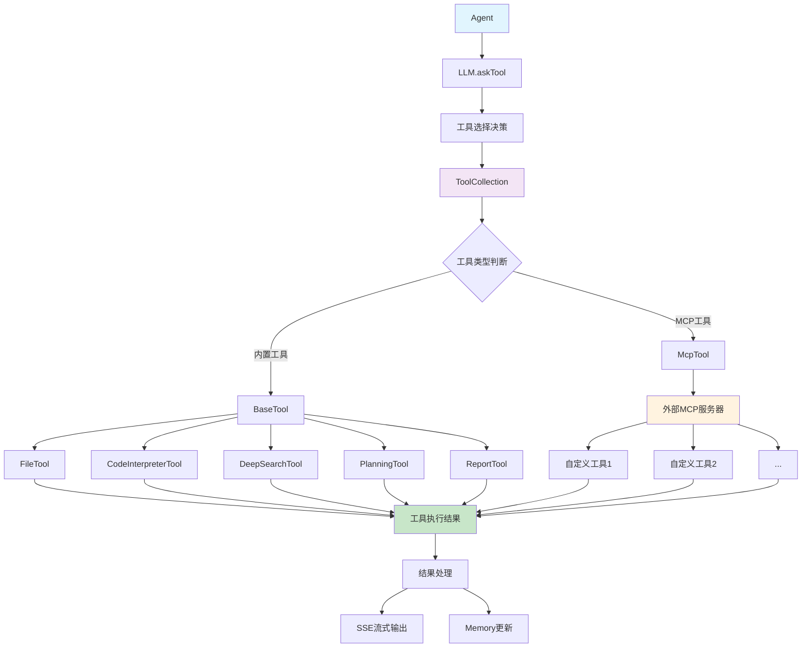
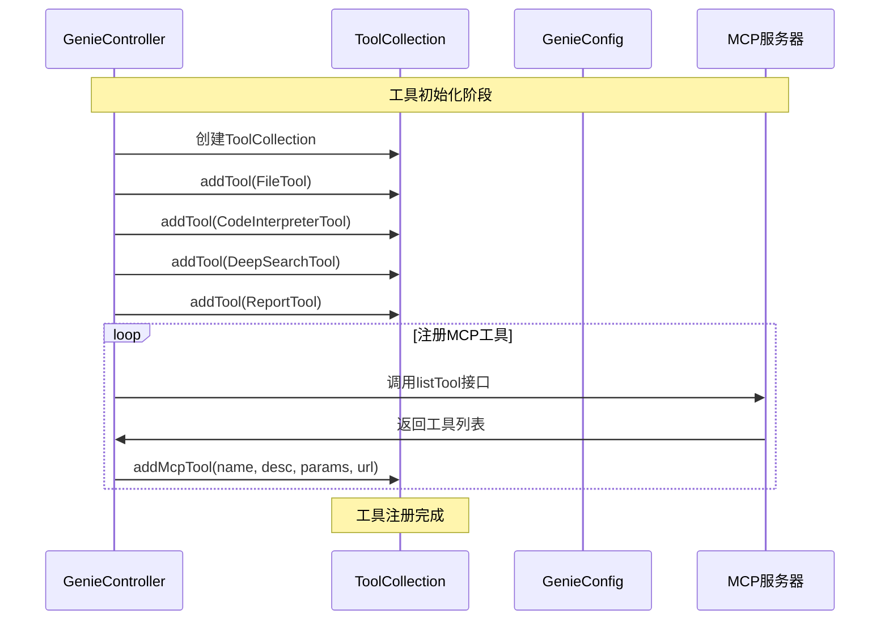
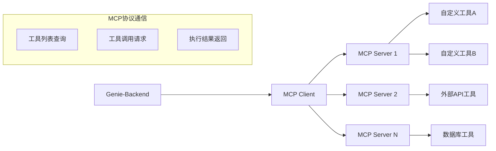
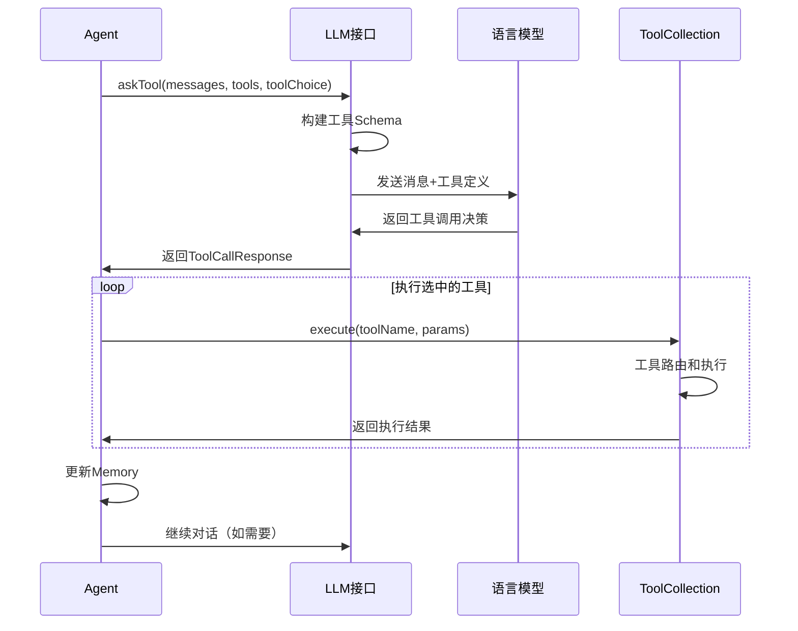
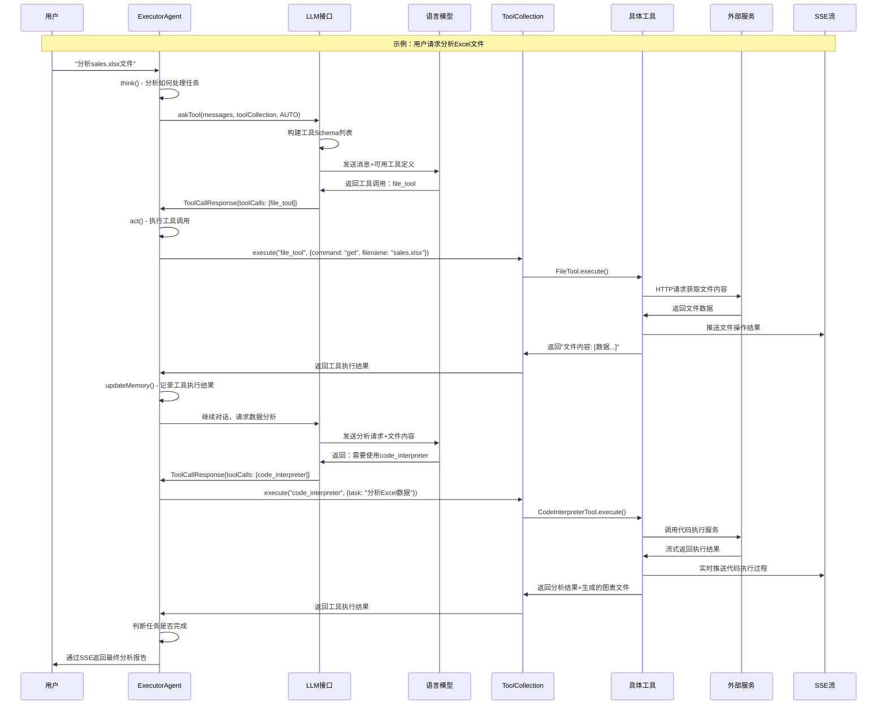

# Genie-Backend 工具调用系统深度分析

## 概述

Genie-Backend 的工具调用系统是整个多智能体架构的核心组件，负责管理、选择和执行各种工具以完成复杂任务。系统采用统一的工具接口设计，支持内置工具和外部MCP（Model Context Protocol）工具的无缝集成。

## 系统架构



## 工具接口设计

### BaseTool 接口规范

所有内置工具都必须实现 `BaseTool` 接口，确保统一的调用规范：

```java
public interface BaseTool {
    String getName();           // 工具名称
    String getDescription();    // 工具描述（供LLM理解工具功能）
    Map<String, Object> toParams(); // 工具参数Schema（JSON Schema格式）
    Object execute(Object input);   // 工具执行逻辑
}
```

**接口设计原则**：
- **getName()**: 返回唯一的工具标识符，用于工具路由
- **getDescription()**: 提供自然语言描述，帮助LLM理解工具用途
- **toParams()**: 定义JSON Schema格式的参数规范，指导LLM正确调用
- **execute()**: 核心执行逻辑，接收参数并返回结果

## 工具集合管理

### ToolCollection 核心功能

`ToolCollection` 是工具管理的中央枢纽，负责：

```java
public class ToolCollection {
    private Map<String, BaseTool> toolMap;      // 内置工具映射
    private Map<String, McpToolInfo> mcpToolMap; // MCP工具映射
    private JSONObject digitalEmployees;        // 数字员工配置
    
    // 统一工具执行入口
    public Object execute(String name, Object toolInput) {
        if (toolMap.containsKey(name)) {
            // 执行内置工具
            BaseTool tool = getTool(name);
            return tool.execute(toolInput);
        } else if (mcpToolMap.containsKey(name)) {
            // 执行MCP工具
            McpToolInfo toolInfo = mcpToolMap.get(name);
            McpTool mcpTool = new McpTool();
            mcpTool.setAgentContext(agentContext);
            return mcpTool.callTool(toolInfo.getMcpServerUrl(), name, toolInput);
        } else {
            log.error("Error: Unknown tool {}", name);
        }
        return null;
    }
}
```

**关键特性**：
1. **统一执行接口**: 通过 `execute()` 方法统一调用所有类型工具
2. **类型自动识别**: 自动判断工具类型并路由到相应处理逻辑
3. **数字员工支持**: 为每个工具分配专业化的数字员工角色

### 工具注册流程



## 核心内置工具详解

### 1. FileTool - 文件操作工具

**功能**: 文件上传、下载和管理

```java
@Override
public Map<String, Object> toParams() {
    Map<String, Object> parameters = new HashMap<>();
    parameters.put("type", "object");
    Map<String, Object> properties = new HashMap<>();
    
    // command参数：操作类型
    Map<String, Object> command = new HashMap<>();
    command.put("type", "string");
    command.put("description", "文件操作类型：upload、get");
    properties.put("command", command);
    
    // filename参数：文件名
    Map<String, Object> fileName = new HashMap<>();
    fileName.put("type", "string");
    fileName.put("description", "文件名");
    properties.put("filename", fileName);
    
    // 其他参数...
    parameters.put("properties", properties);
    parameters.put("required", Arrays.asList("command", "filename"));
    
    return parameters;
}
```

**核心执行逻辑**：
```java
@Override
public Object execute(Object input) {
    Map<String, Object> params = (Map<String, Object>) input;
    String command = (String) params.getOrDefault("command", "");
    FileRequest fileRequest = JSON.parseObject(JSON.toJSONString(input), FileRequest.class);
    
    if ("upload".equals(command)) {
        return uploadFile(fileRequest, true, false);
    } else if ("get".equals(command)) {
        return getFile(fileRequest, true);
    }
    return null;
}
```

**文件上传流程**：
1. 构建HTTP请求调用外部文件服务
2. 处理响应并获取文件URL
3. 更新AgentContext中的文件列表
4. 通过SSE推送文件信息给前端
5. 返回工具执行结果

### 2. CodeInterpreterTool - 代码执行工具

**功能**: 代码编写、执行和结果分析

```java
@Override
public Object execute(Object input) {
    Map<String, Object> params = (Map<String, Object>) input;
    String task = (String) params.get("task");
    
    // 获取上下文中的文件列表
    List<String> fileNames = agentContext.getProductFiles()
        .stream().map(File::getFileName).collect(Collectors.toList());
    
    CodeInterpreterRequest request = CodeInterpreterRequest.builder()
        .requestId(agentContext.getSessionId())
        .query(agentContext.getQuery())
        .task(task)
        .fileNames(fileNames)
        .stream(true)
        .build();
    
    Future future = callCodeAgentStream(request);
    return future.get();
}
```

**流式执行处理**：
```java
client.newCall(request).enqueue(new Callback() {
    @Override
    public void onResponse(Call call, Response response) {
        BufferedReader reader = new BufferedReader(
            new InputStreamReader(responseBody.byteStream()));
        
        while ((line = reader.readLine()) != null) {
            if (line.startsWith("data: ")) {
                String data = line.substring(6);
                if (data.equals("[DONE]")) break;
                
                CodeInterpreterResponse codeResponse = 
                    JSONObject.parseObject(data, CodeInterpreterResponse.class);
                
                // 处理生成的文件
                if (Objects.nonNull(codeResponse.getFileInfo())) {
                    for (CodeInterpreterResponse.FileInfo fileInfo : 
                         codeResponse.getFileInfo()) {
                        // 添加到上下文文件列表
                        agentContext.getProductFiles().add(buildFile(fileInfo));
                    }
                }
                
                // 实时推送执行结果
                agentContext.getPrinter().send("code", codeResponse, digitalEmployee);
            }
        }
    }
});
```

### 3. DeepSearchTool - 深度搜索工具

**功能**: 内外网知识搜索和信息整合

```java
@Override
public Object execute(Object input) {
    Map<String, Object> params = (Map<String, Object>) input;
    String query = (String) params.get("query");
    
    // 构建搜索配置
    Map<String, Object> srcConfig = new HashMap<>();
    Map<String, Object> bingConfig = new HashMap<>();
    bingConfig.put("count", Integer.parseInt(genieConfig.getDeepSearchPageCount()));
    srcConfig.put("bing", bingConfig);
    
    DeepSearchRequest request = DeepSearchRequest.builder()
        .request_id(agentContext.getRequestId() + ":" + StringUtil.generateRandomString(5))
        .query(query)
        .agent_id("1")
        .scene_type("auto_agent")
        .src_configs(srcConfig)
        .stream(true)
        .content_stream(agentContext.getIsStream())
        .build();
    
    Future future = callDeepSearchStream(request);
    return future.get();
}
```

**搜索结果处理**：
```java
while ((line = reader.readLine()) != null) {
    if (line.startsWith("data: ")) {
        DeepSearchrResponse searchResponse = 
            JSONObject.parseObject(data, DeepSearchrResponse.class);
        
        if (searchResponse.getIsFinal()) {
            // 搜索完成，保存结果到文件
            String fileName = StringUtil.removeSpecialChars(
                searchResponse.getQuery() + "的搜索结果.md");
            FileRequest fileRequest = FileRequest.builder()
                .fileName(fileName)
                .description(fileDesc)
                .content(searchResponse.getAnswer())
                .build();
            fileTool.uploadFile(fileRequest, false, false);
        } else {
            // 处理不同类型的中间结果
            if ("extend".equals(searchResponse.getMessageType())) {
                // 扩展搜索
            } else if ("search".equals(searchResponse.getMessageType())) {
                // 基础搜索结果
            } else if ("report".equals(searchResponse.getMessageType())) {
                // 报告生成阶段
            }
        }
    }
}
```

### 4. PlanningTool - 计划管理工具

**功能**: 创建、更新和跟踪任务执行计划

```java
public class PlanningTool implements BaseTool {
    private final Map<String, Function<Map<String, Object>, String>> commandHandlers = new HashMap<>();
    private Plan plan;
    
    public PlanningTool() {
        commandHandlers.put("create", this::createPlan);
        commandHandlers.put("update", this::updatePlan);
        commandHandlers.put("mark_step", this::markStep);
        commandHandlers.put("finish", this::finishPlan);
    }
}
```

**命令处理机制**：
```java
@Override
public Object execute(Object input) {
    Map<String, Object> params = (Map<String, Object>) input;
    String command = (String) params.get("command");
    
    Function<Map<String, Object>, String> handler = commandHandlers.get(command);
    if (handler != null) {
        return handler.apply(params);
    } else {
        throw new IllegalArgumentException("Unknown command: " + command);
    }
}

private String createPlan(Map<String, Object> params) {
    String title = (String) params.get("title");
    List<String> steps = (List<String>) params.get("steps");
    
    plan = Plan.create(title, steps);
    return "我已创建plan";
}
```

## MCP工具系统

### MCP工具架构



### MCP工具注册

```java
// 在GenieController中的buildToolCollection方法
try {
    McpTool mcpTool = new McpTool();
    mcpTool.setAgentContext(agentContext);
    
    for (String mcpServer : genieConfig.getMcpServerUrlArr()) {
        // 调用MCP服务器获取工具列表
        String listToolResult = mcpTool.listTool(mcpServer);
        
        JSONObject resp = JSON.parseObject(listToolResult);
        if (resp.getIntValue("code") != 200) continue;
        
        JSONArray data = resp.getJSONArray("data");
        for (int i = 0; i < data.size(); i++) {
            JSONObject tool = data.getJSONObject(i);
            String method = tool.getString("name");
            String description = tool.getString("description");
            String inputSchema = tool.getString("inputSchema");
            
            // 注册MCP工具
            toolCollection.addMcpTool(method, description, inputSchema, mcpServer);
        }
    }
} catch (Exception e) {
    log.error("{} add mcp tool failed", agentContext.getRequestId(), e);
}
```

### MCP工具调用

```java
public String callTool(String mcpServerUrl, String toolName, Object input) {
    GenieConfig genieConfig = SpringContextHolder.getApplicationContext().getBean(GenieConfig.class);
    String mcpClientUrl = genieConfig.getMcpClientUrl() + "/v1/tool/call";
    
    Map<String, Object> params = (Map<String, Object>) input;
    McpToolRequest mcpToolRequest = McpToolRequest.builder()
        .name(toolName)
        .server_url(mcpServerUrl)
        .arguments(params)
        .build();
    
    String response = OkHttpUtil.postJson(mcpClientUrl, 
        JSON.toJSONString(mcpToolRequest), null, 30L);
    
    return response;
}
```

## 工具选择机制

### LLM工具选择流程



### 工具Schema生成

```java
// 在LLM.askTool方法中
private List<Map<String, Object>> buildToolSchemas(ToolCollection tools) {
    List<Map<String, Object>> toolSchemas = new ArrayList<>();
    
    // 处理内置工具
    for (BaseTool tool : tools.getToolMap().values()) {
        Map<String, Object> toolSchema = new HashMap<>();
        toolSchema.put("type", "function");
        
        Map<String, Object> function = new HashMap<>();
        function.put("name", tool.getName());
        function.put("description", tool.getDescription());
        function.put("parameters", tool.toParams());
        
        toolSchema.put("function", function);
        toolSchemas.add(toolSchema);
    }
    
    // 处理MCP工具
    for (McpToolInfo mcpTool : tools.getMcpToolMap().values()) {
        Map<String, Object> toolSchema = new HashMap<>();
        toolSchema.put("type", "function");
        
        Map<String, Object> function = new HashMap<>();
        function.put("name", mcpTool.getName());
        function.put("description", mcpTool.getDesc());
        function.put("parameters", JSON.parseObject(mcpTool.getParameters(), Map.class));
        
        toolSchema.put("function", function);
        toolSchemas.add(toolSchema);
    }
    
    return toolSchemas;
}
```

### 工具选择策略

**ToolChoice 选项**：
- **AUTO**: 让模型自动决定是否使用工具以及使用哪个工具
- **NONE**: 强制模型不使用任何工具
- **REQUIRED**: 强制模型必须使用工具
- **特定工具名**: 强制模型使用指定工具

```java
public enum ToolChoice {
    AUTO("auto"),
    NONE("none"), 
    REQUIRED("required");
    
    private final String value;
}
```

## 完整工具调用流程

### 详细调用时序图



### 核心代码流程分析

#### 1. Agent层面的工具调用

```java
// ExecutorAgent.think() 方法
@Override
public boolean think() {
    // 构建消息上下文
    if (!getMemory().getLastMessage().getRole().equals(RoleType.USER)) {
        Message userMsg = Message.userMessage(getNextStepPrompt(), null);
        getMemory().addMessage(userMsg);
    }
    
    // 调用LLM进行思考和工具选择
    CompletableFuture<LLM.ToolCallResponse> future = getLlm().askTool(
        context,
        getMemory().getMessages(),
        Message.systemMessage(getSystemPrompt(), null),
        availableTools,
        ToolChoice.AUTO,
        null,
        context.getIsStream(),
        maxTokens
    );
    
    LLM.ToolCallResponse response = future.get();
    setToolCalls(response.getToolCalls());
    
    // 记录LLM响应
    Message assistantMsg = response.getToolCalls() != null && !response.getToolCalls().isEmpty() ?
        Message.fromToolCalls(response.getContent(), response.getToolCalls()) :
        Message.assistantMessage(response.getContent(), null);
    
    getMemory().addMessage(assistantMsg);
    return true;
}
```

#### 2. Agent层面的工具执行

```java
// ExecutorAgent.act() 方法
@Override
public String act() {
    List<String> results = new ArrayList<>();
    
    // 执行所有选中的工具
    for (ToolCall toolCall : toolCalls) {
        String result = executeTool(toolCall);
        if (maxObserve != null) {
            result = result.substring(0, Math.min(result.length(), maxObserve));
        }
        results.add(result);
        
        // 添加工具响应到记忆
        if ("struct_parse".equals(llm.getFunctionCallType())) {
            String content = getMemory().getLastMessage().getContent();
            getMemory().getLastMessage().setContent(content + "\n 工具执行结果为:\n" + result);
        } else {
            Message toolMsg = Message.toolMessage(result, toolCall.getId(), null);
            getMemory().addMessage(toolMsg);
        }
    }
    
    return String.join("\n\n", results);
}
```

#### 3. BaseAgent层面的工具执行

```java
// BaseAgent.executeTool() 方法
public String executeTool(ToolCall command) {
    if (command == null || command.getFunction() == null) {
        return "Error: Invalid function call format";
    }
    
    String name = command.getFunction().getName();
    try {
        // 解析参数
        ObjectMapper mapper = new ObjectMapper();
        Object args = mapper.readValue(command.getFunction().getArguments(), Object.class);
        
        // 执行工具
        Object result = availableTools.execute(name, args);
        log.info("{} execute tool: {} {} result {}", 
            context.getRequestId(), name, args, result);
        
        if (Objects.nonNull(result)) {
            return (String) result;
        }
    } catch (Exception e) {
        log.error("{} execute tool {} failed ", context.getRequestId(), name, e);
    }
    return "Tool " + name + " Error.";
}
```

#### 4. 并发工具执行

```java
// BaseAgent.executeTools() 方法 - 支持并发执行多个工具
public Map<String, String> executeTools(List<ToolCall> commands) {
    Map<String, String> result = new ConcurrentHashMap<>();
    CountDownLatch taskCount = ThreadUtil.getCountDownLatch(commands.size());
    
    for (ToolCall toolCall : commands) {
        ThreadUtil.execute(() -> {
            String toolResult = executeTool(toolCall);
            result.put(toolCall.getId(), toolResult);
            taskCount.countDown();
        });
    }
    
    ThreadUtil.await(taskCount);
    return result;
}
```

## 数字员工系统

### 数字员工概念

数字员工是Genie系统的创新特性，为每个工具分配专业化的人格角色，提升用户体验：

```java
// ToolCollection中的数字员工管理
public String getDigitalEmployee(String toolName) {
    if (StringUtils.isEmpty(toolName) || digitalEmployees == null) {
        return null;
    }
    return (String) digitalEmployees.get(toolName);
}

// 在工具执行时使用数字员工
String digitalEmployee = agentContext.getToolCollection().getDigitalEmployee(getName());
agentContext.getPrinter().send("file", resultMap, digitalEmployee);
```

### 数字员工生成流程

```java
// ReActAgent.generateDigitalEmployee() 方法
public void generateDigitalEmployee(String task) {
    if (StringUtils.isEmpty(task)) return;
    
    try {
        // 构建系统提示
        String formattedPrompt = formatSystemPrompt(task);
        Message userMessage = Message.userMessage(formattedPrompt, null);
        
        // 调用LLM生成数字员工配置
        CompletableFuture<String> summaryFuture = getLlm().ask(
            context,
            Collections.singletonList(userMessage),
            Collections.emptyList(),
            false,
            0.01);
        
        String llmResponse = summaryFuture.get();
        JSONObject jsonObject = parseDigitalEmployee(llmResponse);
        
        if (jsonObject != null) {
            context.getToolCollection().updateDigitalEmployee(jsonObject);
            context.getToolCollection().setCurrentTask(task);
            availableTools = context.getToolCollection();
        }
    } catch (Exception e) {
        log.error("requestId: {} in generateDigitalEmployee failed,", context.getRequestId(), e);
    }
}
```

## 错误处理和监控

### 工具执行错误处理

```java
// 在各个工具的execute方法中都有统一的错误处理模式
@Override
public Object execute(Object input) {
    try {
        // 具体工具逻辑
        return executeToolLogic(input);
    } catch (Exception e) {
        log.error("{} {} tool error", agentContext.getRequestId(), getName(), e);
        return null; // 或返回错误信息
    }
}
```

### 工具调用监控

```java
// 在BaseAgent.executeTool中的监控日志
log.info("{} execute tool: {} {} result {}", 
    context.getRequestId(), name, args, result);
```

### 超时控制

```java
// HTTP客户端超时配置
OkHttpClient client = new OkHttpClient.Builder()
    .connectTimeout(60, TimeUnit.SECONDS)
    .readTimeout(300, TimeUnit.SECONDS)
    .writeTimeout(300, TimeUnit.SECONDS)
    .callTimeout(300, TimeUnit.SECONDS)
    .build();
```

## 系统特性总结

### 1. 统一接口设计
- 所有工具实现相同的BaseTool接口
- 统一的参数Schema定义
- 一致的错误处理机制

### 2. 灵活的工具扩展
- 内置工具与MCP工具无缝集成
- 动态工具注册和发现
- 可插拔的工具架构

### 3. 智能工具选择
- LLM基于上下文智能选择工具
- 支持多种工具选择策略
- 并发工具执行能力

### 4. 实时流式处理
- SSE实时推送工具执行结果
- 流式处理长时间运行的工具
- 心跳机制保持连接稳定

### 5. 上下文状态管理
- 工具执行结果自动更新到AgentContext
- 文件和数据在工具间共享
- Memory系统记录完整对话历史

### 6. 数字员工体验
- 为每个工具分配专业角色
- 个性化的交互体验
- 动态生成角色配置

这个工具调用系统的设计体现了现代AI系统的核心特征：**模块化、可扩展、智能化**，为构建复杂的AI应用提供了强大的基础架构。 