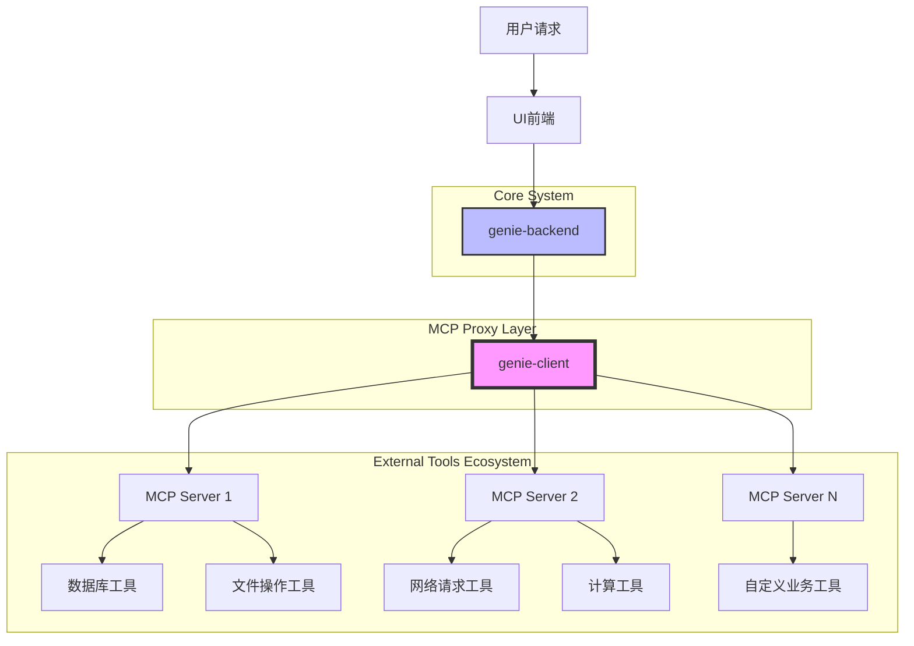
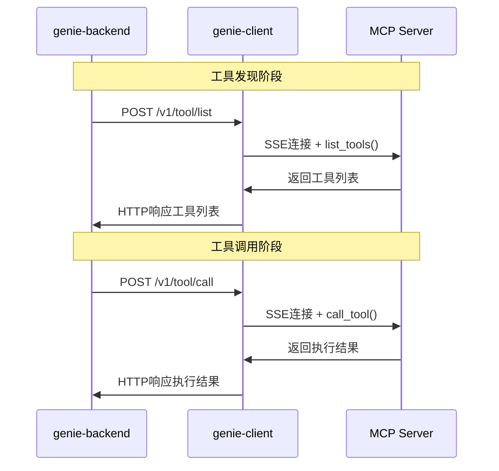
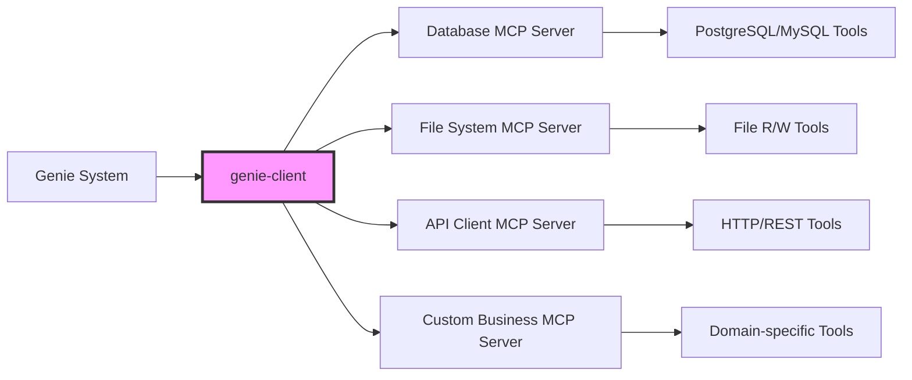
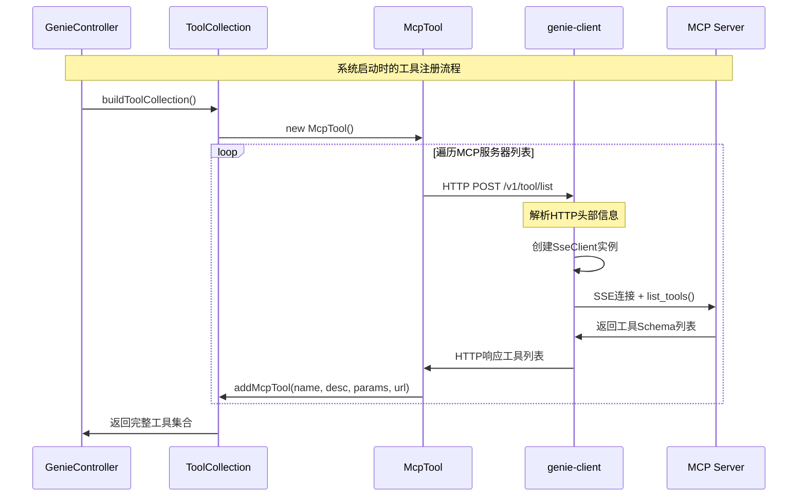
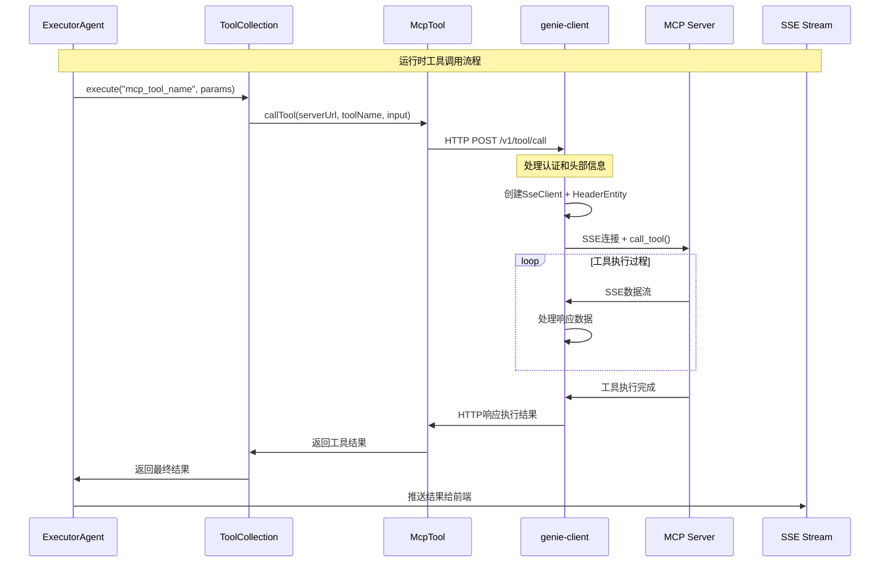

# Genie-Client 在整个项目中的作用分析

## 概述

Genie-Client 是 Genie 项目架构中的关键中间件组件，充当 **MCP（Model Context Protocol）客户端代理**的角色。它位于 genie-backend 和外部 MCP 服务器之间，提供统一的 HTTP API 接口，使得 genie-backend 能够无缝地与各种支持 MCP 协议的外部工具服务器进行通信。

## 系统架构定位



## 核心功能模块

### 1. FastAPI Web 服务层

**文件**: `server.py`

genie-client 基于 FastAPI 框架构建了一个轻量级的 Web 服务，提供标准化的 HTTP API 接口：

```python
app = FastAPI(
    title="Genie MCP Client API",
    version="0.1.0", 
    description="A lightweight web service for Model Context Protocol (MCP) server communication"
)
```

**核心 API 接口**：

#### `/health` - 健康检查
```python
@app.get("/health")
async def health_check():
    return {
        "status": "healthy",
        "timestamp": datetime.now().isoformat(),
        "version": "0.1.0"
    }
```

#### `/v1/serv/pong` - 服务器连通性测试
```python
@app.post("/v1/serv/pong")
async def ping_server(server_url: str = Body(...)):
    mcp_client = SseClient(server_url=server_url, entity=HeaderEntity(request.headers))
    await mcp_client.ping_server()
    return {"code": 200, "message": "success", "data": {}}
```

#### `/v1/tool/list` - 获取工具列表
```python
@app.post("/v1/tool/list")
async def list_tools(server_url: str = Body(...)):
    mcp_client = SseClient(server_url=server_url, entity=HeaderEntity(request.headers))
    tools = await mcp_client.list_tools()
    return {"code": 200, "message": "success", "data": tools}
```

#### `/v1/tool/call` - 执行工具调用
```python
@app.post("/v1/tool/call")
async def call_tool(
    server_url: str = Body(...),
    name: str = Body(...),
    arguments: dict = Body(...)
):
    mcp_client = SseClient(server_url=server_url, entity=entity)
    result = await mcp_client.call_tool(name, arguments)
    return {"code": 200, "message": "success", "data": result}
```

### 2. MCP 协议通信层

**文件**: `app/client.py`

`SseClient` 类是核心的 MCP 协议通信组件，负责与外部 MCP 服务器的实际通信：

```python
class SseClient:
    """SSE (Server-Sent Events) 客户端类
    
    用于与支持 SSE 协议的服务器建立连接，执行工具调用等操作。
    支持自定义头部、超时设置、认证等功能。
    """
    
    DEFAULT_TIMEOUT = 5  # 默认连接超时时间（秒）
    DEFAULT_SSE_READ_TIMEOUT = 300  # 默认SSE读取超时时间（秒，5分钟）
```

**核心通信机制**：

#### SSE 连接管理
```python
@asynccontextmanager
async def _sse_connection(self):
    """SSE 连接上下文管理器
    
    确保连接资源的正确创建和清理，处理认证错误等异常情况。
    """
    try:
        # 创建SSE客户端连接
        self._streams_context = sse_client(
            url=self.server_url,
            headers=self.headers,
            timeout=self.timeout,
            sse_read_timeout=self.sse_read_timeout
        )
        
        streams = await self._streams_context.__aenter__()
        self._session_context = ClientSession(*streams)
        session = await self._session_context.__aenter__()
        
        # 初始化会话，可能触发认证验证
        await session.initialize()
        yield session
        
    except Exception as e:
        # 异常处理逻辑
        if self._is_authentication_error(e):
            raise Exception("认证失败 - 无效的凭据") from e
        elif self._is_network_error(e):
            raise Exception(f"网络连接失败: {str(e)}") from e
    finally:
        await self._cleanup_connection()
```

#### 工具调用实现
```python
async def call_tool(self, name: str, arguments: Optional[Dict[str, Any]] = None) -> Any:
    """调用指定的工具
    
    Args:
        name: 工具名称
        arguments: 工具参数字典
        
    Returns:
        Any: 工具执行结果
    """
    async with self._sse_connection() as session:
        logger.info(f"正在调用工具 '{name}'，参数: {arguments}")
        response = await session.call_tool(name=name, arguments=arguments)
        logger.info(f"工具 '{name}' 执行成功")
        return response
```

### 3. HTTP 头部管理层

**文件**: `app/header.py`

`HeaderEntity` 类负责处理复杂的 HTTP 头部信息，支持认证、超时配置和自定义头部：

```python
class HeaderEntity:
    """HTTP头部实体类，用于管理和处理HTTP请求头信息
    
    主要功能：
    - 解析和存储Cookie信息
    - 管理超时配置  
    - 处理自定义服务器密钥头部
    """
    
    HEADER_COOKIE = "Cookie"
    HEADER_TIMEOUT = "Timeout"
    HEADER_SERVER_KEYS = "X-Server-Keys"
```

**关键功能**：

#### Cookie 管理
```python
def _extract_cookies(self, headers: Headers) -> None:
    """从headers中提取Cookie信息"""
    cookie_value = headers.get(self.HEADER_COOKIE)
    if cookie_value:
        self.cookies = cookie_value

def append_cookie(self, cookie: str) -> None:
    """追加Cookie字符串"""
    if self.cookies is None:
        self.cookies = cookie
    else:
        self.cookies += f"; {cookie}"
```

#### 超时配置
```python
def _set_timeout_config(self, headers: Headers) -> None:
    """设置超时配置"""
    timeout_header = headers.get(self.HEADER_TIMEOUT)
    if timeout_header is not None:
        self.timeout = int(timeout_header)
        timeout_minutes = min(self.timeout, self.MAX_TIMEOUT_MINUTES)
        self.sse_read_timeout = self.TIMEOUT_MULTIPLIER * timeout_minutes
```

#### 服务器密钥处理
```python
def _process_server_keys(self, headers: Headers) -> None:
    """提取指定的服务器密钥
    
    格式: "key1,key2,key3", 会提取headers中对应key1、key2、key3的值
    """
    server_keys_header = headers.get(self.HEADER_SERVER_KEYS)
    if server_keys_header is not None:
        key_list = [key.strip() for key in server_keys_header.split(",")]
        for key in key_list:
            if key:
                key_value = headers.get(key)
                if key_value is not None:
                    self.headers[key] = key_value
```

### 4. 日志管理系统

**文件**: `app/logger.py`

提供统一的日志配置功能，支持控制台输出和文件轮转：

```python
def setup_logger(name: Optional[str] = None) -> logging.Logger:
    """设置并返回配置好的日志器"""
    config = LogConfig()
    logger = logging.getLogger(name or config.name)
    
    # 添加控制台和文件处理器
    _add_console_handler(logger, formatter)
    _add_file_handlers(logger, formatter, config)
    
    return logger
```

## 在整个项目中的作用

### 1. 架构解耦

genie-client 实现了核心业务逻辑与外部工具系统的解耦：



**优势**：
- **协议抽象**: 将复杂的 MCP/SSE 协议封装为简单的 HTTP API
- **连接管理**: 统一管理 SSE 连接的生命周期和资源清理
- **错误处理**: 提供统一的错误处理和重试机制

### 2. 工具生态桥梁

genie-client 是连接 Genie 系统与广泛 MCP 工具生态的桥梁：



### 3. 统一认证和配置

genie-client 提供统一的认证和配置管理：

```python
# genie-backend 调用示例
for (String mcpServer : genieConfig.getMcpServerUrlArr()) {
    String listToolResult = mcpTool.listTool(mcpServer);
    // genie-client 自动处理：
    // - HTTP头部转发
    // - Cookie认证
    // - 超时配置
    // - 错误重试
}
```

### 4. 性能优化和资源管理

#### 连接池管理
```python
# 自动连接生命周期管理
async with self._sse_connection() as session:
    # 连接复用和资源清理
    result = await session.call_tool(name, arguments)
    # 自动清理资源
```

#### 超时和错误控制
```python
# 智能超时配置
def _set_timeout_config(self, headers: Headers) -> None:
    timeout_minutes = min(self.timeout, self.MAX_TIMEOUT_MINUTES)
    self.sse_read_timeout = self.TIMEOUT_MULTIPLIER * timeout_minutes

# 网络错误检测和处理
@staticmethod
def _is_network_error(exception: Exception) -> bool:
    network_error_types = (
        httpx.ConnectError,
        httpx.TimeoutException, 
        httpx.NetworkError,
        ConnectionError,
        OSError
    )
    return isinstance(exception, network_error_types)
```

## 完整调用流程分析

### 工具发现流程



### 工具调用流程



## 部署和配置

### 启动配置

**文件**: `start.sh`
```bash
#!/bin/bash
uv run server.py
```

### 项目依赖

**文件**: `pyproject.toml`
```toml
[project]
name = "genie-client"
version = "0.1.0"
description = "FastAPI-based web service client for Model Context Protocol (MCP) servers"
requires-python = ">=3.10,<=3.13"
dependencies = [
    "fastapi>=0.115.12",
    "mcp==1.9.4",
]
```

### 环境变量配置

```bash
# 日志配置
LOGGER_NAME=genie-client
LOG_LEVEL=INFO
LOG_DIR=Logs
RUNTIME_LOG_FILENAME=runtime.log
ERROR_LOG_FILENAME=error.log

# 连接配置
DEFAULT_TIMEOUT=5
DEFAULT_SSE_READ_TIMEOUT=300
```

## 优势和价值

### 1. **技术解耦**
- 将复杂的 MCP 协议封装为简单的 HTTP API
- 使 genie-backend 无需关心底层通信细节
- 支持协议升级和版本兼容

### 2. **生态扩展**
- 支持任意 MCP 兼容的工具服务器
- 统一的工具注册和调用机制
- 社区工具生态的无缝集成

### 3. **运维友好**
- 独立部署和扩展
- 完善的日志和监控
- 健康检查和错误恢复

### 4. **性能优化**
- 连接复用和资源管理
- 智能超时和重试机制
- 异步并发处理

### 5. **安全可控**
- 统一的认证管理
- 头部信息过滤和转发
- 请求参数验证和清理

## 总结

genie-client 在整个 Genie 项目中扮演着 **"工具生态连接器"** 的关键角色。它不仅仅是一个简单的代理服务，而是一个功能完备的中间件系统，具备以下核心价值：

1. **架构解耦**: 分离核心业务逻辑与外部工具通信
2. **协议桥接**: 将复杂的 MCP/SSE 协议转换为简单的 HTTP API
3. **生态扩展**: 连接丰富的 MCP 工具生态系统
4. **运维保障**: 提供完善的监控、日志和错误处理
5. **性能优化**: 实现连接管理、资源复用和并发控制

通过 genie-client，Genie 系统实现了与外部工具的松耦合集成，为构建强大而灵活的 AI 应用平台奠定了坚实的基础。这种设计使得系统既能充分利用现有的工具生态，又能保持核心架构的简洁和稳定。 