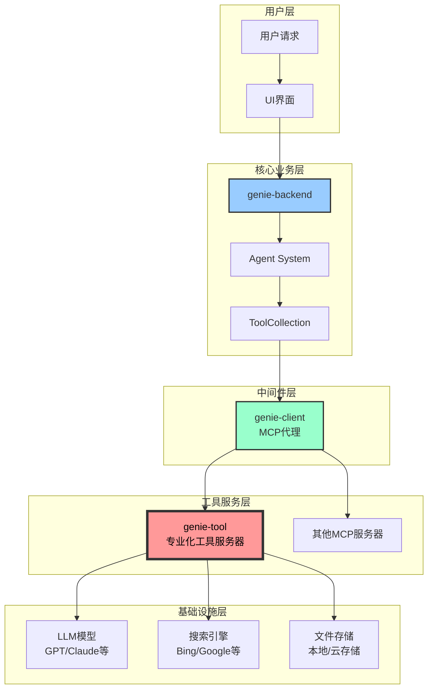
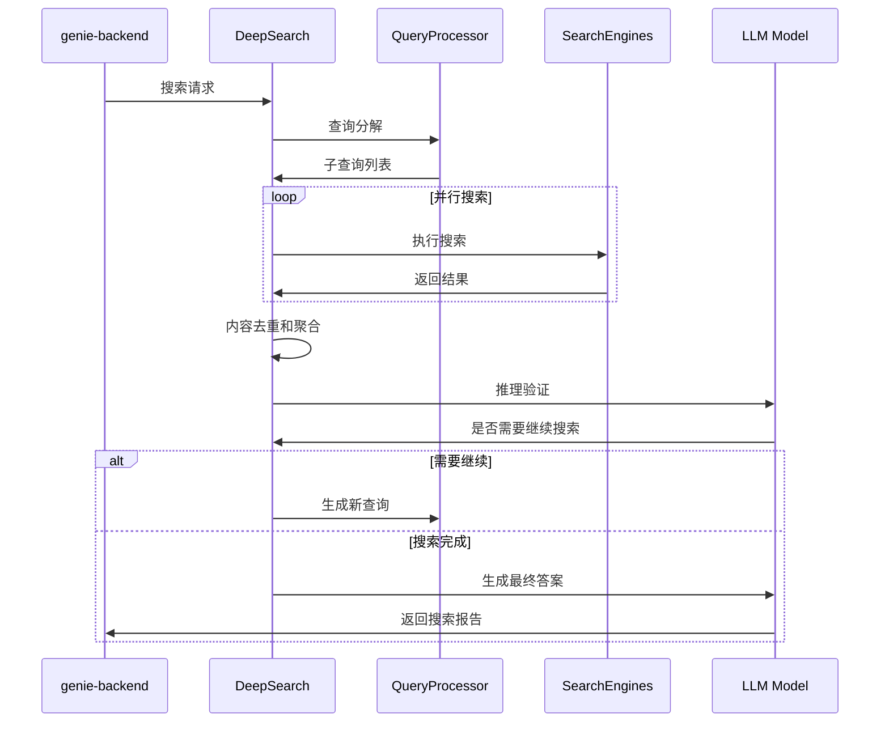
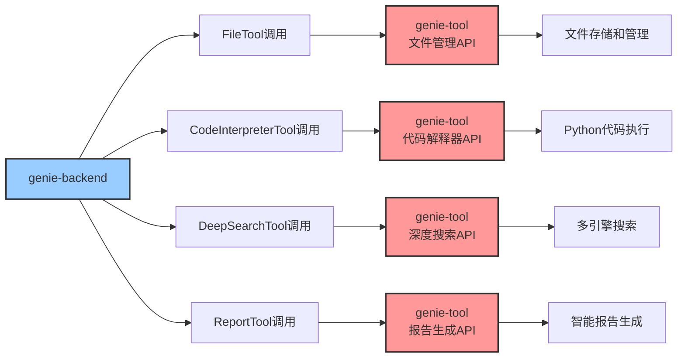
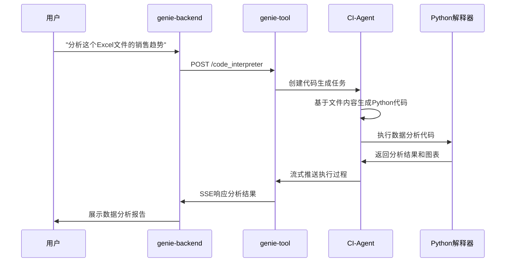
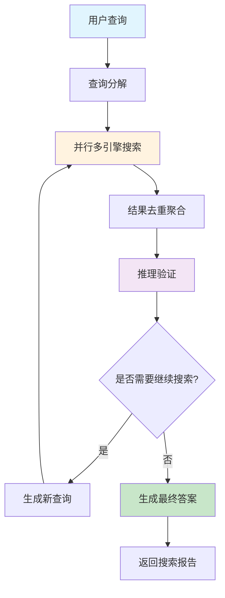
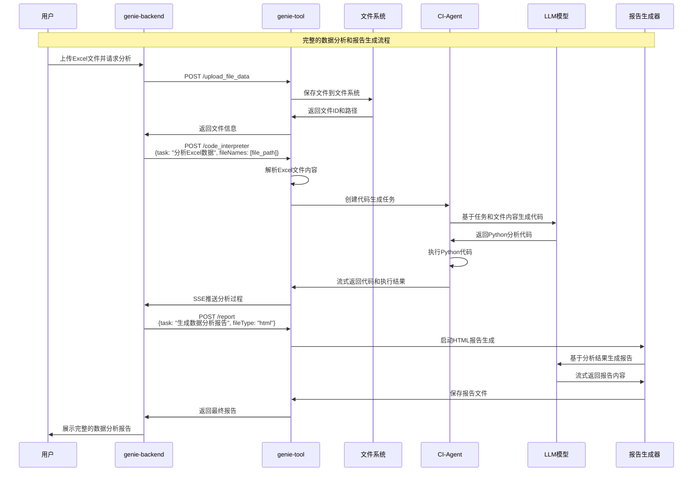

# Genie-Tool 在整个项目中的作用分析

## 概述

Genie-Tool 是 Genie 项目架构中的**专业化工具服务器**，负责提供高级AI能力和复杂计算任务。它作为独立的工具微服务，为 genie-backend 提供代码执行、深度搜索、报告生成等核心功能，是整个系统中最重要的外部工具服务之一。

## 系统架构定位



## 核心功能模块

### 1. 代码解释器服务 (Code Interpreter)

**API接口**: `POST /v1/tool/code_interpreter`

**核心功能**:
- **智能代码生成**: 基于自然语言描述生成Python代码
- **安全代码执行**: 在沙箱环境中执行代码
- **文件处理能力**: 支持Excel、CSV、TXT等多种格式
- **结果可视化**: 自动生成图表和分析结果

**技术实现**:
```python
@router.post("/code_interpreter")
async def post_code_interpreter(body: CIRequest):
    # 处理文件路径
    if body.file_names:
        for idx, f_name in enumerate(body.file_names):
            if not f_name.startswith("/") and not f_name.startswith("http"):
                body.file_names[idx] = f"{os.getenv('FILE_SERVER_URL')}/preview/{body.request_id}/{f_name}"

    async def _stream():
        async for chunk in code_interpreter_agent(
            task=body.task,
            file_names=body.file_names,
            request_id=body.request_id,
            stream=True,
        ):
            if isinstance(chunk, CodeOuput):
                yield ServerSentEvent(data=json.dumps({
                    "requestId": body.request_id,
                    "code": chunk.code,
                    "fileInfo": chunk.file_list,
                    "isFinal": False,
                }, ensure_ascii=False))
```

**核心特性**:
- **基于 smolagents 框架**: 使用先进的AI Agent架构
- **流式代码执行**: 实时展示代码生成和执行过程
- **文件智能解析**: 自动识别和处理不同类型的数据文件
- **安全性保障**: 受限的import和执行环境

### 2. 深度搜索服务 (Deep Search)

**API接口**: `POST /v1/tool/deepsearch`

**核心功能**:
- **多引擎搜索**: 集成Bing、Google、Sogou等搜索引擎
- **智能查询分解**: 将复杂查询分解为多个子查询
- **内容去重和聚合**: 智能去重和内容整合
- **推理验证**: 判断搜索结果是否足够回答问题

**技术架构**:
```python
class DeepSearch:
    """深度搜索工具"""
    
    def __init__(self, engines: List[str] = []):
        if not engines:
            engines = os.getenv("USE_SEARCH_ENGINE", "bing").split(",")
        use_bing = "bing" in engines
        use_jina = "jina" in engines
        use_sogou = "sogou" in engines
        use_serp = "serp" in engines
        self._search_single_query = partial(
            MixSearch().search_and_dedup, 
            use_bing=use_bing, use_jina=use_jina, 
            use_sogou=use_sogou, use_serp=use_serp
        )
```

**搜索流程**:


### 3. 报告生成服务 (Report Generation)

**API接口**: `POST /v1/tool/report`

**核心功能**:
- **多格式支持**: Markdown、HTML、PPT三种格式
- **智能内容整合**: 自动整合文件和搜索结果
- **模板化生成**: 基于Jinja2模板引擎
- **流式输出**: 实时生成和推送内容

**报告类型实现**:
```python
async def report(
    task: str,
    file_names: Optional[List[str]] = tuple(),
    model: str = "gpt-4.1",
    file_type: Literal["markdown", "html", "ppt"] = "markdown",
) -> AsyncGenerator:
    report_factory = {
        "ppt": ppt_report,
        "markdown": markdown_report,
        "html": html_report,
    }
    model = os.getenv("REPORT_MODEL", "gpt-4.1")
    async for chunk in report_factory[file_type](task, file_names, model):
        yield chunk
```

**HTML报告生成特色**:
```python
async def html_report(task, file_names, model="gpt-4.1"):
    files = await download_all_files(file_names)
    key_files = []  # 核心文件（如代码输出结果）
    flat_files = []  # 普通文件
    
    for f in files:
        fname = os.path.basename(f["file_name"])
        if "代码输出" in fname:
            key_files.append({
                "content": f["content"], 
                "description": fname, 
                "type": "txt", 
                "link": f["file_name"]
            })
```

### 4. 文件管理服务 (File Management)

**核心API接口**:
- `POST /upload_file` - 文件内容上传
- `POST /upload_file_data` - 文件数据上传  
- `GET /preview/{file_id}/{file_name}` - 文件预览
- `GET /download/{file_id}/{file_name}` - 文件下载
- `POST /get_file_list` - 文件列表查询

**文件存储架构**:
```python
class _FileDB(object):
    def __init__(self):
        self._work_dir = os.getenv("FILE_SAVE_PATH", "file_db_dir")
        if not os.path.exists(self._work_dir):
            os.makedirs(self._work_dir)

    async def save(self, file_name, content, scope) -> str:
        save_path = os.path.join(self._work_dir, scope)
        if not os.path.exists(save_path):
            os.makedirs(save_path)
        with open(f"{save_path}/{file_name}", "w") as f:
            f.write(content)
        return f"{save_path}/{file_name}"
```

**数据库设计**:
```python
class FileInfo(SQLModel, table=True):
    file_id: str = Field(primary_key=True)
    filename: str
    file_path: str
    description: Optional[str] = None
    file_size: int
    status: int = 1
    request_id: str
    created_at: datetime = Field(default_factory=datetime.now)
```

## 技术架构特点

### 1. 基于FastAPI的现代Web架构

```python
def create_app() -> FastAPI:
    _app = FastAPI(on_startup=[log_setting, print_logo])
    register_middleware(_app)
    register_router(_app)
    return _app

def register_middleware(app: FastAPI):
    app.add_middleware(UnknownException)
    app.add_middleware(CORSMiddleware, allow_origins=["*"])
    app.add_middleware(HTTPProcessTimeMiddleware)
```

### 2. 流式处理能力

所有核心工具都支持SSE流式输出：
```python
return EventSourceResponse(
    _stream(),
    ping_message_factory=lambda: ServerSentEvent(data="heartbeat"),
    ping=15,
)
```

### 3. 多模型支持

基于 LiteLLM 支持多种AI模型：
```python
from litellm import acompletion

async def ask_llm(
    messages: str | List[Any],
    model: str,
    temperature: float = None,
    top_p: float = None,
    stream: bool = False,
    **kwargs,
):
    response = await acompletion(
        messages=messages,
        model=model,
        temperature=temperature,
        top_p=top_p,
        stream=stream,
        **kwargs
    )
```

### 4. 智能代理架构

代码解释器基于高级Agent框架：
```python
class CIAgent(CodeAgent):
    def __init__(self, tools, model, prompt_templates=None, **kwargs):
        self.output_dir = output_dir
        super().__init__(
            tools=tools,
            model=model,
            prompt_templates=prompt_templates,
            additional_authorized_imports=["pandas", "openpyxl", "numpy", "matplotlib", "seaborn"],
            **kwargs,
        )
```

## 在整个项目中的作用

### 1. 核心工具服务提供者

genie-tool 为整个 Genie 系统提供最核心的AI工具能力：



### 2. 数据处理和分析中心

**Excel/CSV数据分析流程**:


### 3. 智能搜索和知识整合

**多轮深度搜索流程**:


### 4. 多格式内容生成

**报告生成矩阵**:

| 输入类型 | 处理方式 | 输出格式 | 应用场景 |
|---------|----------|----------|----------|
| 数据文件 | 代码分析 + 报告生成 | HTML/Markdown | 数据分析报告 |
| 搜索结果 | 内容整合 + 智能总结 | HTML/PPT | 研究报告 |
| 混合内容 | 分类处理 + 模板生成 | 多种格式 | 综合报告 |

## 完整工作流程

### 典型任务处理流程

以"分析Excel文件并生成可视化报告"为例：



## 部署和扩展

### 1. 独立部署架构

```bash
#!/usr/bin/env bash
# 激活虚拟环境
. .venv/bin/activate
# 运行Python服务器
python server.py
```

### 2. 配置灵活性

通过环境变量进行配置：
```python
# 模型配置
CODE_INTEPRETER_MODEL=gpt-4.1
REPORT_MODEL=gpt-4.1
SEARCH_REASONING_MODEL=gpt-3.5-turbo

# 搜索引擎配置
USE_SEARCH_ENGINE=bing,google,sogou

# 文件存储配置
FILE_SAVE_PATH=file_db_dir
FILE_SERVER_URL=http://localhost:1601

# 搜索配置
SEARCH_THREAD_NUM=5
SINGLE_PAGE_MAX_SIZE=200
```

### 3. 依赖管理

```toml
[project]
name = "python"
version = "0.1.0" 
description = "Genie Tools"
dependencies = [
    "fastapi>=0.115.14",
    "litellm>=1.74.0.post1",  # 多模型支持
    "smolagents>=1.19.0",     # AI Agent框架
    "pandas>=2.3.0",          # 数据处理
    "matplotlib>=3.10.3",     # 可视化
    "beautifulsoup4>=4.13.4", # 网页解析
    "aiosqlite>=0.21.0",      # 异步数据库
]
```

## 核心价值和优势

### 1. **专业化AI能力**
- **代码生成和执行**: 基于自然语言生成专业的数据分析代码
- **智能搜索**: 多引擎并行搜索，智能去重和内容整合
- **内容生成**: 多格式报告生成，支持复杂的模板和样式

### 2. **高性能架构**
- **流式处理**: 所有工具都支持实时流式输出
- **并发处理**: 多线程搜索，异步文件操作
- **缓存优化**: 智能文件缓存和内容去重

### 3. **安全性保障**
- **沙箱执行**: 受限的Python执行环境
- **文件隔离**: 按请求ID隔离的文件存储
- **敏感词过滤**: 内置敏感内容检测和替换

### 4. **扩展性设计**
- **模块化架构**: 每个工具都是独立的模块
- **插件式搜索引擎**: 支持多种搜索引擎的灵活配置
- **模板化报告**: 基于Jinja2的灵活模板系统

### 5. **运维友好**
- **完善的日志**: 详细的执行日志和性能监控
- **健康检查**: 内置的服务健康检查机制
- **错误处理**: 完善的错误捕获和恢复机制

## 在Genie生态中的重要地位

genie-tool 在整个 Genie 项目中占据着**"AI能力核心"**的重要地位：

1. **技术密集度最高**: 集成了代码执行、搜索、LLM调用等最复杂的技术栈
2. **功能复杂度最高**: 提供从数据处理到内容生成的端到端AI能力
3. **计算资源消耗最大**: 承担了大部分的AI模型调用和计算任务
4. **扩展潜力最大**: 可以持续添加新的AI工具和能力

## 总结

genie-tool 作为 Genie 项目的**"AI大脑"**，不仅提供了核心的AI工具能力，更重要的是它展示了如何将先进的AI技术（如Agent框架、多模型调用、流式处理）整合到实际的业务应用中。

它的存在使得：
- **genie-backend** 可以专注于业务逻辑和流程编排
- **用户** 能够获得专业级的数据分析和内容生成能力  
- **整个系统** 具备了强大的AI处理能力和无限的扩展潜力

通过 genie-tool，Genie 项目实现了从简单的对话系统到专业AI工作平台的重要跃升，为用户提供了真正实用的AI助手体验。 