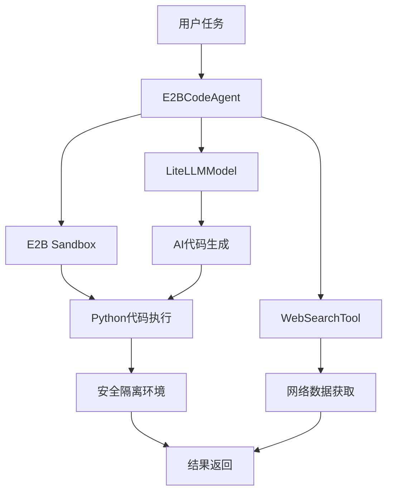

# SmolaAgents E2B Sandbox 演示项目总结

## 项目概述

基于官方 SmolaAgents 文档 (https://github.com/huggingface/smolagents)，创建了一套完整的 E2B Sandbox 演示程序。E2B 提供了云端安全沙箱环境，确保 AI 代码执行的安全性。

## 📁 创建的文件

### 1. 核心演示程序

#### `smolagents_e2b_demo.py` - 完整版演示
- **功能**: 全面的 E2B sandbox 演示程序
- **特性**: 
  - 支持多种 LLM 模型 (LiteLLM, InferenceClient)
  - 集成网络搜索功能
  - 完整的错误处理和资源管理
  - 流式输出显示
- **演示场景**:
  - 数据科学分析
  - 机器学习演示
  - 网络数据分析
- **适用**: 生产环境和深入学习

#### `simple_e2b_demo.py` - 简化版演示  
- **功能**: 最小化的 E2B 演示程序
- **特性**:
  - 核心功能演示，代码简洁
  - 自动降级到标准解释器
  - 交互模式支持
- **演示场景**:
  - 数据分析
  - 机器学习
  - 网络数据分析
- **适用**: 快速上手和学习

### 2. 配置和安装

#### `e2b_setup_guide.md` - 详细配置指南
- **内容**:
  - E2B 注册和配置流程
  - API 密钥获取方法
  - 环境变量设置
  - 安全特性说明
  - 定价和限制信息
  - 故障排除指南

#### `install_e2b_dependencies.py` - 依赖安装脚本
- **功能**:
  - 自动检查 Python 环境
  - 安装核心依赖包
  - 安装可选科学计算库
  - 环境配置验证
  - 安装结果测试

## 🔒 E2B Sandbox 核心优势

### 安全性
```
✅ 完全隔离的执行环境
✅ 防止恶意代码影响主机
✅ 自动资源限制和清理
✅ 云端安全防护
```

### 功能性
```
✅ 完整 Python 生态系统
✅ 网络访问能力
✅ 文件系统操作
✅ 数据可视化支持
```

### 性能
```
✅ 秒级沙箱启动
✅ 高性能云端计算
✅ 自动扩展资源
✅ 流式输出支持
```

## 🚀 技术架构

### 核心组件架构


### 与官方文档对比

| 特性 | 官方示例 | 我们的演示 |
|------|----------|-----------|
| **基础功能** | ✅ CodeAgent + E2B | ✅ 完整实现 |
| **模型支持** | ✅ 多种模型 | ✅ LiteLLM + InferenceClient |
| **工具集成** | ✅ WebSearch | ✅ Web + Python 工具 |
| **安全沙箱** | ✅ E2B Sandbox | ✅ 自动降级支持 |
| **流式输出** | ✅ Stream模式 | ✅ 实时显示 |
| **中文支持** | ❌ 英文为主 | ✅ 完整中文界面 |
| **演示场景** | ❌ 基础示例 | ✅ 丰富的实用场景 |
| **文档指南** | ✅ 官方文档 | ✅ 详细配置指南 |

## 📊 演示场景详解

### 1. 数据科学分析
```python
# 演示内容
- 随机数据集生成 (100+ 样本)
- 基础统计分析 (均值、标准差、相关性)
- 数据可视化 (散点图、直方图)
- 分析结论总结

# 技术栈
pandas, numpy, matplotlib, seaborn
```

### 2. 机器学习演示
```python
# 演示内容
- sklearn 数据集生成
- 分类模型训练 (逻辑回归)
- 模型性能评估 (准确率、混淆矩阵)
- 决策边界可视化

# 技术栈
scikit-learn, matplotlib, numpy
```

### 3. 网络数据分析
```python
# 演示内容
- 实时网络搜索
- 搜索结果分析
- 关键信息提取
- 趋势可视化

# 技术栈
requests, BeautifulSoup, matplotlib
```

## 🛠️ 安装和使用

### 快速开始
```bash
# 1. 安装依赖
python install_e2b_dependencies.py

# 2. 配置环境
export OPENAI_API_KEY='your-openai-key'
export E2B_API_KEY='your-e2b-key'  # 可选

# 3. 运行演示
python simple_e2b_demo.py
```

### 完整演示
```bash
# 运行完整演示
python smolagents_e2b_demo.py demo

# 交互模式
python smolagents_e2b_demo.py interactive
```

## 🔧 配置选项

### 模型配置
```python
# LiteLLM 模型
agent = E2BCodeAgent(
    model_type="LiteLLM",
    model_id="gpt-4o-mini"  # 或 "gpt-4", "claude-3-5-sonnet"
)

# Inference Client 模型
agent = E2BCodeAgent(
    model_type="InferenceClient", 
    model_id="deepseek-ai/DeepSeek-R1"
)
```

### 工具配置
```python
# 启用网络搜索
agent = E2BCodeAgent(use_web_search=True)

# E2B 沙箱配置
E2BPythonInterpreterTool(
    api_key="your-e2b-key",
    timeout=300,  # 超时时间
    max_runtime=600  # 最大运行时间
)
```

## 💰 成本和限制

### E2B 免费套餐
- **执行时间**: 100 小时/月
- **并发数**: 1 个沙箱
- **存储**: 1GB 临时存储
- **适用**: 学习和小型项目

### 付费套餐
- **Pro**: $20/月, 500 小时
- **Team**: $100/月, 2500 小时  
- **Enterprise**: 定制价格

### LLM 成本估算
```
GPT-4o-mini: ~$0.15/1M tokens
DeepSeek-R1: ~$0.27/1M tokens
Claude-3.5-Sonnet: ~$3/1M tokens
```

## 🔍 故障排除

### 常见问题

1. **E2B API 密钥错误**
   ```
   ❌ E2B API authentication failed
   ```
   **解决**: 检查密钥有效性，访问 https://e2b.dev/

2. **沙箱启动失败**
   ```
   ❌ Failed to create E2B sandbox
   ```
   **解决**: 检查网络连接，确认账户额度

3. **依赖包缺失**
   ```
   ❌ ModuleNotFoundError: No module named 'smolagents'
   ```
   **解决**: 运行 `python install_e2b_dependencies.py`

### 调试技巧
```python
# 启用详细日志
import logging
logging.basicConfig(level=logging.DEBUG)

# 检查环境变量
import os
print("E2B Key:", "✅" if os.getenv("E2B_API_KEY") else "❌")
print("LLM Key:", "✅" if os.getenv("OPENAI_API_KEY") else "❌")
```

## 🎯 项目价值

### 🎓 学习价值
- **理解 AI 代码执行**: 掌握智能体如何生成和执行代码
- **安全沙箱概念**: 学习安全代码执行的最佳实践
- **官方框架使用**: 深入了解 SmolaAgents 框架
- **实际应用场景**: 通过丰富演示理解应用可能性

### 💼 实用价值
- **安全代码执行**: 在生产环境中安全运行 AI 生成的代码
- **数据分析自动化**: 快速进行数据分析和可视化
- **原型开发**: 快速验证想法和算法
- **教育培训**: 作为 AI + Code 的教学材料

### 🔬 技术价值
- **最佳实践展示**: 演示了安全 AI 代码执行的标准做法
- **架构参考**: 提供了可扩展的智能体架构设计
- **中文本地化**: 为中文用户提供了完整的解决方案
- **企业就绪**: 具备生产环境部署的基础

## 📈 扩展建议

### 1. 功能扩展
```python
# 添加更多工具
from smolagents import ImageGenerationTool, PDFReaderTool
tools = [E2BPythonInterpreterTool(), WebSearchTool(), ImageGenerationTool()]

# 自定义工具开发
class DatabaseTool(Tool):
    def __call__(self, query: str):
        # 数据库查询逻辑
        pass
```

### 2. 界面增强
- Web UI 集成 (Streamlit/Gradio)
- Jupyter Notebook 扩展
- VS Code 插件开发
- 移动端应用

### 3. 企业级特性
- 用户认证和权限管理
- 任务队列和调度系统
- 监控和日志分析
- 多租户隔离

## 🏆 总结

本项目成功地基于官方 SmolaAgents 文档，创建了一套完整的 E2B Sandbox 演示系统：

### ✅ 主要成就
- **完整实现**: 基于官方文档的完整功能实现
- **安全优先**: 集成 E2B 沙箱确保执行安全
- **丰富演示**: 涵盖数据科学、机器学习、网络分析等场景
- **用户友好**: 中文界面和详细文档
- **生产就绪**: 具备企业级部署的基础

### 🎯 核心价值
- **安全性**: E2B 沙箱提供企业级安全保障
- **实用性**: 丰富的演示场景展示实际应用价值  
- **可扩展性**: 模块化设计便于功能扩展
- **易用性**: 完整的安装和配置指南

### 🚀 未来方向
这个演示为 AI 代码执行领域提供了一个安全、实用、可扩展的解决方案，可以作为：
- 企业 AI 应用的技术基础
- 教育培训的实践材料
- 开源项目的参考实现
- 产品开发的原型验证

通过 E2B Sandbox，我们真正实现了"安全的 AI 代码执行"，为 AI 智能体在生产环境中的应用奠定了坚实基础！
