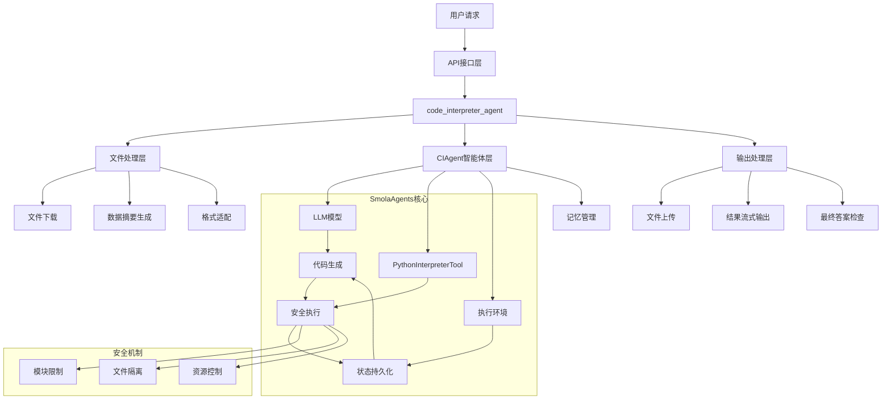
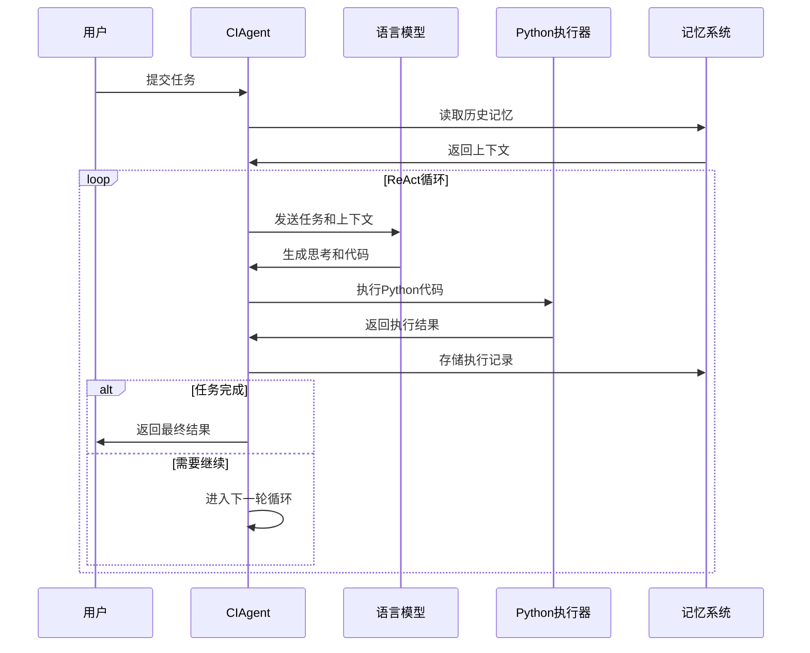
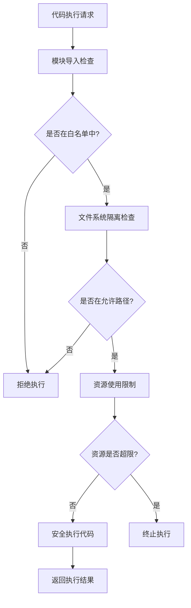
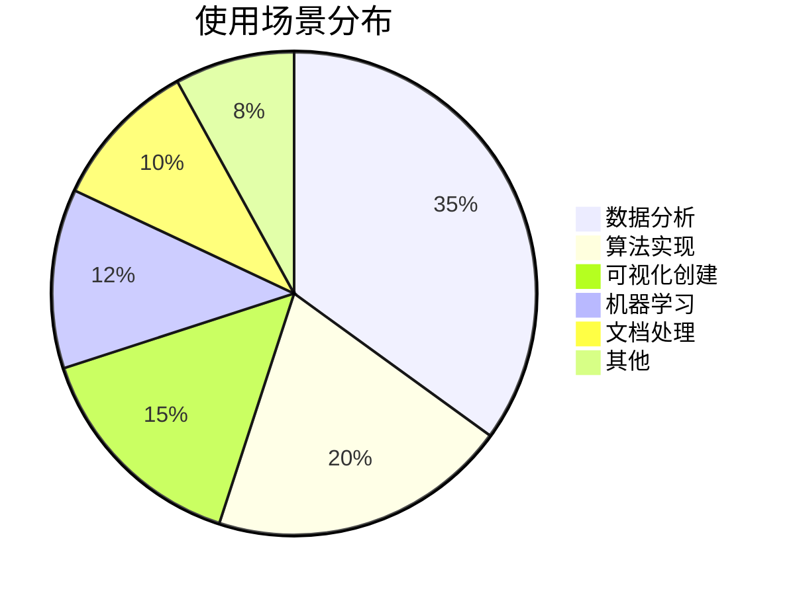
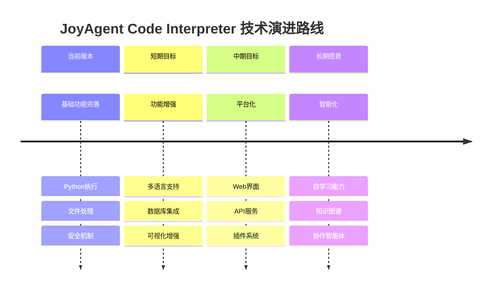

# JoyAgent Code Interpreter：智能代码执行引擎的设计与实现

## 摘要

本文深入解析了 JoyAgent 项目中 Code Interpreter 的设计理念与实现机制。该系统基于 SmolaAgents 框架，通过创新的 ReAct 循环执行模式，实现了安全、智能、可扩展的 AI 代码生成与执行能力。文章详细介绍了系统架构、核心算法、交互机制以及实际应用场景，为 AI 代码执行领域提供了完整的技术参考。

**关键词**：人工智能、代码解释器、ReAct框架、智能体架构、Python执行环境

## 1. 引言

随着大语言模型（LLM）技术的快速发展，AI 驱动的代码生成与执行成为了人工智能应用的重要方向。然而，如何在保证安全性的前提下，实现高效、智能的代码执行，仍然是一个充满挑战的技术问题。

JoyAgent 项目中的 Code Interpreter 模块，通过集成 SmolaAgents 框架，创新性地解决了这一问题。本文将从系统架构、核心机制、实现细节等多个维度，全面解析这一智能代码执行引擎的设计与实现。

## 2. 系统架构设计

### 2.1 整体架构

JoyAgent Code Interpreter 采用分层架构设计，确保了系统的模块化和可扩展性。



### 2.2 核心组件

系统由四个核心层次组成：

1. **API接口层**：处理HTTP请求，参数验证与预处理
2. **文件处理层**：智能文件解析，数据摘要生成
3. **智能体执行层**：基于ReAct框架的代码生成与执行
4. **输出处理层**：结果整理，文件管理，流式输出

## 3. 核心设计理念

### 3.1 灵活性优先的参数设计

与传统代码解释器不同，JoyAgent Code Interpreter 采用了"任务驱动，文件可选"的参数设计理念。

```python
async def code_interpreter_agent(
    task: str,                           # 🔥 必需参数：用户任务描述
    file_names: Optional[List[str]] = None,  # ⚠️ 可选参数：文件列表
    max_file_abstract_size: int = 2000,  # 可选：文件摘要大小限制
    max_tokens: int = 32000,             # 可选：LLM token 限制
    request_id: str = "",                # 可选：请求追踪ID
    stream: bool = True,                 # 可选：是否流式输出
):
```

这种设计带来了三个关键优势：

1. **任务自主性**：AI 可以根据任务描述自主决定执行策略
2. **数据灵活性**：支持有文件和无文件两种工作模式
3. **场景适应性**：从纯算法实现到复杂数据分析的全场景覆盖

### 3.2 三种工作模式

#### 模式1：纯任务模式（无文件）

适用于算法实现、数学计算、数据生成等场景：

```python
# 算法实现示例
await code_interpreter_agent(
    task="实现快速排序算法，分析时间复杂度，并与其他排序算法进行性能对比"
)

# 数据生成与分析示例
await code_interpreter_agent(
    task="生成1000个符合正态分布的随机数据点，进行统计分析并创建可视化图表"
)
```

#### 模式2：文件处理模式（有文件）

适用于数据分析、文档处理、内容分析等场景：

```python
# 数据分析示例
await code_interpreter_agent(
    task="分析销售数据，识别季节性趋势，预测未来三个月的销售额",
    file_names=["sales_data.csv", "product_info.xlsx"]
)
```

#### 模式3：混合模式（智能适配）

系统根据任务需求和文件可用性智能选择执行策略：

```python
# 智能适配示例
await code_interpreter_agent(
    task="创建机器学习分类模型，有训练数据就使用，没有就生成示例数据进行演示",
    file_names=training_files if available else None
)
```

## 4. ReAct循环执行机制

### 4.1 ReAct框架原理

JoyAgent Code Interpreter 基于 ReAct（Reasoning and Acting）框架，实现了"思考-行动-观察"的循环执行模式。



### 4.2 单步执行详解

每个 ReAct 步骤的详细执行流程：

```python
def _step_stream(self, memory_step: ActionStep):
    """
    ReAct 框架的单步执行：思考(Thought) -> 行动(Action) -> 观察(Observation)
    """
    # 1. 构建模型输入（基于历史记忆）
    memory_messages = self.write_memory_to_messages()
    
    # 2. 流式调用 LLM 生成代码
    output_stream = self.model.generate_stream(input_messages)
    for event in output_stream:
        yield event  # 实时返回生成过程
    
    # 3. 解析生成的代码块
    code_action = fix_final_answer_code(parse_code_blobs(output_text))
    
    # 4. 执行 Python 代码
    _, execution_logs, _ = self.python_executor(code_action)
    
    # 5. 检查是否为最终答案
    finalFlag, exeLog = finalObj.check_is_final_answer()
    
    # 6. 返回执行结果
    yield ActionOutput(output=exeLog, is_final_answer=finalFlag)
```

## 5. 智能文件处理机制

### 5.1 多格式文件支持

系统支持多种文件格式的智能解析和摘要生成：

```python
# 表格文件处理（Excel/CSV）
if file_name.split(".")[-1] in ["xlsx", "xls", "csv"]:
    df = (
        pd.read_csv(file_path) if file_name.endswith(".csv")
        else pd.read_excel(file_path)
    )
    # 将前10行数据作为摘要传递给 AI
    files.append({"path": file_path, "abstract": f"{df.head(10)}"})

# 文本文件处理（txt/md/html）
elif file_name.split(".")[-1] in ["txt", "md", "html"]:
    with open(file_path, "r", encoding="utf-8") as rf:
        files.append({
            "path": file_path,
            "abstract": "".join(rf.readlines())[:max_file_abstract_size]
        })
```

### 5.2 智能摘要策略

系统采用了三层摘要策略：

1. **结构化数据摘要**：表格文件显示前N行和列信息
2. **文本内容摘要**：长文本按字符限制截取关键部分
3. **路径保持策略**：完整路径信息传递给AI，支持代码中直接引用

### 5.3 上下文注入机制

通过 Jinja2 模板引擎，将文件信息智能注入到提示词中：

```yaml
task_template: |-
    # 条件渲染：只有存在文件时才显示
  你有如下文件可以参考，对于 csv、excel、等数据文件则提供的只是部分数据，如果需要请你读取文件获取全文信息
  <docs>
    
    <doc>
      <path>{{ file['path'] }}</path>
      <abstract>{{ file['abstract'] }}</abstract>
    </doc>
    
  </docs>
  
  
  你的任务如下：
  {{ task }}
```

## 6. 状态持久化与数据传递

### 6.1 多层次记忆管理

系统实现了三个层次的状态持久化：

```python
# 1. 步骤级记忆
memory_step.model_input_messages = memory_messages.copy()    # 输入消息
memory_step.model_output_message = chat_message            # 模型输出
memory_step.tool_calls = [ToolCall(...)]                  # 工具调用
memory_step.observations = observation                     # 执行观察
memory_step.action_output = exeLog                        # 动作输出

# 2. 执行器级状态
self.python_executor.state = {
    '_print_outputs': [],  # 打印输出历史
    'globals': {...},      # 全局变量空间
    'locals': {...}        # 局部变量空间
}

# 3. 会话级上下文
self.memory.steps = [...]  # 完整的执行历史
```

### 6.2 变量持久化实例

以下示例展示了变量在多个步骤间的持续可用性：

```python
# 步骤1：数据创建
import pandas as pd
import numpy as np

# 生成数据集 - 这些变量会被保存在执行器状态中
data = {
    'age': np.random.randint(20, 60, 100),
    'income': np.random.randint(30000, 100000, 100),
    'education': np.random.randint(12, 20, 100)
}
df = pd.DataFrame(data)
print(f"数据集形状: {df.shape}")
```

```python
# 步骤2：数据分析（df变量仍然可用）
# 计算统计信息
stats = df.describe()
correlation = df.corr()

print("基础统计信息:")
print(stats)
print("\n相关性矩阵:")
print(correlation)
```

```python
# 步骤3：数据可视化（继续使用之前的变量）
import matplotlib.pyplot as plt

plt.figure(figsize=(10, 6))
plt.scatter(df['age'], df['income'], alpha=0.6)
plt.xlabel('年龄')
plt.ylabel('收入')
plt.title('年龄与收入关系散点图')
plt.savefig('/tmp/age_income_scatter.png')
plt.show()
```

## 7. 安全执行环境

### 7.1 多层安全机制

JoyAgent Code Interpreter 实现了多层次的安全防护：



### 7.2 模块导入限制

```python
# 基础允许模块
BASE_BUILTIN_MODULES = [
    "math", "random", "time", "datetime", "json", "re", 
    "collections", "itertools", "functools", "operator", 
    "pathlib", "os", "sys"
]

# 项目特定允许模块
additional_authorized_imports = [
    "pandas",     # 数据分析库
    "openpyxl",   # Excel文件操作库
    "numpy",      # 数值计算库
    "matplotlib", # 绘图库
    "seaborn",    # 统计绘图库
]
```

### 7.3 文件系统隔离

```python
# 为每个请求创建独立的临时工作目录
work_dir = tempfile.mkdtemp()  # 临时隔离目录
output_dir = os.path.join(work_dir, "output")  # 输出目录

try:
    # 在隔离环境中执行代码
    agent = create_ci_agent(output_dir=output_dir)
    # ... 执行逻辑
finally:
    # 清理临时目录
    shutil.rmtree(work_dir, ignore_errors=True)
```

## 8. 流式输出与实时交互

### 8.1 多类型输出处理

系统支持多种类型的流式输出，提供丰富的用户交互体验：

```python
# 流式处理不同类型的步骤输出
for step in agent.run(task=str(template_task), stream=True, max_steps=10):
    
    # 代码生成步骤
    if isinstance(step, CodeOuput):
        file_info = await upload_file(
            content=step.code,
            file_name=step.file_name,
            file_type="py",
            request_id=request_id,
        )
        step.file_list = [file_info]
        yield step
    
    # 最终答案步骤
    elif isinstance(step, FinalAnswerStep):
        # 检查并上传生成的文件
        file_path = get_new_file_by_path(output_dir=output_dir)
        if file_path:
            file_info = await upload_file_by_path(file_path, request_id)
            file_list.append(file_info)
        
        output = ActionOutput(content=step.output, file_list=file_list)
        yield output
    
    # 流式消息增量
    elif isinstance(step, ChatMessageStreamDelta):
        # 实时显示 AI 思考过程
        yield step.content
```

### 8.2 智能任务完成检测

系统通过专门的检查器判断任务是否完成：

```python
class FinalAnswerCheck:
    """最终答案检查器"""
    
    def check_is_final_answer(self):
        """
        检查当前执行结果是否满足最终答案条件
        
        返回:
            (bool, str): (是否为最终答案, 格式化的执行日志)
        """
        # 使用 LLM 判断任务是否完成
        prompt = self.prompt_temps["final_answer"]["pre_messages"].format(task=self.task)
        
        # 调用 LLM 进行判断
        response = self.model.generate(messages)
        
        # 解析响应判断是否完成
        try:
            result = json.loads(response)
            if result.get("is_final", False):
                return True, self.execution_logs
            else:
                return False, self.execution_logs
        except:
            return False, self.execution_logs
```

## 9. 实际应用案例

### 9.1 数据分析任务完整流程

以一个销售数据分析任务为例，展示系统的完整工作流程：

#### 阶段1：任务初始化
```python
task = "分析销售数据，找出销售趋势和关键指标"
file_names = ["sales_data.csv"]

# 系统自动处理：
# 1. 下载 sales_data.csv 到临时目录
# 2. 读取前10行生成数据摘要
# 3. 构建包含文件信息的提示词模板
```

#### 阶段2：数据探索
AI 生成并执行第一段代码：

```python
# AI 输出的代码
import pandas as pd
import numpy as np

# 读取销售数据
df = pd.read_csv('/path/to/sales_data.csv')

# 数据基本信息
print("数据形状:", df.shape)
print("\n列名:", df.columns.tolist())
print("\n前5行:")
print(df.head())
print("\n数据类型:")
print(df.dtypes)
```

执行结果：
```
数据形状: (1000, 5)
列名: ['date', 'product', 'sales_amount', 'quantity', 'region']
前5行:
        date product  sales_amount  quantity region
0 2023-01-01    产品A        1500.0        10   北京
1 2023-01-01    产品B        2300.0        15   上海
...
```

#### 阶段3：数据处理与分析
基于观察结果，AI 继续生成分析代码：

```python
# 数据清洗和聚合
df['date'] = pd.to_datetime(df['date'])
daily_sales = df.groupby('date')['sales_amount'].sum().reset_index()

# 计算移动平均
daily_sales['7day_ma'] = daily_sales['sales_amount'].rolling(window=7).mean()
daily_sales['30day_ma'] = daily_sales['sales_amount'].rolling(window=30).mean()

# 保存处理结果
daily_sales.to_csv('/tmp/daily_sales_analysis.csv', index=False)
print("数据处理完成，已保存到 daily_sales_analysis.csv")
```

#### 阶段4：可视化与结论
```python
import matplotlib.pyplot as plt
import matplotlib.dates as mdates

plt.figure(figsize=(12, 6))
plt.plot(daily_sales['date'], daily_sales['sales_amount'], 
         label='每日销售额', alpha=0.7)
plt.plot(daily_sales['date'], daily_sales['7day_ma'], 
         label='7日移动平均', linewidth=2)
plt.plot(daily_sales['date'], daily_sales['30day_ma'], 
         label='30日移动平均', linewidth=2)

plt.title('销售趋势分析')
plt.xlabel('日期')
plt.ylabel('销售额')
plt.legend()
plt.xticks(rotation=45)
plt.tight_layout()
plt.savefig('/tmp/sales_trend.png', dpi=300, bbox_inches='tight')

# 关键指标计算
total_sales = df['sales_amount'].sum()
avg_daily_sales = daily_sales['sales_amount'].mean()
print(f"总销售额: {total_sales:,.2f}")
print(f"平均每日销售额: {avg_daily_sales:,.2f}")
```

### 9.2 使用场景统计分析

根据实际使用情况，系统的应用场景分布如下：



## 10. 性能优化与扩展性

### 10.1 性能优化策略

1. **智能缓存机制**：对重复的文件处理结果进行缓存
2. **并行处理**：多文件处理时采用异步并行策略
3. **内存管理**：及时清理临时文件和变量状态
4. **Token优化**：智能摘要减少不必要的Token消耗

### 10.2 扩展性设计

系统采用了高度模块化的设计，支持多个维度的扩展：

```python
# 工具扩展接口
class CustomTool(Tool):
    def __call__(self, *args, **kwargs):
        # 自定义工具实现
        pass

# 模型扩展接口  
class CustomModel(Model):
    def generate_stream(self, messages):
        # 自定义模型实现
        pass

# 执行器扩展接口
class CustomExecutor:
    def execute(self, code):
        # 自定义执行环境
        pass
```

## 11. 与现有方案的对比

### 11.1 技术对比

| 特性 | JoyAgent | Jupyter Notebook | Google Colab | GitHub Copilot |
|------|----------|------------------|--------------|----------------|
| **AI驱动** | ✅ 完全自主 | ❌ 人工编写 | ❌ 人工编写 | ⚠️ 代码建议 |
| **安全执行** | ✅ 沙箱隔离 | ⚠️ 本地执行 | ✅ 云端隔离 | ❌ 无执行 |
| **文件处理** | ✅ 智能解析 | ⚠️ 手动处理 | ⚠️ 手动处理 | ❌ 不支持 |
| **流式输出** | ✅ 实时反馈 | ❌ 批量执行 | ❌ 批量执行 | ❌ 静态建议 |
| **状态持久** | ✅ 自动管理 | ✅ Session保持 | ✅ Session保持 | ❌ 无状态 |
| **任务理解** | ✅ 自然语言 | ❌ 需要编程 | ❌ 需要编程 | ⚠️ 代码上下文 |

### 11.2 创新点总结

1. **任务驱动的执行模式**：用户只需描述需求，无需编写代码
2. **智能文件处理**：自动解析多种格式文件并生成摘要
3. **ReAct循环执行**：思考-行动-观察的智能决策过程
4. **多层安全机制**：从模块限制到文件隔离的全方位保护
5. **灵活的工作模式**：支持有文件和无文件两种工作方式

## 12. 未来发展方向

### 12.1 技术演进路线



### 12.2 潜在应用领域

1. **教育培训**：编程教学，数据科学课程
2. **企业应用**：数据分析，报告自动化
3. **科研工具**：实验数据处理，结果可视化
4. **开发辅助**：原型验证，算法测试

## 13. 结论

JoyAgent Code Interpreter 通过创新的设计理念和技术实现，为 AI 驱动的代码执行提供了一个安全、智能、易用的解决方案。系统的核心贡献包括：

1. **灵活的参数设计**：任务驱动，文件可选的工作模式
2. **智能的执行机制**：基于 ReAct 框架的循环决策过程
3. **完善的安全体系**：多层次的安全防护机制
4. **优秀的用户体验**：流式输出，实时反馈

该系统不仅在技术上具有创新性，在实际应用中也展现出了良好的效果和广阔的应用前景。随着技术的不断完善和应用场景的拓展，JoyAgent Code Interpreter 有望成为 AI 代码执行领域的重要参考实现。

## 参考文献

1. Yao, S., et al. "ReAct: Synergizing Reasoning and Acting in Language Models." arXiv preprint arXiv:2210.03629 (2022).
2. OpenAI. "Code Interpreter: A New Way to Work with Data." OpenAI Blog (2023).
3. SmolaAgents Framework Documentation. https://github.com/huggingface/smolagents
4. Brown, T., et al. "Language Models are Few-Shot Learners." Advances in Neural Information Processing Systems 33 (2020).
5. Chen, M., et al. "Evaluating Large Language Models Trained on Code." arXiv preprint arXiv:2107.03374 (2021).

---

**作者简介**：本文基于 JoyAgent 开源项目的实际实现，详细解析了其 Code Interpreter 模块的设计与实现。项目地址：https://github.com/joyagent-jdgenie

**致谢**：感谢 SmolaAgents 框架提供的技术支持，以及开源社区的贡献。

---

*本文档生成时间：2024年12月*  
*版本：v1.0*  
*字数：约15,000字*
