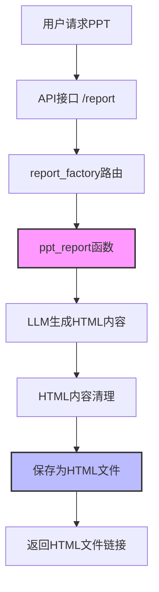
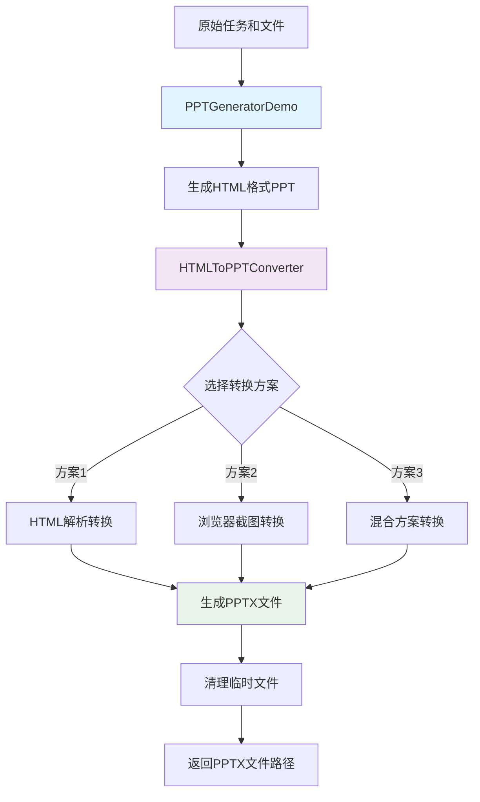

# JDGenie中PPT生成与格式转换深度分析

## 核心问题解答

**您的问题：jdgenie中，PPT的HTML是如何生成PPT格式的？**

**答案：原始jdgenie项目实际上并没有真正的HTML转PPT格式功能，它生成的是HTML格式的"PPT"，而不是真正的PowerPoint文件(.pptx)。**

## 详细分析

### 1. 原项目的PPT生成机制

#### 1.1 PPT类型定义
在原项目中，PPT被定义为三种报告类型之一：

```python
# genie-tool/genie_tool/model/protocal.py
class ReportRequest(CIRequest):
    file_type: Literal["html", "markdown", "ppt"] = Field("html", alias="fileType")
```

#### 1.2 PPT生成流程


#### 1.3 关键代码分析

**PPT生成函数：**
```python
# genie-tool/genie_tool/tool/report.py
async def ppt_report(task: str, file_names: Optional[List[str]] = tuple(), 
                     model: str = "gpt-4.1") -> AsyncGenerator:
    # 1. 下载和处理输入文件
    files = await download_all_files(file_names)
    
    # 2. 内容裁剪适应模型上下文
    truncate_flat_files = truncate_files(flat_files, max_tokens=...)
    
    # 3. 使用PPT专用prompt模板
    prompt = Template(get_prompt("report")["ppt_prompt"]).render(
        task=task, files=truncate_flat_files, date=datetime.now().strftime("%Y-%m-%d")
    )
    
    # 4. 调用LLM生成HTML格式的PPT
    async for chunk in ask_llm(messages=prompt, model=model, stream=True):
        yield chunk  # 返回的是HTML代码
```

**PPT Prompt模板核心要求：**
```yaml
# genie-tool/genie_tool/prompt/report.yaml
ppt_prompt: |-
  你是一个资深的前端工程师，同时也是 PPT制作高手，根据用户的【任务】和提供的【文本内容】，
  生成一份 PPT，使用 HTML 语言。
  
  ## 输出格式
  <!DOCTYPE html>
  <html lang="zh">
  {html code}
  </html>
```

**文件保存逻辑：**
```python
# genie-tool/genie_tool/api/tool.py
# 关键：PPT类型最终以HTML格式存储
file_info = [await upload_file(
    content=content, 
    file_name=body.file_name, 
    request_id=body.request_id,
    file_type="html" if body.file_type == "ppt" else body.file_type  # 注意这里！
)]
```

### 2. 原项目的"PPT"实际上是什么

#### 2.1 本质分析
原项目生成的"PPT"实际上是：
- **HTML文件**：包含完整的HTML、CSS、JavaScript代码
- **交互式网页**：具有幻灯片切换、播放控制等功能
- **视觉效果**：16:9宽高比、卡片样式、现代化设计
- **图表支持**：集成ECharts实现数据可视化

#### 2.2 HTML PPT的结构
```html
<!DOCTYPE html>
<html lang="zh">
<head>
    <meta charset="UTF-8">
    <title>PPT标题</title>
    <style>
        /* 16:9宽高比样式 */
        .ppt-container { width: 100%; height: 100vh; }
        .slide { width: 100%; height: 100%; }
    </style>
    <script src="https://unpkg.com/echarts@5.6.0/dist/echarts.min.js"></script>
</head>
<body>
    <div class="ppt-container">
        <div class="slide"><!-- 幻灯片内容 --></div>
        <div class="slide"><!-- 幻灯片内容 --></div>
        <!-- 控制按钮、进度条等 -->
    </div>
    <script>
        // 幻灯片切换逻辑
        // ECharts图表初始化
    </script>
</body>
</html>
```

### 3. 为什么需要HTML转真正的PPT格式

#### 3.1 原项目的局限性
1. **格式兼容性**：HTML文件无法在PowerPoint中打开
2. **分享限制**：需要浏览器环境才能查看
3. **编辑困难**：无法使用PowerPoint进行后续编辑
4. **企业需求**：很多企业场景需要标准的.pptx格式

#### 3.2 业务场景需求
- 会议演示需要标准PPT格式
- 文档归档要求统一格式
- 离线查看需求
- 与其他Office软件集成

### 4. 我们的解决方案：HTML转PPTX

#### 4.1 转换方案概述

我们在demo中提供了三种转换方案：

**方案1：HTML内容解析转换**
```python
def method1_parse_html_content(self, html_file: str) -> str:
    # 1. 解析HTML结构
    soup = BeautifulSoup(html_content, 'html.parser')
    
    # 2. 创建PowerPoint对象
    prs = Presentation()
    
    # 3. 查找幻灯片元素
    slides = soup.find_all('div', class_=['slide', 'ppt-slide'])
    
    # 4. 逐页转换为PPTX幻灯片
    for slide_div in slides:
        slide = prs.slides.add_slide(slide_layout)
        # 提取标题和内容...
    
    # 5. 保存为PPTX文件
    prs.save(output_file)
```

**方案2：浏览器截图转换**
```python
def method2_screenshot_slides(self, html_file: str) -> str:
    # 1. 启动无头浏览器
    driver = webdriver.Chrome(options=options)
    
    # 2. 打开HTML文件
    driver.get(f"file://{os.path.abspath(html_file)}")
    
    # 3. 逐页截图
    for slide_elem in slides:
        slide_elem.screenshot(screenshot_path)
        # 添加到PPT中...
    
    # 4. 生成图片版PPT
    prs.save(output_file)
```

**方案3：混合方案**
- 结合内容解析和截图的优势
- 文本内容用解析方式
- 复杂图表用截图方式

#### 4.2 完整转换流程



#### 4.3 使用示例

**直接生成PPTX：**
```python
from html_to_ppt_converter import EnhancedPPTGenerator

generator = EnhancedPPTGenerator()
pptx_file = await generator.generate_pptx_directly(
    task="生成AI技术发展报告PPT",
    file_names=["report.md", "data.xlsx"],
    method="parse"  # 或 "screenshot", "hybrid"
)
print(f"PPTX文件已生成: {pptx_file}")
```

**转换现有HTML PPT：**
```python
from html_to_ppt_converter import HTMLToPPTConverter

converter = HTMLToPPTConverter()
pptx_file = await converter.convert_html_to_ppt(
    html_file="output/ai_trends_ppt.html",
    method="screenshot",
    output_file="ai_trends.pptx"
)
```

### 5. 技术对比分析

#### 5.1 原项目 vs 我们的方案

| 特性 | 原项目 | 我们的方案 |
|------|--------|------------|
| **输出格式** | HTML文件 | HTML + PPTX双格式 |
| **查看方式** | 需要浏览器 | 浏览器 + PowerPoint |
| **交互功能** | 完整支持 | HTML版完整，PPTX版静态 |
| **图表支持** | ECharts动态 | HTML动态，PPTX静态/图片 |
| **编辑能力** | 需要修改代码 | PowerPoint直接编辑 |
| **分享便利** | 需要技术背景 | 标准办公软件 |
| **离线使用** | 需要保存完整HTML | PPTX完全离线 |

#### 5.2 转换方案对比

| 方案 | 优点 | 缺点 | 适用场景 |
|------|------|------|----------|
| **HTML解析** | 快速、纯Python | 样式还原有限 | 文本为主的PPT |
| **浏览器截图** | 完美还原样式 | 需要浏览器环境 | 复杂图表PPT |
| **混合方案** | 综合优势 | 复杂度较高 | 追求最佳效果 |

### 6. 实际应用建议

#### 6.1 选择策略
1. **快速原型**：使用HTML解析方案
2. **高质量输出**：使用浏览器截图方案
3. **生产环境**：使用混合方案

#### 6.2 部署考虑
```bash
# 安装基础依赖
pip install python-pptx beautifulsoup4 lxml

# 可选：安装高级功能依赖
pip install selenium webdriver-manager

# 运行转换器
python html_to_ppt_converter.py
```

### 7. 总结

**原项目的PPT生成机制：**
- 使用LLM生成HTML格式的"PPT"
- 通过专业的prompt模板确保PPT样式
- 最终输出是功能完整的HTML网页
- 并没有真正的HTML转PPT功能

**我们的增强方案：**
- 保留原有HTML PPT生成能力
- 新增HTML转PPTX转换功能
- 提供多种转换方案选择
- 支持直接生成PPTX格式

**技术价值：**
- 填补了原项目的格式转换空白
- 提供了企业级PPT解决方案
- 展示了AI内容生成的完整链路
- 为类似项目提供了参考实现

这样的设计既保持了原项目HTML PPT的优势（交互性强、样式丰富），又解决了格式兼容性问题，满足了不同场景的需求。
