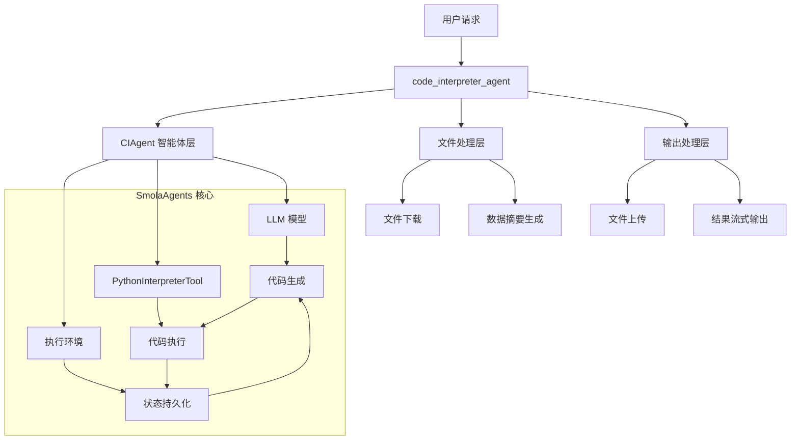
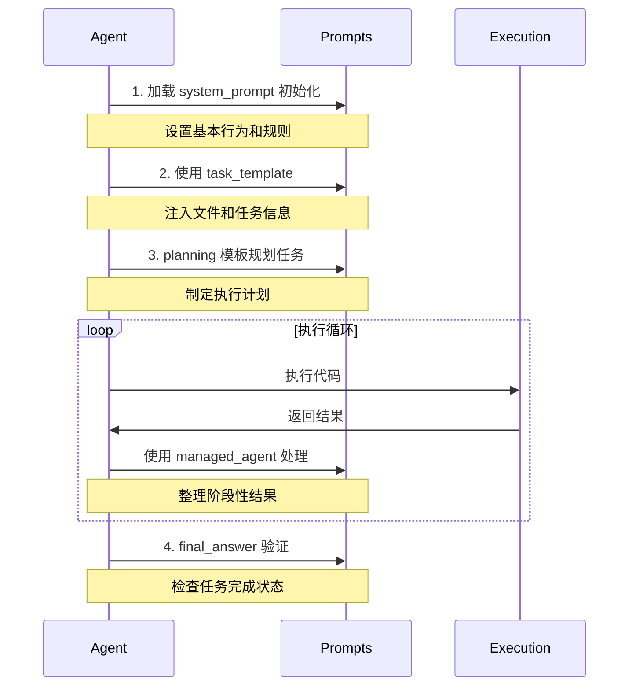

# SmolaAgents Code Interpreter 交互机制详解

## 概述

本文档详细介绍 jdgenie 项目中如何与 SmolaAgents 的 code_interpreter 进行交互，包括数据传递、步骤执行、状态管理等核心机制。

## 🏗️ 整体架构

### 交互层次结构



## 📋 核心交互流程

### 1. 任务初始化阶段

```python
# genie-tool/genie_tool/tool/code_interpreter.py:40-80
async def code_interpreter_agent(
    task: str,                    # 用户任务描述
    file_names: Optional[List[str]] = None,  # 输入文件列表
    max_file_abstract_size: int = 2000,      # 文件摘要大小限制
    max_tokens: int = 32000,                 # LLM token 限制
    request_id: str = "",                    # 请求追踪ID
    stream: bool = True,                     # 是否流式输出
):
```

**核心机制**：
- **工作空间隔离**: 每个请求创建独立的临时目录
- **文件预处理**: 自动下载和解析用户提供的文件
- **上下文构建**: 将文件内容转换为 AI 可理解的摘要格式

### 2. 文件处理和数据传递机制

#### 📁 文件类型处理

```python
# 表格文件处理 (Excel/CSV)
if file_name.split(".")[-1] in ["xlsx", "xls", "csv"]:
    df = (
        pd.read_csv(file_path) if file_name.endswith(".csv")
        else pd.read_excel(file_path)
    )
    # 将前10行数据作为摘要传递给 AI
    files.append({"path": file_path, "abstract": f"{df.head(10)}"})

# 文本文件处理 (txt/md/html)
elif file_name.split(".")[-1] in ["txt", "md", "html"]:
    with open(file_path, "r", encoding="utf-8") as rf:
        files.append({
            "path": file_path,
            "abstract": "".join(rf.readlines())[:max_file_abstract_size]
        })
```

**数据传递策略**：
- **智能摘要**: 大文件只传递关键信息，避免 token 浪费
- **路径保持**: 保留完整文件路径，AI 可以在代码中直接引用
- **格式适配**: 不同文件类型采用最适合的预览方式

#### 🔄 上下文注入机制

```python
# 使用 Jinja2 模板将文件信息注入到提示词中
template_task = Template(ci_prompt_template["task_template"]).render(
    files=files,        # 处理后的文件列表
    task=task,         # 用户任务描述  
    output_dir=output_dir  # 输出目录路径
)
```

**模板结构** (来自 `code_interpreter.yaml`):
```yaml
task_template: |-
  
  你有如下文件可以参考，对于 csv、excel、等数据文件则提供的只是部分数据，如果需要请你读取文件获取全文信息
  <docs>
    
    <doc>
      <path>{{ file['path'] }}</path>
      <abstract>{{ file['abstract'] }}</abstract>
    </doc>
    
  </docs>
  
  
  你的任务如下：
  {{ task }}
```

### 3. CIAgent 智能体交互机制

#### 🧠 ReAct 循环执行

```python
# genie-tool/genie_tool/tool/ci_agent.py:119-296
def _step_stream(self, memory_step: ActionStep):
    """
    ReAct 框架的单步执行：思考(Thought) -> 行动(Action) -> 观察(Observation)
    """
    # 1. 构建模型输入 (基于历史记忆)
    memory_messages = self.write_memory_to_messages()
    
    # 2. 流式调用 LLM 生成代码
    output_stream = self.model.generate_stream(input_messages)
    for event in output_stream:
        yield event  # 实时返回生成过程
    
    # 3. 解析生成的代码块
    code_action = fix_final_answer_code(parse_code_blobs(output_text))
    
    # 4. 执行 Python 代码
    _, execution_logs, _ = self.python_executor(code_action)
    
    # 5. 检查是否为最终答案
    finalFlag, exeLog = finalObj.check_is_final_answer()
    
    # 6. 返回执行结果
    yield ActionOutput(output=exeLog, is_final_answer=finalFlag)
```

#### 🔄 状态持久化机制

**记忆管理**：
```python
# 每个步骤都会被记录到 memory_step 中
memory_step.model_input_messages = memory_messages.copy()    # 输入消息
memory_step.model_output_message = chat_message            # 模型输出
memory_step.tool_calls = [ToolCall(...)]                  # 工具调用
memory_step.observations = observation                     # 执行观察
memory_step.action_output = exeLog                        # 动作输出
```

**变量持久化**：
```python
# Python 执行器维护持久化状态
# 变量在多个代码块之间保持可用
self.python_executor.state = {
    '_print_outputs': [],  # 打印输出
    'globals': {...},      # 全局变量
    'locals': {...}        # 局部变量
}
```

### 4. 数据在步骤间的传递机制

#### 📊 变量持久化示例

```python
# 步骤1: 创建数据
import pandas as pd
import numpy as np

# 生成数据集 - 这些变量会被保存
data = {
    'age': np.random.randint(20, 60, 100),
    'income': np.random.randint(30000, 100000, 100),
    'education': np.random.randint(12, 20, 100)
}
df = pd.DataFrame(data)
print(f"数据集形状: {df.shape}")
```

```python
# 步骤2: 使用上一步的数据 (df 变量仍然可用)
# 计算统计信息
stats = df.describe()
correlation = df.corr()

print("基础统计信息:")
print(stats)
print("\n相关性矩阵:")
print(correlation)
```

```python
# 步骤3: 继续使用之前的变量进行可视化
import matplotlib.pyplot as plt

plt.figure(figsize=(10, 6))
plt.scatter(df['age'], df['income'], alpha=0.6)
plt.xlabel('年龄')
plt.ylabel('收入')
plt.title('年龄与收入关系')
plt.savefig('/tmp/age_income_scatter.png')
plt.show()
```

#### 🔍 执行日志传递

```python
# 每步执行的输出都会作为 observation 传递给下一步
observation = "Execution logs:\n" + execution_logs

# 示例执行日志:
"""
Execution logs:
数据集形状: (100, 3)
基础统计信息:
              age       income   education
count  100.000000   100.000000  100.000000
mean    39.450000  64235.000000   15.980000
std     11.789442  20187.234567    2.234567
...
"""
```

### 5. 文件输出和结果处理机制

#### 📁 输出文件检测

```python
def get_new_file_by_path(output_dir):
    """检测输出目录中新生成的文件"""
    temp_file = ""
    latest_time = 0
    
    for item in os.listdir(output_dir):
        if item.endswith((".xlsx", ".csv", ".xls")):
            item_path = os.path.join(output_dir, item)
            mod_time = os.path.getmtime(item_path)
            
            if mod_time > latest_time:
                latest_time = mod_time
                temp_file = item_path
                
    return temp_file
```

#### 🔄 结果流式输出

```python
# 流式处理不同类型的步骤输出
for step in agent.run(task=str(template_task), stream=True, max_steps=10):
    
    # 代码生成步骤
    if isinstance(step, CodeOuput):
        file_info = await upload_file(
            content=step.code,
            file_name=step.file_name,
            file_type="py",
            request_id=request_id,
        )
        step.file_list = [file_info]
        yield step
    
    # 最终答案步骤
    elif isinstance(step, FinalAnswerStep):
        # 检查并上传生成的文件
        file_path = get_new_file_by_path(output_dir=output_dir)
        if file_path:
            file_info = await upload_file_by_path(file_path, request_id)
            file_list.append(file_info)
        
        # 创建结果输出
        output = ActionOutput(content=step.output, file_list=file_list)
        yield output
    
    # 流式消息增量
    elif isinstance(step, ChatMessageStreamDelta):
        # 实时显示 AI 思考过程
        pass
```

## 🛠️ 核心工具和组件

### 1. 提示词系统设计

#### 提示词结构和用途
```yaml
# 系统提示词：定义 AI 助手的基本行为
system_prompt: |-
  - 定义 AI 的角色和能力
  - 设置代码生成规则
  - 规定工作语言
  - 定义错误处理方式

# 任务模板：构建具体任务上下文
task_template: |-
  - 文件信息注入
  - 任务要求格式化
  - 输出路径设置

# 管理代理模板：处理代理间交互
managed_agent:
  task: |- 
    - 定义代理任务格式
    - 设置任务执行环境
  report: |-
    - 格式化执行报告
    - 整理执行结果

# 规划模板：任务规划和更新
planning:
  initial_plan: ""      # 初始规划
  update_plan_pre_messages: ""   # 规划更新前置消息
  update_plan_post_messages: ""  # 规划更新后置消息

# 最终答案模板：结果验证
final_answer:
  pre_messages: |-     # 结果验证前置消息
  post_messages: |-    # 结果验证后置消息
```

#### 提示词使用流程


#### 提示词交互示例
```python
# 1. 系统初始化
agent = CIAgent(
    prompt_templates={
        "system_prompt": "...",
        "task_template": "...",
        # 其他模板配置
    }
)

# 2. 任务执行过程中的提示词使用
async def execute_task():
    # 使用 task_template 构建任务
    task_prompt = Template(prompt_templates["task_template"]).render(
        files=files,
        task=task,
        output_dir=output_dir
    )
    
    # 使用 planning 进行任务规划
    if is_first_step:
        plan = Template(prompt_templates["planning"]["initial_plan"]).render(
            task=task,
            tools=tools
        )
    
    # 使用 final_answer 验证结果
    final_check = Template(prompt_templates["final_answer"]["pre_messages"]).render(
        task=task
    )
```

#### 提示词交互特点
1. **分层设计**
   - 系统层：基础行为定义
   - 任务层：具体执行指导
   - 管理层：结果处理和验证

2. **动态注入**
   - 文件信息实时注入
   - 任务状态动态更新
   - 执行结果即时反馈

3. **状态管理**
   - 保持执行上下文
   - 追踪任务进度
   - 维护执行历史

4. **安全控制**
   - 限制执行范围
   - 规范输出格式
   - 验证执行结果

### 2. Python 执行器配置

```python
def create_ci_agent(
    prompt_templates=None,
    max_tokens: int = 16000,
    return_full_result: bool = True,
    output_dir: str = "",
) -> CIAgent:
    """创建代码解释器智能体"""
    
    # 创建 LLM 模型
    model = LiteLLMModel(
        max_tokens=max_tokens,
        model_id=os.getenv("CODE_INTEPRETER_MODEL", "gpt-4.1")
    )

    # 创建智能体，配置允许的 Python 库
    return CIAgent(
        model=model,
        prompt_templates=prompt_templates,
        tools=[PythonInterpreterTool()],
        additional_authorized_imports=[
            "pandas",     # 数据分析
            "openpyxl",   # Excel 操作
            "numpy",      # 数值计算
            "matplotlib", # 绘图
            "seaborn",    # 统计绘图
        ],
        output_dir=output_dir,
    )
```

### 2. 安全执行环境

**导入限制**：
```python
# SmolaAgents 提供安全的执行环境
BASE_BUILTIN_MODULES = [
    "math", "random", "time", "datetime", "json", "re", "collections",
    "itertools", "functools", "operator", "pathlib", "os", "sys"
]

# 项目额外允许的模块
additional_authorized_imports = [
    "pandas", "openpyxl", "numpy", "matplotlib", "seaborn"
]
```

**文件系统隔离**：
```python
# 执行器只能访问指定的工作目录
work_dir = tempfile.mkdtemp()  # 临时隔离目录
output_dir = os.path.join(work_dir, "output")  # 输出目录
```

### 3. 最终答案检查机制

```python
# genie-tool/genie_tool/tool/final_answer_check.py
class FinalAnswerCheck:
    """最终答案检查器"""
    
    def check_is_final_answer(self):
        """
        检查当前执行结果是否满足最终答案条件
        
        返回:
            (bool, str): (是否为最终答案, 格式化的执行日志)
        """
        # 使用 LLM 判断任务是否完成
        prompt = self.prompt_temps["final_answer"]["pre_messages"].format(task=self.task)
        
        # 调用 LLM 进行判断
        response = self.model.generate(messages)
        
        # 解析响应判断是否完成
        if "is_final" in response and response["is_final"]:
            return True, self.execution_logs
        else:
            return False, self.execution_logs
```

## 🔄 实际交互示例

### 数据分析任务的完整流程

#### 步骤1: 任务初始化
```python
task = "分析销售数据，找出销售趋势"
file_names = ["sales_data.csv"]

# 系统自动处理:
# 1. 下载 sales_data.csv
# 2. 读取前10行作为摘要
# 3. 构建上下文提示词
```

#### 步骤2: AI 生成第一段代码
```python
# AI 输出 (ChatMessageStreamDelta):
"""
Task: 读取和探索销售数据

Thought: 首先需要读取CSV文件，查看数据结构和基本信息

Code:
<code>
import pandas as pd
import numpy as np

# 读取销售数据
df = pd.read_csv('/path/to/sales_data.csv')

# 查看数据基本信息
print("数据形状:", df.shape)
print("\n数据列名:")
print(df.columns.tolist())
print("\n前5行数据:")
print(df.head())
print("\n数据类型:")
print(df.dtypes)
</code>
"""
```

#### 步骤3: 代码执行和观察
```python
# PythonInterpreterTool 执行代码
# 执行日志:
"""
数据形状: (1000, 5)

数据列名:
['date', 'product', 'sales_amount', 'quantity', 'region']

前5行数据:
        date product  sales_amount  quantity region
0 2023-01-01    产品A        1500.0        10   北京
1 2023-01-01    产品B        2300.0        15   上海
2 2023-01-01    产品C        1800.0        12   广州
3 2023-01-02    产品A        1600.0        11   北京
4 2023-01-02    产品B        2100.0        14   上海

数据类型:
date            object
product         object
sales_amount   float64
quantity         int64
region          object
dtype: object
"""
```

#### 步骤4: AI 基于观察继续分析
```python
# AI 看到执行结果后，生成下一段代码:
"""
Task: 数据清洗和时间序列分析

Thought: 数据已成功读取，现在需要处理日期列并进行时间序列分析

Code:
<code>
# 转换日期列
df['date'] = pd.to_datetime(df['date'])

# 按日期聚合销售数据
daily_sales = df.groupby('date')['sales_amount'].sum().reset_index()

# 计算移动平均
daily_sales['7day_ma'] = daily_sales['sales_amount'].rolling(window=7).mean()
daily_sales['30day_ma'] = daily_sales['sales_amount'].rolling(window=30).mean()

print("每日销售汇总:")
print(daily_sales.head(10))

# 保存处理后的数据
daily_sales.to_csv('/tmp/daily_sales_analysis.csv', index=False)
print("\n数据已保存到 daily_sales_analysis.csv")
</code>
"""
```

#### 步骤5: 最终可视化和结论
```python
# AI 继续生成可视化代码:
"""
Task: 创建销售趋势图表

Thought: 创建可视化图表展示销售趋势

Code:
<code>
import matplotlib.pyplot as plt
import matplotlib.dates as mdates

plt.figure(figsize=(12, 6))
plt.plot(daily_sales['date'], daily_sales['sales_amount'], 
         label='每日销售额', alpha=0.7)
plt.plot(daily_sales['date'], daily_sales['7day_ma'], 
         label='7日移动平均', linewidth=2)
plt.plot(daily_sales['date'], daily_sales['30day_ma'], 
         label='30日移动平均', linewidth=2)

plt.title('销售趋势分析')
plt.xlabel('日期')
plt.ylabel('销售额')
plt.legend()
plt.xticks(rotation=45)
plt.tight_layout()

# 保存图表
plt.savefig('/tmp/sales_trend.png', dpi=300, bbox_inches='tight')
print("趋势图已保存")

# 分析结论
total_sales = df['sales_amount'].sum()
avg_daily_sales = daily_sales['sales_amount'].mean()
print(f"\n=== 销售分析结论 ===")
print(f"总销售额: {total_sales:,.2f}")
print(f"平均每日销售额: {avg_daily_sales:,.2f}")
print(f"数据覆盖天数: {len(daily_sales)}")
</code>
"""
```

#### 步骤6: 最终答案检查
```python
# FinalAnswerCheck 判断任务完成
# 系统自动:
# 1. 检查输出目录中的文件 (daily_sales_analysis.csv, sales_trend.png)
# 2. 上传生成的文件
# 3. 创建最终答案输出
# 4. 返回 ActionOutput(is_final_answer=True)
```

## 🎯 关键特性总结

### 1. 状态持久化
- **变量持续**: Python 变量在多个代码块间保持可用
- **文件访问**: 生成的文件可以在后续步骤中使用
- **记忆管理**: 完整的对话历史和执行记录

### 2. 智能数据传递
- **文件摘要**: 自动生成文件内容摘要传递给 AI
- **路径注入**: 文件路径直接注入到提示词中
- **上下文感知**: AI 能理解数据结构和内容特征

### 3. 安全执行环境
- **模块限制**: 只允许安全的 Python 模块导入
- **文件隔离**: 执行环境与主系统隔离
- **资源控制**: 限制执行时间和资源使用

### 4. 流式交互体验
- **实时反馈**: 用户可以看到 AI 的思考过程
- **步骤追踪**: 每个执行步骤都有详细日志
- **动态调整**: 基于执行结果动态调整后续策略

### 5. 智能任务完成检测
- **自动判断**: AI 自动判断任务是否完成
- **结果验证**: 检查执行结果是否满足用户需求
- **质量保证**: 确保输出的完整性和准确性

这套交互机制使得 SmolaAgents 能够处理复杂的数据分析任务，在保证安全性的同时提供了强大的代码执行和数据处理能力。
