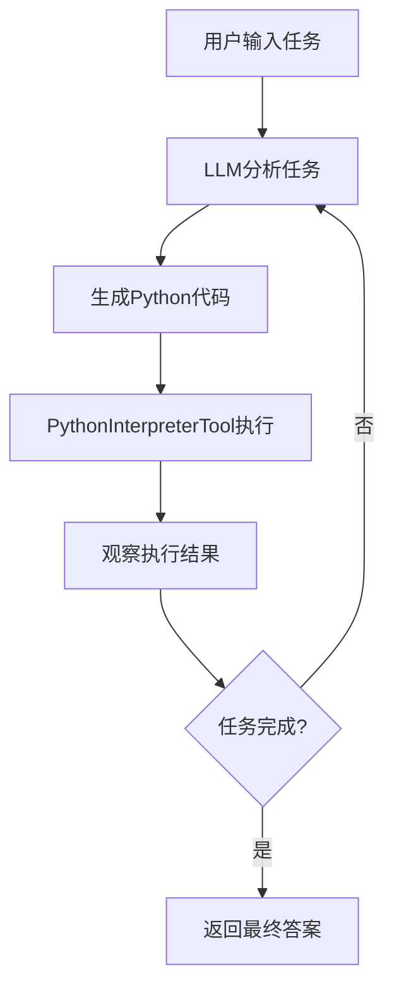

# SmolaAgents Demo 使用说明

## 概述

这个演示基于 jdgenie 项目中的 `code_interpreter.py`，创建了两个最小化的 SmolaAgents Python 代码执行演示。

## 文件说明

### 1. `smolagents_demo.py` - 完整版演示
- 包含完整的工作空间管理
- 支持多种演示模式
- 包含错误处理和资源清理
- 适合深入了解 SmolaAgents 功能

### 2. `minimal_smolagents_demo.py` - 最小化演示
- 核心功能演示，代码简洁
- 专注于基本的Python代码执行
- 适合快速上手和理解核心概念

## 安装依赖

```bash
# 安装 smolagents
pip install smolagents

# 可选：安装数据分析相关库
pip install pandas matplotlib numpy
```

## 环境配置

设置API密钥（选择其一）：

```bash
# OpenAI API
export OPENAI_API_KEY='your-openai-api-key-here'

# 或者 DeepSeek API
export DEEPSEEK_API_KEY='your-deepseek-api-key-here'
```

## 使用方法

### 最小化演示 (推荐)

```bash
python minimal_smolagents_demo.py
```

支持的演示模式：
1. 基础数学计算
2. 数据分析
3. 数据可视化
4. 交互模式

### 完整版演示

```bash
# 简单演示
python smolagents_demo.py simple

# 完整演示
python smolagents_demo.py demo

# 交互模式
python smolagents_demo.py interactive

# 查看帮助
python smolagents_demo.py help
```

## 核心特性

### 1. Python代码执行
- 基于 SmolaAgents 的 `PythonInterpreterTool`
- 安全的代码执行环境
- 支持常用Python库（pandas, numpy, matplotlib等）

### 2. 智能代码生成
- 使用LLM模型生成Python代码
- 自动解析和执行代码块
- 支持多步骤任务执行

### 3. 流式输出
- 实时显示执行过程
- 支持流式和非流式两种模式
- 便于观察AI的思考和执行过程

## 示例任务

### 数学计算
```python
task = "计算1到100的平方和，并显示前10个数的平方值"
```

### 数据分析
```python
task = """
创建一个包含学生姓名和成绩的数据集，
计算平均分，找出最高分学生
"""
```

### 数据可视化
```python
task = """
生成随机数据并创建柱状图，
添加标题和标签
"""
```

## 技术架构

### 核心组件

1. **LiteLLMModel**: LLM模型适配器
   ```python
   model = LiteLLMModel(
       model_id="gpt-4o-mini",
       max_tokens=2000
   )
   ```

2. **PythonInterpreterTool**: Python解释器工具
   ```python
   tool = PythonInterpreterTool()
   ```

3. **CodeAgent**: 代码智能体
   ```python
   agent = CodeAgent(
       model=model,
       tools=[tool],
       max_steps=5
   )
   ```

### 执行流程



## 与原项目的对比

### 原项目 (`code_interpreter.py`)
- 完整的文件处理能力
- 支持Excel、CSV、文本文件
- 复杂的工作空间管理
- 文件上传下载功能
- 自定义CIAgent类

### 演示版本
- 专注于核心代码执行功能
- 简化的API接口
- 最小化依赖
- 易于理解和扩展

## 扩展建议

### 1. 添加更多工具
```python
from smolagents import WebSurferTool, ImageGenerationTool

agent = CodeAgent(
    model=model,
    tools=[
        PythonInterpreterTool(),
        WebSurferTool(),
        ImageGenerationTool()
    ]
)
```

### 2. 自定义Prompt
```python
custom_prompt = """
你是一个专业的数据分析师...
"""

agent = CodeAgent(
    model=model,
    tools=[PythonInterpreterTool()],
    system_prompt=custom_prompt
)
```

### 3. 结果保存
```python
# 在演示基础上添加文件保存功能
def save_result(result, filename):
    with open(filename, 'w') as f:
        f.write(result)
```

## 故障排除

### 常见问题

1. **API密钥未设置**
   ```
   ❌ 请安装 smolagents: pip install smolagents
   ```
   解决：设置正确的API密钥环境变量

2. **依赖包缺失**
   ```
   ModuleNotFoundError: No module named 'smolagents'
   ```
   解决：`pip install smolagents`

3. **模型调用失败**
   ```
   ❌ 执行出错: API call failed
   ```
   解决：检查网络连接和API密钥有效性

### 调试建议

1. 启用详细日志
2. 检查环境变量
3. 验证API密钥
4. 测试网络连接

## 总结

这个演示展示了如何使用 SmolaAgents 框架创建Python代码执行智能体：

✅ **优点**：
- 简单易用的API
- 强大的代码生成和执行能力
- 安全的执行环境
- 流式输出支持

🎯 **适用场景**：
- 数据分析任务
- 代码生成和执行
- 教育和学习
- 快速原型开发

💡 **学习价值**：
- 理解AI代码执行的基本原理
- 掌握SmolaAgents框架使用
- 学习智能体架构设计
- 为复杂应用奠定基础
