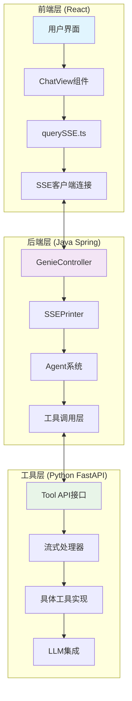
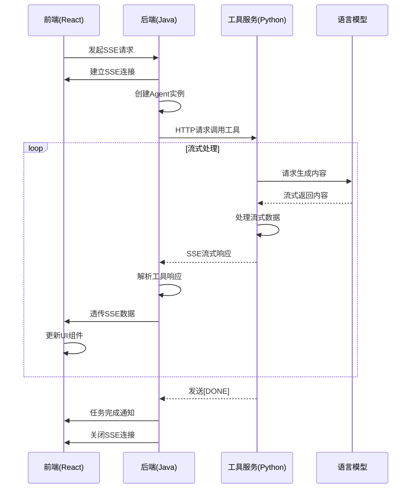

# JoyAgent-JDGenie 流式输出源码分析

## 概述

JoyAgent-JDGenie 是一个基于多智能体的AI助手系统，采用了完整的流式输出架构实现实时交互。本文档深入分析整个系统的流式输出实现机制，包括前端、后端、工具层的技术架构以及数据流的透传过程。

## 1. 系统架构概览



## 2. 前端流式接收机制

### 2.1 SSE客户端实现

**文件位置：** `ui/src/utils/querySSE.ts`

```typescript
import { fetchEventSource, EventSourceMessage } from '@microsoft/fetch-event-source';

const DEFAULT_SSE_URL = `${customHost}/web/api/v1/gpt/queryAgentStreamIncr`;

export default (config: SSEConfig, url: string = DEFAULT_SSE_URL): void => {
  const { body = null, handleMessage, handleError, handleClose } = config;

  fetchEventSource(url, {
    method: 'POST',
    credentials: 'include',
    headers: {
      'Content-Type': 'application/json',
      'Cache-Control': 'no-cache',
      'Connection': 'keep-alive',
      'Accept': 'text/event-stream',
    },
    body: JSON.stringify(body),
    openWhenHidden: true,
    onmessage(event: EventSourceMessage) {
      if (event.data) {
        try {
          const parsedData = JSON.parse(event.data);
          handleMessage(parsedData);
        } catch (error) {
          console.error('Error parsing SSE message:', error);
          handleError(new Error('Failed to parse SSE message'));
        }
      }
    },
    onerror(error: Error) {
      console.error('SSE error:', error);
      handleError(error);
    },
    onclose() {
      console.log('SSE connection closed');
      handleClose();
    }
  });
};
```

**核心特性：**
- 使用 `@microsoft/fetch-event-source` 库建立稳定的 SSE 连接
- 支持 JSON 数据解析和错误处理
- 提供连接状态管理（打开、关闭、错误）

### 2.2 消息处理与UI更新

**文件位置：** `ui/src/components/ChatView/index.tsx`

```typescript
const sendMessage = useMemoizedFn((inputInfo: CHAT.TInputInfo) => {
  // ... 准备请求参数
  
  const handleMessage = (data: MESSAGE.Answer) => {
    const { finished, resultMap, packageType, status } = data;
    
    // 🔥 心跳消息过滤
    if (packageType !== "heartbeat") {
      requestAnimationFrame(() => {
        if (resultMap?.eventData) {
          // 🔥 实时合并数据到当前会话
          currentChat = combineData(resultMap.eventData || {}, currentChat);
          
          // 🔥 处理任务数据并更新UI
          const taskData = handleTaskData(currentChat, deepThink, currentChat.multiAgent);
          
          // 🔥 流式更新各UI组件
          setTaskList(taskData.taskList);    // 任务列表
          updatePlan(taskData.plan!);        // 执行计划
          openAction(taskData.taskList);     // 操作面板
          
          if (finished) {
            currentChat.loading = false;
            setLoading(false); // 🔥 完成标记
          }
          
          // 更新聊天列表
          const newChatList = [...chatList.current];
          newChatList.splice(newChatList.length - 1, 1, currentChat);
          chatList.current = newChatList;
        }
      });
      scrollToTop(chatRef.current!);
    }
  };

  querySSE({
    body: params,
    handleMessage,
    handleError,
    handleClose,
  });
});
```

### 2.3 数据合并与状态管理

**文件位置：** `ui/src/utils/chat.ts`

```typescript
function handleContentMessage(
  eventData: MESSAGE.EventData,
  currentChat: CHAT.ChatItem,
  taskIndex: number,
  toolIndex: number
) {
  if (taskIndex !== -1) {
    if (toolIndex !== -1) {
      // 🔥 流式更新已存在的工具结果
      if (eventData.resultMap.resultMap.isFinal) {
        currentChat.multiAgent.tasks[taskIndex][toolIndex].resultMap = {
          ...eventData.resultMap.resultMap,
          codeOutput: eventData.resultMap.resultMap.data,
        };
      } else {
        // 🔥 增量更新内容
        currentChat.multiAgent.tasks[taskIndex][toolIndex].resultMap.isFinal = false;
        currentChat.multiAgent.tasks[taskIndex][toolIndex].resultMap.codeOutput +=
          eventData.resultMap.resultMap?.data || "";
      }
    } else {
      // 🔥 添加新工具到已存在任务
      currentChat.multiAgent.tasks[taskIndex].push({
        taskId: eventData.taskId,
        ...eventData.resultMap,
      });
    }
  } else {
    // 🔥 创建新任务和工具
    currentChat.multiAgent.tasks.push([{
      taskId: eventData.taskId,
      ...eventData.resultMap,
    }]);
  }
}
```

## 3. 后端流式输出机制

### 3.1 SSE控制器层

**文件位置：** `genie-backend/src/main/java/com/jd/genie/controller/GenieController.java`

```java
@PostMapping("/AutoAgent")
public SseEmitter AutoAgent(@RequestBody AgentRequest request) {
    Long AUTO_AGENT_SSE_TIMEOUT = 60 * 60 * 1000L; // 1小时超时
    SseEmitter emitter = new SseEmitter(AUTO_AGENT_SSE_TIMEOUT);
    
    // 🔥 心跳机制 - 每10秒发送一次心跳保活
    ScheduledFuture<?> heartbeatFuture = startHeartbeat(emitter, request.getRequestId());
    
    // 🔥 SSE连接监听
    registerSSEMonitor(emitter, request.getRequestId(), heartbeatFuture);
    
    // 异步执行Agent处理逻辑
    ThreadUtil.execute(() -> {
        try {
            // 🔥 创建SSE推送器
            Printer printer = new SSEPrinter(emitter, request, request.getAgentType());
            
            // 🔥 构建Agent上下文
            AgentContext context = AgentContext.builder()
                    .requestId(request.getRequestId())
                    .printer(printer)        // 注入SSE推送器
                    .isStream(true)          // 启用流式模式
                    .build();
            
            // 构建工具列表
            context.setToolCollection(buildToolCollection(context, request));
            
            // 🔥 获取对应的处理器并执行
            AgentHandlerService handler = agentHandlerFactory.getHandler(context, request);
            handler.handle(context, request);
            
        } finally {
            emitter.complete();
        }
    });
    
    return emitter;
}

// 🔥 心跳保活机制
private ScheduledFuture<?> startHeartbeat(SseEmitter emitter, String requestId) {
    return executor.scheduleAtFixedRate(() -> {
        try {
            log.info("{} send heartbeat", requestId);
            emitter.send("heartbeat");
        } catch (Exception e) {
            log.error("{} heartbeat failed, closing connection", requestId, e);
            emitter.completeWithError(e);
        }
    }, HEARTBEAT_INTERVAL, HEARTBEAT_INTERVAL, TimeUnit.MILLISECONDS);
}
```

### 3.2 SSE打印器实现

**文件位置：** `genie-backend/src/main/java/com/jd/genie/agent/printer/SSEPrinter.java`

```java
@Slf4j
@Setter
public class SSEPrinter implements Printer {
    private SseEmitter emitter;
    private AgentRequest request;
    private Integer agentType;

    @Override
    public void send(String messageId, String messageType, Object message, 
                     String digitalEmployee, Boolean isFinal) {
        try {
            // 🔥 构建统一的响应格式
            AgentResponse response = AgentResponse.builder()
                    .requestId(request.getRequestId())
                    .messageId(messageId)
                    .messageType(messageType)
                    .messageTime(String.valueOf(System.currentTimeMillis()))
                    .resultMap(new HashMap<>())
                    .finish("result".equals(messageType))
                    .isFinal(isFinal)
                    .build();
            
            // 🔥 根据消息类型处理不同数据结构
            switch (messageType) {
                case "tool_thought":
                    response.setToolThought((String) message);
                    break;
                case "task":
                    response.setTask(((String) message).replaceAll("^执行顺序(\\d+)\\.\\s?", ""));
                    break;
                case "task_summary":
                    if (message instanceof Map) {
                        Map<String, Object> taskSummary = (Map<String, Object>) message;
                        response.setResultMap(taskSummary);
                        response.setTaskSummary(taskSummary.get("taskSummary").toString());
                    }
                    break;
                case "plan_thought":
                    response.setPlanThought((String) message);
                    break;
                case "plan":
                    AgentResponse.Plan plan = new AgentResponse.Plan();
                    BeanUtils.copyProperties(message, plan);
                    response.setPlan(AgentResponse.formatSteps(plan));
                    break;
                case "tool_result":
                    response.setToolResult((AgentResponse.ToolResult) message);
                    break;
                case "browser":
                case "code":
                case "html":
                case "markdown":
                case "ppt":
                case "file":
                case "knowledge":
                case "deep_search":
                    // 🔥 工具执行结果的统一处理
                    response.setResultMap(JSON.parseObject(JSON.toJSONString(message)));
                    response.getResultMap().put("agentType", agentType);
                    break;
                case "agent_stream":
                    response.setResult((String) message);
                    break;
                case "result":
                    // 🔥 最终结果处理
                    if (message instanceof Map) {
                        Map<String, Object> taskResult = (Map<String, Object>) message;
                        response.setResultMap(taskResult);
                        response.setResult(taskResult.get("taskSummary").toString());
                    }
                    response.getResultMap().put("agentType", agentType);
                    break;
            }
            
            // 🔥 发送SSE消息
            emitter.send(response);
            
        } catch (Exception e) {
            log.error("sse send error ", e);
        }
    }
}
```

### 3.3 Agent执行与工具调用

**文件位置：** `genie-backend/src/main/java/com/jd/genie/agent/agent/ReactImplAgent.java`

```java
@Override
public String act() {
    if (toolCalls.isEmpty()) {
        setState(AgentState.FINISHED);
        return getMemory().getLastMessage().getContent();
    }

    // 🔥 执行工具调用
    Map<String, String> toolResults = executeTools(toolCalls);
    
    for (ToolCall command : toolCalls) {
        String result = toolResults.get(command.getId());
        
        // 🔥 非流式工具结果直接推送
        if (!Arrays.asList("code_interpreter", "report_tool", "file_tool", "deep_search")
            .contains(command.getFunction().getName())) {
            
            String toolName = command.getFunction().getName();
            printer.send("tool_result", AgentResponse.ToolResult.builder()
                    .toolName(toolName)
                    .toolParam(JSON.parseObject(command.getFunction().getArguments(), Map.class))
                    .toolResult(result)
                    .build(), null);
        }
        
        // 添加工具响应到记忆
        Message toolMsg = Message.toolMessage(result, command.getId(), null);
        getMemory().addMessage(toolMsg);
    }
    
    return String.join("\n\n", results);
}
```

## 4. 工具层流式处理

### 4.1 工具API接口层

**文件位置：** `genie-tool/genie_tool/api/tool.py`

```python
@router.post("/code_interpreter")
async def post_code_interpreter(body: CIRequest):
    async def _stream():
        acc_content = ""
        acc_token = 0
        acc_time = time.time()
        
        # 🔥 异步流式处理Agent执行
        async for chunk in code_interpreter_agent(
            task=body.task,
            file_names=body.file_names,
            request_id=body.request_id,
            stream=True,  # 启用流式模式
        ):
            # 🔥 代码输出流式推送
            if isinstance(chunk, CodeOuput):
                yield ServerSentEvent(
                    data=json.dumps({
                        "requestId": body.request_id,
                        "code": chunk.code,
                        "fileInfo": chunk.file_list,
                        "isFinal": False,
                    }, ensure_ascii=False)
                )
            
            # 🔥 最终结果推送
            elif isinstance(chunk, ActionOutput):
                yield ServerSentEvent(
                    data=json.dumps({
                        "requestId": body.request_id,
                        "codeOutput": chunk.content,
                        "fileInfo": chunk.file_list,
                        "isFinal": True,  # 完成标记
                    }, ensure_ascii=False)
                )
                yield ServerSentEvent(data="[DONE]")
            
            # 🔥 LLM流式内容处理
            else:
                acc_content += chunk
                acc_token += 1
                
                # 根据流式模式决定何时发送数据
                if body.stream_mode.mode == "general":
                    # 通用模式：每个chunk都发送
                    yield ServerSentEvent(
                        data=json.dumps({
                            "requestId": body.request_id, 
                            "data": chunk, 
                            "isFinal": False
                        }, ensure_ascii=False)
                    )
                elif body.stream_mode.mode == "token":
                    # 令牌模式：累积到指定数量才发送
                    if acc_token >= body.stream_mode.token:
                        yield ServerSentEvent(
                            data=json.dumps({
                                "requestId": body.request_id,
                                "data": acc_content,
                                "isFinal": False,
                            }, ensure_ascii=False)
                        )
                        acc_token = 0
                        acc_content = ""
                elif body.stream_mode.mode == "time":
                    # 时间模式：累积到指定时间才发送
                    if time.time() - acc_time > body.stream_mode.time:
                        yield ServerSentEvent(
                            data=json.dumps({
                                "requestId": body.request_id,
                                "data": acc_content,
                                "isFinal": False,
                            }, ensure_ascii=False)
                        )
                        acc_time = time.time()
                        acc_content = ""
    
    return StreamingResponse(_stream(), media_type="text/event-stream")
```

**流式模式说明：**
- **general**: 实时发送每个生成的内容块
- **token**: 累积指定数量的令牌后发送
- **time**: 累积指定时间后发送

### 4.2 代码解释器Agent实现

**文件位置：** `genie-tool/genie_tool/tool/ci_agent.py`

```python
class CIAgent(CodeAgent):
    def _step_stream(self, memory_step: ActionStep) -> Generator[
        ChatMessageStreamDelta | ToolCall | ToolOutput | ActionOutput | CodeOuput
    ]:
        """
        执行一个ReAct框架步骤：思考、行动、观察结果
        """
        memory_messages = self.write_memory_to_messages()
        
        try:
            model_request_id = str(uuid.uuid4())
            
            # 🔥 获取LLM流式输出
            output_stream = self.model.generate_stream(
                memory_messages,
                extra_headers={"x-ms-client-request-id": model_request_id},
            )
            
            chat_message_stream_deltas: list[ChatMessageStreamDelta] = []
            
            # 🔥 实时处理流式输出
            with Live("", console=self.logger.console, vertical_overflow="visible") as live:
                for event in output_stream:
                    chat_message_stream_deltas.append(event)
                    live.update(
                        Markdown(agglomerate_stream_deltas(chat_message_stream_deltas).render_as_markdown())
                    )
                    # 🔥 逐个yield流式事件
                    yield event
            
            # 🔥 聚合完整消息
            chat_message = agglomerate_stream_deltas(chat_message_stream_deltas)
            output_text = chat_message.content
            
            # 解析代码块
            code_action = fix_final_answer_code(parse_code_blobs(output_text))
            
            # 🔥 执行代码并生成输出
            _, execution_logs, _ = self.python_executor(code_action)
            
            # 🔥 生成代码输出对象
            if matcher := re.search(r"Task:\s?(.*)", output_text):
                file_name = f"{matcher.group(1).replace(' ', '')}.py"
            else:
                file_name = f'{generate_data_id("index")}.py'
            
            yield CodeOuput(code=code_action, file_name=file_name)
            
            # 🔥 检查是否为最终答案
            finalObj = FinalAnswerCheck(
                input_messages=self.input_messages,
                execution_logs=execution_logs,
                model=self.model,
                task=self.task,
                prompt_temps=self.prompt_templates,
                memory_step=memory_step,
                grammar=self.grammar,
                request_id=f"{model_request_id}-final",
            )
            
            finalFlag, exeLog = finalObj.check_is_final_answer()
            
            # 🔥 生成最终输出
            yield ActionOutput(output=exeLog, is_final_answer=finalFlag)
            
        except Exception as e:
            raise AgentExecutionError(str(e), self.logger)
```

## 5. 数据透传机制详解

### 5.1 整体数据流



### 5.2 后端透传实现

**文件位置：** `genie-backend/src/main/java/com/jd/genie/service/impl/MultiAgentServiceImpl.java`

```java
public void searchForAgentRequest(GptQueryReq req, SseEmitter sseEmitter) {
    ThreadUtil.execute(() -> {
        try {
            // 🔥 构建对后端Agent服务的HTTP请求
            Request request = buildHttpRequest(agentRequest);
            
            try (Response response = client.newCall(request).execute()) {
                if (response.isSuccessful() && response.body() != null) {
                    BufferedReader reader = new BufferedReader(
                        new InputStreamReader(response.body().byteStream())
                    );
                    
                    String line;
                    // 🔥 逐行读取SSE流式响应
                    while ((line = reader.readLine()) != null) {
                        if (!line.startsWith("data:")) {
                            continue;
                        }
                        
                        String data = line.substring(5);
                        
                        // 🔥 处理结束标记
                        if (data.equals("[DONE]")) {
                            log.info("{} data equals with [DONE]", autoReq.getRequestId());
                            break;
                        }
                        
                        // 🔥 处理心跳消息
                        if (data.startsWith("heartbeat")) {
                            GptProcessResult result = buildHeartbeatData(autoReq.getRequestId());
                            sseEmitter.send(result);
                            continue;
                        }
                        
                        // 🔥 解析Agent响应并透传
                        AgentResponse agentResponse = JSON.parseObject(data, AgentResponse.class);
                        AgentType agentType = AgentType.fromCode(autoReq.getAgentType());
                        AgentResponseHandler handler = handlerMap.get(agentType);
                        
                        // 🔥 处理响应数据并发送给前端
                        GptProcessResult result = handler.handle(autoReq, agentResponse, agentRespList, eventResult);
                        sseEmitter.send(result);
                        
                        if (result.isFinished()) {
                            sseEmitter.complete();
                        }
                    }
                }
            }
        } catch (Exception e) {
            log.error("", e);
        }
    });
}
```

### 5.3 HTTP工具调用实现

**文件位置：** `genie-backend/src/main/java/com/jd/genie/agent/util/OkHttpUtil.java`

```java
/**
 * 发送 SSE 流式请求
 */
public static void sseRequest(String url, String jsonParams, Map<String, String> headers, 
                             Long timeout, SseEventListener eventListener) {
    OkHttpClient client = createClient(timeout, timeout, timeout);
    RequestBody body = RequestBody.create(jsonParams, JSON);
    Request.Builder requestBuilder = new Request.Builder()
            .url(url)
            .post(body);

    if (headers != null) {
        for (Map.Entry<String, String> entry : headers.entrySet()) {
            requestBuilder.addHeader(entry.getKey(), entry.getValue());
        }
    }

    Request request = requestBuilder.build();

    // 🔥 异步处理SSE响应
    client.newCall(request).enqueue(new Callback() {
        @Override
        public void onResponse(Call call, Response response) throws IOException {
            if (response.isSuccessful() && response.body() != null) {
                try (BufferedReader reader = new BufferedReader(
                    new InputStreamReader(response.body().byteStream()))) {
                    
                    String line;
                    // 🔥 逐行读取流式响应
                    while ((line = reader.readLine()) != null) {
                        eventListener.onEvent(line);
                    }
                }
                eventListener.onComplete();
            } else {
                eventListener.onError(new IOException("SSE request failed: " + response.code()));
            }
        }
        
        @Override
        public void onFailure(Call call, IOException e) {
            eventListener.onError(e);
        }
    });
}
```

## 6. 核心技术特性

### 6.1 心跳保活机制

**后端实现：**
```java
private static final long HEARTBEAT_INTERVAL = 10_000L; // 10秒心跳间隔

private ScheduledFuture<?> startHeartbeat(SseEmitter emitter, String requestId) {
    return executor.scheduleAtFixedRate(() -> {
        try {
            emitter.send("heartbeat");
        } catch (Exception e) {
            emitter.completeWithError(e);
        }
    }, HEARTBEAT_INTERVAL, HEARTBEAT_INTERVAL, TimeUnit.MILLISECONDS);
}
```

**前端处理：**
```typescript
const handleMessage = (data: MESSAGE.Answer) => {
  const { packageType } = data;
  
  // 过滤心跳消息，不进行UI更新
  if (packageType !== "heartbeat") {
    // 处理实际业务数据
    updateUI(data);
  }
};
```

### 6.2 错误处理与重连

**前端错误处理：**
```typescript
fetchEventSource(url, {
  onmessage(event) {
    try {
      const parsedData = JSON.parse(event.data);
      handleMessage(parsedData);
    } catch (error) {
      console.error('Error parsing SSE message:', error);
      handleError(new Error('Failed to parse SSE message'));
    }
  },
  onerror(error) {
    console.error('SSE error:', error);
    handleError(error);
  },
  onclose() {
    console.log('SSE connection closed');
    handleClose();
  }
});
```

### 6.3 数据格式标准化

**响应数据结构：**
```java
@Data
@Builder
public class AgentResponse {
    private String requestId;        // 请求ID
    private String messageId;        // 消息ID
    private Boolean isFinal;         // 是否最终消息
    private String messageType;      // 消息类型
    private String messageTime;      // 消息时间
    private String planThought;      // 计划思考
    private Plan plan;              // 执行计划
    private String task;            // 任务内容
    private String taskSummary;     // 任务摘要
    private String toolThought;     // 工具思考
    private ToolResult toolResult;  // 工具结果
    private Map<String, Object> resultMap; // 结果映射
    private String result;          // 最终结果
    private Boolean finish;         // 是否完成
}
```

## 7. 性能优化策略

### 7.1 前端优化

1. **批量更新优化**
```typescript
requestAnimationFrame(() => {
  // 在下一个动画帧中批量更新UI
  if (resultMap?.eventData) {
    currentChat = combineData(resultMap.eventData || {}, currentChat);
    const taskData = handleTaskData(currentChat, deepThink, currentChat.multiAgent);
    
    // 批量更新所有相关组件
    setTaskList(taskData.taskList);
    updatePlan(taskData.plan!);
    openAction(taskData.taskList);
  }
});
```

2. **内存管理**
```typescript
// 避免重复创建对象，使用浅拷贝
const newChatList = [...chatList.current];
newChatList.splice(newChatList.length - 1, 1, currentChat);
chatList.current = newChatList;
```

### 7.2 后端优化

1. **异步处理**
```java
// 使用线程池异步处理Agent逻辑，避免阻塞SSE连接
ThreadUtil.execute(() -> {
    try {
        Printer printer = new SSEPrinter(emitter, request, request.getAgentType());
        AgentContext context = AgentContext.builder()
                .printer(printer)
                .isStream(true)
                .build();
        
        AgentHandlerService handler = agentHandlerFactory.getHandler(context, request);
        handler.handle(context, request);
    } finally {
        emitter.complete();
    }
});
```

2. **连接管理**
```java
// 自动清理过期连接
private void registerSSEMonitor(SseEmitter emitter, String requestId, 
                               ScheduledFuture<?> heartbeatFuture) {
    emitter.onCompletion(() -> {
        log.info("{} SSE connection completed", requestId);
        heartbeatFuture.cancel(true);
    });
    
    emitter.onTimeout(() -> {
        log.warn("{} SSE connection timeout", requestId);
        heartbeatFuture.cancel(true);
        emitter.complete();
    });
    
    emitter.onError((ex) -> {
        log.error("{} SSE connection error", requestId, ex);
        heartbeatFuture.cancel(true);
    });
}
```

## 8. 总结

JoyAgent-JDGenie 的流式输出系统通过以下几个核心机制实现了高效的实时交互：

1. **三层架构设计**：前端SSE客户端、后端SSE服务器、工具层流式处理，各层职责清晰

2. **数据透传机制**：后端作为中间层，将工具服务的流式响应透传给前端，实现端到端的流式体验

3. **多种流式模式**：支持实时、批量、定时等多种流式推送策略，适应不同场景需求

4. **稳定性保障**：心跳保活、错误处理、连接管理等机制确保长连接的稳定性

5. **性能优化**：异步处理、批量更新、内存管理等策略提升系统整体性能

这种设计不仅实现了流畅的用户体验，也为系统的扩展性和维护性提供了良好的基础。 