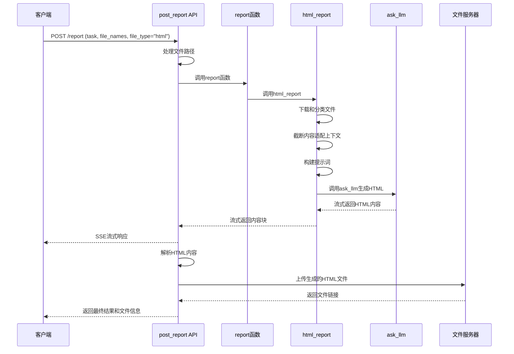

# post_report HTML 生成流程详细代码解读

## 📚 概述

`post_report` 是 Genie 工具中负责生成报告的核心 API 接口，支持生成 HTML、Markdown 和 PPT 三种格式的报告。本文档详细解读其生成 HTML 报告的完整代码流程。

## 🏗️ 整体架构

### 文件结构
```
genie-tool/
├── genie_tool/
│   ├── api/
│   │   └── tool.py           # 主要的 API 接口
│   ├── tool/
│   │   └── report.py         # 报告生成核心逻辑
│   ├── prompt/
│   │   └── report.yaml       # 提示词模板
│   └── util/
│       ├── llm_util.py       # LLM 调用工具
│       └── file_util.py      # 文件处理工具
```

## 🔍 详细代码流程分析

### 1. API 入口点：`post_report` 函数

**文件位置：** `genie-tool/genie_tool/api/tool.py:154`

```python
@router.post("/report")
async def post_report(body: ReportRequest):
    # 第一步：处理文件路径，将相对路径转换为完整URL
    if body.file_names:
        for idx, f_name in enumerate(body.file_names):
            if not f_name.startswith("/") and not f_name.startswith("http"):
                body.file_names[idx] = f"{os.getenv('FILE_SERVER_URL')}/preview/{body.request_id}/{f_name}"
```

**关键逻辑解析：**
- 检查文件名是否为相对路径
- 如果是相对路径，则拼接完整的文件服务器 URL
- 使用环境变量 `FILE_SERVER_URL` 构建完整路径

### 2. HTML 内容解析函数

```python
def _parser_html_content(content: str):
    """解析和清理HTML内容，移除markdown代码块标记"""
    if content.startswith("```\nhtml"):
        content = content[len("```\nhtml"): ]
    if content.startswith("```html"):
        content = content[len("```html"): ]
    if content.endswith("```"):
        content = content[: -3]
    return content
```

**功能说明：**
- 移除 LLM 生成内容中的 markdown 代码块标记
- 确保返回纯净的 HTML 内容

### 3. 流式响应处理

```python
async def _stream():
    content = ""
    acc_content = ""  # 累积内容
    acc_token = 0     # 累积令牌数
    acc_time = time.time()  # 累积时间
    
    # 调用核心报告生成函数
    async for chunk in report(
        task=body.task,
        file_names=body.file_names,
        file_type=body.file_type,
    ):
        content += chunk
        acc_content += chunk
        acc_token += 1
        
        # 根据流式模式决定何时发送数据
        if body.stream_mode.mode == "general":
            # 通用模式：每个chunk都发送
            yield ServerSentEvent(data=json.dumps({
                "requestId": body.request_id, 
                "data": chunk, 
                "isFinal": False
            }, ensure_ascii=False))
        elif body.stream_mode.mode == "token":
            # 令牌模式：累积到指定数量才发送
            if acc_token >= body.stream_mode.token:
                yield ServerSentEvent(data=json.dumps({
                    "requestId": body.request_id,
                    "data": acc_content,
                    "isFinal": False,
                }, ensure_ascii=False))
                acc_token = 0
                acc_content = ""
        elif body.stream_mode.mode == "time":
            # 时间模式：累积到指定时间才发送
            if time.time() - acc_time > body.stream_mode.time:
                yield ServerSentEvent(data=json.dumps({
                    "requestId": body.request_id,
                    "data": acc_content,
                    "isFinal": False,
                }, ensure_ascii=False))
                acc_time = time.time()
                acc_content = ""
```

**流式模式说明：**
- **general**: 实时发送每个生成的内容块
- **token**: 累积指定数量的令牌后发送
- **time**: 累积指定时间后发送

### 4. 报告类型分发器

**文件位置：** `genie-tool/genie_tool/tool/report.py:23`

```python
@timer(key="enter")
async def report(
    task: str,
    file_names: Optional[List[str]] = tuple(),
    model: str = "gpt-4.1",
    file_type: Literal["markdown", "html", "ppt"] = "markdown",
) -> AsyncGenerator:
    # 报告生成工厂模式
    report_factory = {
        "ppt": ppt_report,        # PPT格式（实际生成HTML）
        "markdown": markdown_report,  # Markdown格式
        "html": html_report,      # HTML格式
    }
    
    # 从环境变量获取模型配置
    model = os.getenv("REPORT_MODEL", "gpt-4.1")
    
    # 根据文件类型选择对应的生成函数
    async for chunk in report_factory[file_type](task, file_names, model):
        yield chunk
```

**设计模式分析：**
- 使用工厂模式根据 `file_type` 选择相应的处理函数
- 支持环境变量配置默认模型
- 异步生成器模式支持流式输出

## 🌐 HTML 报告生成核心逻辑

### 5. HTML 报告生成函数

**文件位置：** `genie-tool/genie_tool/tool/report.py:95`

```python
@timer(key="enter")
async def html_report(
    task,
    file_names: Optional[List[str]] = tuple(),
    model: str = "gpt-4.1",
    temperature: float = 0,
    top_p: float = 0.9,
) -> AsyncGenerator:
```

#### 5.1 文件下载和预处理

```python
# 下载所有输入文件
files = await download_all_files(file_names)
key_files = []   # 核心文件列表
flat_files = []  # 普通文件列表

# 文件分类和处理
for f in files:
    fpath = f["file_name"]
    fname = os.path.basename(fpath)
    
    # 只处理特定格式的文件
    if fname.split(".")[-1] in ["md", "txt", "csv"]:
        if "代码输出" in fname:
            # 核心文件：代码执行结果等重要内容
            key_files.append({
                "content": f["content"], 
                "description": fname, 
                "type": "txt", 
                "link": fpath
            })
        elif fname.endswith("_search_result.txt"):
            # 搜索结果文件需要特殊解析
            try:
                flat_files.extend([{
                    "content": tf["content"],
                    "description": tf.get("title") or tf["content"][:20],
                    "type": "txt",
                    "link": tf.get("link"),
                } for tf in flatten_search_file(f)])
            except Exception as e:
                logger.warning(f"html_report parser file [{fpath}] error: {e}")
        else:
            # 普通文件
            flat_files.append({
                "content": f["content"],
                "description": fname,
                "type": "txt",
                "link": fpath
            })
```

**文件分类逻辑：**
- **key_files**: 包含代码输出等核心内容，优先级最高
- **flat_files**: 包含搜索结果和普通文档，作为补充信息
- **搜索结果文件**: 需要特殊解析结构化数据

#### 5.2 内容截断和令牌管理

```python
# 计算可用的令牌数量（模型上下文长度的80%）
discount = int(LLMModelInfoFactory.get_context_length(model) * 0.8)

# 先处理核心文件
key_files = truncate_files(key_files, max_tokens=discount)

# 再处理普通文件，减去核心文件已使用的令牌
flat_files = truncate_files(
    flat_files, 
    max_tokens=discount - sum([len(f["content"]) for f in key_files])
)
```

**令牌管理策略：**
- 使用模型上下文长度的 80% 作为安全边界
- 优先保证核心文件的完整性
- 动态调整普通文件的可用令牌数

#### 5.3 提示词构建

```python
# 获取提示词模板
report_prompts = get_prompt("report")

# 使用Jinja2模板引擎渲染用户提示词
prompt = Template(report_prompts["html_task"]).render(
    task=task, 
    key_files=key_files, 
    files=flat_files, 
    date=datetime.now().strftime('%Y年%m月%d日')
)
```

**模板渲染过程：**
- 加载 YAML 格式的提示词模板
- 使用 Jinja2 引擎注入动态内容
- 生成包含任务描述、文件内容和时间信息的完整提示词

#### 5.4 LLM 调用和内容生成

```python
# 构建消息列表并调用LLM
async for chunk in ask_llm(
    messages=[
        {"role": "system", "content": report_prompts["html_prompt"]},
        {"role": "user", "content": prompt}
    ],
    model=model, 
    stream=True, 
    temperature=temperature, 
    top_p=top_p, 
    only_content=True
):
    yield chunk
```

**LLM 调用参数说明：**
- **system**: 包含HTML生成的详细规范和要求
- **user**: 包含具体任务和文件内容
- **stream=True**: 启用流式输出
- **only_content=True**: 只返回生成的内容，不包含元数据

## 🎨 HTML 提示词分析

### 6. HTML 生成提示词详解

**文件位置：** `genie-tool/genie_tool/prompt/report.yaml:233`

#### 6.1 技术栈要求

```yaml
html_prompt: |-
  # Context
  你是一位世界级的前端设计大师，擅长美工以及前端UI设计...
  
  ## 网页格式要求
  - 使用CDN（jsdelivr）加载所需资源
  - 使用Tailwind CSS (https://unpkg.com/tailwindcss@2.2.19/dist/tailwind.min.css)
  - 使用Echart（https://unpkg.com/echarts@5.6.0/dist/echarts.min.js）工具体现数据
```

**技术要求分析：**
- **Tailwind CSS**: 提供快速样式开发
- **ECharts**: 用于数据可视化
- **CDN资源**: 确保资源加载速度和可靠性

#### 6.2 内容质量要求

```yaml
- 数据准确性：报告中的所有数据和结论都应基于<任务内容>提供的信息
- 完整性：HTML 页面应包含<任务内容>中所有重要的内容信息
- 逻辑性：报告各部分之间应保持逻辑联系
- 不要输出空dom节点
```

#### 6.3 引用和参考文献系统

```yaml
## 引用
- 所有内容都必须标注来源，格式：
  <cite><a href="[链接]" target="_blank" rel="noopener noreferrer">[[引用编号]]</a></cite>
  
## 参考文献
- 最后一个章节输出参考文献列表，从编号1开始计数
```

## 🔧 工具函数详解

### 7. LLM 调用工具

**文件位置：** `genie-tool/genie_tool/util/llm_util.py:17`

```python
@timer(key="enter")
async def ask_llm(
    messages: str | List[Any],
    model: str,
    temperature: float = None,
    top_p: float = None,
    stream: bool = False,
    only_content: bool = False,  # 只返回内容
    extra_headers: Optional[dict] = None,
    **kwargs,
):
    # 消息格式标准化
    if isinstance(messages, str):
        messages = [{"role": "user", "content": messages}]
    
    # 敏感词过滤处理
    if os.getenv("SENSITIVE_WORD_REPLACE", "false") == "true":
        for message in messages:
            if isinstance(message.get("content"), str):
                message["content"] = SensitiveWordsReplace.replace(message["content"])
    
    # 调用LiteLLM进行统一的模型调用
    response = await acompletion(
        messages=messages,
        model=model,
        temperature=temperature,
        top_p=top_p,
        stream=stream,
        extra_headers=extra_headers,
        **kwargs
    )
    
    # 处理流式和非流式响应
    if stream:
        async for chunk in response:
            if only_content:
                if chunk.choices and chunk.choices[0] and chunk.choices[0].delta and chunk.choices[0].delta.content:
                    yield chunk.choices[0].delta.content
            else:
                yield chunk
    else:
        yield response.choices[0].message.content if only_content else response
```

**关键特性：**
- 支持多种消息格式输入
- 集成敏感词过滤功能
- 使用 LiteLLM 统一不同模型的调用接口
- 支持流式和非流式两种输出模式

### 8. 文件上传工具

**文件位置：** `genie-tool/genie_tool/util/file_util.py:86`

```python
@timer()
async def upload_file(
    content: str,
    file_name: str,
    file_type: str,
    request_id: str,
):
    # 文件类型标准化
    if file_type == "markdown":
        file_type = "md"
    if not file_name.endswith(file_type):
        file_name = f"{file_name}.{file_type}"
    
    # 构建上传请求体
    body = {
        "requestId": request_id,
        "fileName": file_name,
        "content": content,
        "description": content[:200],  # 文件描述（前200字符）
    }
    
    # 发送上传请求
    async with aiohttp.ClientSession() as session:
        async with session.post(
            f"{os.getenv('FILE_SERVER_URL')}/upload_file", 
            json=body, 
            timeout=10
        ) as response:
            result = json.loads(await response.text())
    
    # 返回文件信息
    return {
        "fileName": file_name,
        "ossUrl": result["downloadUrl"],
        "domainUrl": result["domainUrl"],
        "downloadUrl": result["downloadUrl"],
        "fileSize": len(content),
    }
```

## 🔄 完整流程时序图



## 📊 数据流分析

### 输入数据结构
```python
class ReportRequest:
    task: str                    # 用户任务描述
    file_names: List[str]        # 输入文件列表
    file_type: str              # 报告类型 ("html", "markdown", "ppt")
    request_id: str             # 请求ID
    stream: bool                # 是否启用流式输出
    stream_mode: StreamMode     # 流式输出模式
    file_name: str              # 输出文件名
```

### 输出数据结构
```python
# 流式输出格式
{
    "requestId": "xxx",
    "data": "HTML内容块",
    "isFinal": False
}

# 最终输出格式
{
    "requestId": "xxx",
    "data": "完整HTML内容",
    "fileInfo": [{
        "fileName": "report.html",
        "downloadUrl": "https://...",
        "fileSize": 12345
    }],
    "isFinal": True
}
```

## ⚡ 性能优化策略

### 1. 内容截断策略
- 使用模型上下文长度的 80% 作为安全边界
- 优先保证核心文件完整性
- 动态分配令牌给不同类型的文件

### 2. 流式输出优化
- 支持多种流式模式（通用、令牌、时间）
- 实时响应用户，提升体验
- 减少内存占用

### 3. 异步处理
- 全流程使用异步编程
- 文件下载和LLM调用并发处理
- 提升整体处理效率

## 🛠️ 错误处理机制

### 1. 文件处理错误
```python
try:
    flat_files.extend([...])
except Exception as e:
    logger.warning(f"html_report parser file [{fpath}] error: {e}")
```

### 2. LLM 调用错误
- 使用 LiteLLM 的内置重试机制
- 支持多模型降级策略
- 完整的错误日志记录

### 3. 文件上传错误
- 设置超时时间（10秒）
- 返回详细的错误信息
- 支持重试机制

## 📈 监控和日志

### 性能监控
```python
@timer(key="enter")  # 函数执行时间监控
async def html_report(...):
    ...

async with AsyncTimer(key=f"exec ask_llm"):  # 异步操作监控
    ...
```

### 日志记录
- 使用 loguru 进行结构化日志记录
- 记录关键操作的执行时间
- 捕获和记录异常信息

## 🎯 总结

`post_report` HTML 生成流程是一个高度模块化、可扩展的系统：

1. **输入处理**: 标准化文件路径和请求参数
2. **内容分析**: 智能分类和处理不同类型的输入文件
3. **提示词工程**: 使用专业的模板生成高质量提示词
4. **LLM生成**: 调用大语言模型生成专业的HTML报告
5. **流式输出**: 实时响应用户，提升交互体验
6. **文件管理**: 自动上传和管理生成的文件

整个系统具备高性能、高可靠性和良好的用户体验，是现代AI应用的优秀实践案例。 