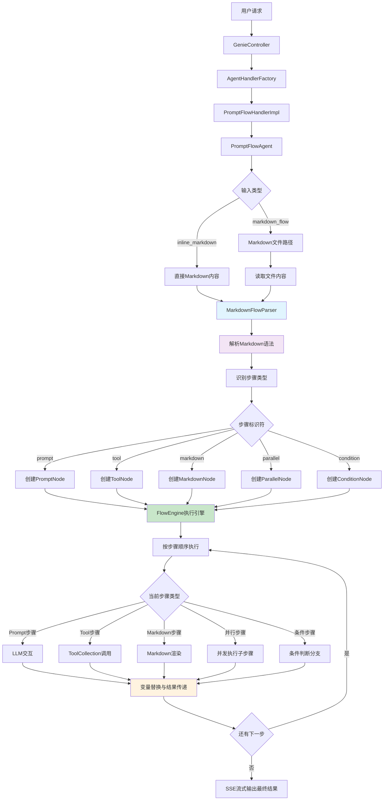

# PromptFlow Agent 架构设计文档

## 1. 概述

PromptFlow Agent 是基于JoyAgent-JDGenie现有架构设计的新型智能体，专门用于从配置文件加载长 prompt，定义工具和 markdown 流程。该 agent 旨在提供高度可配置、可扩展的 prompt 流程管理能力，支持复杂的多步骤任务编排和执行。

## 2. 设计目标

### 2.1 核心目标
- **配置化 Prompt 管理**: 支持从YAML/JSON配置文件加载复杂的长 prompt
- **工具定义和管理**: 允许在配置中定义专用工具和工具组合
- **Markdown 流程编排**: 支持基于 markdown 格式的流程定义和执行
- **动态流程控制**: 支持条件分支、循环、并行执行等流程控制
- **模板化设计**: 提供可重用的 prompt 模板和流程模板

### 2.2 技术目标
- **与现有架构无缝集成**: 基于现有的 Agent 架构和工具系统
- **高度可扩展性**: 支持自定义 prompt 处理器和流程节点
- **配置热加载**: 支持配置文件的动态加载和更新
- **流式输出**: 完整支持SSE流式输出和实时进度反馈

## 3. 系统架构设计

### 3.1 整体架构图



### 3.2 Markdown 解析流程图


### 3.3 用户体验对比

**传统复杂方式**:
```yaml
flowDefinition:
  startNode: "step1"
  nodes:
    - id: "step1"
      type: "PROMPT"
      promptTemplateId: "template1"
      properties:
        model: "gpt-4"
```

**PromptFlow 简化方式**:
```markdown
1. **数据分析** [prompt]
   > 请分析数据: {{user_data}}
```

### 3.4 核心组件设计

#### 3.4.1 PromptFlowAgent 主体类

```java
public class PromptFlowAgent extends BaseAgent {
    private PromptFlowConfig config;
    private FlowEngine flowEngine;
    private MarkdownFlowParser markdownParser;
    
    public PromptFlowAgent(AgentContext context) {
        super(context);
        this.markdownParser = new MarkdownFlowParser();
        this.flowEngine = new FlowEngine(context);
    }
    
    @Override
    public String step() {
        try {
            // 检查是否是直接传入的 Markdown 内容
            if (getContext().getInlineMarkdown() != null) {
                this.config = markdownParser.parseMarkdown(getContext().getInlineMarkdown());
            } else {
                // 加载 Markdown 文件
                String markdownPath = getMarkdownPath();
                String markdownContent = Files.readString(Paths.get(markdownPath));
                this.config = markdownParser.parseMarkdown(markdownContent);
            }
            
            // 初始化流程引擎
            flowEngine.initialize(config);
            
            // 执行流程
            return flowEngine.execute();
            
        } catch (Exception e) {
            log.error("PromptFlow execution failed", e);
            return handleError(e);
        }
    }
    
    private String getMarkdownPath() {
        // 从用户请求或默认配置获取 Markdown 文件路径
        return getContext().getMarkdownFlow() != null ? 
               getContext().getMarkdownFlow() : 
               "flows/default_flow.md";
    }
}
```

#### 3.4.2 Markdown 解析系统

**MarkdownFlowParser 核心解析器**

```java
@Component
public class MarkdownFlowParser {
    
    private static final Pattern STEP_PATTERN = Pattern.compile("^(\\d+)\\.(.*?)\\[(.*?)\\]");
    private static final Pattern CONFIG_PATTERN = Pattern.compile("^-\\s+(.*?):\\s+(.*)");
    private static final Pattern VARIABLE_PATTERN = Pattern.compile("\\{\\{(.*?)\\}\\}");
    
    public PromptFlowConfig parseMarkdown(String markdownContent) throws ParseException {
        String[] lines = markdownContent.split("\n");
        
        PromptFlowConfig.PromptFlowConfigBuilder configBuilder = PromptFlowConfig.builder();
        List<FlowStep> steps = new ArrayList<>();
        Map<String, Object> globalConfig = new HashMap<>();
        
        ParseState state = ParseState.HEADER;
        FlowStep currentStep = null;
        StringBuilder contentBuffer = new StringBuilder();
        
        for (String line : lines) {
            line = line.trim();
            
            switch (state) {
                case HEADER:
                    if (line.startsWith("# ")) {
                        configBuilder.name(line.substring(2).trim());
                    } else if (line.equals("## 配置")) {
                        state = ParseState.CONFIG;
                    }
                    break;
                    
                case CONFIG:
                    if (line.equals("## 流程步骤")) {
                        state = ParseState.STEPS;
                    } else if (line.startsWith("- ")) {
                        parseConfigLine(line, globalConfig);
                    }
                    break;
                    
                case STEPS:
                    if (isStepLine(line)) {
                        // 保存前一个步骤
                        if (currentStep != null) {
                            currentStep.setContent(contentBuffer.toString().trim());
                            steps.add(currentStep);
                        }
                        
                        // 解析新步骤
                        currentStep = parseStepLine(line);
                        contentBuffer = new StringBuilder();
                        state = ParseState.STEP_CONTENT;
                    }
                    break;
                    
                case STEP_CONTENT:
                    if (isStepLine(line)) {
                        // 保存当前步骤并开始新步骤
                        currentStep.setContent(contentBuffer.toString().trim());
                        steps.add(currentStep);
                        
                        currentStep = parseStepLine(line);
                        contentBuffer = new StringBuilder();
                    } else {
                        contentBuffer.append(line).append("\n");
                    }
                    break;
            }
        }
        
        // 保存最后一个步骤
        if (currentStep != null) {
            currentStep.setContent(contentBuffer.toString().trim());
            steps.add(currentStep);
        }
        
        return configBuilder
            .variables(globalConfig)
            .flowDefinition(convertToFlowDefinition(steps))
            .build();
    }
    
    private FlowStep parseStepLine(String line) {
        Matcher matcher = STEP_PATTERN.matcher(line);
        if (matcher.find()) {
            int stepNumber = Integer.parseInt(matcher.group(1));
            String stepName = matcher.group(2).trim();
            String stepType = matcher.group(3).trim();
            
            // 清理步骤名称中的markdown格式
            stepName = stepName.replaceAll("\\*\\*(.*?)\\*\\*", "$1");
            
            return FlowStep.builder()
                .stepNumber(stepNumber)
                .name(stepName)
                .type(parseStepType(stepType))
                .originalType(stepType)
                .build();
        }
        throw new ParseException("Invalid step format: " + line);
    }
}

@Data
@Builder
public class FlowStep {
    private int stepNumber;
    private String name;
    private StepType type;
    private String originalType;
    private String content;
}

public enum StepType {
    PROMPT, TOOL, MARKDOWN, PARALLEL, CONDITION, LOOP, UNKNOWN
}
```

**简化的配置模型**

```java
@Data
@Builder
@NoArgsConstructor
@AllArgsConstructor
public class PromptFlowConfig {
    private String name;
    private String version;
    private String description;
    private Map<String, Object> variables;
    private FlowDefinition flowDefinition;
    private Map<String, Object> settings;
    
    // 从Markdown解析的配置更加简化
    // 不需要复杂的模板定义，内容直接嵌入在节点中
}
```

#### 3.4.3 流程引擎设计

**FlowEngine 核心引擎**

```java
@Component
public class FlowEngine {
    private final AgentContext agentContext;
    private final FlowExecutor flowExecutor;
    private final PromptProcessor promptProcessor;
    private final MarkdownProcessor markdownProcessor;
    
    public FlowEngine(AgentContext agentContext) {
        this.agentContext = agentContext;
        this.flowExecutor = new FlowExecutor(agentContext);
        this.promptProcessor = new PromptProcessor(agentContext);
        this.markdownProcessor = new MarkdownProcessor();
    }
    
    public String execute() throws FlowExecutionException {
        FlowContext flowContext = new FlowContext();
        flowContext.setGlobalVariables(config.getFlowDefinition().getGlobalVariables());
        
        String currentNodeId = config.getFlowDefinition().getStartNode();
        StringBuilder result = new StringBuilder();
        
        while (currentNodeId != null) {
            FlowNode currentNode = findNodeById(currentNodeId);
            if (currentNode == null) {
                throw new FlowExecutionException("Node not found: " + currentNodeId);
            }
            
            // 执行当前节点
            NodeExecutionResult nodeResult = executeNode(currentNode, flowContext);
            result.append(nodeResult.getOutput());
            
            // 更新流程上下文
            flowContext.merge(nodeResult.getContext());
            
            // 确定下一个节点
            currentNodeId = determineNextNode(currentNode, nodeResult, flowContext);
            
            // 发送流式输出
            sendStreamOutput(nodeResult);
        }
        
        return result.toString();
    }
    
    private NodeExecutionResult executeNode(FlowNode node, FlowContext context) {
        switch (node.getType()) {
            case PROMPT:
                return executePromptNode((PromptNode) node, context);
            case TOOL:
                return executeToolNode((ToolNode) node, context);
            case MARKDOWN:
                return executeMarkdownNode((MarkdownNode) node, context);
            case CONTROL:
                return executeControlNode((ControlNode) node, context);
            default:
                throw new FlowExecutionException("Unsupported node type: " + node.getType());
        }
    }
}
```

#### 3.4.4 节点类型设计

**FlowNode 基础节点**

```java
@Data
@JsonTypeInfo(use = JsonTypeInfo.Id.NAME, property = "type")
@JsonSubTypes({
    @JsonSubTypes.Type(value = PromptNode.class, name = "PROMPT"),
    @JsonSubTypes.Type(value = ToolNode.class, name = "TOOL"),
    @JsonSubTypes.Type(value = MarkdownNode.class, name = "MARKDOWN"),
    @JsonSubTypes.Type(value = ControlNode.class, name = "CONTROL")
})
public abstract class FlowNode {
    private String id;
    private String name;
    private String description;
    private NodeType type;
    private Map<String, Object> properties;
    private List<String> inputs;
    private List<String> outputs;
    
    public abstract NodeExecutionResult execute(FlowContext context);
}

public enum NodeType {
    PROMPT,     // Prompt处理节点
    TOOL,       // 工具调用节点
    MARKDOWN,   // Markdown处理节点
    CONTROL,    // 流程控制节点
    PARALLEL,   // 并行执行节点
    CONDITION,  // 条件分支节点
    LOOP,       // 循环节点
    MERGE       // 结果合并节点
}
```

**PromptNode 实现**

```java
@Data
@EqualsAndHashCode(callSuper = true)
public class PromptNode extends FlowNode {
    private String promptTemplateId;
    private Map<String, String> templateVariables;
    private String model;
    private Integer maxTokens;
    private Double temperature;
    
    @Override
    public NodeExecutionResult execute(FlowContext context) {
        try {
            // 获取 prompt 模板
            PromptTemplate template = context.getPromptTemplate(promptTemplateId);
            if (template == null) {
                throw new NodeExecutionException("Prompt template not found: " + promptTemplateId);
            }
            
            // 渲染 prompt
            String renderedPrompt = renderPrompt(template, context);
            
            // 调用 LLM
            LLM llm = new LLM(model != null ? model : "default", "");
            CompletableFuture<String> future = llm.ask(
                context.getAgentContext(),
                Arrays.asList(Message.userMessage(renderedPrompt, null)),
                null,
                context.getAgentContext().getIsStream(),
                maxTokens != null ? maxTokens : 4000
            );
            
            String response = future.get();
            
            // 构建执行结果
            return NodeExecutionResult.builder()
                .nodeId(getId())
                .success(true)
                .output(response)
                .context(createOutputContext(response))
                .build();
                
        } catch (Exception e) {
            log.error("PromptNode execution failed", e);
            return NodeExecutionResult.builder()
                .nodeId(getId())
                .success(false)
                .error(e.getMessage())
                .build();
        }
    }
    
    private String renderPrompt(PromptTemplate template, FlowContext context) {
        String prompt = template.getTemplate();
        
        // 替换模板变量
        for (Map.Entry<String, String> entry : templateVariables.entrySet()) {
            String value = context.getVariable(entry.getValue(), entry.getKey());
            prompt = prompt.replace("{{" + entry.getKey() + "}}", value);
        }
        
        // 替换全局变量
        for (Map.Entry<String, Object> entry : context.getGlobalVariables().entrySet()) {
            prompt = prompt.replace("{{" + entry.getKey() + "}}", String.valueOf(entry.getValue()));
        }
        
        return prompt;
    }
}
```

**ToolNode 实现**

```java
@Data
@EqualsAndHashCode(callSuper = true)
public class ToolNode extends FlowNode {
    private String toolName;
    private Map<String, Object> toolParameters;
    private boolean async;
    private Integer timeout;
    
    @Override
    public NodeExecutionResult execute(FlowContext context) {
        try {
            // 获取工具
            ToolCollection toolCollection = context.getAgentContext().getToolCollection();
            BaseTool tool = toolCollection.getTool(toolName);
            
            if (tool == null) {
                throw new NodeExecutionException("Tool not found: " + toolName);
            }
            
            // 准备工具参数
            Map<String, Object> resolvedParams = resolveParameters(toolParameters, context);
            
            // 执行工具
            Object result;
            if (async) {
                result = executeToolAsync(tool, resolvedParams);
            } else {
                result = tool.execute(resolvedParams);
            }
            
            return NodeExecutionResult.builder()
                .nodeId(getId())
                .success(true)
                .output(String.valueOf(result))
                .context(createOutputContext(result))
                .build();
                
        } catch (Exception e) {
            log.error("ToolNode execution failed", e);
            return NodeExecutionResult.builder()
                .nodeId(getId())
                .success(false)
                .error(e.getMessage())
                .build();
        }
    }
    
    private Map<String, Object> resolveParameters(Map<String, Object> params, FlowContext context) {
        Map<String, Object> resolved = new HashMap<>();
        
        for (Map.Entry<String, Object> entry : params.entrySet()) {
            Object value = entry.getValue();
            if (value instanceof String) {
                String strValue = (String) value;
                // 解析变量引用 ${variable_name}
                if (strValue.startsWith("${") && strValue.endsWith("}")) {
                    String varName = strValue.substring(2, strValue.length() - 1);
                    value = context.getVariable(varName, strValue);
                }
            }
            resolved.put(entry.getKey(), value);
        }
        
        return resolved;
    }
}
```

**MarkdownNode 实现**

```java
@Data
@EqualsAndHashCode(callSuper = true)
public class MarkdownNode extends FlowNode {
    private String markdownContent;
    private String templatePath;
    private MarkdownRenderType renderType;
    private Map<String, Object> renderOptions;
    
    @Override
    public NodeExecutionResult execute(FlowContext context) {
        try {
            String content = getMarkdownContent(context);
            String renderedContent = renderMarkdown(content, context);
            
            return NodeExecutionResult.builder()
                .nodeId(getId())
                .success(true)
                .output(renderedContent)
                .context(createOutputContext(renderedContent))
                .build();
                
        } catch (Exception e) {
            log.error("MarkdownNode execution failed", e);
            return NodeExecutionResult.builder()
                .nodeId(getId())
                .success(false)
                .error(e.getMessage())
                .build();
        }
    }
    
    private String getMarkdownContent(FlowContext context) {
        if (markdownContent != null) {
            return resolveVariables(markdownContent, context);
        } else if (templatePath != null) {
            // 从文件加载 markdown 模板
            try {
                String template = Files.readString(Paths.get(templatePath));
                return resolveVariables(template, context);
            } catch (IOException e) {
                throw new NodeExecutionException("Failed to load markdown template: " + templatePath, e);
            }
        } else {
            throw new NodeExecutionException("No markdown content or template specified");
        }
    }
    
    private String renderMarkdown(String content, FlowContext context) {
        switch (renderType) {
            case HTML:
                return markdownToHtml(content);
            case PLAIN:
                return content;
            case FORMATTED:
                return formatMarkdown(content);
            default:
                return content;
        }
    }
}

public enum MarkdownRenderType {
    HTML,       // 渲染为HTML
    PLAIN,      // 纯文本输出
    FORMATTED   // 格式化输出
}
```

## 4. 简化的 Markdown 流程定义格式

### 4.1 设计理念

为了让新手用户能够轻松定义 prompt 流程，我们采用简单直观的 Markdown 格式：
- 使用有序列表 `1.`, `2.`, `3.` 定义执行步骤
- 支持嵌套列表表示并行或子步骤
- 使用特殊语法标识工具调用和配置
- 支持内联 prompt 定义和变量替换

### 4.2 基础语法规则

#### 4.2.1 步骤定义语法

```markdown
# 流程名称

## 配置
- 作者: {{author}}
- 模型: gpt-4
- 输出格式: html

## 流程步骤

1. **初始分析** [prompt]
   > 你是一个专业的数据分析师，请分析用户提供的数据文件。
   > 
   > 用户需求: {{user_input}}
   > 文件: {{input_file}}

2. **文件处理** [tool:file_tool]
   - 文件路径: {{input_file}}
   - 操作: read_and_analyze

3. **数据分析** [tool:code_interpreter]
   ```python
   import pandas as pd
   # 读取和分析数据
   data = pd.read_csv('{{input_file}}')
   summary = data.describe()
   print(summary)
   ```

4. **生成报告** [markdown]
   ```markdown
   # 数据分析报告
   
   **分析师**: {{author}}
   **时间**: {{current_date}}
   
   ## 分析结果
   {{analysis_result}}
   ```

5. **总结** [prompt]
   > 基于以上分析结果，生成一个简洁的执行摘要，突出关键发现和建议。
```

#### 4.2.2 语法说明

**步骤类型标识**：
- `[prompt]` - LLM 对话步骤
- `[tool:工具名]` - 工具调用步骤  
- `[markdown]` - Markdown 内容生成步骤
- `[parallel]` - 并行执行步骤
- `[if:条件]` - 条件分支步骤

**变量引用**：
- `{{变量名}}` - 引用全局变量或上一步的输出
- `{{user_input}}` - 用户输入
- `{{current_date}}` - 当前日期
- `{{step_1_result}}` - 第1步的执行结果

### 4.3 完整示例

#### 4.3.1 数据分析流程示例

```markdown
# 销售数据分析流程

## 配置
- 作者: AI分析师
- 模型: gpt-4
- 温度: 0.1
- 最大令牌: 4000

## 流程步骤

1. **数据文件读取** [tool:file_tool]
   - 操作: upload
   - 文件: {{user_file}}

2. **初步数据探索** [tool:code_interpreter]
   ```python
   import pandas as pd
   import matplotlib.pyplot as plt
   
   # 读取数据
   df = pd.read_csv('{{user_file}}')
   print("数据形状:", df.shape)
   print("数据类型:")
   print(df.dtypes)
   print("前5行数据:")
   print(df.head())
   ```

3. **数据质量检查** [tool:code_interpreter]
   ```python
   # 检查缺失值
   missing_data = df.isnull().sum()
   print("缺失值统计:")
   print(missing_data[missing_data > 0])
   
   # 基础统计信息
   print("数值列统计:")
   print(df.describe())
   ```

4. **趋势分析** [parallel]
   4.1. **销售趋势图** [tool:code_interpreter]
       ```python
       # 绘制销售趋势
       plt.figure(figsize=(12, 6))
       df.groupby('date')['sales'].sum().plot(kind='line')
       plt.title('销售趋势分析')
       plt.savefig('sales_trend.png')
       plt.show()
       ```
   
   4.2. **产品分析** [tool:code_interpreter]
       ```python
       # 产品销量分析
       product_sales = df.groupby('product')['sales'].sum().sort_values(ascending=False)
       print("产品销量排行:")
       print(product_sales.head(10))
       ```

5. **生成分析报告** [prompt]
   > 你是一名资深数据分析师，请基于以下数据分析结果生成一份专业的销售分析报告：
   > 
   > 数据概览: {{step_2_result}}
   > 数据质量: {{step_3_result}}  
   > 销售趋势: {{step_4_1_result}}
   > 产品分析: {{step_4_2_result}}
   > 
   > 请按以下结构输出报告：
   > 1. 执行摘要
   > 2. 数据概览
   > 3. 关键发现
   > 4. 趋势分析
   > 5. 产品洞察
   > 6. 行动建议

6. **格式化输出** [markdown]
   ```markdown
   # 销售数据分析报告
   
   **分析师**: {{author}}  
   **分析时间**: {{current_date}}  
   **数据文件**: {{user_file}}
   
   {{step_5_result}}
   
   ---
   *本报告由 PromptFlow Agent 自动生成*
   ```
```

#### 4.3.2 客服对话流程示例

```markdown
# 智能客服对话流程

## 配置
- 公司: JoyAgent
- 服务等级: 高级
- 模型: gpt-3.5-turbo

## 流程步骤

1. **问候客户** [prompt]
   > 你是 {{company}} 的智能客服助手，请礼貌专业地问候客户。
   > 
   > 服务等级: {{service_level}}
   > 当前时间: {{current_time}}
   > 
   > 客户消息: {{user_message}}

2. **意图识别** [tool:intent_classifier]
   - 文本: {{user_message}}
   - 分类: ["咨询", "投诉", "技术支持", "销售"]

3. **智能回复** [if:{{step_2_result}} == "咨询"]
   
   3.1. **咨询处理** [tool:knowledge_search]
        - 查询: {{user_message}}
        - 类别: inquiry
   
   3.2. **生成回复** [prompt]
        > 基于知识库搜索结果，为客户提供准确的回复：
        > 
        > 客户问题: {{user_message}}
        > 知识库结果: {{step_3_1_result}}
        > 
        > 要求：专业、友好、准确

4. **投诉处理** [if:{{step_2_result}} == "投诉"]
   
   4.1. **记录投诉** [tool:complaint_recorder]
        - 客户ID: {{customer_id}}
        - 投诉内容: {{user_message}}
        - 紧急程度: 中等
   
   4.2. **安抚回复** [prompt]
        > 客户提出了投诉，请给出专业的安抚回复：
        > 
        > 投诉内容: {{user_message}}
        > 
        > 要求：
        > - 表示歉意和重视
        > - 说明处理流程
        > - 给出预期时间

5. **回复总结** [prompt]
   > 请对本次客服对话进行总结：
   > 
   > 客户意图: {{step_2_result}}
   > 处理结果: {{step_3_result}}{{step_4_result}}
   > 
   > 生成简洁的服务总结。
```

### 4.4 高级语法特性

#### 4.4.1 条件分支

```markdown
1. **检查文件类型** [if:{{file_extension}} == ".csv"]
   1.1. **CSV处理** [tool:csv_processor]
   1.2. **数据验证** [tool:data_validator]

2. **Excel文件处理** [if:{{file_extension}} == ".xlsx"]
   2.1. **Excel读取** [tool:excel_reader]
   2.2. **工作表分析** [tool:sheet_analyzer]
```

#### 4.4.2 循环处理

```markdown
1. **批量处理文件** [loop:{{file_list}}]
   1.1. **处理当前文件** [tool:file_processor]
        - 文件: {{current_file}}
   1.2. **生成报告** [prompt]
        > 为文件 {{current_file}} 生成处理报告
```

#### 4.4.3 并行执行

```markdown
1. **多维度分析** [parallel]
   1.1. **文本分析** [tool:text_analyzer]
   1.2. **情感分析** [tool:sentiment_analyzer]  
   1.3. **关键词提取** [tool:keyword_extractor]

2. **结果汇总** [prompt]
   > 汇总以下分析结果：
   > - 文本分析: {{step_1_1_result}}
   > - 情感分析: {{step_1_2_result}}
   > - 关键词: {{step_1_3_result}}
```

### 4.5 内置变量和函数

#### 4.5.1 系统变量
- `{{current_date}}` - 当前日期
- `{{current_time}}` - 当前时间  
- `{{user_input}}` - 用户输入
- `{{user_file}}` - 用户上传的文件
- `{{step_N_result}}` - 第N步的执行结果

#### 4.5.2 配置变量
- `{{author}}` - 作者名称
- `{{model}}` - 使用的模型
- `{{company}}` - 公司名称
- 用户自定义变量

### 4.6 错误处理

```markdown
1. **尝试文件读取** [tool:file_reader]
   - 文件: {{user_file}}
   - 错误处理: 继续到步骤3

2. **数据处理** [tool:data_processor]
   - 数据: {{step_1_result}}

3. **错误回退** [if:{{step_1_error}}]
   > 文件读取失败，请检查文件格式是否正确。
   > 
   > 错误信息: {{step_1_error_message}}
```
```

## 5. Handler Service 设计

### 5.1 PromptFlowHandlerImpl

```java
@Component
public class PromptFlowHandlerImpl implements AgentHandlerService {
    
    @Override
    public String handle(AgentContext agentContext, AgentRequest request) {
        try {
            // 创建 PromptFlow Agent
            PromptFlowAgent agent = new PromptFlowAgent(agentContext);
            
            // 设置 Markdown 内容或文件路径
            setupMarkdownContent(agentContext, request);
            
            // 执行流程
            return agent.run(request.getQuery());
            
        } catch (Exception e) {
            log.error("PromptFlow execution failed", e);
            return "执行失败: " + e.getMessage();
        }
    }
    
    @Override
    public Boolean support(AgentContext agentContext, AgentRequest request) {
        // 支持 AgentType.PROMPT_FLOW (新增类型)
        return AgentType.PROMPT_FLOW.getValue().equals(request.getAgentType());
    }
    
    private void setupMarkdownContent(AgentContext agentContext, AgentRequest request) {
        Map<String, Object> params = request.getParams();
        if (params == null) return;
        
        // 优先使用内联 Markdown 内容
        if (params.containsKey("inline_markdown")) {
            agentContext.setInlineMarkdown((String) params.get("inline_markdown"));
        } 
        // 其次使用 Markdown 文件路径
        else if (params.containsKey("markdown_flow")) {
            agentContext.setMarkdownFlow((String) params.get("markdown_flow"));
        }
        
        // 设置流程变量
        if (params.containsKey("variables")) {
            agentContext.setFlowVariables((Map<String, Object>) params.get("variables"));
        }
    }
}
```

### 5.2 ResponseHandler 设计

```java
@Component
public class PromptFlowAgentResponseHandler extends BaseAgentResponseHandler {
    
    @Override
    protected GptProcessResult handleResponse(AgentRequest request, 
                                            AgentResponse response,
                                            List<AgentResponse> responseList, 
                                            EventResult eventResult) {
        
        GptProcessResult result = new GptProcessResult();
        result.setSuccess(true);
        
        // 处理流程执行结果
        if (response.getContent() != null) {
            result.setContent(response.getContent());
            result.setMessageType("prompt_flow_result");
        }
        
        // 处理流程进度信息
        if (response.getToolCalls() != null) {
            result.setToolCalls(response.getToolCalls());
        }
        
        // 设置流程状态
        Map<String, Object> metadata = new HashMap<>();
        metadata.put("flow_status", "completed");
        metadata.put("execution_time", System.currentTimeMillis() - request.getStartTime());
        result.setMetadata(metadata);
        
        return result;
    }
    
    @Override
    public Boolean support(AgentRequest request, AgentResponse response) {
        return AgentType.PROMPT_FLOW.getValue().equals(request.getAgentType());
    }
}
```

## 6. 工具扩展设计

### 6.1 PromptFlowTool 管理工具

```java
@Component
public class PromptFlowTool extends BaseTool {
    
    @Override
    public String getName() {
        return "prompt_flow";
    }
    
    @Override
    public String getDescription() {
        return "PromptFlow 流程管理工具，支持加载、执行、管理 prompt 流程";
    }
    
    @Override
    public Map<String, Object> toParams() {
        Map<String, Object> parameters = new HashMap<>();
        parameters.put("type", "object");
        
        Map<String, Object> properties = new HashMap<>();
        
        // command 参数
        Map<String, Object> command = new HashMap<>();
        command.put("type", "string");
        command.put("enum", Arrays.asList("execute_markdown", "execute_file", "validate", "list", "create_template"));
        command.put("description", "操作命令：execute_markdown-执行Markdown内容, execute_file-执行Markdown文件, validate-验证格式, list-列出模板, create_template-创建模板");
        properties.put("command", command);
        
        // markdown_content 参数
        Map<String, Object> markdownContent = new HashMap<>();
        markdownContent.put("type", "string");
        markdownContent.put("description", "Markdown格式的流程内容");
        properties.put("markdown_content", markdownContent);
        
        // markdown_file 参数
        Map<String, Object> markdownFile = new HashMap<>();
        markdownFile.put("type", "string");
        markdownFile.put("description", "Markdown文件路径");
        properties.put("markdown_file", markdownFile);
        
        // variables 参数
        Map<String, Object> variables = new HashMap<>();
        variables.put("type", "object");
        variables.put("description", "流程变量");
        properties.put("variables", variables);
        
        parameters.put("properties", properties);
        parameters.put("required", Arrays.asList("command"));
        
        return parameters;
    }
    
    @Override
    public Object execute(Object input) {
        try {
            Map<String, Object> params = (Map<String, Object>) input;
            String command = (String) params.get("command");
            
            switch (command) {
                case "execute_markdown":
                    return executeMarkdownContent(params);
                case "execute_file":
                    return executeMarkdownFile(params);
                case "validate":
                    return validateMarkdown(params);
                case "list":
                    return listAvailableTemplates();
                case "create_template":
                    return createTemplate(params);
                default:
                    return "不支持的命令: " + command;
            }
            
        } catch (Exception e) {
            log.error("PromptFlowTool execution failed", e);
            return "工具执行失败: " + e.getMessage();
        }
    }
    
    private Object executeMarkdownContent(Map<String, Object> params) {
        String markdownContent = (String) params.get("markdown_content");
        if (markdownContent == null) {
            return "错误: 缺少 Markdown 内容";
        }
        
        try {
            PromptFlowAgent agent = new PromptFlowAgent(agentContext);
            agentContext.setInlineMarkdown(markdownContent);
            
            Map<String, Object> variables = (Map<String, Object>) params.get("variables");
            if (variables != null) {
                agentContext.setFlowVariables(variables);
            }
            
            String result = agent.step();
            return "Markdown 流程执行完成: " + result;
            
        } catch (Exception e) {
            return "Markdown 流程执行失败: " + e.getMessage();
        }
    }
    
    private Object executeMarkdownFile(Map<String, Object> params) {
        String markdownFile = (String) params.get("markdown_file");
        if (markdownFile == null) {
            return "错误: 缺少 Markdown 文件路径";
        }
        
        try {
            PromptFlowAgent agent = new PromptFlowAgent(agentContext);
            agentContext.setMarkdownFlow(markdownFile);
            
            Map<String, Object> variables = (Map<String, Object>) params.get("variables");
            if (variables != null) {
                agentContext.setFlowVariables(variables);
            }
            
            String result = agent.step();
            return "Markdown 文件执行完成: " + result;
            
        } catch (Exception e) {
            return "Markdown 文件执行失败: " + e.getMessage();
        }
    }
    
    private Object validateMarkdown(Map<String, Object> params) {
        String markdownContent = (String) params.get("markdown_content");
        if (markdownContent == null) {
            return "错误: 缺少要验证的 Markdown 内容";
        }
        
        try {
            MarkdownFlowParser parser = new MarkdownFlowParser();
            PromptFlowConfig config = parser.parseMarkdown(markdownContent);
            
            return String.format("Markdown 格式验证通过: %s", config.getName());
        } catch (Exception e) {
            return "Markdown 格式验证失败: " + e.getMessage();
        }
    }
    
    private Object listAvailableTemplates() {
        try {
            File templateDir = new File("flows/templates");
            if (!templateDir.exists()) {
                return "模板目录不存在";
            }
            
            File[] templateFiles = templateDir.listFiles((dir, name) -> name.endsWith(".md"));
            
            if (templateFiles == null || templateFiles.length == 0) {
                return "未找到可用的 Markdown 模板";
            }
            
            StringBuilder result = new StringBuilder("可用的 Markdown 模板:\n");
            for (File file : templateFiles) {
                result.append("- ").append(file.getName()).append("\n");
            }
            
            return result.toString();
            
        } catch (Exception e) {
            return "列出模板失败: " + e.getMessage();
        }
    }
    
    private Object createTemplate(Map<String, Object> params) {
        String templateName = (String) params.get("template_name");
        String templateType = (String) params.get("template_type");
        
        if (templateName == null) {
            return "错误: 缺少模板名称";
        }
        
        try {
            String templateContent = generateTemplate(templateType != null ? templateType : "basic");
            String filePath = "flows/templates/" + templateName + ".md";
            
            Files.write(Paths.get(filePath), templateContent.getBytes());
            
            return "成功创建模板: " + filePath;
        } catch (Exception e) {
            return "创建模板失败: " + e.getMessage();
        }
    }
    
    private String generateTemplate(String type) {
        switch (type) {
            case "data_analysis":
                return "# 数据分析模板\n\n## 配置\n- 作者: {{author}}\n- 模型: gpt-4\n\n## 流程步骤\n\n1. **读取数据** [tool:file_tool]\n   - 文件: {{input_file}}\n\n2. **数据分析** [tool:code_interpreter]\n   ```python\n   import pandas as pd\n   df = pd.read_csv('{{input_file}}')\n   print(df.describe())\n   ```\n\n3. **生成报告** [prompt]\n   > 基于数据分析结果生成报告: {{step_2_result}}";
            
            case "customer_service":
                return "# 客服模板\n\n## 配置\n- 公司: {{company}}\n- 模型: gpt-3.5-turbo\n\n## 流程步骤\n\n1. **问候** [prompt]\n   > 你是{{company}}客服，问候客户: {{user_message}}\n\n2. **意图识别** [tool:intent_classifier]\n   - 文本: {{user_message}}\n\n3. **智能回复** [prompt]\n   > 根据意图{{step_2_result}}回复客户: {{user_message}}";
            
            default:
                return "# 基础模板\n\n## 配置\n- 作者: AI助手\n- 模型: gpt-4\n\n## 流程步骤\n\n1. **处理请求** [prompt]\n   > 请处理用户请求: {{user_input}}";
        }
    }
}
```

## 7. 集成配置

### 7.1 AgentType 枚举扩展

```java
public enum AgentType {
    COMPREHENSIVE(1),   // 未实现
    WORKFLOW(2),        // 工作流型
    PLAN_SOLVE(3),      // 已实现 - 计划解决型
    ROUTER(4),          // 未实现  
    REACT(5),           // 已实现 - 反应型
    PROMPT_FLOW(6);     // 新增 - PromptFlow型
    
    private final Integer value;
    
    AgentType(Integer value) {
        this.value = value;
    }
    
    public Integer getValue() {
        return value;
    }
}
```

### 7.2 Handler 注册配置

```java
@Configuration
public class AgentHandlerConfig {
    
    @Bean
    public Map<AgentType, AgentResponseHandler> handlerMap(
            ReactAgentResponseHandler reactHandler,
            PlanSolveAgentResponseHandler planSolveHandler,
            WorkflowAgentResponseHandler workflowHandler,
            PromptFlowAgentResponseHandler promptFlowHandler) {
        
        Map<AgentType, AgentResponseHandler> map = new HashMap<>();
        map.put(AgentType.REACT, reactHandler);
        map.put(AgentType.PLAN_SOLVE, planSolveHandler);
        map.put(AgentType.WORKFLOW, workflowHandler);
        map.put(AgentType.PROMPT_FLOW, promptFlowHandler); // 新增
        return map;
    }
}
```

### 7.3 AgentHandlerFactory 更新

```java
@Component
public class AgentHandlerFactory {
    
    private List<AgentHandlerService> handlers;
    
    private void initHandlers() {
        handlers = new ArrayList<>();
        handlers.add(new ReactHandlerImpl());
        handlers.add(new PlanSolveHandlerImpl());
        handlers.add(new WorkflowHandlerImpl());
        handlers.add(new PromptFlowHandlerImpl()); // 新增
    }
    
    public AgentHandlerService getHandler(AgentContext context, AgentRequest request) {
        for (AgentHandlerService handler : handlers) {
            if (handler.support(context, request)) {
                return handler;
            }
        }
        return null;
    }
}
```

## 8. 使用示例

### 8.1 简化的 Markdown 流程文件

用户只需要创建一个简单的 `.md` 文件：

**sales_analysis.md**
```markdown
# 销售数据分析

## 配置
- 作者: AI分析师
- 模型: gpt-4

## 流程步骤

1. **读取数据** [tool:file_tool]
   - 操作: read
   - 文件: {{user_file}}

2. **数据探索** [tool:code_interpreter]
   ```python
   import pandas as pd
   df = pd.read_csv('{{user_file}}')
   print("数据概览:", df.shape)
   print(df.head())
   ```

3. **生成报告** [prompt]
   > 你是数据分析专家，基于以下数据生成分析报告：
   > 
   > 数据信息: {{step_2_result}}
   > 
   > 请提供：数据概览、关键发现、建议
```

### 8.2 API 调用示例

```json
{
  "query": "分析我的销售数据",
  "agentType": 6,
  "params": {
    "markdown_flow": "sales_analysis.md",
    "variables": {
      "user_file": "data/sales_2024.csv",
      "author": "数据分析师"
    }
  }
}
```

### 8.3 更简单的客服流程示例

**customer_service.md**
```markdown
# 智能客服

## 配置
- 公司: JoyAgent
- 模型: gpt-3.5-turbo

## 流程步骤

1. **问候** [prompt]
   > 你是{{company}}客服，请问候客户：{{user_message}}

2. **意图识别** [tool:intent_classifier]
   - 文本: {{user_message}}
   - 类别: ["咨询", "投诉", "支持"]

3. **智能回复** [if:{{step_2_result}} == "咨询"]
   > 为客户咨询提供专业回复：{{user_message}}

4. **投诉处理** [if:{{step_2_result}} == "投诉"]
   > 客户投诉，请给出安抚回复：{{user_message}}
```

### 8.4 工具调用示例

```json
{
  "tool_name": "prompt_flow",
  "parameters": {
    "command": "execute_markdown",
    "markdown_content": "# 简单分析\n\n1. **分析** [prompt]\n   > 分析这个问题: {{user_input}}",
    "variables": {
      "user_input": "如何提升销售业绩"
    }
  }
}
```

### 8.5 直接传递 Markdown 内容

```json
{
  "query": "帮我分析数据",
  "agentType": 6,
  "params": {
    "inline_markdown": "# 数据分析\n\n1. **读取文件** [tool:file_tool]\n   - 文件: {{user_file}}\n\n2. **分析** [prompt]\n   > 分析数据: {{step_1_result}}",
    "variables": {
      "user_file": "data.csv"
    }
  }
}
```

## 9. 高级特性

### 9.1 条件分支支持

```yaml
nodes:
  - id: "decision_node"
    name: "条件判断"
    type: "CONTROL"
    controlType: "CONDITION"
    condition: "${confidence_score} > 0.8"
    trueNode: "high_confidence_node"
    falseNode: "low_confidence_node"
```

### 9.2 循环执行支持

```yaml
nodes:
  - id: "retry_node"
    name: "重试处理"
    type: "CONTROL"
    controlType: "LOOP"
    loopCondition: "${retry_count} < 3 && ${success} == false"
    loopBody: "process_node"
    maxIterations: 5
```

### 9.3 并行执行支持

```yaml
nodes:
  - id: "parallel_analysis"
    name: "并行分析"
    type: "PARALLEL"
    subNodes:
      - id: "text_analysis"
        type: "TOOL"
        toolName: "text_analyzer"
      - id: "sentiment_analysis"  
        type: "TOOL"
        toolName: "sentiment_analyzer"
      - id: "keyword_extraction"
        type: "TOOL"
        toolName: "keyword_extractor"
    mergeStrategy: "WAIT_ALL"  # WAIT_ALL, WAIT_ANY, FIRST_SUCCESS
```

### 9.4 错误处理和重试

```yaml
nodes:
  - id: "robust_node"
    name: "健壮处理节点"
    type: "TOOL"
    toolName: "external_api"
    properties:
      retryPolicy:
        maxRetries: 3
        retryDelay: 1000
        backoffMultiplier: 2
      errorHandling:
        onError: "fallback_node"
        ignoreErrors: false
      timeout: 30000
```

## 10. 监控和日志

### 10.1 执行监控

```java
@Component
public class PromptFlowMonitor {
    
    public void recordFlowExecution(String flowId, String nodeId, 
                                   long executionTime, boolean success) {
        // 记录执行指标
        FlowMetrics metrics = FlowMetrics.builder()
            .flowId(flowId)
            .nodeId(nodeId)
            .executionTime(executionTime)
            .success(success)
            .timestamp(System.currentTimeMillis())
            .build();
            
        // 发送到监控系统
        monitoringService.record(metrics);
    }
    
    public FlowExecutionReport generateReport(String flowId) {
        // 生成执行报告
        List<FlowMetrics> metrics = getFlowMetrics(flowId);
        return FlowExecutionReport.builder()
            .flowId(flowId)
            .totalExecutionTime(calculateTotalTime(metrics))
            .successRate(calculateSuccessRate(metrics))
            .nodePerformance(calculateNodePerformance(metrics))
            .build();
    }
}
```

### 10.2 日志记录

```java
@Slf4j
public class PromptFlowLogger {
    
    public void logFlowStart(String flowId, PromptFlowConfig config) {
        log.info("PromptFlow started: {} - {}", flowId, config.getName());
    }
    
    public void logNodeExecution(String flowId, String nodeId, 
                                String nodeType, Object result) {
        log.info("Node executed: {} -> {} ({}) -> {}", 
                flowId, nodeId, nodeType, 
                result != null ? "SUCCESS" : "FAILED");
    }
    
    public void logFlowCompletion(String flowId, boolean success, 
                                 long totalTime) {
        if (success) {
            log.info("PromptFlow completed successfully: {} in {}ms", 
                    flowId, totalTime);
        } else {
            log.error("PromptFlow failed: {} after {}ms", flowId, totalTime);
        }
    }
}
```

## 11. 性能优化

### 11.1 缓存策略

```java
@Component
public class PromptFlowCache {
    
    private final Cache<String, PromptFlowConfig> configCache;
    private final Cache<String, NodeExecutionResult> resultCache;
    
    public PromptFlowCache() {
        this.configCache = Caffeine.newBuilder()
            .maximumSize(100)
            .expireAfterWrite(Duration.ofMinutes(30))
            .build();
            
        this.resultCache = Caffeine.newBuilder()
            .maximumSize(1000)
            .expireAfterWrite(Duration.ofMinutes(10))
            .build();
    }
    
    public PromptFlowConfig getConfig(String configPath) {
        return configCache.get(configPath, this::loadConfigFromFile);
    }
    
    public void invalidateConfig(String configPath) {
        configCache.invalidate(configPath);
    }
}
```

### 11.2 异步执行优化

```java
@Component
public class AsyncFlowExecutor {
    
    private final ThreadPoolExecutor executorService;
    
    public AsyncFlowExecutor() {
        this.executorService = new ThreadPoolExecutor(
            5, 20, 60L, TimeUnit.SECONDS,
            new LinkedBlockingQueue<>(100),
            new ThreadFactoryBuilder()
                .setNameFormat("prompt-flow-%d")
                .build()
        );
    }
    
    public CompletableFuture<NodeExecutionResult> executeNodeAsync(
            FlowNode node, FlowContext context) {
        return CompletableFuture.supplyAsync(() -> {
            try {
                return node.execute(context);
            } catch (Exception e) {
                log.error("Async node execution failed", e);
                return NodeExecutionResult.builder()
                    .nodeId(node.getId())
                    .success(false)
                    .error(e.getMessage())
                    .build();
            }
        }, executorService);
    }
}
```

## 12. 安全考虑

### 12.1 配置文件验证

```java
@Component
public class ConfigValidator {
    
    public ValidationResult validateConfig(PromptFlowConfig config) {
        ValidationResult result = new ValidationResult();
        
        // 基础验证
        if (config.getName() == null || config.getName().trim().isEmpty()) {
            result.addError("配置名称不能为空");
        }
        
        if (config.getFlowDefinition() == null) {
            result.addError("流程定义不能为空");
        }
        
        // 节点验证
        validateNodes(config.getFlowDefinition().getNodes(), result);
        
        // 工具定义验证
        validateToolDefinitions(config.getToolDefinitions(), result);
        
        // 安全检查
        validateSecurity(config, result);
        
        return result;
    }
    
    private void validateSecurity(PromptFlowConfig config, ValidationResult result) {
        // 检查危险的工具调用
        for (ToolDefinition tool : config.getToolDefinitions()) {
            if (isDangerousTool(tool)) {
                result.addWarning("检测到潜在危险工具: " + tool.getName());
            }
        }
        
        // 检查文件路径安全
        for (FlowNode node : config.getFlowDefinition().getNodes()) {
            if (node instanceof MarkdownNode) {
                MarkdownNode mdNode = (MarkdownNode) node;
                if (mdNode.getTemplatePath() != null && 
                    !isSecurePath(mdNode.getTemplatePath())) {
                    result.addError("不安全的文件路径: " + mdNode.getTemplatePath());
                }
            }
        }
    }
}
```

### 12.2 执行权限控制

```java
@Component
public class PromptFlowSecurityManager {
    
    public boolean canExecuteFlow(String userId, String flowId) {
        // 检查用户权限
        UserPermissions permissions = getUserPermissions(userId);
        return permissions.canExecuteFlow(flowId);
    }
    
    public boolean canUseTool(String userId, String toolName) {
        // 检查工具使用权限
        UserPermissions permissions = getUserPermissions(userId);
        return permissions.canUseTool(toolName);
    }
    
    public void auditFlowExecution(String userId, String flowId, 
                                  boolean success, String details) {
        // 记录审计日志
        AuditLog auditLog = AuditLog.builder()
            .userId(userId)
            .action("EXECUTE_FLOW")
            .resource(flowId)
            .success(success)
            .details(details)
            .timestamp(System.currentTimeMillis())
            .build();
            
        auditService.log(auditLog);
    }
}
```

## 13. 总结

PromptFlow Agent 架构设计为JoyAgent-JDGenie系统提供了强大而简化的 prompt 流程管理能力。主要特点包括：

### 13.1 核心优势

1. **极简的 Markdown 语法**: 用户只需用 `1.`, `2.`, `3.` 和简单标识符定义流程，无需学习复杂的 YAML/JSON
2. **直观的步骤定义**: `[prompt]`, `[tool:工具名]`, `[markdown]` 等标识符让流程一目了然
3. **灵活的内容嵌入**: 支持在 Markdown 中直接写 prompt、代码块和参数配置
4. **强大的变量系统**: `{{变量名}}` 语法支持步骤间数据传递和模板替换
5. **无缝集成**: 完全基于现有架构，与其他 Agent 类型协同工作

### 13.2 技术亮点

1. **智能 Markdown 解析**: 自动解析用户友好的 Markdown 格式为内部流程定义
2. **零学习成本**: 新手用户无需学习复杂配置语法，会写 Markdown 就能定义流程
3. **渐进式复杂度**: 从简单的顺序执行到条件分支、并行处理，支持各种复杂度需求
4. **实时变量替换**: 支持步骤结果自动传递和模板变量动态替换
5. **完整的错误处理**: 包含重试、回退和异常处理机制

### 13.3 用户体验优势

**传统方式 (复杂)**:
```yaml
flowDefinition:
  startNode: "init_node"
  nodes:
    - id: "init_node"
      name: "数据分析"
      type: "PROMPT"
      promptTemplateId: "analysis_template"
      properties:
        model: "gpt-4"
```

**PromptFlow 方式 (简单)**:
```markdown
1. **数据分析** [prompt]
   > 请分析这个数据: {{user_data}}
```

### 13.4 应用场景

1. **快速原型**: 新手用户可以快速创建和测试 AI 工作流程
2. **数据分析**: 简单几步定义完整的数据处理和报告生成流程
3. **智能客服**: 用自然语言定义对话流程和条件分支
4. **内容生成**: 轻松创建多步骤的内容创作和优化流程
5. **业务自动化**: 用 Markdown 描述业务流程，系统自动执行

### 13.5 设计理念

**"让AI工作流程定义像写文档一样简单"**

- ✅ 会写 Markdown 就能定义 AI 流程
- ✅ 用数字列表表示执行顺序
- ✅ 用简单标签标识步骤类型  
- ✅ 用变量语法连接步骤数据
- ✅ 用嵌套列表表示复杂逻辑

PromptFlow Agent 将显著降低 AI 工作流程的创建门槛，让更多用户能够轻松构建和使用智能化的多步骤任务处理系统。这种设计真正实现了"人人都能创建 AI 工作流"的愿景。
