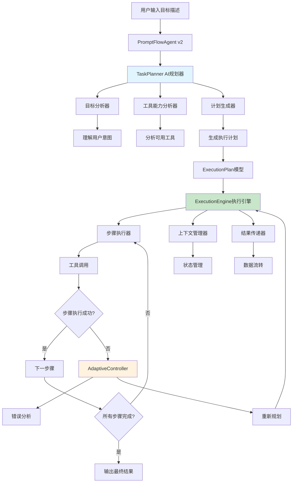
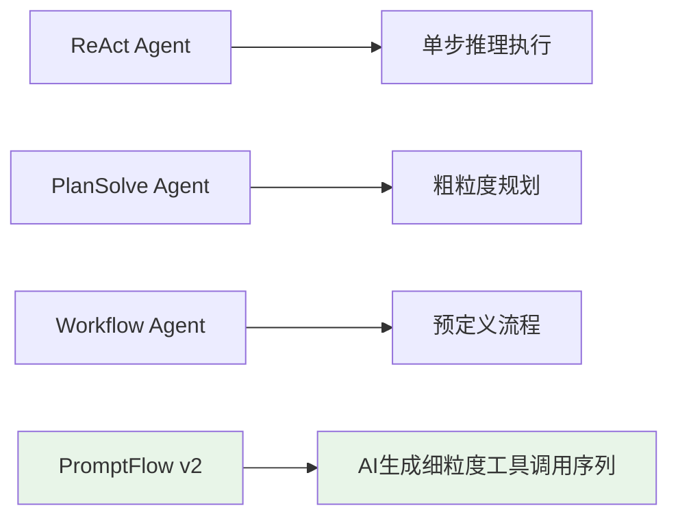

# PromptFlow Agent v2.0 架构设计文档

## 1. 概述

PromptFlow Agent v2.0 是基于 AI 驱动任务规划的智能代理系统。与 v1.0 的 markdown 语法解析不同，v2.0 让 AI 参与到任务规划过程中，用户只需要用自然语言描述目标，AI 会自动生成并执行最优的任务计划。

## 2. 设计理念

### 2.1 从静态解析到智能规划

**v1.0 的问题**：
- 用户需要学习特定的 markdown 语法
- AI 只负责执行，不参与规划
- 缺乏智能性和适应性
- 更像是静态工作流执行器

**v2.0 的改进**：
- 用户用自然语言描述目标
- AI 智能分析并生成执行计划
- 支持动态调整和错误恢复
- 真正的智能代理系统

### 2.2 核心优势

1. **零学习成本**：用户无需学习任何语法，用自然语言描述目标即可
2. **智能规划**：AI 根据目标和可用工具自动生成最优执行计划
3. **动态适应**：执行过程中可根据结果和错误动态调整计划
4. **工具感知**：AI 了解所有可用工具的能力，智能选择和组合
5. **错误恢复**：执行失败时自动重新规划替代方案

## 3. 系统架构

### 3.1 整体架构图



### 3.2 与现有 Agent 的关系



## 4. 核心组件设计

### 4.1 PromptFlowAgent v2 主控制器

```java
@Component
public class PromptFlowAgentV2 extends BaseAgent {
    
    private final TaskPlanner taskPlanner;
    private final ExecutionEngine executionEngine;
    private final AdaptiveController adaptiveController;
    
    @Override
    public String step() {
        try {
            // 1. AI 分析用户目标并生成计划
            String userGoal = getContext().getQuery();
            ExecutionPlan plan = taskPlanner.planTasks(userGoal, getContext());
            
            // 2. 执行计划
            ExecutionResult result = executionEngine.execute(plan, getContext());
            
            // 3. 处理执行结果
            if (result.isSuccess()) {
                return result.getFinalOutput();
            } else {
                // 4. 失败时尝试自适应调整
                return adaptiveController.handleFailure(plan, result, getContext());
            }
            
        } catch (Exception e) {
            log.error("PromptFlow v2 execution failed", e);
            return handleError(e);
        }
    }
}
```

### 4.2 TaskPlanner AI驱动的任务规划器

```java
@Component
public class TaskPlanner {
    
    private final LLM plannerLLM;
    private final ToolAnalyzer toolAnalyzer;
    
    /**
     * 根据用户目标生成执行计划
     */
    public ExecutionPlan planTasks(String userGoal, AgentContext context) {
        // 1. 分析可用工具能力
        ToolCapabilities toolCapabilities = toolAnalyzer.analyzeAvailableTools(context);
        
        // 2. 构建规划 prompt
        String planningPrompt = buildPlanningPrompt(userGoal, toolCapabilities);
        
        // 3. 调用 LLM 生成计划
        String planJson = plannerLLM.generatePlan(planningPrompt);
        
        // 4. 解析并验证计划
        ExecutionPlan plan = parsePlan(planJson);
        validatePlan(plan, toolCapabilities);
        
        return plan;
    }
    
    private String buildPlanningPrompt(String userGoal, ToolCapabilities capabilities) {
        return String.format("""
            你是一个智能任务规划师。用户目标是：%s
            
            可用工具及其能力：
            %s
            
            请生成一个详细的执行计划，包含：
            1. 任务分解为具体步骤
            2. 每步选择合适的工具
            3. 步骤间的依赖关系
            4. 参数和数据传递
            
            输出格式为 JSON，包含 steps 数组，每个 step 包含：
            - id: 步骤标识
            - description: 步骤描述
            - tool: 工具名称
            - params: 工具参数
            - dependencies: 依赖的步骤ID列表
            - expected_output: 预期输出描述
            """, userGoal, capabilities.getDescription());
    }
}
```

### 4.3 ExecutionPlan 计划模型

```java
@Data
@Builder
@JsonIgnoreProperties(ignoreUnknown = true)
public class ExecutionPlan {
    private String goal;
    private String planId;
    private List<ExecutionStep> steps;
    private Map<String, Object> globalVariables;
    private PlanMetadata metadata;
    
    @Data
    @Builder
    public static class ExecutionStep {
        private String id;
        private String description;
        private String tool;
        private Map<String, Object> params;
        private List<String> dependencies;
        private String expectedOutput;
        private int retryCount;
        private boolean optional;
    }
    
    @Data
    @Builder
    public static class PlanMetadata {
        private String createdBy;
        private long createdTime;
        private int estimatedSteps;
        private String complexity;
    }
}
```

### 4.4 ExecutionEngine 执行引擎

```java
@Component
public class ExecutionEngine {
    
    private final ToolCollection toolCollection;
    private final ContextManager contextManager;
    private final ResultProcessor resultProcessor;
    
    public ExecutionResult execute(ExecutionPlan plan, AgentContext context) {
        ExecutionContext execContext = contextManager.createExecutionContext(plan, context);
        
        try {
            // 1. 按依赖关系排序步骤
            List<ExecutionStep> sortedSteps = sortStepsByDependencies(plan.getSteps());
            
            // 2. 逐步执行
            for (ExecutionStep step : sortedSteps) {
                StepResult stepResult = executeStep(step, execContext);
                
                if (!stepResult.isSuccess() && !step.isOptional()) {
                    return ExecutionResult.failure(step.getId(), stepResult.getError());
                }
                
                // 3. 更新执行上下文
                execContext.addStepResult(step.getId(), stepResult);
                
                // 4. 发送进度更新
                sendProgressUpdate(step, stepResult, context);
            }
            
            // 5. 生成最终结果
            String finalOutput = resultProcessor.generateFinalOutput(execContext);
            return ExecutionResult.success(finalOutput);
            
        } catch (Exception e) {
            log.error("Execution failed", e);
            return ExecutionResult.failure("execution_error", e.getMessage());
        }
    }
    
    private StepResult executeStep(ExecutionStep step, ExecutionContext context) {
        try {
            // 1. 解析参数中的变量引用
            Map<String, Object> resolvedParams = resolveParameters(step.getParams(), context);
            
            // 2. 获取工具并执行
            BaseTool tool = toolCollection.getTool(step.getTool());
            if (tool == null) {
                return StepResult.failure("Tool not found: " + step.getTool());
            }
            
            Object result = tool.execute(resolvedParams);
            return StepResult.success(result);
            
        } catch (Exception e) {
            return StepResult.failure("Step execution failed: " + e.getMessage());
        }
    }
}
```

### 4.5 AdaptiveController 自适应控制器

```java
@Component
public class AdaptiveController {
    
    private final TaskPlanner taskPlanner;
    private final ErrorAnalyzer errorAnalyzer;
    
    public String handleFailure(ExecutionPlan originalPlan, ExecutionResult result, AgentContext context) {
        try {
            // 1. 分析失败原因
            FailureAnalysis analysis = errorAnalyzer.analyze(result);
            
            // 2. 决定处理策略
            RecoveryStrategy strategy = determineRecoveryStrategy(analysis);
            
            switch (strategy) {
                case RETRY_STEP:
                    return retryFailedStep(originalPlan, result, context);
                    
                case REPLAN_FROM_FAILURE:
                    return replanFromFailurePoint(originalPlan, result, context);
                    
                case COMPLETE_REPLAN:
                    return completeReplan(originalPlan, analysis, context);
                    
                default:
                    return "执行失败，无法恢复：" + result.getError();
            }
            
        } catch (Exception e) {
            log.error("Adaptive recovery failed", e);
            return "执行失败：" + result.getError();
        }
    }
    
    private String completeReplan(ExecutionPlan originalPlan, FailureAnalysis analysis, AgentContext context) {
        // 生成新的执行计划，考虑失败经验
        String adjustedGoal = originalPlan.getGoal() + 
            "\n\n注意：之前的执行失败了，原因是：" + analysis.getRootCause() +
            "\n请调整计划避免类似问题。";
            
        ExecutionPlan newPlan = taskPlanner.planTasks(adjustedGoal, context);
        ExecutionEngine engine = new ExecutionEngine();
        ExecutionResult newResult = engine.execute(newPlan, context);
        
        return newResult.isSuccess() ? newResult.getFinalOutput() : 
               "重新规划后仍然失败：" + newResult.getError();
    }
}
```

## 5. 使用示例

### 5.1 数据分析任务

**用户输入**：
```
"帮我分析这个销售数据文件，我需要了解销售趋势、最佳产品、以及改进建议"
```

**AI 生成的计划**：
```json
{
  "goal": "分析销售数据文件，提供趋势、产品和建议分析",
  "steps": [
    {
      "id": "data_upload",
      "description": "获取用户上传的数据文件",
      "tool": "file_tool",
      "params": {"action": "get_uploaded_file"},
      "dependencies": [],
      "expected_output": "文件路径和基本信息"
    },
    {
      "id": "data_exploration",
      "description": "探索数据结构和质量",
      "tool": "code_interpreter",
      "params": {
        "code": "import pandas as pd\ndf = pd.read_csv('{{data_upload.file_path}}')\nprint('数据形状:', df.shape)\nprint('列信息:')\nprint(df.info())\nprint('前5行:')\nprint(df.head())"
      },
      "dependencies": ["data_upload"],
      "expected_output": "数据概览信息"
    },
    {
      "id": "sales_trend_analysis",
      "description": "分析销售趋势",
      "tool": "code_interpreter", 
      "params": {
        "code": "# 基于时间的销售趋势分析\nimport matplotlib.pyplot as plt\n# 分析代码..."
      },
      "dependencies": ["data_exploration"],
      "expected_output": "销售趋势图表和分析"
    },
    {
      "id": "product_analysis",
      "description": "分析产品性能",
      "tool": "code_interpreter",
      "params": {
        "code": "# 产品销售排行和性能分析\n# 分析代码..."
      },
      "dependencies": ["data_exploration"],
      "expected_output": "产品分析结果"
    },
    {
      "id": "generate_report",
      "description": "生成综合分析报告",
      "tool": "llm_call",
      "params": {
        "prompt": "基于以下分析结果生成专业的销售分析报告：\n\n数据概览：{{data_exploration.result}}\n销售趋势：{{sales_trend_analysis.result}}\n产品分析：{{product_analysis.result}}\n\n请提供：\n1. 执行摘要\n2. 关键发现\n3. 趋势分析\n4. 产品洞察\n5. 改进建议"
      },
      "dependencies": ["sales_trend_analysis", "product_analysis"],
      "expected_output": "最终分析报告"
    }
  ]
}
```

### 5.2 客服对话处理

**用户输入**：
```
"客户说产品有质量问题要退款，帮我处理这个客服场景"
```

**AI 生成的计划**：
```json
{
  "goal": "处理客户质量问题退款请求",
  "steps": [
    {
      "id": "sentiment_analysis",
      "description": "分析客户情绪和意图",
      "tool": "deep_search",
      "params": {
        "query": "客服情绪分析 质量问题 退款请求"
      },
      "dependencies": [],
      "expected_output": "客户情绪和意图分析"
    },
    {
      "id": "policy_check",
      "description": "查询退款政策",
      "tool": "deep_search", 
      "params": {
        "query": "退款政策 质量问题 退款流程"
      },
      "dependencies": [],
      "expected_output": "相关退款政策"
    },
    {
      "id": "generate_response",
      "description": "生成专业的客服回复",
      "tool": "llm_call",
      "params": {
        "prompt": "客户反馈产品质量问题要求退款。请生成专业的客服回复：\n\n客户情绪分析：{{sentiment_analysis.result}}\n退款政策：{{policy_check.result}}\n\n回复要求：\n1. 表示理解和歉意\n2. 说明处理流程\n3. 提供解决方案\n4. 保持专业友好"
      },
      "dependencies": ["sentiment_analysis", "policy_check"],
      "expected_output": "客服回复内容"
    }
  ]
}
```

## 6. 技术实现细节

### 6.1 任务规划提示词工程

```java
public class PlanningPromptTemplate {
    
    public static final String PLANNING_SYSTEM_PROMPT = """
        你是一个专业的任务规划AI助手。你的职责是：
        
        1. 理解用户的目标和需求
        2. 分析可用的工具和能力
        3. 制定最优的执行计划
        4. 确保步骤间的逻辑性和可执行性
        
        规划原则：
        - 步骤要具体可执行
        - 合理利用工具能力
        - 考虑依赖关系
        - 包含错误处理
        - 优化执行效率
        """;
        
    public static String buildPlanningPrompt(String userGoal, ToolCapabilities tools) {
        return String.format("""
            用户目标：%s
            
            可用工具：
            %s
            
            请生成执行计划，JSON格式如下：
            {
              "goal": "目标描述",
              "steps": [
                {
                  "id": "步骤ID",
                  "description": "步骤描述", 
                  "tool": "工具名称",
                  "params": {"param1": "value1"},
                  "dependencies": ["依赖步骤ID"],
                  "expected_output": "预期输出"
                }
              ]
            }
            """, userGoal, tools.getDescription());
    }
}
```

### 6.2 上下文管理和变量替换

```java
@Component
public class ContextManager {
    
    public Map<String, Object> resolveParameters(Map<String, Object> params, ExecutionContext context) {
        Map<String, Object> resolved = new HashMap<>();
        
        for (Map.Entry<String, Object> entry : params.entrySet()) {
            Object value = entry.getValue();
            if (value instanceof String) {
                String strValue = (String) value;
                value = resolveVariables(strValue, context);
            } else if (value instanceof Map) {
                value = resolveParameters((Map<String, Object>) value, context);
            }
            resolved.put(entry.getKey(), value);
        }
        
        return resolved;
    }
    
    private String resolveVariables(String template, ExecutionContext context) {
        // 解析 {{step_id.field}} 格式的变量引用
        Pattern pattern = Pattern.compile("\\{\\{([^}]+)\\}\\}");
        Matcher matcher = pattern.matcher(template);
        
        StringBuffer result = new StringBuffer();
        while (matcher.find()) {
            String varRef = matcher.group(1);
            String value = getVariableValue(varRef, context);
            matcher.appendReplacement(result, value != null ? value : "");
        }
        matcher.appendTail(result);
        
        return result.toString();
    }
}
```

### 6.3 流式输出支持

```java
@Component  
public class PromptFlowStreamingHandler {
    
    public void sendProgressUpdate(ExecutionStep step, StepResult result, AgentContext context) {
        if (!context.getIsStream()) return;
        
        // 发送步骤开始
        context.getPrinter().send("prompt_flow_step_start", 
            Map.of("step_id", step.getId(), 
                   "description", step.getDescription(),
                   "tool", step.getTool()));
        
        // 发送步骤结果
        context.getPrinter().send("prompt_flow_step_result",
            Map.of("step_id", step.getId(),
                   "success", result.isSuccess(),
                   "output", result.getOutput()));
    }
}
```

## 7. 与现有系统集成

### 7.1 AgentType 枚举更新

```java
public enum AgentType {
    COMPREHENSIVE(1),
    WORKFLOW(2), 
    PLAN_SOLVE(3),
    ROUTER(4),
    REACT(5),
    PROMPT_FLOW(6);  // 保持现有值，但实现完全重构
}
```

### 7.2 Handler 实现

```java
@Component
public class PromptFlowHandlerImpl implements AgentHandlerService {
    
    @Override
    public String handle(AgentContext agentContext, AgentRequest request) {
        try {
            PromptFlowAgentV2 agent = new PromptFlowAgentV2(agentContext);
            return agent.run(request.getQuery());
        } catch (Exception e) {
            log.error("PromptFlow v2 execution failed", e);
            return "执行失败: " + e.getMessage();
        }
    }
    
    @Override
    public Boolean support(AgentContext agentContext, AgentRequest request) {
        return AgentType.PROMPT_FLOW.getValue().equals(request.getAgentType());
    }
}
```

## 8. 优势对比

### 8.1 用户体验对比

| 方面 | v1.0 (Markdown语法) | v2.0 (AI规划) |
|------|---------------------|---------------|
| 学习成本 | 需要学习语法 | 零学习成本 |
| 交互方式 | 结构化语法 | 自然语言 |
| 智能程度 | 静态执行 | AI智能规划 |
| 适应性 | 固定流程 | 动态调整 |
| 错误处理 | 手动修改 | 自动重规划 |

### 8.2 技术优势

1. **智能规划**：AI 参与任务分解和工具选择
2. **动态适应**：根据执行结果调整计划
3. **自然交互**：用户只需描述目标
4. **错误恢复**：自动处理执行失败
5. **工具感知**：了解工具能力并智能组合

## 9. 总结

PromptFlow Agent v2.0 从根本上改变了任务流程的定义方式：

- **从用户定义到AI规划**：用户不再需要预定义步骤，AI 根据目标自动规划
- **从静态执行到动态适应**：执行过程中可以根据结果动态调整
- **从语法学习到自然交互**：用户用自然语言描述目标即可

这种设计更符合 AI Agent 的本质 - 不仅执行任务，更要智能地规划任务。用户体验将大幅提升，系统的智能化程度也会显著增强。