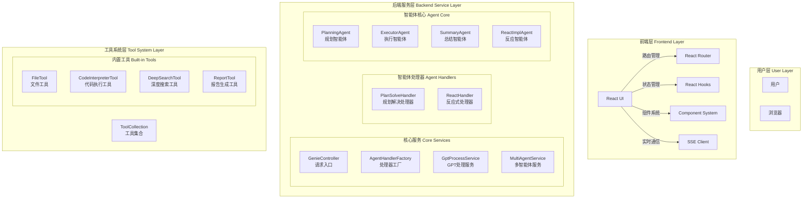
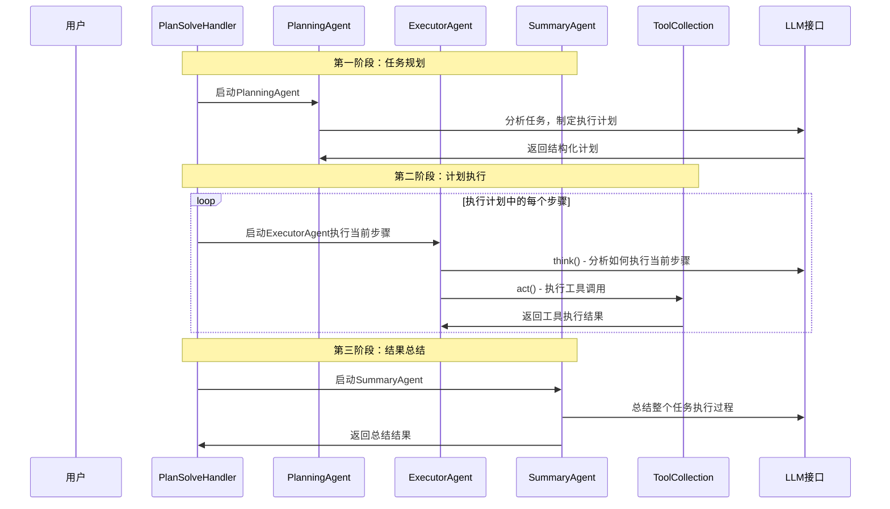
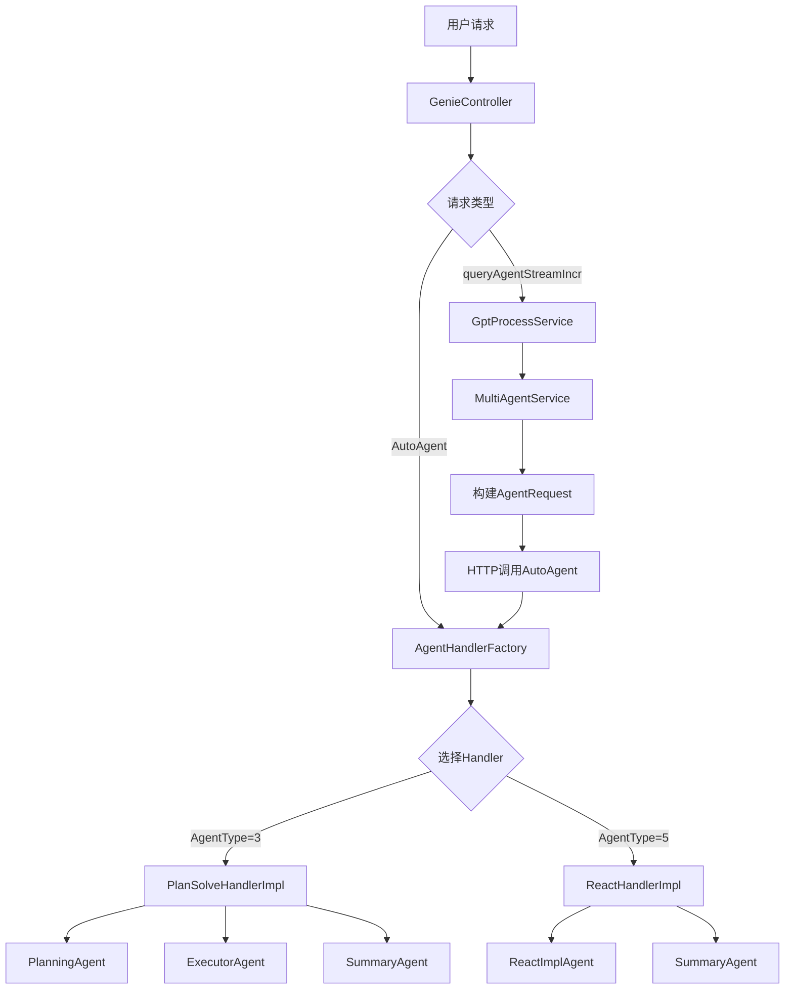
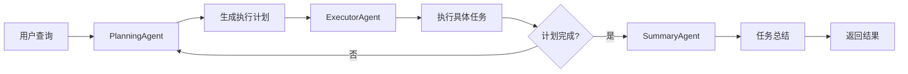
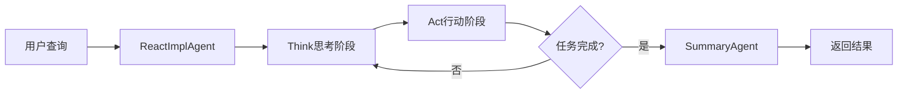
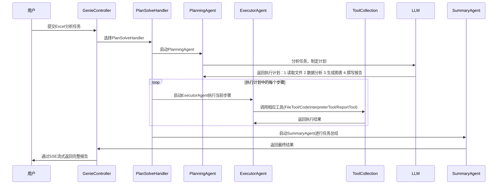

# 以 JoyAgent-JDGenie 项目为例：如何利用 AI Agent 高效学习开源框架

## 前言

在当今快速发展的技术环境中，学习开源框架已成为开发者必备技能。然而，面对复杂的项目架构和庞大的代码库，传统的学习方式往往效率低下。本文以 **JoyAgent-JDGenie** 项目为例，分享如何利用 AI Agent 技术高效学习和掌握开源框架的实践方法。

JoyAgent-JDGenie 是一个基于多智能体架构的 AI 应用开发框架，集成了多种 Agent 类型，支持代码解释、报告生成、工作流编排等功能。通过系统化的学习方法，我们不仅能快速理解项目架构，还能在此基础上扩展新功能。

## 第一步：利用 DeepWiki 建立项目全局认知

### 1.1 什么是 DeepWiki

[DeepWiki](https://deepwiki.com/) 是一个基于 AI 的项目文档生成和理解工具，能够自动分析 GitHub 项目并生成结构化的文档。对于初学者来说，这是快速了解项目全貌的最佳起点。

### 1.2 使用 DeepWiki 分析 JoyAgent-JDGenie

访问 DeepWiki 并输入项目地址：`joyagent-jdgenie`，系统会自动生成：

- **项目概览**：核心功能和技术栈
- **架构图**：系统组件关系
- **API 文档**：接口定义和使用方法
- **代码结构**：目录组织和模块划分

通过 DeepWiki 的分析，我们可以快速了解到：

```
JoyAgent-JDGenie 项目结构：
├── genie-backend/     # Java 后端服务
├── genie-tool/        # Python 工具服务  
├── genie-client/      # Python 客户端
└── ui/               # React 前端界面
```

**核心技术栈**：
- 后端：Java Spring Boot + Python FastAPI
- 前端：React + TypeScript
- AI 框架：LiteLLM + smolagents
- 数据库：SQLite + 文件存储

## 第二步：深度理解项目架构 - 四篇核心文档解析

基于 DeepWiki 的初步认知，我们需要深入研读项目中的核心文档。以下四类文档是理解复杂开源项目的关键：

### 2.1 架构设计文档 - 理解系统蓝图

项目中的架构设计文档为我们提供了系统的整体设计思路。通过 **JoyAgent-JDGenie 系统架构文档**，我们能够全面理解整个系统的设计理念：

> 参考文档：[JoyAgent-JDGenie系统架构文档.md](JoyAgent-JDGenie系统架构文档.md)

该文档展示了完整的系统架构层次：



**系统架构核心特性**：

**1. 端到端完整产品架构**
```java
// 引用：JoyAgent-JDGenie系统架构文档.md 第5-14行
// JoyAgent-JDGenie 是业界首个开源高完成度轻量化通用多智能体产品
// 核心特性：
// - 端到端完整产品：包含前端、后端、工具系统的完整解决方案
// - 多智能体协作：支持Planning、Executor、Summary等专业化智能体
// - 工具生态扩展：内置工具与MCP协议工具无缝集成
// - 实时流式处理：基于SSE的实时交互体验
// - 模式灵活切换：支持Plan-Solve和ReAct两种处理模式
```

**2. 分层架构设计**
```java
// 引用：JoyAgent-JDGenie系统架构文档.md 第279-404行
// 后端服务架构包含：
// - 控制器层：GenieController 统一请求入口
// - 服务层：GptProcessService、MultiAgentService
// - 处理器工厂：AgentHandlerFactory 动态路由
// - 智能体核心：PlanningAgent、ExecutorAgent、SummaryAgent
// - LLM交互：统一的语言模型接口
// - 工具系统：ToolCollection 统一工具管理
```

**3. 多智能体协作流程**



**关键架构洞察**：
- **端到端产品思维**：不仅是框架，更是完整的产品解决方案
- **分层模块化设计**：从用户层到数据存储层的清晰分层
- **多智能体协作模式**：专业化智能体分工协作，提高任务处理效率
- **工具生态扩展**：内置工具与MCP协议工具无缝集成
- **实时流式体验**：基于SSE的实时交互，提供良好用户体验
- **技术栈现代化**：React + Spring Boot + Python FastAPI 的现代化组合

### 2.2 流程分析文档 - 掌握核心流程

通过流程分析文档，我们能理解系统的运行机制。项目中有多个流程分析文档，每个都从不同角度揭示系统的运行逻辑。

#### 2.2.1 系统整体调用流程

首先，我们通过 **Genie-Backend 核心调用流程分析**了解系统的整体架构：

> 参考文档：[genie-backend-core-flow.md](genie-backend-core-flow.md)

该文档详细展示了从用户请求到结果返回的完整调用链路：



**系统架构洞察**：
- **双入口设计**：支持直接调用(`/AutoAgent`)和服务层调用(`/queryAgentStreamIncr`)
- **处理器工厂模式**：通过 `AgentHandlerFactory` 根据 `AgentType` 动态选择处理器
- **多智能体协作**：Plan-Solve 模式采用三个专业化 Agent 协同工作

#### 2.2.2 Agent 执行流程深度解析

文档还详细分析了不同 Agent 类型的执行流程。以 **PlanSolveHandlerImpl** 为例：

```java
// 引用：genie-backend-core-flow.md 第102-123行
// 核心特点：采用规划-执行-总结的三阶段架构

// 关键流程：
// 1. 规划阶段：PlanningAgent 分析任务，生成步骤计划
// 2. 执行阶段：ExecutorAgent 逐步执行计划中的任务  
// 3. 总结阶段：SummaryAgent 整理执行结果并生成最终报告
```

**Plan-Solve 模式流程图**：


#### 2.2.3 ReAct 模式对比分析

相比之下，**ReactHandlerImpl** 采用更简化的单一智能体模式：



**两种模式对比**：

| 特性 | Plan-Solve 模式 | ReAct 模式 |
|------|----------------|------------|
| **复杂度** | 高 - 三阶段处理 | 低 - 单一循环 |
| **适用场景** | 复杂多步骤任务 | 简单快速响应 |
| **Agent数量** | 3个专业化Agent | 1个通用Agent |
| **执行效率** | 并发执行支持 | 串行执行 |

#### 2.2.4 具体业务流程示例

文档还提供了完整的任务执行示例，以Excel数据分析为例：



#### 2.2.5 工具系统流程

除了 Agent 执行流程，文档还详细分析了工具系统的工作机制：

```java
// 引用：genie-backend-core-flow.md 第230-243行
public class ToolCollection {
    private Map<String, BaseTool> toolMap;      // 内置工具
    private Map<String, McpToolInfo> mcpToolMap; // MCP工具
    
    public Object execute(String name, Object toolInput) {
        if (toolMap.containsKey(name)) {
            return getTool(name).execute(toolInput);
        } else if (mcpToolMap.containsKey(name)) {
            // 执行MCP工具
            return mcpTool.callTool(toolInfo.getMcpServerUrl(), name, toolInput);
        }
    }
}
```

**工具系统特点**：
- **双重工具支持**：内置工具 + MCP 协议工具
- **统一调用接口**：通过 `ToolCollection` 统一管理
- **动态扩展能力**：支持运行时添加新工具

#### 2.2.6 PPT生成流程补充

结合具体的业务流程，我们再看 **PPT生成流程源码分析**：

> 参考文档：[PPT生成流程源码分析.md](PPT生成流程源码分析.md)

```python
# 引用：PPT生成流程源码分析.md 第143-178行
@timer(key="enter")
async def ppt_report(
    task: str,
    file_names: Optional[List[str]] = tuple(),
    model: str = "gpt-4.1",
    temperature: float = None,
    top_p: float = 0.6,
) -> AsyncGenerator:
    # 1. 文件下载与处理
    files = await download_all_files(file_names)
    
    # 2. 上下文长度控制
    truncate_flat_files = truncate_files(flat_files, 
        max_tokens=int(LLMModelInfoFactory.get_context_length(model) * 0.8))
    
    # 3. Prompt模板渲染
    prompt = Template(get_prompt("report")["ppt_prompt"]) \
        .render(task=task, files=truncate_flat_files, date=datetime.now().strftime("%Y-%m-%d"))
    
    # 4. LLM流式调用
    async for chunk in ask_llm(messages=prompt, model=model, stream=True,
                                temperature=temperature, top_p=top_p, only_content=True):
        yield chunk
```

**综合流程理解**：
- **宏观层面**：通过核心调用流程了解系统整体架构
- **中观层面**：通过 Agent 执行流程理解任务处理逻辑  
- **微观层面**：通过具体业务流程掌握实现细节
- **异步流式架构**：全链路支持实时输出
- **智能内容管理**：自动裁剪适应模型上下文限制
- **模板化系统**：使用 Jinja2 模板引擎

### 2.3 数据结构文档 - 理解核心模型

数据结构是系统的骨架，理解核心数据模型对掌握系统至关重要。通过深入分析项目的数据结构设计，我们能够理解系统的业务逻辑和技术架构。

> 参考文档：[genie-backend-data-structure-analysis.md](genie-backend-data-structure-analysis.md)

#### 2.3.1 Agent 类型系统

首先，我们看系统支持的智能体类型定义：

```java
// 引用：genie-backend/src/main/java/com/jd/genie/agent/enums/AgentType.java
public enum AgentType {
    COMPREHENSIVE(1),   // 综合模式 - 未实现
    WORKFLOW(2),        // 工作流模式 - 未实现
    PLAN_SOLVE(3),      // 计划解决模式 - 已实现
    ROUTER(4),          // 路由模式 - 未实现
    REACT(5),           // 反应模式 - 已实现
    PROMPT_FLOW(6);     // PromptFlow模式 - 新增
    
    private final Integer value;
    
    AgentType(Integer value) {
        this.value = value;
    }
    
    public Integer getValue() {
        return value;
    }
}
```

#### 2.3.2 核心数据结构体系

根据数据结构分析文档，系统的核心数据结构可以分为六大类：

**1. 消息传递相关数据结构**

```java
// 引用：genie-backend-data-structure-analysis.md 第12-24行
@Data
@Builder
@NoArgsConstructor
@AllArgsConstructor
public class Message {
    private RoleType role;           // 消息角色
    private String content;          // 消息内容
    private String base64Image;      // 图片数据（base64编码）
    private String toolCallId;       // 工具调用ID
    private List<ToolCall> toolCalls; // 工具调用列表
}
```

**消息系统特点**：
- **多角色支持**：USER、SYSTEM、ASSISTANT、TOOL 四种角色
- **多媒体支持**：支持文本和图片数据传输
- **工具集成**：内置工具调用功能
- **便捷创建**：提供静态工厂方法

**2. 任务规划相关数据结构**

```java
// 引用：genie-backend-data-structure-analysis.md 第62-73行
@Data
@Builder
@NoArgsConstructor
@AllArgsConstructor
public class Plan {
    private String title;              // 计划标题
    private List<String> steps;        // 计划步骤列表
    private List<String> stepStatus;   // 步骤状态列表
    private List<String> notes;        // 步骤备注列表
}
```

**规划系统设计**：
- **步骤化管理**：支持多步骤任务分解
- **状态跟踪**：实时跟踪每个步骤的执行状态
- **备注机制**：为每个步骤提供详细说明

**3. 工具执行相关数据结构**

```java
// 引用：genie-backend-data-structure-analysis.md 第150-168行
@Data
@Builder
@NoArgsConstructor
@AllArgsConstructor
public class ToolResult {
    private String toolName;           // 工具名称
    private ExecutionStatus status;    // 执行状态
    private Object result;             // 执行结果
    private String error;              // 错误信息
    private Long executionTime;        // 执行时间
    private Object parameters;         // 执行参数
    
    public enum ExecutionStatus {
        SUCCESS, FAILED, TIMEOUT, CANCELLED, SKIPPED
    }
}
```

**工具系统特点**：
- **完整状态管理**：五种执行状态覆盖所有场景
- **性能监控**：内置执行时间统计
- **错误处理**：详细的错误信息记录
- **参数追踪**：保留执行参数用于调试

**4. Agent 核心架构**

```java
// 引用：genie-backend-data-structure-analysis.md 第179-206行
@Slf4j
@Data
@Accessors(chain = true)
public abstract class BaseAgent {
    // 核心属性
    private String name;
    private String description;
    private String systemPrompt;
    public ToolCollection availableTools = new ToolCollection();
    private Memory memory = new Memory();
    protected LLM llm;
    protected AgentContext context;
    
    // 执行控制
    private AgentState state = AgentState.IDLE;
    private int maxSteps = 10;
    private int currentStep = 0;
    
    // 抽象方法
    public abstract String step();
    
    // 核心方法
    public String run(String query)
    public String executeTool(ToolCall command)
    public Map<String, String> executeTools(List<ToolCall> commands)
}
```

**Agent 架构特点**：
- **抽象基类设计**：提供统一的 Agent 接口
- **状态管理**：完整的执行状态控制
- **工具集成**：内置工具集合管理
- **记忆机制**：支持对话历史管理

#### 2.3.3 数据结构设计优势

通过分析文档，我们发现系统数据结构设计的几个优秀特点：

**1. 清晰的职责分离**
```java
// 引用：genie-backend-data-structure-analysis.md 第308-312行
// 消息、计划、工具、代理等各有独立的数据结构
// 每个类都有明确的单一职责
// 模块化设计便于维护和扩展
```

**2. 丰富的静态工厂方法**
```java
// 引用：genie-backend-data-structure-analysis.md 第319-325行
// Message类提供便捷的创建方法
public static Message userMessage(String content, String base64Image)
public static Message systemMessage(String content, String base64Image)
public static Message assistantMessage(String content, String base64Image)
public static Message toolMessage(String content, String toolCallId, String base64Image)
```

**3. 完善的状态管理**
```java
// 引用：genie-backend-data-structure-analysis.md 第327-331行
// Plan 类的状态跟踪机制设计得很好，支持步骤级状态管理
// AgentState 和 ToolResult.ExecutionStatus 提供清晰的状态枚举
// 支持状态转换和生命周期管理
```

#### 2.3.4 设计不足与改进建议

文档也指出了一些设计上的不足：

**1. 数据结构冗余问题**
```java
// 引用：genie-backend-data-structure-analysis.md 第350-366行
// File 和 FileInformation 功能重叠，存在冗余
public class File {
    private String ossUrl;
    private String fileName;
    // ...
}

public class FileInformation {
    private String fileName;
    private String ossUrl;
    // ...
}
// 问题：两个类功能高度重叠，增加了维护成本  
// 建议：合并为统一的文件信息类，或明确区分两者的使用场景
```

**2. 类型安全性不足**
```java
// 引用：genie-backend-data-structure-analysis.md 第405-421行
// Tool 类的 parameters 使用 Object 类型
private Object parameters;

// ToolResult 的 result 使用 Object 类型  
private Object result;

// 问题：运行时才能发现类型错误，缺乏编译时类型检查
// 建议：使用泛型提高类型安全性，定义具体的参数和结果类型
```

**3. BaseAgent 职责过重**
```java
// 引用：genie-backend-data-structure-analysis.md 第448-469行
public abstract class BaseAgent {
    // 包含了状态管理、工具执行、记忆管理等多个职责
    private AgentState state;
    private Memory memory;
    public ToolCollection availableTools;
    
    // 问题：违反了单一职责原则，类过于庞大，难于测试和维护
    // 建议：使用组合模式，将不同职责分离到独立组件
}
```

#### 2.3.5 改进方案示例

文档还提供了具体的改进建议：

**1. 引入泛型提高类型安全**
```java
// 引用：genie-backend-data-structure-analysis.md 第514-530行
// 改进后的工具定义
public class Tool<P, R> {
    private String name;
    private String description;
    private Class<P> parameterType;
    private Class<R> resultType;
    private Function<P, R> executor;
}

public class ToolResult<T> {
    private String toolName;
    private ExecutionStatus status;
    private T result;
    private String error;
}
```

**2. 提取服务组件**
```java
// 引用：genie-backend-data-structure-analysis.md 第533-553行
// 内存管理服务
public interface MemoryManager {
    void addMessage(Message message);
    void clearByFilter(MessageFilter filter);
    List<Message> getMessages();
}

// 工具执行服务
public interface ToolExecutor {
    <T> ToolResult<T> execute(ToolCall toolCall);
    Map<String, ToolResult<?>> executeAll(List<ToolCall> toolCalls);
}

// 状态管理服务
public interface StateManager {
    void updateState(AgentState newState);
    AgentState getCurrentState();
    boolean canTransitionTo(AgentState targetState);
}
```

#### 2.3.6 数据结构学习价值

通过深入分析这些数据结构，我们获得了宝贵的设计经验：

**设计优势**：
- **模块化设计**：清晰的职责分离和良好的封装性
- **状态管理**：完善的状态跟踪和生命周期管理
- **工具框架**：强大的工具执行和错误处理机制
- **消息系统**：灵活的多角色消息传递机制

**改进空间**：
- **类型安全**：通过泛型提高编译时类型检查
- **职责分离**：使用组合模式降低类的复杂度
- **异常处理**：建立统一的异常处理机制
- **配置管理**：集中化配置管理机制

**学习启示**：
- 数据结构设计要平衡功能完整性和设计简洁性
- 类型安全和运行时灵活性需要权衡
- 单一职责原则在复杂系统中尤为重要
- 良好的抽象设计能够支撑系统的扩展性

### 2.4 FAQ 文档 - 解决常见问题

FAQ 文档帮助我们理解项目的技术细节和设计决策。例如，关于 AgentType=3 的业务逻辑：

> 参考文档：[genie-backend-faq.md](genie-backend-faq.md)

```java
// AgentType 设置逻辑
private AgentRequest buildAgentRequest(GptQueryReq req) {
    AgentRequest request = new AgentRequest();
    // 核心逻辑：根据 DeepThink 参数决定 AgentType
    request.setAgentType(req.getDeepThink() == 0 ? 5 : 3);
    return request;
}
```

**业务逻辑理解**：
- DeepThink == 0 → REACT 模式（快速响应）
- DeepThink != 0 → PLAN_SOLVE 模式（深度思考）

## 第三步：实践驱动学习 - 实现新的 Agent 类型

理论学习后，最好的巩固方式是动手实践。JoyAgent-JDGenie 项目为我们提供了绝佳的练习机会：**实现未完成的 Agent 类型**。

### 3.1 选择实现目标

从 AgentType 枚举可以看出，以下类型等待实现：
- **COMPREHENSIVE(1)**：综合模式
- **WORKFLOW(2)**：工作流模式  
- **ROUTER(4)**：路由模式

我们选择实现 **WORKFLOW** 类型，因为它在企业应用中需求最大。

### 3.2 设计 Workflow Agent

基于项目现有架构，设计 Workflow Agent：

```java
@Component
public class WorkflowAgent extends BaseAgent {
    
    private final WorkflowEngine workflowEngine;
    private final StepExecutor stepExecutor;
    
    @Override
    public String step() {
        try {
            // 1. 解析工作流定义
            WorkflowDefinition workflow = parseWorkflow(getContext().getQuery());
            
            // 2. 执行工作流
            WorkflowResult result = workflowEngine.execute(workflow, getContext());
            
            // 3. 返回执行结果
            return result.getOutput();
            
        } catch (Exception e) {
            log.error("Workflow execution failed", e);
            return handleError(e);
        }
    }
}
```

### 3.3 实现 Handler 服务

```java
@Component
public class WorkflowHandlerImpl implements AgentHandlerService {
    
    @Override
    public String handle(AgentContext agentContext, AgentRequest request) {
        try {
            WorkflowAgent agent = new WorkflowAgent(agentContext);
            return agent.run(request.getQuery());
        } catch (Exception e) {
            log.error("Workflow agent execution failed", e);
            return "工作流执行失败: " + e.getMessage();
        }
    }
    
    @Override
    public Boolean support(AgentContext agentContext, AgentRequest request) {
        return AgentType.WORKFLOW.getValue().equals(request.getAgentType());
    }
}
```

### 3.4 注册到配置系统

```java
@Configuration
public class AgentHandlerConfig {
    
    @Bean
    public List<AgentHandlerService> agentHandlerServices(
            ReactHandlerImpl reactHandler,
            PlanSolveHandlerImpl planSolveHandler,
            PromptFlowHandlerImpl promptFlowHandler,
            WorkflowHandlerImpl workflowHandler  // 新增
    ) {
        return Arrays.asList(
                reactHandler,
                planSolveHandler, 
                promptFlowHandler,
                workflowHandler  // 新增
        );
    }
}
```

### 3.5 通过单元测试验证实现

**重点：先运行开源项目原有的测试！** 这是理解项目架构和验证环境配置的关键步骤。通过运行和分析现有测试，我们能够深入理解系统的工作机制。

#### 3.5.1 运行项目原有测试

**第一步：运行所有现有测试**

```bash
# 进入项目根目录
cd genie-backend

# 运行所有测试，了解项目整体测试状况
mvn clean test

# 查看测试报告
open target/surefire-reports/index.html
```

**运行结果分析**：
- **测试通过情况**：哪些测试通过，哪些失败
- **测试覆盖范围**：了解项目测试的完整性
- **测试执行时间**：识别性能瓶颈
- **依赖关系**：观察测试间的依赖和顺序

**第二步：分析测试目录结构**

```bash
# 查看项目测试目录结构
genie-backend/src/test/java/
├── com/jd/genie/
│   ├── agent/          # Agent相关测试
│   ├── handler/        # Handler测试
│   ├── tool/           # 工具测试
│   └── service/        # 服务测试
```

**第三步：逐个运行核心测试类**

```bash
# 运行特定的测试类，深入理解核心组件
mvn test -Dtest=PlanSolveHandlerImplTest
mvn test -Dtest=ReactHandlerImplTest
mvn test -Dtest=BaseAgentTest

# 运行特定包下的所有测试
mvn test -Dtest="com.jd.genie.agent.*Test"
```

#### 3.5.2 从现有测试中学习项目架构

通过分析现有测试代码，我们能够理解：

**1. 测试数据准备模式**
```java
// 从现有测试中学习如何构建测试数据
@BeforeEach
void setUp() {
    // 学习项目中标准的测试数据构建方式
    agentContext = AgentContext.builder()
        .requestId("test-request-001")
        .sessionId("test-session-001")
        .query("测试查询内容")
        .isStream(false)
        .build();
        
    agentRequest = AgentRequest.builder()
        .agentType(AgentType.PLAN_SOLVE.getValue())
        .query("执行数据分析任务")
        .isStream(false)
        .build();
}
```

**2. Mock 策略和依赖管理**
```java
// 学习项目中如何处理复杂依赖关系
@ExtendWith(MockitoExtension.class)
class ExistingAgentTest {
    
    @Mock
    private LLM mockLlm;
    
    @Mock 
    private ToolCollection mockToolCollection;
    
    @InjectMocks
    private PlanSolveHandlerImpl planSolveHandler;
    
    @Test
    void testExistingLogic() {
        // 学习现有的Mock配置方式
        when(mockLlm.askTool(any(), any(), any(), any(), any(), any(), anyBoolean(), anyInt()))
            .thenReturn(CompletableFuture.completedFuture(mockResponse));
    }
}
```

**3. 异常处理和边界条件测试**
```java
// 学习项目中如何测试异常场景
@Test
void testErrorHandlingScenarios() {
    // 学习异常情况的测试方式
    when(mockService.process(any()))
        .thenThrow(new RuntimeException("模拟异常"));
        
    // 验证异常处理逻辑
    assertThrows(AgentException.class, () -> {
        handler.handle(context, request);
    });
}
```

**4. 集成测试配置**
```java
// 学习Spring Boot集成测试的配置方式
@SpringBootTest
@TestPropertySource(properties = {
    "spring.profiles.active=test",
    "logging.level.com.jd.genie=DEBUG"
})
class IntegrationTestExample {
    
    @Autowired
    private GenieController controller;
    
    @MockBean
    private MultiAgentService multiAgentService;
}
```

#### 3.5.3 理解测试失败原因

如果某些测试失败，这正是学习的好机会：

**分析失败原因**：
```bash
# 查看详细的测试失败信息
mvn test -Dtest=FailingTest -X

# 分析失败日志
cat target/surefire-reports/TEST-com.jd.genie.FailingTest.xml
```

**常见失败原因及学习价值**：
- **配置问题**：学习项目的配置依赖
- **环境依赖**：了解项目对外部服务的依赖
- **数据准备**：理解测试数据的要求
- **时序问题**：掌握异步操作的测试方法

#### 3.5.4 编写新功能的测试

为我们新实现的 WorkflowAgent 编写完整的测试用例：

```java
@ExtendWith(MockitoExtension.class)
class WorkflowAgentTest {
    
    @Mock
    private WorkflowEngine workflowEngine;
    
    @Mock
    private StepExecutor stepExecutor;
    
    @Mock
    private AgentContext agentContext;
    
    @InjectMocks
    private WorkflowAgent workflowAgent;
    
    @Test
    @DisplayName("测试工作流正常执行流程")
    void testWorkflowNormalExecution() {
        // Given - 准备测试数据
        String query = "执行数据分析工作流";
        WorkflowDefinition mockWorkflow = WorkflowDefinition.builder()
            .name("数据分析流程")
            .steps(Arrays.asList("读取数据", "数据清洗", "统计分析", "生成报告"))
            .build();
        
        WorkflowResult expectedResult = WorkflowResult.builder()
            .success(true)
            .output("工作流执行成功，已生成分析报告")
            .build();
        
        // When - 模拟方法调用
        when(agentContext.getQuery()).thenReturn(query);
        when(workflowEngine.execute(any(WorkflowDefinition.class), eq(agentContext)))
            .thenReturn(expectedResult);
        
        // Then - 执行测试并验证结果
        String result = workflowAgent.step();
        
        assertThat(result).isEqualTo("工作流执行成功，已生成分析报告");
        verify(workflowEngine).execute(any(WorkflowDefinition.class), eq(agentContext));
    }
    
    @Test
    @DisplayName("测试工作流执行异常处理")
    void testWorkflowExecutionException() {
        // Given
        String query = "执行异常工作流";
        when(agentContext.getQuery()).thenReturn(query);
        when(workflowEngine.execute(any(), any()))
            .thenThrow(new RuntimeException("工作流引擎异常"));
        
        // When & Then
        String result = workflowAgent.step();
        
        assertThat(result).contains("执行失败");
        assertThat(result).contains("工作流引擎异常");
    }
}
```

#### 3.5.5 编写 Handler 集成测试

测试 WorkflowHandlerImpl 的集成功能：

```java
@SpringBootTest
@TestPropertySource(properties = {
    "spring.datasource.url=jdbc:h2:mem:testdb",
    "spring.jpa.hibernate.ddl-auto=create-drop"
})
class WorkflowHandlerImplIntegrationTest {
    
    @Autowired
    private WorkflowHandlerImpl workflowHandler;
    
    @MockBean
    private WorkflowEngine workflowEngine;
    
    @Test
    @DisplayName("测试Handler支持判断逻辑")
    void testHandlerSupport() {
        // Given
        AgentContext context = AgentContext.builder()
            .requestId("test-001")
            .build();
        
        AgentRequest workflowRequest = AgentRequest.builder()
            .agentType(AgentType.WORKFLOW.getValue())
            .query("测试工作流")
            .build();
        
        AgentRequest reactRequest = AgentRequest.builder()
            .agentType(AgentType.REACT.getValue())
            .query("测试ReAct")
            .build();
        
        // When & Then
        assertThat(workflowHandler.support(context, workflowRequest)).isTrue();
        assertThat(workflowHandler.support(context, reactRequest)).isFalse();
    }
    
    @Test
    @DisplayName("测试Handler处理流程")
    void testHandlerProcess() {
        // Given
        AgentContext context = AgentContext.builder()
            .requestId("test-002")
            .query("执行测试工作流")
            .build();
        
        AgentRequest request = AgentRequest.builder()
            .agentType(AgentType.WORKFLOW.getValue())
            .query("执行测试工作流")
            .build();
        
        // When
        String result = workflowHandler.handle(context, request);
        
        // Then
        assertThat(result).isNotNull();
        assertThat(result).isNotEmpty();
    }
}
```

#### 3.5.6 运行测试并分析结果

```bash
# 运行特定测试类
mvn test -Dtest=WorkflowAgentTest

# 运行所有测试
mvn test

# 生成测试覆盖率报告
mvn jacoco:report
```

**测试结果分析**：
- **测试通过率**：确保所有测试用例都能通过
- **代码覆盖率**：检查测试覆盖的代码行数和分支
- **性能指标**：关注测试执行时间和资源消耗

#### 3.5.7 深入理解测试策略

运行项目中的现有测试，能够帮助我们理解：

**1. 测试策略**
```java
// 从现有测试中学习Mock策略
@Test
void testPlanSolveHandler() {
    // 学习如何Mock复杂的依赖关系
    when(planningAgent.step()).thenReturn("规划完成");
    when(executorAgent.step()).thenReturn("执行完成");
    when(summaryAgent.step()).thenReturn("总结完成");
}
```

**2. 数据准备模式**
```java
// 学习测试数据的构建方式
private AgentRequest buildTestRequest() {
    return AgentRequest.builder()
        .requestId("test-" + System.currentTimeMillis())
        .agentType(AgentType.PLAN_SOLVE.getValue())
        .query("测试查询")
        .isStream(false)
        .build();
}
```

**3. 异常处理验证**
```java
// 学习如何测试异常场景
@Test
void testErrorHandling() {
    // 验证异常情况下的系统行为
    assertThrows(AgentException.class, () -> {
        agent.step();
    });
}
```

#### 3.5.8 测试驱动的学习收益

通过编写和运行测试，我们获得了：

**技术收益**：
- **代码质量保证**：确保新实现的功能正确性
- **回归测试能力**：防止后续修改破坏现有功能
- **文档化作用**：测试用例作为代码使用示例
- **重构信心**：有测试保护的代码更容易重构

**学习收益**：
- **深入理解依赖关系**：通过Mock了解组件间的交互
- **掌握边界条件**：测试异常情况加深对系统的理解
- **学习最佳实践**：从现有测试中学习测试编写技巧
- **验证理解正确性**：测试通过证明我们的理解是正确的

**实践建议**：
1. **首先运行原有测试**：这是理解项目的第一步，必须确保现有测试能够通过
2. **分析测试失败原因**：失败的测试往往揭示了项目的依赖和配置要求
3. **学习测试模式**：从现有测试中学习数据准备、Mock策略、异常处理等模式
4. **边写边测**：实现新功能时同步编写测试，遵循项目的测试约定
5. **覆盖关键路径**：重点测试核心业务逻辑和异常场景
6. **模拟真实场景**：测试用例要贴近实际使用情况

**重要提醒**：
- 永远先运行项目原有的测试，这是验证环境配置和理解项目架构的基础
- 测试失败不是坏事，而是学习项目依赖关系和配置要求的最佳机会
- 通过阅读和运行现有测试，可以快速掌握项目的测试规范和最佳实践

## 第四步：深度源码理解 - 全面注释实践

如果想要深入理解项目源码，最有效的方法是为每一行代码添加详细注释。这个过程不仅能加深理解，还能发现设计精妙之处。

### 4.1 注释实践示例

以 Code Interpreter Agent 为例：

> 参考文档：[code_interpreter_agent_深度分析.md](code_interpreter_agent_深度分析.md)

```python
# Code Interpreter Agent 核心实现
# Core implementation of Code Interpreter Agent
@timer()  # 性能监控装饰器 / Performance monitoring decorator
async def code_interpreter_agent(
    task: str,  # 用户任务描述 / User task description
    file_names: Optional[List[str]] = None,  # 输入文件列表 / Input file list
    max_file_abstract_size: int = 2000,  # 文件摘要最大长度 / Max file abstract size
    max_tokens: int = 32000,  # 最大token数限制 / Max token limit
    request_id: str = "",  # 请求ID用于追踪 / Request ID for tracking
    stream: bool = True,  # 是否启用流式输出 / Enable streaming output
):
    """
    代码解释器智能体主函数
    Main function of Code Interpreter Agent
    
    功能：将自然语言任务转换为可执行的Python代码并在安全环境中执行
    Function: Convert natural language tasks to executable Python code and run in secure environment
    """
    
    # 创建临时工作目录 / Create temporary working directory
    output_dir = f"file_db_dir/geniesession-{request_id}"
    os.makedirs(output_dir, exist_ok=True)
    
    # 下载并处理输入文件 / Download and process input files
    files = []
    if file_names:
        for file_name in file_names:
            # 获取文件内容 / Get file content
            file_path = await download_file(file_name, output_dir)
            
            # 根据文件类型生成摘要 / Generate abstract based on file type
            if file_name.split(".")[-1] in ["xlsx", "xls", "csv"]:
                # 处理表格文件 / Process spreadsheet files
                df = pd.read_csv(file_path) if file_name.endswith(".csv") else pd.read_excel(file_path)
                files.append({"path": file_path, "abstract": f"{df.head(10)}"})
            elif file_name.split(".")[-1] in ["txt", "md", "html"]:
                # 处理文本文件 / Process text files
                with open(file_path, "r", encoding="utf-8") as rf:
                    files.append({
                        "path": file_path,
                        "abstract": "".join(rf.readlines())[:max_file_abstract_size],
                    })
```

### 4.2 注释的价值

通过全面注释，我们能够：

1. **理解设计意图**：每个函数和变量的作用
2. **掌握技术细节**：算法实现和优化技巧
3. **发现最佳实践**：错误处理、性能优化等
4. **建立知识体系**：从局部到整体的理解

## 学习成果与收获

通过这套系统化的学习方法，我们获得了：

### 技术收获

1. **架构理解**：掌握了多智能体系统的设计模式
2. **技术栈熟悉**：Java + Python + React 的协作方式
3. **AI 应用开发**：LLM 集成和流式处理技术
4. **工程实践**：错误处理、性能监控、安全机制

### 方法论收获

1. **自顶向下学习**：从整体架构到具体实现
2. **文档驱动理解**：通过文档快速建立认知框架
3. **实践验证理论**：通过编码加深理解
4. **注释促进思考**：逐行分析提升洞察力

## 总结与建议

利用 AI Agent 学习开源框架是一种高效的现代学习方式。通过本文介绍的五步法：

1. **DeepWiki 建立全局认知** → 快速了解项目全貌
2. **四类文档深度理解** → 掌握架构、流程、数据、问题
3. **实践驱动学习** → 通过实现新功能巩固理解
4. **单元测试验证** → 通过测试深入理解系统交互
5. **全面注释源码** → 深入理解每个技术细节

这套方法不仅适用于 JoyAgent-JDGenie，也可以推广到其他开源项目的学习中。

### 给学习者的建议

1. **选择合适的项目**：选择自己领域内感兴趣且有一定复杂度的项目
2. **循序渐进**：不要急于深入细节，先建立整体认知
3. **动手实践**：理论学习必须结合实际编码
4. **持续总结**：将学习过程和收获整理成文档

通过这种方式，我们不仅能快速掌握开源框架，还能培养系统性思维和工程实践能力，为后续的技术发展奠定坚实基础。
